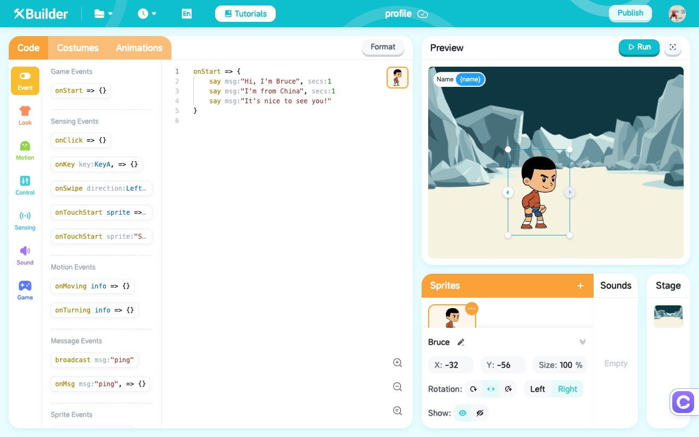

# XBuilder

XBuilder is a tool for building games. We create it to help children to learn [abilities to build](https://github.com/goplus/builder/issues/531).

XBuilder is developed based on [spx](https://github.com/goplus/spx), which is a game engine built on [XGo](https://xgo.dev/).

## How to try

You can try XBuilder online at https://xbuilder.com.

For users in mainland China, we recommend visiting https://x.qiniu.com for optimal performance.

## Learn more about XBuilder

Read [Product Design](./docs/product/index.md) to understand the core concepts in XBuilder.

Read other content in [product docs directory](./docs/product/) to learn more about XBuilder's key features.

## How to develop

For information like project structure, environment requirements, etc., refer to [Develop XBuilder](./docs/develop/index.md).
