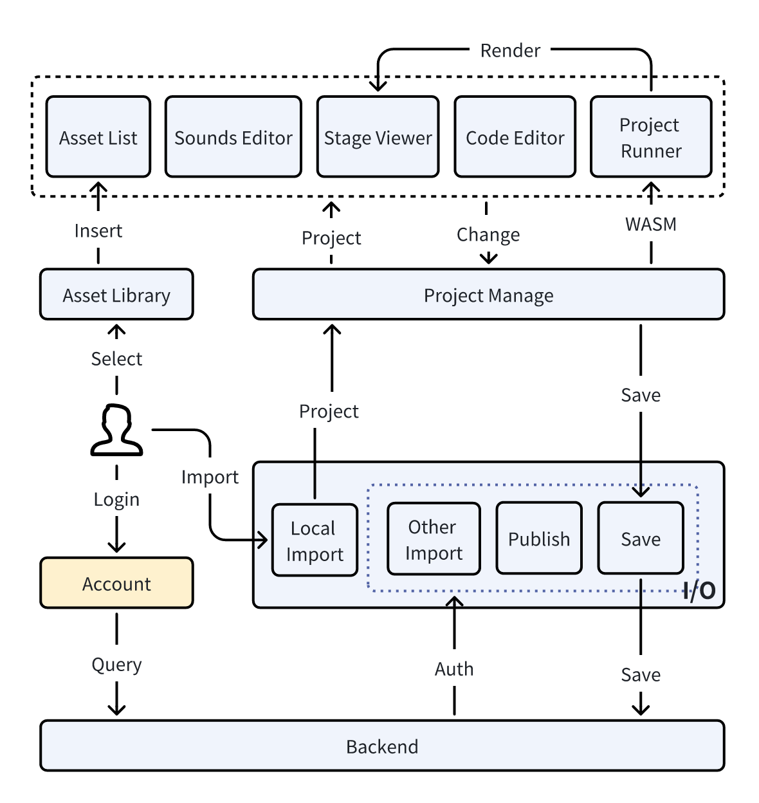

# STEM Education Architecture

## **Architecture Overview**

STEM EDU is a comprehensive online platform dedicated to enhancing children's programming education through interactive and engaging tools. The architecture encompasses a variety of modules, each designed to contribute to a holistic educational experience. These modules integrate to form a cohesive system that facilitates the creation, modification, and deployment of programming projects within an educational context.

## **Module Boundaries**

1. **Asset List:**

   - Description:  Handles the display and management of assets (Sprites, Backdrops, Sounds), allowing for addition and deletion, as well as importing assets from local storage.
   - Interfaces: Input type and show, output handleAssetAddition function with  params(name: string, file: File[])
   - Behavior: User can interact with the Asset List, they can add assets from local or Asset Library into project, and also delete it.
2. **Asset Library**:

   - Description:  Serves as the repository for assets, from which users can import assets into their projects.
   - Interfaces: Input type and show, output handleAssetAddition function with  params(name: string, file: File[])
   - Behavior: When a user interacts with the Asset Library, they can add selected assets to their respective asset lists.
3. **Stage Viewer**:

   - Description: render sprites  and backdrop  of  different spx project，Mainly include sprite's location,size,heading and soon.
   - Interfaces: input size of container, size of stage in spx, sprites and backdrop, output onSpritesDragEnd function with params(targets: SpriteDragEndTarget[])
   - Behavior: When in use, users can view backgrounds and sprites in the spx project, and drag sprites
4. **Code Editor**:

   - Description: Provide an editor for writing and editing SPX code, with syntax highlighting, error detection, formatting, and other features; Provides a toolbox that allows users to easily insert code blocks.
   - Interfaces: Inputs _modelValue,height,width and editorOptions, outputs __change function with params(code:string),insertSnippet,format,snippets_
   - Behavior: When users interact with the editor, they can edit the project's code
5. **Project Management**:

   - Description: Managing projects, allowing the usage of the project instance, and methods for project.
   - Interfaces: Export project instances, getProjects, load, save, download, etc. methods.
   - Behavior: When the user gets a project instance, he can display and change the contents of the project to the UI level.
6. **Sounds Edit**: 

   - Description: Allows users to perform editing operations on audio files, with the capability to save the edits.
   - Interfaces: Inputs a list of audio files.
   - Behavior: When in use, users can carry out editing actions on audio files.
7. **Project Runner**:

   - Description: Online compilation of spx projects using wasm
   - Interfaces: None
   - Behavior: The use of indexedDB to achieve the spx project file reading, the use of iframe to achieve the project online running
8. **Backend**: 

   - Description:  It is used to manage projects and asset files.
   - Interfaces: Add, delete, modify, search for project and asset files, search for resource files, and format code.
   - Behavior: When users interact with project files and resource files, they can upload, modify, search, and format code when editing.

## **Module Interaction**

Each module within the STEM EDU architecture is designed to interact seamlessly with one another, establishing a network of functionality that supports the platform's educational objectives.

- **Asset List & Asset Library:** The Asset List (comprising BackdropList.vue and SpriteList.vue) interacts with the Asset Library (LibraryModal.vue) to handle the addition, deletion, and importing of assets. When users choose assets from the Asset Library, these assets are inserted into the Asset List and become part of the project.
- **Stage Viewer & Project Management:** The Stage Viewer module displays the visual elements of the SPX project, such as sprites and backdrops. It is closely linked with Project Management, such that any changes made in the project (like sprite position or backdrop selection) are immediately reflected within the Stage Viewer, providing real-time feedback as users adjust different aspects of their project.
- **Code Editor, Sounds Editor, & Project Runner:** These three modules represent the creative triad of the system. The Code Editor allows users to write and modify SPX code, which is then used by the Project Runner to compile and run the project using WebAssembly (wasm). Both the code and sound modifications are managed and saved via the Project Management module.
- **Project Management & Backend:** The Project Management module serves as the bridge between the user interface and the backend. It manages project instances, including the import, save, and publish functionalities. When users save or publish their projects, these actions are processed through the backend, which handles file storage, authentication, and other cloud-based operations.
- **User Interaction with Account & Auth:** Users must log in to access cloud-based functionalities like importing, saving, and publishing projects. The Account module ensures that user credentials are securely managed, while the Auth interface within the backend validates these credentials, allowing users to interact with their projects and assets.

## **Architecture Design**

The interaction of each module is as follows:

- Users can import projects, save them in Project Manage, and display them on the page.

- Users can modify the code in the Code Editor module, modify the project's sound in the Sounds Editor, compile the spx project online using wasm in the Project Runner, and view the project's running effects in the Stage Viewer. Resources can be inserted from the Asset Library into the Asset List. These changes are saved through the Project Manage module, which also saves the project to the backend and publishes the project when necessary.

- Users need to log in to perform cloud-based functions such as importing projects, saving projects, and publishing projects.

## **Module List**

- AssetList
- AssetLibrary
- StageViewer
- CodeEditor
- ProjectManagement
- SoundsEditor
- Backend