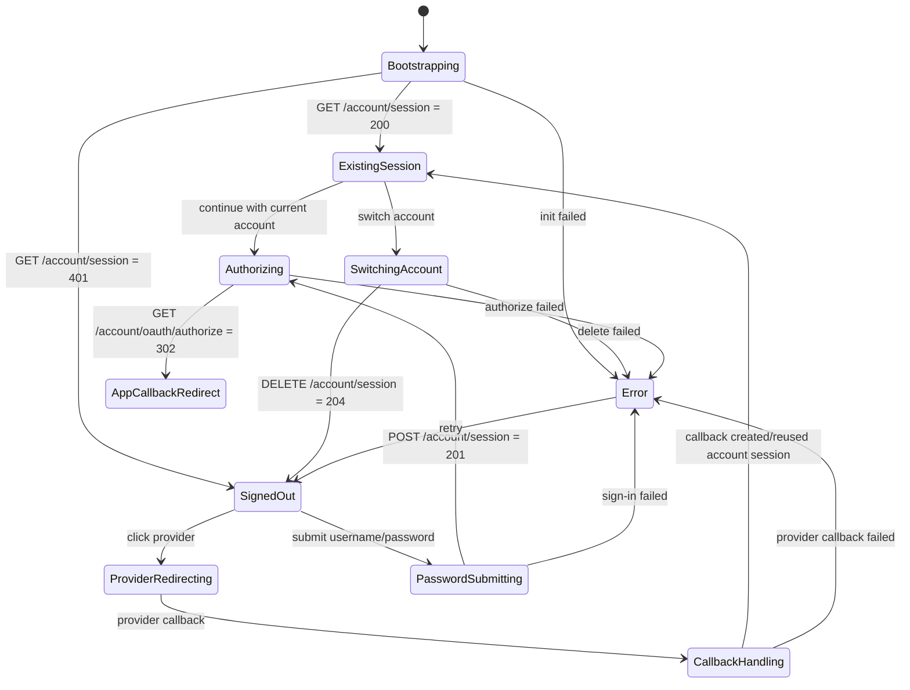
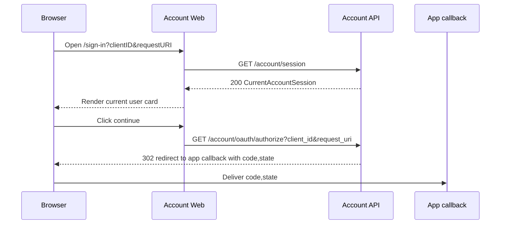
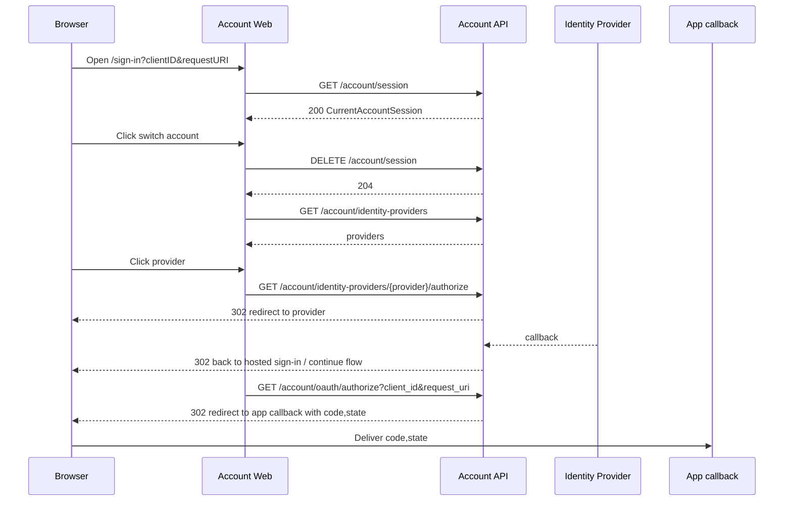
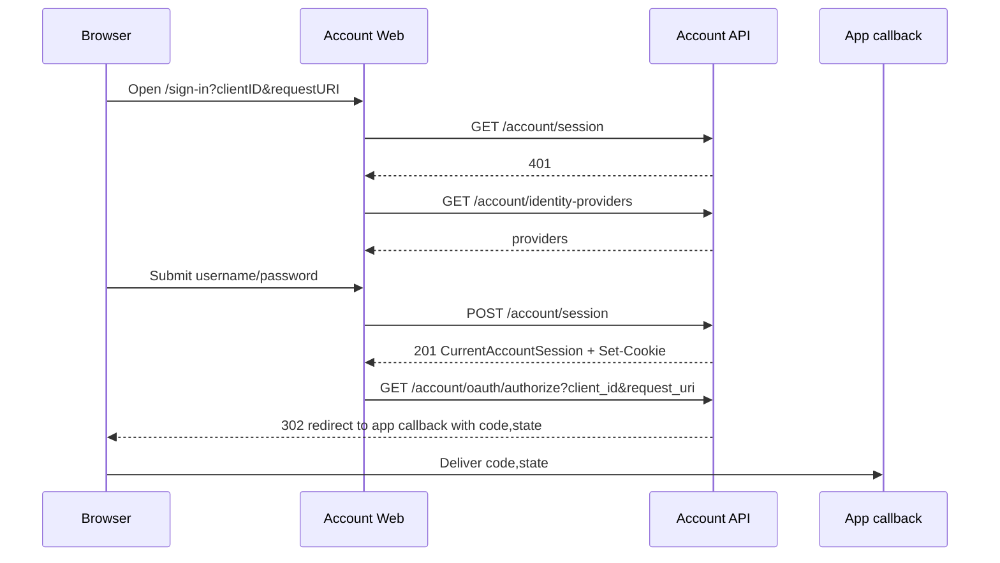
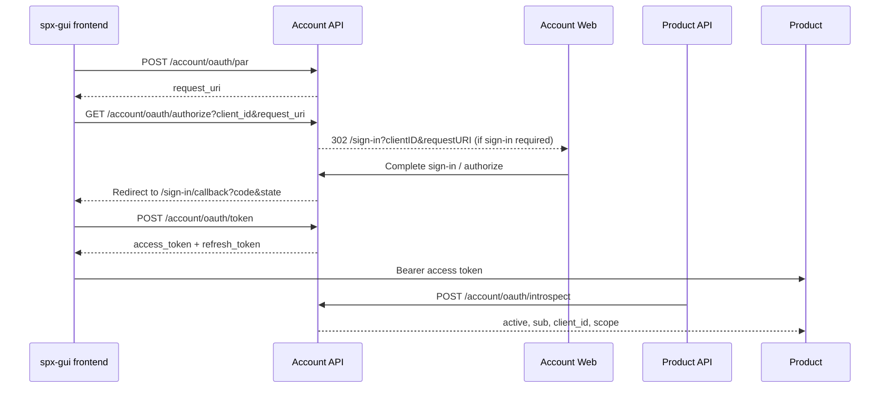

# 第一阶段前端迁移方案

本文档覆盖第一阶段的两条并行工作流：

1. `Account Web`：把 Casdoor 中的 `XBuilderLoginPage` 迁移到 Builder 仓库，并接入新的 XBuilder Account API。
2. `spx-gui`：把主站从当前 Casdoor 接入切到新的 Account OAuth 流程。

## 总体范围

### 包含

- `account.xbuilder.com/sign-in` 登录页迁移
- 第三方身份登录入口
- 用户名密码登录（仅管理员托管密码）
- 基于已有 account session 的“继续使用当前账号”
- “切换其它账号登录”
- 主站 OAuth `PAR / authorize / token / revoke` 对接
- 承接 Bearer token 的产品 API / backend 侧继续通过 introspection 校验 access token

### 不包含

- prompt page
- hosted interaction（绑定确认、身份冲突、补充信息）
- provider link / unlink
- 公开注册
- 全局切账号

## 1. `Account Web` sign-in 登录页迁移

### 1.1 目标

- 承载 `account.xbuilder.com/sign-in`
- 替代 Casdoor 中的 `XBuilderLoginPage`
- 支持：
  - 第三方身份登录
  - 用户名密码登录
  - 已有 account session 的继续登录
  - 切换其它账号登录
- 登录完成后继续 `GET /account/oauth/authorize`

### 1.2 页面状态机



### 1.3 接口调用时序图

#### 1.3.1 已有 session，继续当前账号



#### 1.3.2 切换其它账号后重新登录



#### 1.3.3 用户名密码登录



### 1.4 当前页面结构

当前实现已经把 `Account Web` 作为 `spx-gui` 内的独立入口落地，而不是继续依赖 Casdoor 项目。

```text
spx-gui/src/account-web/
├── main.ts
├── App.vue
├── pages/
│   └── sign-in.vue
├── apis/
│   └── account.ts
├── utils/
│   └── oauth.ts
└── components/
    └── login/
        ├── AccountSessionSection.vue
        ├── InputWithIcon.vue
        ├── LoginButton.vue
        ├── LoginForm.vue
        ├── LoginOptionsSection.vue
        ├── PasswordLoginSection.vue
        ├── ProviderLoginButton.vue
        ├── UsernamePasswordLink.vue
        ├── XBuilderLoginPageMobile.vue
        └── XBuilderLoginPagePc.vue
```

### 1.5 当前实现涉及的文件

#### 已新增

- `spx-gui/sign-in/index.html`
  - `Account Web` 独立 HTML 入口
- `spx-gui/src/account-web/main.ts`
  - `Account Web` 独立入口
- `spx-gui/src/account-web/App.vue`
  - `Account Web` 根组件
- `spx-gui/src/account-web/pages/sign-in.vue`
  - 登录页，承载状态机
- `spx-gui/src/account-web/apis/account.ts`
  - 封装 `GET/DELETE /account/session`、`GET /account/identity-providers`、`POST /account/session`
- `spx-gui/src/account-web/utils/oauth.ts`
  - 解析 `client_id`、`request_uri`，拼接同源 `/api/oauth/authorize` 和 provider authorize URL，并维护 pending authorization 标记
- `spx-gui/src/account-web/components/login/AccountSessionSection.vue`
  - 展示当前账号、继续登录、切换账号
- `spx-gui/src/account-web/components/login/LoginOptionsSection.vue`
  - provider 按钮列表和用户名密码入口
- `spx-gui/src/account-web/components/login/PasswordLoginSection.vue`
  - 用户名密码登录表单
- `spx-gui/src/account-web/components/login/LoginForm.vue`
  - 登录页状态机与 API 调用编排
- `spx-gui/vite.config.account-web.ts`
  - `Account Web` 独立构建配置、同源 `/api` 代理和 Vercel rewrite

#### 已改造

- `spx-gui/src/utils/env.ts`
  - 增加主站 OAuth 和 `Account Web` 需要的环境变量
- `spx-gui/src/apis/account-oauth.ts`
  - 封装 `POST /account/oauth/par`、`POST /account/oauth/token`、`POST /account/oauth/revoke`
- `spx-gui/src/stores/user/signed-in.ts`
  - 主站切到新的 Account OAuth 流程
- `spx-gui/src/pages/sign-in/callback.vue`
  - callback 页改为处理 authorization code exchange
- `spx-gui/src/router.ts`
  - `requiresSignIn` 场景改为走新的 `initiateSignIn()`

### 1.6 接口清单

#### `Account Web` 直接调用

- `GET /account/session`
- `DELETE /account/session`
- `GET /account/identity-providers`
- `POST /account/session`
- `GET /account/oauth/authorize`

#### 浏览器跳转链路使用

- `GET /account/identity-providers/{provider}/authorize`
- `GET /account/identity-providers/{provider}/callback`
- `POST /account/identity-providers/{provider}/callback`

### 1.7 页面交互约定

#### 已有有效 session

登录页优先展示当前账号卡片：

- 主按钮：继续使用当前账号
- 次按钮：切换其它账号登录

#### 切换其它账号登录

第一阶段只清除 `Account Web` 的当前 `account session`：

- 调 `DELETE /account/session`
- 不要求同步退出其它应用
- 不做全局切账号

### 1.8 实现注意点

- 不读取浏览器 cookie；统一通过 `GET /account/session` 判断当前登录态
- `continue` 直接进入 `GET /account/oauth/authorize`
- `switch account` 必须先 `DELETE /account/session`，避免仍复用旧 session
- 第一阶段不复刻 Casdoor 的 `prompt page` / `forget` / `signup` 分支

## 2. `spx-gui` 主站 OAuth 接入

### 2.1 目标

这一部分覆盖 `xbuilder.com` 主站如何从当前 Casdoor 接入切到新的 Account OAuth 流程。默认按 `Account-issued token model` 落地。

### 2.2 主链路



### 2.3 前端状态调整

- 不再使用 `casdoor-js-sdk`
- 不再从 access token decode 用户名
- OAuth 一次性中间态短期保存在 `sessionStorage`：
  - `state`
  - `codeVerifier`
  - `returnTo`
- 当前用户身份以 `/user` 或后端返回的 canonical user 为准，不以 token payload 为准

### 2.4 当前落地的文件改造

#### 重点改造

- `spx-gui/src/stores/user/signed-in.ts`
  - 移除 `casdoor-js-sdk`
  - 增加 `createAuthorizationRequest()`：生成 PKCE、state，调用 `POST /account/oauth/par`，并生成 `GET /account/oauth/authorize` 跳转地址
  - 增加 `completeAuthorizationCodeSignIn()`：在 callback 页用 `code + code_verifier` 调 `POST /account/oauth/token`
  - 增加 `refreshAccessToken()`：用 `refresh_token` 调 `POST /account/oauth/token`
  - 增加 `revokeTokens()`：调用 `POST /account/oauth/revoke`

- `spx-gui/src/pages/sign-in/callback.vue`
  - 从只做 Casdoor `exchangeForAccessToken()`
  - 改为：读取 `code/state` → 校验 state → 读取 PKCE verifier → 调 token exchange → 恢复 `returnTo`

- `spx-gui/src/utils/env.ts`
  - 增加主站在新账号系统里的应用标识 `VITE_ACCOUNT_OAUTH_CLIENT_ID`
  - 主站在 `PAR` 之后直接跳转 `GET /account/oauth/authorize`，不自行拼接 `Account Web` 地址
  - `Account Web` 自身走同源 `/api/*` facade，不额外暴露独立的 Account API base URL
  - `Account Web` 本地环境联调暂时通过 `VITE_ACCOUNT_WEB_TEST_ORIGIN` 复用测试环境地址，用于代理请求的 `Origin` header 和 Vite `allowedHosts` 等绕过配置

#### 小范围联动

- `spx-gui/src/router.ts`
  - 保留 `/sign-in/callback`
  - `requiresSignIn` 场景改为走新的 `initiateSignIn()`

- `spx-gui/src/pages/sign-in/token.vue`
  - 当前是 JWT token 手动粘贴登录页
  - 若不再需要调试入口，可标记废弃或后续删除

- `spx-gui/package.json`
  - 已移除 `casdoor-js-sdk`
  - 已移除 `jwt-decode`

### 2.5 推荐实现拆分

#### 2.5.1 发起登录

在 `signed-in.ts` 提供统一入口：

- 生成 `state`
- 生成 PKCE `code_verifier` / `code_challenge`
- 调 `POST /account/oauth/par`
- 将 `state`、`code_verifier`、`returnTo` 保存到 `sessionStorage`
- 浏览器跳转到 `GET /account/oauth/authorize?client_id=...&request_uri=...`
- 若需要 hosted sign-in，则由 `/account/oauth/authorize` 再 `302` 到 `account.xbuilder.com/sign-in`

#### 2.5.2 callback 页收尾

`/sign-in/callback` 页面负责：

- 读取 `code`、`state`
- 校验本地保存的 `state`
- 读取 `code_verifier`
- 调 `POST /account/oauth/token`
- 保存 `access_token` / `refresh_token`
- 清理一次性 OAuth 中间状态
- `window.location.replace(returnTo ?? '/')`

#### 2.5.3 token 刷新

- access token 接近过期时主动刷新
- 同一运行环境合并并发刷新
- 刷新失败时清空本地 token；后续再次访问受保护页面时重新进入 hosted sign-in

#### 2.5.4 退出登录

主站退出第一阶段建议至少做两步：

- 清理本地 `access_token` / `refresh_token`
- 如需撤销当前 grant 下 token，再调 `POST /account/oauth/revoke`

是否同时退出 `account session`，由产品交互决定；第一阶段不强制联动 `Account Web`。

### 2.6 与当前实现的对应关系

| 当前文件 / 逻辑 | 第一阶段替换为 |
| - | - |
| `casdoorSdk.signin_redirect()` | `POST /account/oauth/par` + 跳转 `GET /account/oauth/authorize` |
| `casdoorSdk.exchangeForAccessToken()` | `POST /account/oauth/token` |
| `casdoorSdk.refreshAccessToken()` | `POST /account/oauth/token` with `grant_type=refresh_token` |
| JWT decode username | 删除；改为依赖 `/user` |
| Casdoor env | Account OAuth env |

### 2.7 验收清单

- 未登录访问受保护页面会先进入 `GET /account/oauth/authorize`，并在需要时跳到新的 hosted sign-in
- callback 能成功换取 token 并恢复原页面
- access token 可自动刷新
- 刷新失败时会清理本地登录态，后续受保护页面访问会重新进入 hosted sign-in
- 承接前端 Bearer token 的产品 API / backend 可以接受新 token，并通过 introspection 校验
- 前端不再依赖 Casdoor SDK / Casdoor JWT 用户名解析

## 3. 任务拆分 checklist

### 3.1 `Account Web`

- [x] 在 `spx-gui` 中增加 `Account Web` 独立构建入口
- [x] 新增登录页，适配 PC / mobile
- [x] 登录页支持“继续使用当前账号”/“切换其它账号登录”
- [x] 登录页支持第三方身份登录
- [x] 登录页支持用户名密码登录
- [x] 对接 `GET /account/session`
- [x] 对接 `DELETE /account/session`
- [x] 对接 `GET /account/identity-providers`
- [x] 对接 `POST /account/session`
- [x] 对接 `GET /account/oauth/authorize`
- [x] 对接 `GET /account/identity-providers/{provider}/authorize`

### 3.2 `spx-gui`

- [x] 在 `spx-gui/src/stores/user/signed-in.ts` 移除 `casdoor-js-sdk`
- [x] 在 `spx-gui/src/stores/user/signed-in.ts` 移除 JWT decode 用户名逻辑
- [x] 实现 `createAuthorizationRequest()`
- [x] 实现 `completeAuthorizationCodeSignIn()`
- [x] 实现 `refreshAccessToken()`
- [x] 实现 `revokeTokens()`
- [x] 用 `POST /account/oauth/par` + `GET /account/oauth/authorize` 发起登录
- [x] 用 `POST /account/oauth/token` 完成 code exchange
- [x] 用 `POST /account/oauth/token` 完成 refresh token exchange
- [x] 在 `/sign-in/callback` 页面接入新 callback 收尾逻辑
- [x] 在 `router.ts` 中让 `requiresSignIn` 走新的 `initiateSignIn()`
- [x] 更新 `env.ts`，移除 `VITE_CASDOOR_*`
- [ ] 评估并处理 `src/pages/sign-in/token.vue`
- [x] 移除 `package.json` 中的 `casdoor-js-sdk`
- [x] 移除 `package.json` 中的 `jwt-decode`

### 3.3 联调与验收

- [ ] 验证未登录进入受保护页面会先进入 `/account/oauth/authorize`，并在需要时跳到 Account Web
- [ ] 验证已有 account session 时可直接 continue
- [ ] 验证 switch account 只影响 `Account Web` 当前 session
- [ ] 验证用户名密码登录可完成 OAuth authorize
- [ ] 验证第三方身份登录可完成 OAuth authorize
- [ ] 验证 `/sign-in/callback` 可恢复 `returnTo`
- [ ] 验证 access token 自动刷新
- [ ] 验证刷新失败会重新进入 hosted sign-in
- [ ] 验证承接前端 Bearer token 的产品 API / backend 已接入 `/account/oauth/introspect`
- [ ] 验证前端运行时不再依赖 Casdoor SDK / Casdoor JWT
