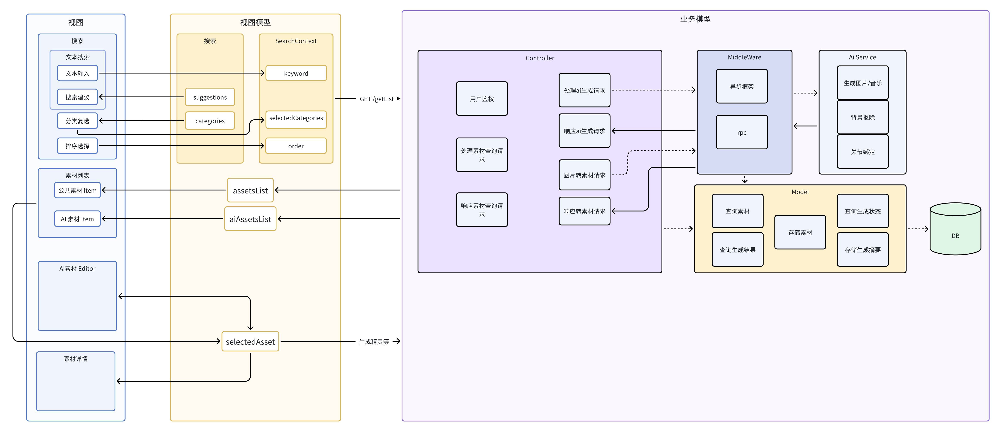
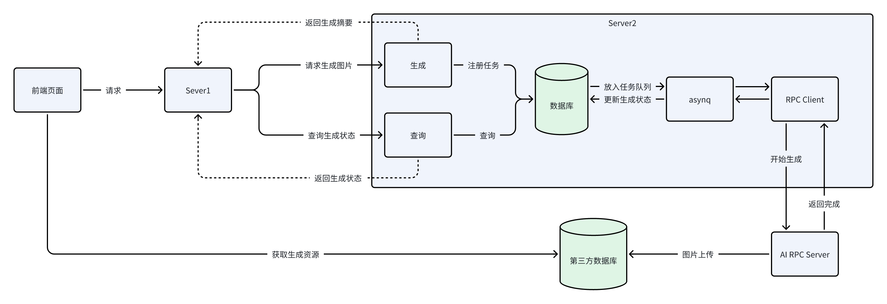
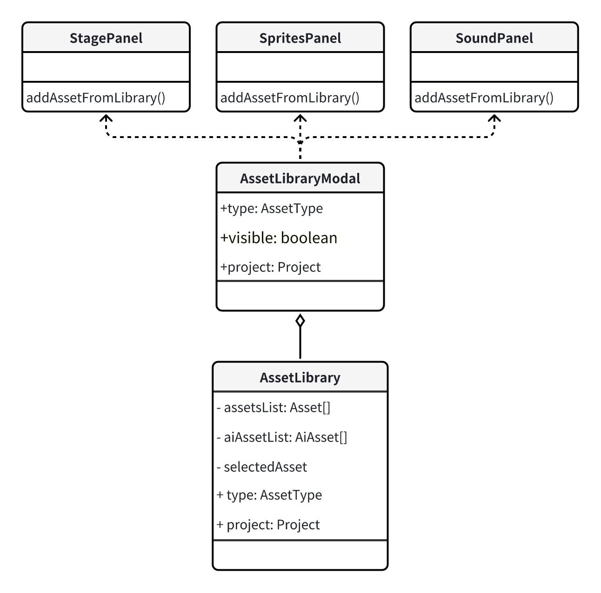
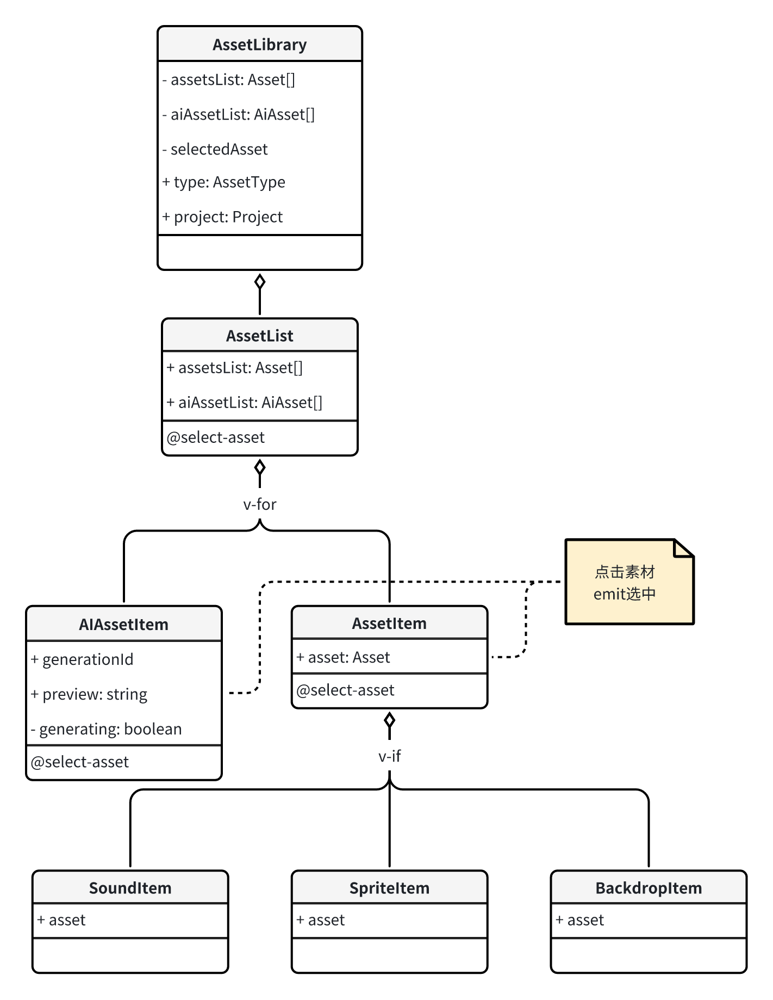
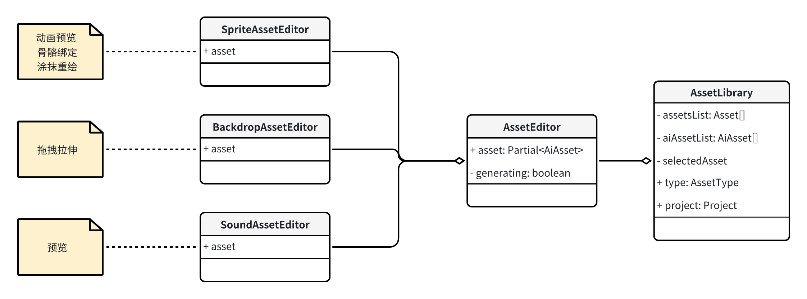
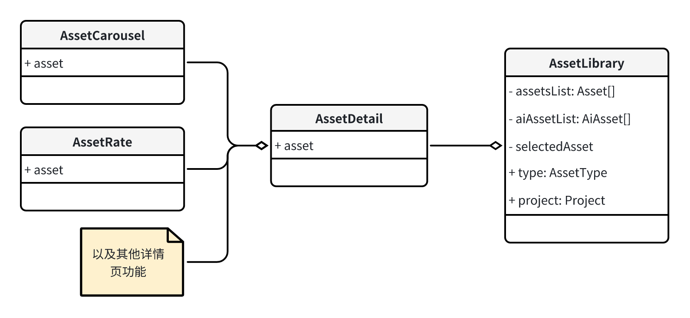
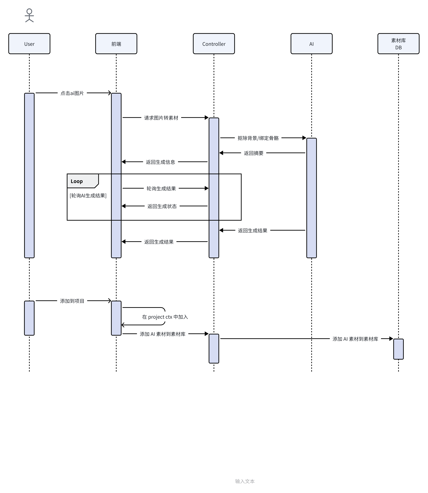

# 功能模块划分


[产品需求文档](https://ncuhomer.feishu.cn/docx/Ghg0dqLmRoPVrlxHmXzcbjgDnEf?from=from_copylink)

## fiama原型图

https://www.figma.com/design/Q32DIEm4tpDsrk7sPZvRKX/go%2Bbuilder?node-id=0-1&t=5deNPJ3ceqI8wO3f-0

# 风险分析

核心需求中，搜索与分类等皆为常规功能，AI生成部分整体风险较高，非常规功能+低延迟（搜索要求等），需要重点关注。

### **整体风险来源**：

AI生成部分的不确定性

### **AI生成部分风险来源：**

1.  **生成内容的质量**：AI生成的资产的质量和相关性必须符合用户期望。质量低劣或不相关的内容可能导致用户不满意。
2. **延迟**：开发和集成AI生成功能需要保证ai生成较低的延迟。此处的任何问题都可能影响用户体验。
3. **动画相关部分技术的不确定性**：动画相关部分的渲染和生成

### 风险预防：

1. 及时与相关ai开发人员沟通
2. 及早调研动画渲染相关技术，明确后续思路
3. 安排好相关人员排期，留足突发情况处理时间
4. 对ai生成质量进行把控（？）

# 分层架构



# 模块详细设计

## 后端部分

### **图片生成模块后端实现**

 **概述**

- 模块名称：图片生成模块
- 模块描述：实现ai生成素材，补充搜索结果的需求。
- 目标：提供高效、符合预期的素材生成服务。

 **功能需求**

- 生成与用户输入一致（keyword、category）的素材。
- 提供查询生成状态接口，以便前端获取查询状态

**实现方案**

- 解析前端传递的参数，主要是category和keyword。
- 将参数传递给aigc服务器。
- 将生成摘要返回给前端。
- 将生成状态返回给前端。



### **查询模块后端实现**

 **概述**

- 模块名称：查询模块
- 模块描述：实现用户在素材库中精准查询的需求。
- 目标：提供高效、准确的查询服务。

 **功能需求**

- 用户可以通过关键词搜索商品。
- 用户可以按类别、价格范围、品牌等筛选素材。
- 搜索结果需要以关联度来进行排序，关联度高的放在前面
- 用户可以对查询结果进行排序（如按价格、评分、时间等）。
- 支持分页显示查询结果。
- 显示每个商品的详细信息，包括名称、图片等。

**实现方案**

- 解析前端传递的参数，主要是category和keyword。
- 经过encoding将参数转化为词向量。
- 将词向量放入向量数据库（暂定milvus）比对，将结果按匹配度排序。
- 将搜索到的结果（暂定结果为asset_id）放入mysql中查找。
- 返回查询结果。


### **添加ai素材模块后端实现**

 **概述**

- 模块名称：添加ai素材模块
- 模块描述：用户点击收藏或添加某一ai生成的素材后，可以将该素材添加至公有素材库中。
- 目标：添加ai素材到公有素材库。

 **功能需求**

- 添加ai素材到公有素材库。

**实现方案**

- 解析前端传递的参数，ai素材的url和id。
- 查询此素材对应的词向量。
- 后端将此素材信息（id、词向量）写入milvus和数据库。


## 前端部分

### 素材库入口



#### AssetLibraryModal `已有设计`

- 组件：素材库模态框
- 描述：作为素材库的承载形式，控制素材库素材类型、可见性等
- Props：
  - type：素材类型 - 枚举值AssetType：Sprite/Backdrop/Sound
  - visible：可见性 - boolean
  - project：当前项目，通过 editorCtx.project 获取 - Project
- 使用：
  - 通过 useModal 创建实例，通过invokeAssetLibraryModal激活素材库模态框。
  - 对于各个 EditorPanel，使用useAddAssetFromLibrary获取素材库模态框的handler，并调用addAssetFromLibrary打开素材库模态框。
- 子组件：
  - AssetLibrary

```TypeScript
// spx-gui/src/components/asset/index.ts
export function useAddAssetFromLibrary(autoSelect = true) {
  const invokeAssetLibraryModal = useModal(AssetLibraryModal)
  return async function addAssetFromLibrary<T extends AssetType>(project: Project, type: T) {
    const added = (await invokeAssetLibraryModal({ project, type })) as Array<AssetModel<T>> // 返回在素材库中选中的素材
    // 素材添加逻辑应在素材库中进行，这里仅处理添加素材关闭模态框之后的逻辑。
    // ... 
  }
}
// spx-gui/src/components/editor/panels/xxx/XxxPanel.vue
const addAssetFromLibrary = useAddAssetFromLibrary()
const handleAddFromAssetLibrary = useMessageHandle(
  () => addAssetFromLibrary(editorCtx.project, AssetType.Xxx),
  { en: 'Failed to add xxx from asset library', zh: '从素材库添加失败' }
).fn
```

#### AssetLibrary

- 组件：素材库
- 描述：素材库页，展示搜索框、分类选项、搜索及AI生成结果列表。在有选中的素材时（selectedAsset非空时）展示素材详情（公有素材）或素材预览编辑（AI预览素材）。
- props：
  - type：素材类型 - 枚举值AssetType：Sprite/Backdrop/Sound
  - project：当前项目，通过 editorCtx.project 获取 - Project
- 视图模型：
  - assetsList：素材列表 - Asset[]
  - aiAssetsList：AI素材列表 - AiAsset[]
  - selectedAsset?：当前选中的素材 - Asset | AiAsset
- 使用：

用于素材库模态框 AssetLibraryModal 中。

- 子组件：
  - SearchContextProvider
    - SearchBox
    - CategorySelector
    - OrderSelector
    - AssetsList
  - AssetEditor
  - AssetDetail

### 搜索、分类、排序


#### SearchContextProvider

- 组件：搜索 ContextProvider

- 描述：提供搜索上下文。在上下文改变时自动进行搜索并产生搜索事件。

- 上下文：

  - keyword：搜索关键词 - string
  - category： 分类 - string[]
  - order：排序选项
  - page：分页查询当前页 - number

- props：

- 导出：

  - useSearchCtx()：inject 搜索上下文

- emits：

  - search：搜索事件，emit 搜索结果到素材库组件。

- 使用：

  - 用于素材库 AssetLibrary 中。其插槽内应包含所有搜索组件和搜索结果组件（布局考虑）。
  - 搜索组件通过 useSearchCtx 获取搜索上下文。修改上下文内的值进行搜索。
  - 高频改变的搜索参数如 keyword 应做防抖处理后再更新到上下文。

- 参考代码

  - ```HTML
    <!-- SearchContextProvider.vue -->
    <template>
      <slot></slot>
    </template>
    
    <script lang="ts">
    import { inject } from 'vue'
    
    export type SearchCtx = {
      keyword: string
      category: string[]
      order: Order
      page: number
    }
    
    const searchCtxKey: InjectionKey<SearchCtx> = Symbol('search-ctx')
    
    export function useSearchCtx() {
      const ctx = inject(searchCtxKey)
      if (ctx == null) throw new Error('useSearchCtx should be called inside of SearchContextProvider')
      return ctx
    }
    </script>
    
    <script setup lang="ts">
    import { provide, type InjectionKey, reactive } from 'vue'
    import { Project } from '@/models/project'
    import type { UserInfo } from '@/stores/user'
    
    interface SearchResult {
      assetList: Asset[]
      aiAssetList: AiAsset[]
    }
    
    const emit = defineEmits<{
      search: [SearchResult]
    }>()
    
    const searchCtx = reactive({
      keyword: '',
      category: [],
      order: Order.xxx,
      page: 0,
    })
    provide(searchCtxKey, searchCtx)
    
    const { data, refetch } = useQuery<...>(
      () => {
        // fetch 素材
        // 如果素材过少则进行AI生成
        // 返回搜索结果
      }
    )
    watch(data, ()=>{
      emit('search', {
        // ...
      })
    })
    </script>
    ```

  - ```TypeScript
    // 搜索组件
    const searchCtx = useSearchCtx();
    
    watch(
      searchInput,
      debounce(() => {
        searchCtx.keyword = searchInput.value;
      }, 500)
    )
    ```

#### SearchBox

- 组件：搜索框
- 描述：搜索框，提供文本搜索和搜索建议`P1`。
- 子组件：
  - TextInput
  - SearchSuggestions

#### SearchSuggestions

```
P1
```

- 组件：搜索建议
- 视图模型：
  - suggestions：建议列表 - string[]

#### CategorySelector

- 组件：分类选择
- 视图模型：
  - categories：给定的分类列表 [7.11](https://ncuhomer.feishu.cn/docx/VoTDd5yfxoEuavxg4R9c21gNnWR)

### 搜索结果及AI生成结果列表



#### AssetList

- 组件：搜索结果及AI生成结果列表
- 描述：以虚拟列表形式展示每个搜索素材和AI生成的素材预览。在滚动到底部时更新搜索上下文的 page 参数。
- 子组件：
  - AiAssetItem
  - AssetItem
- props：
  - assetsList：素材列表 - Asset[]
  - aiAssetsList：AI素材列表 - AiAsset[]
- emits：
  - select-asset：传递子组件的素材选中事件，更新素材库的选中素材状态。

#### AssetItem

- 组件：搜索素材项目
- 描述：展示一个公有素材库项目
- props：
  - asset：素材 - Asset
- emits：
  - select-asset：素材选中事件，更新素材库的选中素材状态。

#### AiAssetItem

- 组件：AI生成素材预览项目
- 描述：展示一个AI生成素材的预览图片。轮询生成状态，在未生成完成时显示进度或状态提示。
- props：
  - generationId：AI生成id - string
  - preview：AI素材预览（image_url） - string
- 视图模型：
  - generating：正在生成？- boolean
- emits：
  - select-asset：素材选中事件，更新素材库的选中素材状态。仅在生成完成时点击触发。

### AI生成结果 素材编辑



#### AssetEditor

- 组件：AI生成素材预览（及编辑）
- 描述：在素材库选中AI素材时显示。激活时由图片预览进一步进行AI生成素材。生成完成后根据素材类型展示不同的预览或编辑。
- props：
  - asset：AI生成素材预览 - Partial<AiAsset>
- 视图模型：
  - generating：正在生成？- boolean
- 子组件：
  - SpriteAssetEditor
  - BackdropAssetEditor
  - SoundAssetEditor

### 搜索结果 素材详情页



#### AssetDetail

- 组件：素材详情页
- 描述：在素材库选中公共素材时显示。展示素材详细信息。
- props：
  - asset：素材 - Asset

### 骨骼动画(预览)

> 参考 spx 新增的骨骼动画
>
> **PR** #286 **[[WIP\] feat: add skeleton animation & vertex aimation](https://github.com/goplus/spx/pull/286/files#top)** 

#### 时序图


#### WASM 接口

##### parseSkeletonAnimData

解析骨骼动画，返回所有帧数据

- 参数：
  - animData: `Uint8Array` 骨骼动画目录(zip格式)
- 返回值：
  - AnimFrame[]: 帧数据
    - vertices：`number[][]` 顶点数据
    - uvs：`number[][]` 
    - indices：`number[][]` 

#### PIXI参考代码

```TypeScript
const pixiApp = ref<HTMLElement | null>(null);
const app = new Application();
const initPixi = async () => {
  await app.init({
    background: "xxx",
    resizeTo: pixiApp.value!,
    preference: "webgl",
  });
  pixiApp.value!.appendChild(app.canvas);
};
const geometry = new Geometry({
    attributes: {
      aPosition: vertices,
      aUV: uvs,
    },
    indexBuffer: indices,
});

const shader = Shader.from({
    gl: {
      vertex: ...,
      fragment: ...,
    },
    resources: {
      uTexture: (await Assets.load(...)).source,
    },
});

const sprite = new Mesh({
    geometry,
    shader,
});

sprite.position.set(100, 100);
sprite.scale.set(0.5);
app.stage.addChild(sprite);

app.ticker.add(() => {
    // update
    // sprite.geometry = ...
});
in vec2 aPosition;
in vec2 aUV;
out vec2 vUV;

uniform mat3 uProjectionMatrix;
uniform mat3 uWorldTransformMatrix;
uniform mat3 uTransformMatrix;

void main() {
    mat3 mvp = uProjectionMatrix * uWorldTransformMatrix * uTransformMatrix;
    gl_Position = vec4((mvp * vec3(aPosition, 1.0)).xy, 0.0, 1.0);
    
    vUV = aUV;
}
in vec2 vUV;

uniform sampler2D uTexture;

void main() {
    gl_FragColor = texture2D(uTexture, vUV);
}
```

## 时序图

### 搜索、AI素材预生成


### 搜索结果、详情页、收藏、添加到项目


### AI生成结果、AI素材生成（背景扣除、骨骼绑定等）



## 接口

## API文档

[后端服务API](https://fxj4kdez1kc.feishu.cn/wiki/Dqh4wBrXlisVenkM4SCcU62Hnvd)

https://app.apifox.com/invite/project?token=069BkUW4OItXzhb3mHho4

https://app.apifox.com/project/4854588

https://apifox.com/apidoc/shared-cef04b18-6c83-4c6a-9466-1ac66acfdff3/api-195901658

# 参考

## Go+ builder spx-gui 类图（素材库）

暂时无法在飞书文档外展示此内容

## 架构梳理文档

[架构梳理文档（fe）](https://ncuhomer.feishu.cn/docx/A9QYdcIkmoZ6IxxHuCyciRG6nXe?from=from_copylink)

## 骨骼动画(预览)

> 参考 spx 新增的骨骼动画
>
> **PR** #286 **[[WIP\] feat: add skeleton animation & vertex aimation](https://github.com/goplus/spx/pull/286/files#top)** 

### 数据格式

#### 动画数据 `xxx@yyy.anim`

- **格式**: JSON
- **内容**: 包含动画帧数据，每个帧包含位置和角度信息。

```JSON
{
    "AnimData": [
        {
            "PosDeg": [
                -0.09239541739225388,
                2.531355857849121,
                90.0,
                -0.01921691931784153,
                ...
            ],
        },
        ...
    ]
}
```

> [spx/tutorial/06-Skeleton/assets/animations/Stander@HitDown.anim at skeleton_animation · JiepengTan/s](https://github.com/JiepengTan/spx/blob/skeleton_animation/tutorial/06-Skeleton/assets/animations/Stander@HitDown.anim)

#### 动画控制器 `xxx.animator`

- **格式**: JSON
- **内容**: 定义动画类型、默认动画片段、动画片段列表及其属性。

```JSON
{
    "type": "skeleton",
    "defaultClip": "roll",
    "clips": [
        {
            "name": "idle",
            "loop": true,
            "frameRate": 30,
            "path": "animations/Stander@Idle.anim"
        },
        ...
    ]
}
```

> [spx/tutorial/06-Skeleton/assets/animators/Stander.animator at skeleton_animation · JiepengTan/spx](https://github.com/JiepengTan/spx/blob/skeleton_animation/tutorial/06-Skeleton/assets/animators/Stander.animator)

#### 动画网格 `xxx.mesh`

- **格式**: JSON
- **内容**: 包含网格名称、层级数据、皮肤网格数据、渲染顺序等。

```JSON
{
    "Name": "Target",
    "Hierarchy": [{
        "Name": "_Root",
        "PosRot": { "x": 0.0, "y": 0.0, "z": 0.0 },
        "Order": 0,
        "Parent": ""
    },...],
    "SkinMesh": [
        {
            "Name": "RDX@hip",
            "Indices": [0, ...],
            "Vertices": [{
                "x": 0.1372000128030777,
                "y": -0.7988400459289551,
                "z": 0.0
            },...],
            "BoneWeights": [{
                "m_Weight0": 1.0,
                ...
            },...],
            "BindPoses": [{
                "e00": -0.03760790824890137,
                "e01": 0.9992926716804504,
                "e02": 0.0,
                ...
            }],
            "BoneTransforms": ["hip"],
            "Uvs": [{
                    "x": 0.5423593521118164,
                    "y": 0.14460554718971253
                },]
        },...
    ],
    "RenderOrder": [4,2,6,0,1,3,7,5]
}
```

> [spx/tutorial/06-Skeleton/assets/avatars/Stander.mesh at skeleton_animation · JiepengTan/spx](https://github.com/JiepengTan/spx/blob/skeleton_animation/tutorial/06-Skeleton/assets/avatars/Stander.mesh)

### 类型定义

#### **骨骼 (****`Bone`****)**

定义骨骼的名称、父骨骼、位置、旋转角度等。

```TypeScript
interface Bone {
  name: string; // 骨骼的名称
  parent: Bone | null; // 父骨骼的引用，如果没有父骨骼则为null
  pos: Vector2; // 骨骼在世界坐标系中的位置
  deg: number; // 骨骼相对于世界坐标系的旋转角度
  localPos: Vector2; // 骨骼在局部坐标系中的位置
  localDeg: number; // 骨骼相对于父骨骼的旋转角度
}
```

#### **骨架 (****`Skeleton`****)**: 

包含所有骨骼及通过骨骼名称快速访问骨骼的映射。

```TypeScript
interface Skeleton {
  bones: Bone[]; // 骨架包含的所有骨骼
  name2Bone: { [key: string]: Bone }; // 通过骨骼名称快速访问骨骼的映射
}
```

#### **动画剪辑 (****`AnimClip`****)**: 

扩展自 `common.AnimClip`，包含动画数据。

```TypeScript
interface AnimClip extends common.AnimClip {
  data: SpriteAnimData;
}
```

#### **动画网格 (****`AnimMesh`****)**: 

定义网格名称、层级结构、皮肤信息、渲染顺序等。

```TypeScript
interface AnimMesh {
  Name: string; // 网格名称
  Hierarchy: HierarchyData[]; // 层级数据数组，定义了网格的层级结构
  SkinMesh: SpriteSkinData[]; // 皮肤网格数据数组，定义了网格的皮肤信息
  RenderOrder: number[]; // 渲染顺序数组，定义了网格的渲染顺序
}
```

#### **精灵动画数据 (****`SpriteAnimData`****)**: 

包含动画帧数据。

```TypeScript
interface SpriteAnimData {
  AnimData: FrameData[];
}
```

#### **帧数据 (****`FrameData`****)**: 

定义帧的位置和旋转信息。

```TypeScript
interface FrameData {
  PosDeg: number[];
}
```

#### **层级数据 (****`HierarchyData`****)**: 

定义层级的名称、位置、旋转信息、渲染顺序和父层级关系。

```TypeScript
interface HierarchyData {
  Name: string; // 层级名称
  PosRot: Vector3; // 位置和旋转向量，定义了层级的位置和旋转信息
  Order: number; // 渲染顺序，定义了层级的渲染顺序
  Parent: string; // 父层级名称，定义了层级的父级关系
}
```

#### **精灵皮肤数据 (****`SpriteSkinData`****)**: 

定义皮肤名称、顶点索引、顶点位置、骨骼权重、绑定姿势、骨骼变换信息和UV坐标。

```TypeScript
interface SpriteSkinData {
  Name: string; // 皮肤名称
  Indices: number[]; // 索引数组，定义了皮肤网格的顶点索引
  Vertices: Vector3[]; // 顶点数组，定义了皮肤网格的顶点位置
  BoneWeights: BoneWeight[]; // 骨骼权重数组，定义了顶点受骨骼影响的权重
  BindPoses: Matrix4[]; // 绑定姿势数组，定义了骨骼的初始姿势
  BoneTransforms: string[]; // 骨骼变换数组，定义了骨骼的变换信息
  Uvs: Vector2[]; // UV坐标数组，定义了皮肤网格的纹理坐标
}
```

## 动画接口调整

### `Animation` 类（主要帧动画）

#### 属性

- `sprite`: 关联的精灵对象。
- `name`: 动画名称。
- `costumes`: 动画使用的服装列表。
- `duration`: 动画时长。
- `sound`: 动画开始时播放的声音。

#### 方法

- `setSprite(sprite: Sprite | null)`: 设置关联的精灵。
- `setName(name: string)`: 设置动画名称，并进行名称验证。
- `setCostumes(costumes: Costume[])`: 设置动画的服装列表，并添加名称前缀以避免冲突。
- `setDuration(duration: number)`: 设置动画时长。
- `setSound(sound: string | null)`: 设置动画开始时播放的声音。
- `withCostumeNamePrefix(name: string)`: 给服装名称添加前缀。
- `stripCostumeNamePrefix(name: string)`: 移除服装名称的前缀。

#### 静态方法

- `create(nameBase: string, costumes: Costume[], inits?: AnimationInits)`: 使用给定的名称基础和服装列表创建动画实例。
- `load(name: string, { from, to, ...inits }: RawAnimationConfig, sprite: Sprite)`: 从已有的配置加载动画，移除精灵中的相应服装并克隆它们到动画中。

#### 辅助函数

- `getCostumeIndex(costumes: Costume[], costume: string | number)`: 获取服装在列表中的索引。

js支持的unity库

### spx类

```JSON
    "fAnimations": {
        "fight": {
            "turnToDuration": 2,
            "frameFrom": "__animation_fight_attack_1-1",
            "frameTo": "__animation_fight_attack_1-4",
            "frameFps": 8
        },
        "dying": {
            "frameFrom": "__animation_dying_dead-1",
            "frameTo": "__animation_dying_dead-3",
            "frameFps": 8
        },
        "walk": {
            "stepDuration": 0.01,
            "frameFrom": "__animation_walk_walk-1",
            "frameTo": "__animation_walk_walk-8",
            "frameFps": 8
        },
        "default": { 
            "frameFrom": "__animation_default_idle-1",
            "frameTo": "__animation_default_idle-6",
            "frameFps": 16
        }
    },
```

移除/弃用的画板

[删除](https://yizadgyog9c.feishu.cn/docx/IBByd6T3fojG49xWOCbcjLVknfh)