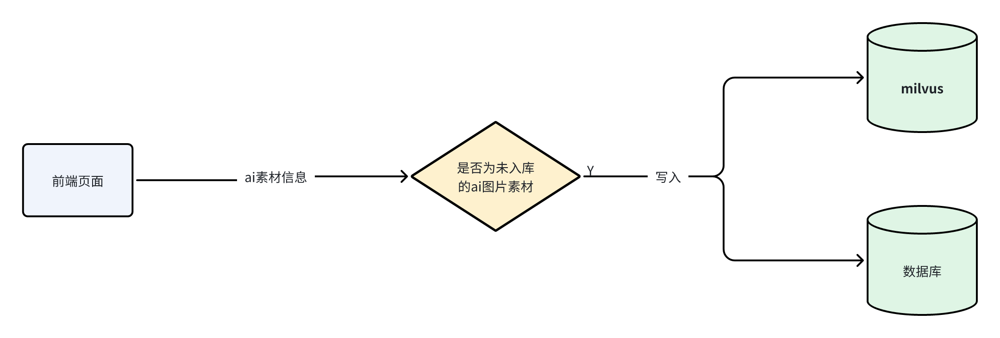

# AI生成模块（后端）

## 模块目的

实现AI生成素材，补充搜索结果的需求，提供高效、符合预期的素材生成服务。包括 AI生成精灵、AI生成背景、AI生成音频等。



## 模块定位

此模块作为 Go+ builder 后端服务的一部分。主要用于实现用户在搜索结果数量不足时，通过AI生成素材来补充搜索结果的需求。模块需求：

- 生成与用户输入一致（keyword、category）的素材。
- 提供查询生成状态接口，以便前端获取查询状态。

-20240725144730930.png)

## 模块接口

### AI生成精灵图片

Request

方法 ： POST

路径 ： /asset/ai/sprite/image

```TypeScript
export interface Request {
    category?: string;
    keyword?: string;
    [property: string]: any;
}
e.g.

curl --location --request POST '/asset/ai/spriteImage' \
--form 'keyword=""' \
--form 'category=""'
```

Response

200 ok

内容格式 ： JSON

```TypeScript
{
  "imageJobId": "string"
}
```

### AI生成背景图片

Request

方法 ： POST

路径 ： /asset/ai/backdrop/image

```TypeScript
export interface Request {
    category?: string;
    keyword?: string;
//    resolution?: string;
    width?: number;
    height?: number;
    [property: string]: any;
}
e.g.
curl --location --request POST '/asset/ai/backdropImage' \
--form 'keyword=""' \
--form 'category=""' \
--form 'resolution=""'
```

Response

200 ok

内容格式 ： JSON

```TypeScript
{
  "imageJobId": "string"
}
```

-20240725144730917.png)

### AI图片生成精灵

传入所选的图片的生成任务id、所选图片url ， 返回生成精灵任务id 、 生成精灵结果url

Request

方法 ： POST

路径 ： /asset/ai/sprite

```TypeScript
export interface Request {
    imageJobId: string;
    [property: string]: any;
}
e.g.
curl --location --request POST '/asset/ai/sprite' \
--form 'imageJobId=""'
```

Response

200 ok

内容格式 ： JSON

```TypeScript
{
  "spritejobId": "string",
}
```

### 查询生成状态

传入生成任务id ， 返回生成状态

Request

方法 ： GET

路径 ： /asset/ai/status

```TypeScript
export interface Request {
    jobId: string;
    [property: string]: any;
}
e.g.
curl --location --request GET '/asset/ai/status/?jobId'
```

200 ok

内容格式 ： JSON

```TypeScript
{
  "status": 0,
  "result": {
    "jobId": "string",
    "type": 0,
    "files": {
        "imageUrl": "string",
        "skeletonUrl" : "string",
        "animMeshUrl" : "string",
        "frameDataUrl" : "string"
        "backdropImageUrl" : "string"
    }
  }
}
/*      "imageUrl": "string",
      "spriteComponent": {
        "skeletonUrl" : "string",
        "animMeshUrl" : "string",
        "frameDataUrl" : "string"
        ......
      },
      "backdropComponent": {
        "backdropImageUrl" : "string"
        ......
      },
*/
//      "soundsComponent": [
//        "string"
//      ]
```

status分为以下几种：

```Go
const{
    waitting = 0   // 正在排队
    generating = 1 // 正在生成
    finish = 2     // 已完成
}
```

type分为以下几种：

```Go
const{
    image = 0       // 纯图片生成，包含精灵图片和背景图片
    sprite = 1      // 图片生成精灵素材
    backdrop = 3    // 图片生成背景素材
//    sounds = 4      // 生成音乐素材
}
```
