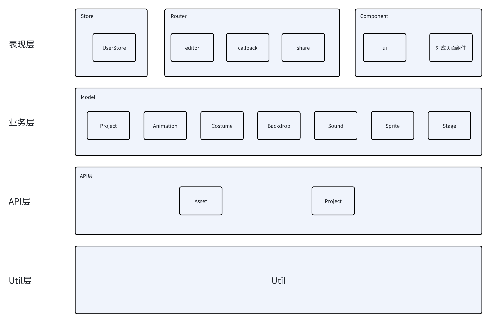
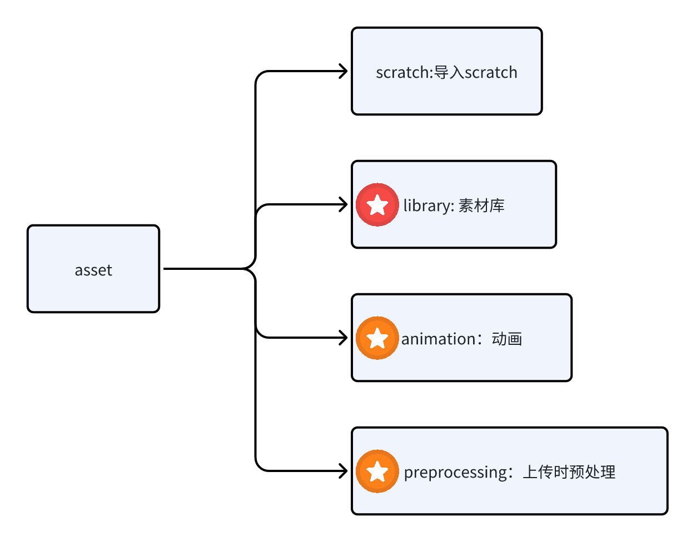
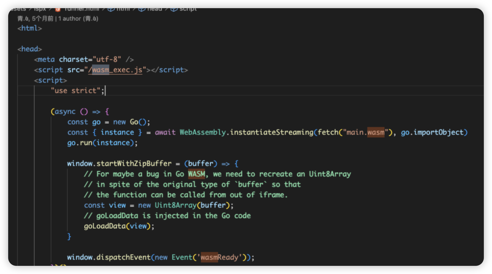

# 技术选型

目前的技术选型是Vue3相关生态+TSX+Naive UI +sass+Wasm等

## Vue相关生态

首先Vue3是基础框架，那么vue套餐自然是必不可少的：

- vue-router,单页应用必不可少需要使用前端路由，项目的路由较少，选用也较为合适
- pinia，官方推荐的状态管理库，用于存储用户的相关信息

## UI部分

- Naive UI,Vue3组件库，并且使用TS，比较主流的组件库之一
- Sass,css替代品，支持变量，嵌套等特性

## 功能部分

- Wasm,编译项目需要用的动画渲染库
- Konva,用于绘图的组件库
- monaco-editor,vscode中的编辑器，用于项目中的编辑器部分

# 架构梳理

## 目录结构

```Java
.
├── README.md
├── build-wasm.sh                 # wasm编译文件
├── index.html                    # 基础网页
├── package-lock.json
├── package.json
├── public                    
├── src
│   ├── App.vue                  # 根组件，包含路由和配置 Provider 
│   ├── apis                     # 网络请求相关
│   ├── assets                   # 静态资源
│   ├── components               # 功能组件
│   ├── global.d.ts              # 全局类型定义（go）
│   ├── i18n.ts                  # i18n设置
│   ├── main.ts                  # 入口文件
│   ├── models                   # 模型层，数据及调用数据方法
│   ├── router.ts                # 路由挂载
│   ├── stores                   # 全局状态管理
│   ├── utils                    # 工具
│   └── widgets                  # 动画运行时iframe
├── tsconfig.app.json            # 项目ts配置
├── tsconfig.json                # 全局ts配置 
├── tsconfig.node.json           # 非客户端部分ts配置
└── vite.config.ts               # vite 相关配置
```

## 整体架构图



### 表现层

- Store/ - pinia状态管理，主要是UserStore，主要用于存储双token（OAuth认证）。
- Router/ - 前端路由，主要由editor,callback,share三个页面组成，其中editor是主要功能页面。
- Component/ - 组件部分，主要由ui组件和对各页面的特定封装组件组成

### 业务层

- Model/ - 定义项目中需要使用的类，类中包含业务数据和获取数据的方法

### API层

- api/ - 请求后端数据

### Util层

- util/ - 存放项目全局的工具函数

> 整体项目应该是采用面向对象式的架构设计，对业务层的修改很多是通过修改Modal中的类实现的，考虑迭代的话可以考虑在model中新建相关类以承载业务。
>
> 为什么要新建一个类？易于

## 素材库部分(components/asset架构梳理

```Java
.
├── AssetName.vue
├── BlobImage.vue
├── BlobSoundPlayer.vue
├── animation                           # 动画添加部分
│   ├── CostumeItem.vue
│   └── GroupCostumesModal.vue
├── index.ts                            # 统一导出该部分功能组件
├── library                             # 素材库相关组件
│   ├── AssetAddModal.vue
│   ├── AssetItem.vue
│   ├── AssetItemName.vue
│   ├── AssetLibraryModal.vue
│   ├── BackdropItem.vue
│   ├── BackdropPreview.vue
│   ├── SoundItem.vue
│   ├── SoundPreview.vue
│   ├── SpriteItem.vue
│   ├── SpritePreview.vue
│   └── category.ts
├── preprocessing                       # 上传图片时对图片进行裁剪等预处理
│   ├── CostumeItem.vue
│   ├── PreprocessModal.vue
│   ├── common
│   ├── original-thumbnail.svg
│   └── split-sprite-sheet
└── scratch                             # 导入scratch部分相关功能
    ├── LoadFromScratch.vue
    ├── LoadFromScratchModal.vue
    ├── ScratchItemContainer.vue
    └── SoundItem.vue
```




> 核心是对素材库部分（library)进行修改，动画添加骨骼动画等，上传时预处理加上图片扣除的功能。

# 迭代架构设计

## 动画

动画部分使用wasm引入spx进行动画渲染，值得注意的是在index.html处有一个注入，



运行的runner是单独的在一个iframe中使用的，在https://github.com/goplus/builder/blob/dev/spx-gui/src/components/project/runner/IframeDisplay.vue中创建iframe并注入数据（运行后触发），在spx-gui部分应该不用关注其动画运行（runner中？）

动画的编辑层使用konva来实现，可对动画进行编辑操作。

## project

```Java
.
├── ProjectCreateModal.vue
├── ProjectItem.vue                
├── ProjectList.vue
├── ProjectOpenModal.vue
├── bg.svg
├── index.ts                          # 项目的导出界面
└── runner                            # 最后运行时的页面组件
    ├── IframeDisplay.vue
    ├── ProjectRunner.vue
    └── RunnerContainer.vue
```

