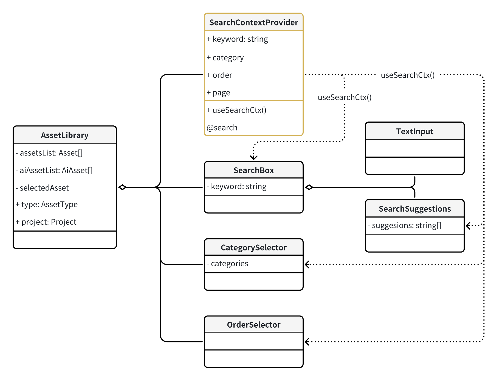

# 查询模块（前端）

## 模块目的

此模块提供用户通过关键词搜索、分类筛选和排序选项快速定位所需素材的功能。

## 模块定位

此模块是[素材库页面](./07_frontend_assetLibrary.md)的子模块，主要负责素材的搜索功能。搜索结果由[素材列表](./09_frontend_assetList.md)模块展示。

模块需要提供以下功能：
- 为用户提供一个直观的搜索界面，支持文本搜索和搜索建议。
- 允许用户根据分类、价格范围、品牌等对搜索结果进行筛选。
- 支持对搜索结果进行多种排序方式，如按价格、评分、时间等。
- 在搜索结果少于预期时，请求 AI 生成素材预览。

## 模块组件

### SearchContextProvider

- 组件：搜索 ContextProvider

- 描述：提供搜索上下文。在上下文改变时自动进行搜索并产生搜索事件。

- 上下文：

  - keyword：搜索关键词 - string
  - category： 分类 - string[]
  - order：排序选项
  - page：分页查询当前页 - number

- props：

- 导出：

  - useSearchCtx()：inject 搜索上下文

- emits：

  - search：搜索事件，emit 搜索结果到素材库组件。

- 使用：

  - 用于素材库 AssetLibrary 中。其插槽内应包含所有搜索组件和搜索结果组件（布局考虑）。
  - 搜索组件通过 useSearchCtx 获取搜索上下文。修改上下文内的值进行搜索。
  - 高频改变的搜索参数如 keyword 应做防抖处理后再更新到上下文。

### SearchBox

- 组件：搜索框
- 描述：搜索框，提供文本搜索和搜索建议`P1`。
- 子组件：
  - TextInput
  - SearchSuggestions

### SearchSuggestions

`P1`

- 组件：搜索建议
- 视图模型：
  - suggestions：建议列表 - string[]

### CategorySelector

- 组件：分类选择
- 视图模型：
  - categories：给定的分类列表 [7.11](https://ncuhomer.feishu.cn/docx/VoTDd5yfxoEuavxg4R9c21gNnWR)