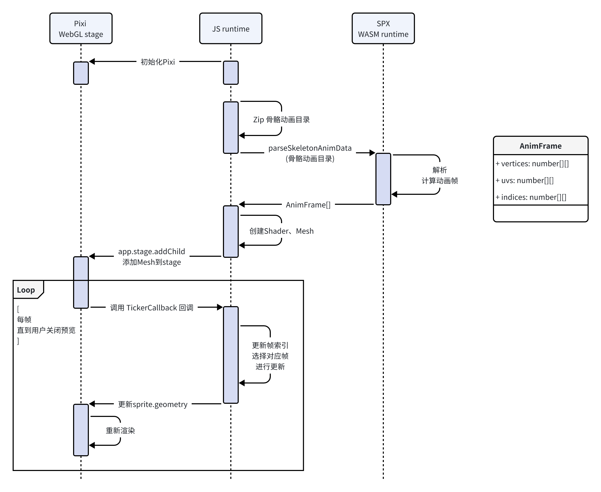

# 骨骼动画(预览)

> 参考 spx 新增的骨骼动画
>
> **PR** #286 **[[WIP] feat: add skeleton animation & vertex aimation](https://github.com/goplus/spx/pull/286/files#top)** 

## 模块目的

此模块提供在素材库中预览骨骼动画的功能。

## 模块定位

此模块是[素材库页面](./07_frontend_assetLibrary.md)的子模块，在需要展示骨骼动画时显示。

模块调用 SPX 提供的 WASM 接口解析骨骼动画数据，计算动画帧序列，通过 pixi.js 渲染动画。并提供播放、暂停等功能。

通过 WASM 调用 SPX 可以确保骨骼动画的解析的一致性。预先计算帧序列，可以实现帧动画播放的精细控制，并减少和 WASM 的交互次数和数据传输量。使用 Pixi.js 可以在 JS Runtime 直接控制动画的播放状态，包括播放、暂停等，而不需要通过 WASM 多次交互。直接使用 SPX 进行渲染时，需要对 SPX 做较多的改动以支持仅骨骼动画数据的渲染控制。而通过调用 SPX 进行帧序列计算则需要 SPX 提供一个接口，利用现有的逻辑进行计算，改动相对较少。

#### WASM 接口

##### parseSkeletonAnimData

解析骨骼动画，返回所有帧数据

- 参数：
  - animData: `Uint8Array` 骨骼动画目录(zip格式)
- 返回值：
  - AnimFrame[]: 帧数据
    - vertices：`number[][]` 顶点数据
    - uvs：`number[][]` 
    - indices：`number[][]` 