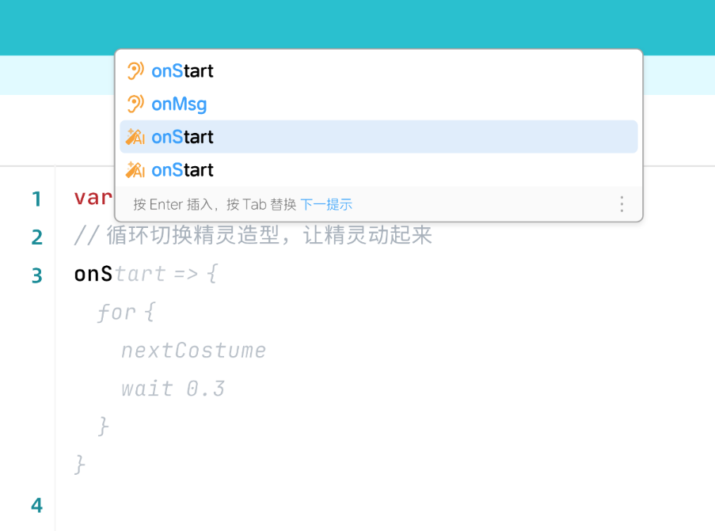

### CompletionProvider
效果图：



```ts
interface CompletionItem {
    icon: Icon,
    // 标签
    label: string,
    // 描述
    desc: string,
    // 插入的内容
    insertText: string,
    // 补全菜单项激活时，额外显示的当前菜单项的预览，例如：API文档，音频预览
    preview: LayerContent
}

interface CompletionProvider {
    provideDynamicCompletionItems(
        model: TextModel, 
        ctx: {
            position: Position,
            // 如果要补全"hello world"，输入到"hello wo"，unitWord表示："wo" 
            unitWord: string,
            signal: AbortSignal
        }, 
        addItems: (items: CompletionItem[])=> void
    ): void
}
```
##### 代码示例
```ts
function implementsCompletionProviders(ui: EditorUI) {
    ui.registerCompletionProvider({
        provideDynamicCompletionItems(model: TextModel, {unitWord}, addItems: (items: CompletionItem[]) => void) {
            const mockCompletionItems: CompletionItem[] = [
                {
                    icon: IconEnum.Event,
                    label: "onStart",
                    insertText: "onStart",
                    desc: "this is the event which will be called when project running.",
                    preview: {
                        content: 'some markdown text...',
                        recommendAction: {
                            label: "Still not figured it out? Seek help offstage",
                            activeLabel: "ask AI",
                            onActiveLabelClick() {
                                ui.invokeAIChatModal({
                                    initialMessage: 'some ai prompt'
                                })
                            }
                        },
                        moreActions: [{
                            icon: IconEnum.Document,
                            label: "document detail",
                            onClick: () => {
                                ui.invokeDocumentDetail("markdown content...")
                            }
                        }]
                    }
                }
            ];
            // write some logic code to get matchedCompletionItems.
            const matchedCompletionItems= mockCompletionItems
                .filter(({label}) => label.startsWith(unitWord))
            return matchedCompletionItems
        }
    })
}

```
