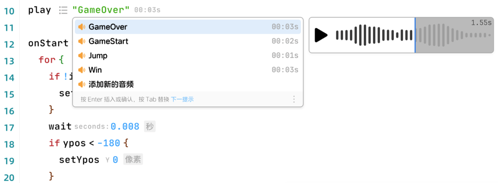

### InlayHintsProvider
效果图：


```ts
// tag表示有灰色背景的文字，text表示灰色文字，icon表示灰色图标
type InlayHintStyle = "tag" | "text" | "icon"

// none表示不对鼠标交互产生反应，triggerCompletion用于弹出补全菜单
// 例如：play "soundName", 输入 "soundN" 补全菜单会基于当前项目中的声音名称展示内容，
// 这里通过鼠标点击图标的方式，方便用户选择，而无需键盘输入。
type InlayHintBehavior = "none" | "triggerCompletion"

type InlayHint = {
    content: string | Icon,
    style: InlayHintStyle,
    behavior: InlayHintBehavior,
    position: Position
}

interface InlayHintsProvider {
    provideInlayHints(
        model: TextModel, 
        ctx: {
            signal: AbortSignal
        }
    ): Promise<InlayHint[]>
}
```
##### 代码示例
```ts
function implementInlayHintsProvider(ui: EditorUI) {
    ui.registerInlayHintsProvider({
        provideInlayHints: async (model: TextModel, ctx: { signal: AbortSignal }): Promise<InlayHint[]> => {
            // write some logic to get the inlayHintsItems
            const inlayHintsItems: InlayHint[] = [
                {
                    content: "seconds",
                    style: "text",
                    behavior: "none",
                    position: {
                        column: 0,
                        lineNumber: 0
                    }
                },{
                    content: "seconds",
                    style: "tag",
                    behavior: "none",
                    position: {
                        column: 0,
                        lineNumber: 0
                    }
                },{
                    content: IconEnum.List,
                    style: "icon",
                    behavior: "triggerCompletion",
                    position: {
                        column: 0,
                        lineNumber: 0
                    }
                },
            ]
            return inlayHintsItems
        }
    })
}
```
