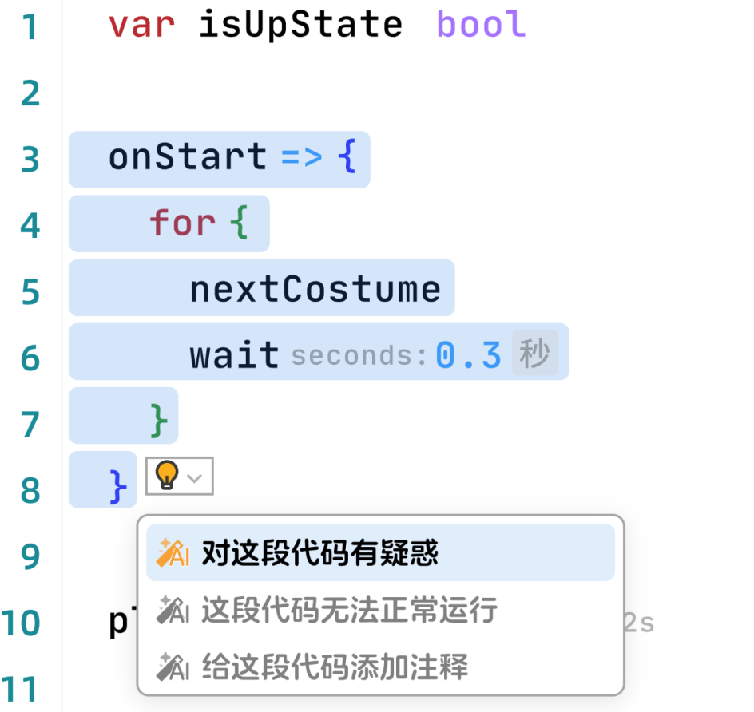

### SelectionProvider
效果图：


```ts
type SelectionMenuItem = {
    icon: Icon,
    label: string,
    action: () => void
}

interface SelectionMenuProvider {
    provideSelectionMenuItems(
        model: TextModel, 
        ctx: {
            selection: IRange,
            // 鼠标选中的内容
            selectContent: string
        }
    ): Promise<SelectionMenuItem[]>
}
```
##### 代码示例
```ts
function implementSelectionProvider(ui: EditorUI) {
    ui.registerSelectionMenuProvider({
        provideSelectionMenuItems: async (model: TextModel, {selectContent}): Promise<SelectionMenuItem[]> => {
            const selectionMenuItems: SelectionMenuItem[] = [
                {
                    icon: IconEnum.AIAbility,
                    label: "I have doubts about this code.",
                    action: function (): void {
                        // some code to invoke AI chat box.
                    }
                },{
                    icon: IconEnum.AIAbility,
                    label: "This code doesn't run properly.",
                    action: function (): void {
                        // some code to invoke AI chat box.
                    }
                },{
                    icon: IconEnum.AIAbility,
                    label: "Add comments to this code.",
                    action: function (): void {
                        // some code to invoke AI chat box.
                    }
                },
            ]
            return selectionMenuItems
        }
    })
}

```
