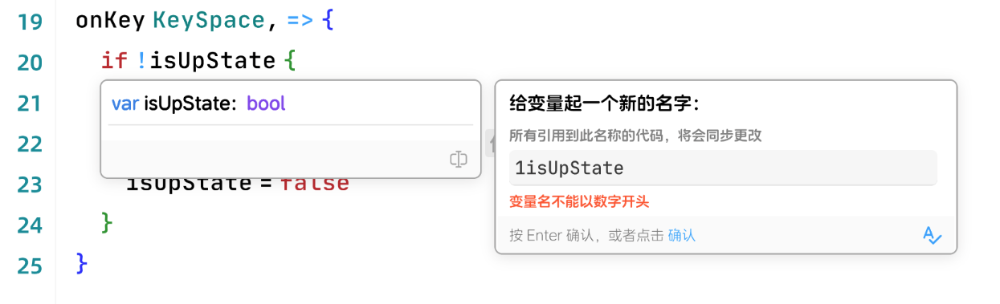

### HoverProvider
效果图：



```ts
type LayerContent = DocPreview | AudioPlayer | RenamePreview 


interface registerHoverProvider {
    providHover(
        model: TextModel, 
        ctx: {
            position: Position,
            // 鼠标悬停的关键词
            hoverUnitWord: string,
            token: AbortController
        }
    ): Promise<LayerContent>
}
```
##### 代码示例
```ts
// hover some asset to show asset preview code example. this function is about how to show audio player
function implementHoverProviderAudioPlayer(ui: EditorUI) {
    ui.registerHoverProvider({
        provideHover: async(model: TextModel, ctx: {
            position: Position;
            hoverUnitWord: string;
            token: AbortController
        }) => ({
            src: 'audio source url',
            duration: 125,
        })
    })
}

// rename code example
function implementHoverProviderForRename(ui: EditorUI) {
    ui.registerHoverProvider({
        provideHover: async (model, ctx) => ({
            content: `var isUpState: bool`,
            moreActions: [{
                icon: IconEnum.Rename,
                label: "rename variable",
                onClick: () => ({
                    placeholder: ctx.hoverUnitWord,
                    async onSubmit (newName, ctx, setError) {
                        if (!newName.match("some regex....")) {
                            setError("name is not available");
                        }
                        // some other code need await Fn to check...
                        ctx.token.signal.addEventListener("abort", function () {
                            console.log("rename process aborted");
                        });
                    },
                }),
            }]
        }),
    })
}
```
