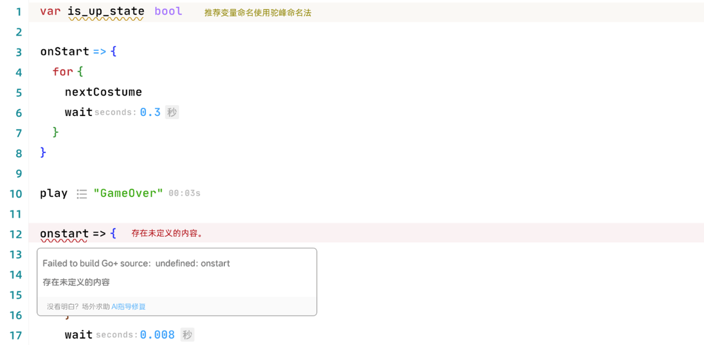

# AttentionHintsProvider
效果图：


```ts
enum AttentionHintLevelEnum {
    INFO,
    WARNING,
    ERROR
}

type AttentionHint = {
    level: AttentionHintLevelEnum,
    range: IRange,
    message: string,
    hoverContent: LayerContent
}

interface AttentionHintsProvider {
    provideAttentionHints(
        setHints: (hints: AttentionHint[])=> void,
        ctx: {
          signal: AbortSignal
        }
    ): void
}
```

## 代码示例
```ts
function implementAttentionHintsProvider(ui: EditorUI) {
    ui.registerAttentionHintsProvider({
        provideAttentionHints(setHints: (hints: AttentionHint[]) => void, ctx: { signal: AbortSignal }) {
            // write some logic code to get the attentionHintItems
            const attentionHintItems: AttentionHint[] = [
                {
                    level: AttentionHintLevelEnum.WARNING,
                    range: {
                        startColumn: 0,
                        startLineNumber: 0,
                        endColumn: 0,
                        endLineNumber: 0
                    },
                    message: "",
                    hoverContent: {
                        content: "Failed to build Go+ source:  undefined: onstart",
                        recommendAction: {
                            label: "Still not figured it out? Seek help offstage",
                            activeLabel: "ask AI",
                            onActiveLabelClick() {
                                ui.invokeAIChatModal({
                                    initialMessage: 'some ai prompt'
                                })
                            }
                        },
                    }
                }
            ]

            setHints(attentionHintItems)
            
            // example to work with other events to add attentionHints
            const close = onRuntimeError((errs) => {
               addHints([...attentionHintItems, ...errs])
            })
            // remove listener when provider is aborted
            ctx.signal.addEventListener("abort", () => close())
            
        }
    })
}

```
