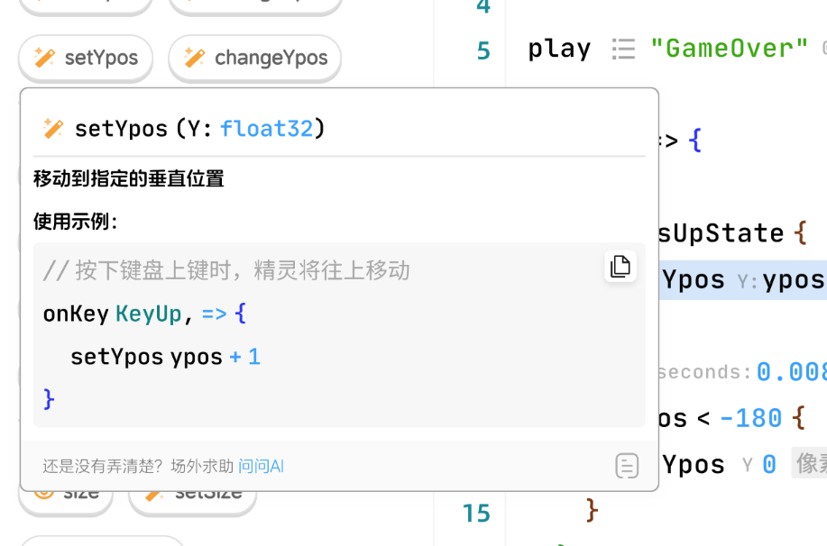

### registerCodeInputAssistantProvider

效果图：



```ts
type CodeSnapUsage = {
    /** Description for usage, without tailing dot */
    desc: LayerContent
    /** Code sample, usually it's similar while sightly different with `insertText` */
    sample: string
    /**
     * A string or snippet that should be inserted in a document for the usage.
     * Same with `languages.CompletionItem.insertText`.
     */
    insertText: string
}

type CodeSnap = {
    icon: Icon,
    // used for 2 or more usages to explain codeSnap main function
    desc: string,
    usages: CodeSnapUsage[],
    token: Token
}

type CodeSnapGroup = {
    label: string
    codeSnaps: CodeSnap[]
}

type CodeSnapCategory = {
    label: string
    groups: CodeSnapGroup[]
    icon: Icon,
    color: string
}

interface CodeInputAssistantProvider {
    provideCodeInputAssistant(ctx: {
        token: AbortController
    }): Promise<CodeSnapCategory[]>
}
```
