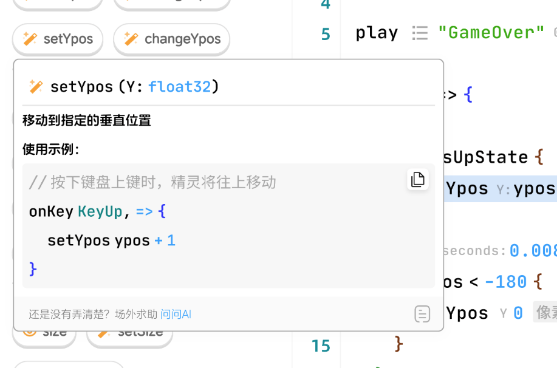

# registerCodeInputAssistantProvider

效果图：



```ts
type InputItemUsage = {
  // 鼠标悬浮到具体用法上面时会显示文档卡片供用户参考
  desc: LayerContent,
  insertText: string
}

type InputItem = {
  icon: Icon,
  label: string,
  // 用于在函数或者事件超过2个及以上时显示概述性的用法
  desc: string,
  usages: InputItemUsage[],
}

type InputItemGroup = {
  label: string
  inputItems: InputItem[]
}

type InputItemCategory = {
  label: string
  icon: Icon,
  color: string
  groups: InputItemGroup[]
}

interface InputAssistantProvider {
  provideInputAssistant(ctx: {
    signal: AbortSignal
  }): Promise<InputItemCategory[]>
}
```
