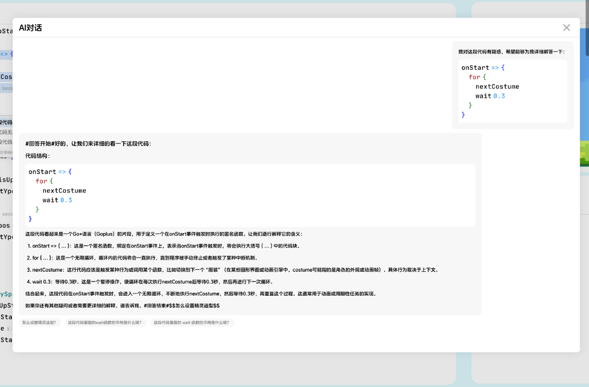

# invokeAIChatModal

效果图：


```ts
type ReplyAction = {
    message: string
}

type Reply = {
    message: Markdown,
    actions: ReplyAction[]
}

type AIChatModalOptions = {
    initialMessage: string,
    reply?: (userMessage: Markdown)=> Promise<Reply>
}
```

## 代码示例
```ts
// hover unitWord to show doc and ask AI
function implementHoverProviderDocPreview(ui: EditorUI) {
    ui.registerHoverProvider({
        provideHover: async (model: TextModel, ctx: {
            position: Position;
            hoverUnitWord: string;
            signal: AbortSignal
        })=> ({
            content: 'some markdown text...',
            recommendAction: {
                label: "Still not figured it out? Seek help offstage",
                activeLabel: "ask AI",
                onActiveLabelClick() {
                    ui.invokeAIChatModal({
                        initialMessage: 'some ai prompt'
                    })
                }
            },
            moreActions: [{
                icon: IconEnum.Document,
                label: "document detail",
                onClick: () => {
                    ui.invokeDocumentDetail("markdown content...")
                }
            }]
        })
    })
}
```
