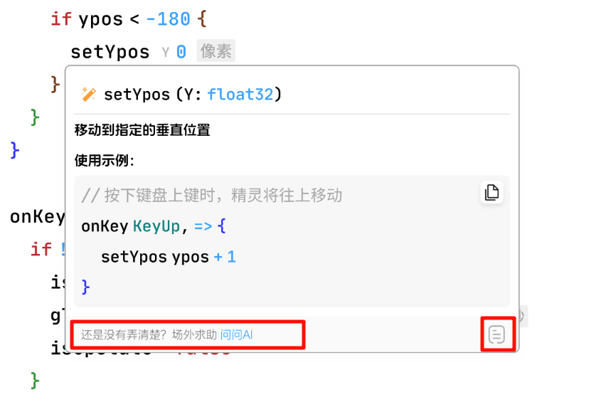

### invokeDocumentDetail

效果图：


```ts
type RecommendAction = {
    label: string,
    activeLabel: string,
    onActiveLabelClick(): void | LayerContent
}

type Action = {
    icon: Icon,
    label: string,
    onClick(): void | LayerContent
}

type DocDetail = Markdown

type DocPreview = {
    content: Markdown,
    recommendAction: RecommendAction | undefined,
    moreActions: Action[] | undefined
}
```

##### 代码示例
```ts
// hover unitWord to show doc and ask AI
function implementHoverProviderDocPreview(ui: EditorUI) {
    ui.registerHoverProvider({
        provideHover: async (model: TextModel, ctx: {
            position: Position;
            hoverUnitWord: string;
            token: AbortController
        })=> ({
            content: 'some markdown text...',
            recommendAction: {
                label: "Still not figured it out? Seek help offstage",
                activeLabel: "ask AI",
                onActiveLabelClick() {
                    ui.invokeAIChatModal({
                        initialMessage: 'some ai prompt'
                    })
                }
            },
            moreActions: [{
                icon: IconEnum.Document,
                label: "document detail",
                onClick: () => {
                    ui.invokeDocumentDetail("markdown content...")
                }
            }]
        })
    })
}
```
