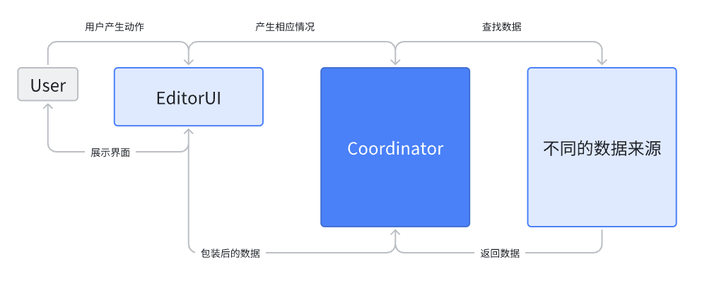

# Coordinator

Coordinator 负责协调各个模块之间的交互和数据获取，并确保整个可扩展性与保证各模块内部将只关心内部实现。



- 自身提供

```ts
//coordinator
interface Editor {
    jump(position: Position): void
}

type Position = {
    line: number,
    column: number,
    fileUri: string
}
```

- 示例代码

通过鼠标悬浮在代码上，获取当前悬浮的词，并获取文档内容，展示在HoverCard上。并且通过确认是否有详细文档形式，确认展现的详细文档内容。其点击的回调可以唤起侧边栏展示文档的功能。

```ts
//ui document example
import { EditorUI as ui } from "./ui"
import { DocAbility as doc } from "./doc"
import { Compiler as compiler } from "./compiler"

function documentImplement() {
    ui.registerHoverProvider({
        async providerHover(model, ctx) {
            const word = model.getValueInRange(ctx.position)
            const id = compiler.getID()
            const content = await doc.getNormalDoc(id)
            const moreActions: Action[] = []
            const detailContent = await doc.getDetailDoc(id)
            if (detailContent != null) {
                moreActions.push({
                    icon: IconEnum.Document,
                    label: "xxx",
                    onClick: () => {
                        ui.invokeDocumentDetail(detailContent)
                    }
                })
            }
            const c: LayerContent = {
                content: content.content,
                moreActions: [
                    ...moreActions
                ]
            }
            return c
        },
    })
}
```

通过获取当前代码中的所有诊断错误之后，利用setHints向代码中设定hints内容，并增加一个回调用于监听运行时结束之后的错误，通过判断目前的项目哈希与运行时的项目哈希来判断是否需要展示运行时错误。

```ts
//syntax error&runtime error example
import { EditorUI as ui } from "./ui"
import { RuntimeAbility as runtime } from "./runtime"
import { Compiler as compiler } from "./compiler"
import { Project as project } from "./project"

function attentionHintImplement() {
    ui.registerAttentionHintProvider({
        provideAttentionHint(setHints: (hints: AttentionHint[]) => void, ctx: { token: AbortController }) {
            const syntaxErrors = compiler.getDiagnostics();
            setHints(syntaxErrors.map((error) => ({
                level: AttentionHintLevelEnum.ERROR,
                range: error.Range,
                message: error.Message,
                hoverContent: {
                    content: "",
                }
            })))
            const close = runtime.OnRuntimeErrors(({ runtimeErrorList, runtimeErrorProjectHash }) => {
                if (runtimeErrorProjectHash == project.getHash()) {
                    setHints(
                        ...syntaxErrors.map((error) => ({
                            level: AttentionHintLevelEnum.ERROR,
                            range: error.Range,
                            message: error.Message,
                            hoverContent: {
                                content: "",
                        }})),
                        ...runtimeErrorList.map((error) => ({
                        level: AttentionHintLevelEnum.ERROR,
                        range: error.Range,
                        message: error.Message,
                        hoverContent: {
                            content: "",
                        }}))
                    )
                }
            })
            ctx.token.signal.addEventListener("abort", () => {
                close()
            })
        }
    })
}
```

通过用户选中代码之后展示SelectionMenu，提供三个AI对话选项，之后通过调用AI模块，来继续与AI进行对话。

```ts
//show ai modal example
import { EditorUI as ui } from "./ui"
import { ChatBot as chatbox } from './ai'

function showAIModal() {
    ui.registerSelectionMenuProvider({
        async provideSelectionMenuItems(model: TextModel, ctx: { selection: IRange, selectContent: string }) {
            return [
                {
                    label: "解释一下代码",
                    icon: IconEnum.AIAbility,
                    action: () => {
                        ui.invokeAIChatModal({
                            initialMessage: "帮我解释一下代码",
                            reply: async (usermsg) => {
                                let chat = await chatBot.startExplainChat({ input: usermsg, lang: "zh-cn" })
                                const resp = await chat.sendUserMessage("")
                                return {
                                    message: resp.content,
                                    actions:
                                        resp.actions.map((action) => {
                                            return {
                                                message: action.message,
                                            }
                                        })
                                }
                            }
                        })
                    }
                },
                {
                    label: "给代码加点注释",
                    icon: IconEnum.AIAbility,
                    action: () => { }
                },
                {
                    label: "怎么修复代码呢",
                    icon: IconEnum.AIAbility,
                    action: () => { }
                },
            ]
        }
    })
}
```
