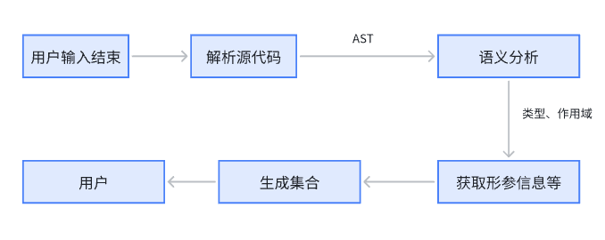
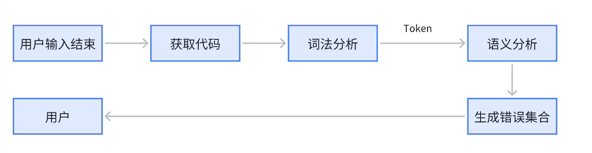
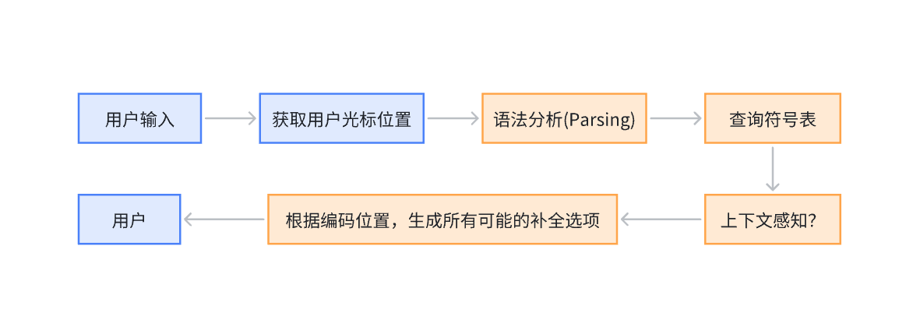
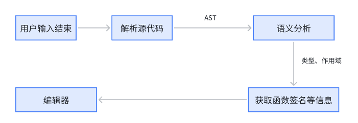

# Compiler

目前前端实现能力需要提供的内容就是以下几个类型：

1. 获取Identity（类型，名称，包，函数签名，具体单位->需要设定函数签名的具体@值，或实现多语言）
2. 获取行内提示（每次对代码修改之后的，一次性获取）（位置，类型->'形参名、单位名、特定场景针对play声音展示ICON的类型'）
3. 提供语法检查出的内容（类型详见：Part.错误类型，提供位置跟分级提示）
4. 提供补全列表的list （方法1：在键入第一个字的时候就运行，然后之后只filter，方法2：每次键入都运行（不大可能））

## 模式

只向前端提供前端想要的内容，然后剩余的内容由compiler内部封装和组织。

- 提供

1. 获取行内提示
2. 获取错误提示
3. 获取补全列表
4. 获取 Token 类型

- 内部实现

1. 根据代码生成AST树(语义分析，语法分析)
2. 定义完整叶子结点信息（类型，名称，包，函数签名，变量名，具体单位）
3. 维护符号表？
4. 类型推断
5. 解析函数签名

- 生成行内提示流程



- 生成错误提示流程



- 生成补全流程



- 获取 Token 类型流程



- 模块对外接口

```ts
interface Compiler {
    // inside editor
    getInlayHints(codes: Code[]): Hint[]
    getDiagnostics(codes: Code[]): AttentionHint[]
    // completion
    getCompletionItems(codes: Code[], position: Position): CompletionItem[]
    // hover
    getDefinition(codes: Code[], position: Position): Token | null
}
```

- 具体接口内容

```ts
type Hint = {
    type: enum,
    content: string,
    position: Position
}
type AttentionHint = {
    level: AttentionHintLevelEnum,
    range: IRange,
    message: string,
    hoverContent: LayerContent
}
type CompletionItem = {
    type: enum,
    label: string,
    insertText: string,
}
type Token = {
    module: string, // "github.com/goplus/spx"
    name: string,   // "Sprite.touching"
    type: enum,
    usages: TokenUsage[]
}
type Code = {
    type: enum,
    content: string,
}
```

## WASM 方案

需要对应的GO项目环境`GOOS=js;GOARCH=wasm`

- 对于GO环境

```go
type InlayHint struct {
 Content  string   `json:"content"`
 Style    string   `json:"style"`
 Behavior string   `json:"behavior"`
 Position Position `json:"position"`
}

type Position struct {
 Column     int
 LineNumber int
}
...
```

- 对于JS环境

只需要定义前文提到的具体接口内容。

## Token 定义

目前参照Go语言语法规范的定义来实行。分别为

1. 关键字
2. 操作符
3. 标识符
4. 字面量

[Reference: Go Language Specification - Token](https://go.dev/ref/spec#Tokens)

## 单位定义

通常在定义一个函数的过程中，例如在spx的关键字`play`中，可以在其的函数签名中添加一行：

```ts
/ *
 * @unit: {en: 'seconds', zh: '秒'}
* /
```

## 错误类型

针对可能出现的一些错误定义的类型，分别有

1. 语法错误
2. 类型错误
3. 逻辑错误

目前针对的是错误提示这个接口设计的。

### Syntax

1. Typographical Errors

```go
printtln("Hello World") // should be Println
```

2. Missing Symbols
3. Mismatched Symbols

```go
str := "Hello world 
// should be "Hello world"
```

4. Incorrect Statement Structure

```go
var x int var y int
```

5. Incomplete Statements

```go
if x > 0 //missing {
```

6. Illegal use of operators

```go
x := 5 +
```

7. Misuse of reserved words

```go
var func = 10 // func is a reserved word of go
```

8. Incorrect control structures

```go
for i := 0; i < 10; i++ // missing {}
fmt.Println(i)
```

### Type

1. Type Mismatch

```go
var x int = "Hello"
//mismatch
```

2. Function Argument Type Error

```go
func fn(a int) {

}
fn("abc")
// should be fn(123)
```

3. Using Uninitialized Variables

```go
var x int
fmt.Println(x)
```

4. Undeclared Variables

```go
fmt.Println(y)
// should be var y int
```

5. Return types errors

```go
func fn() int {
    return "abc"
}
// should be return 123
```

6. Out of bounds

```go
arr := []int{1, 2, 3}
fmt.Println(arr[3])
// should be arr[2]
```

### Logic

1. Incorrect conditions

```go
x := 10
if x = 5 { // should be x == 5
    //do some thing
}
```

2. Loop errors

```go
for i := 0; i < 10; { // bad loop
    fmt.Println(i)
}
```
