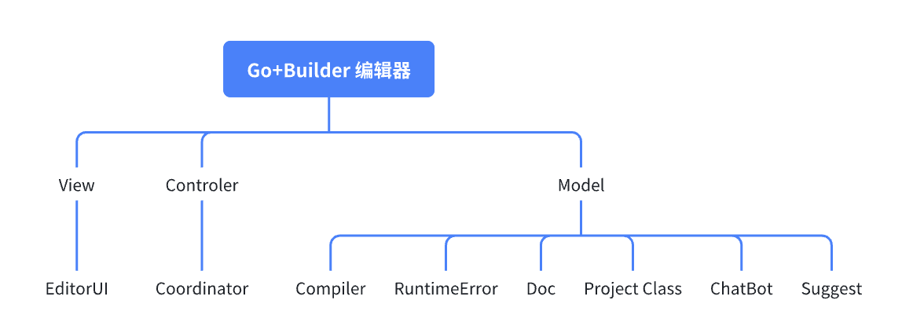

# Editor

针对编辑器中可优化用户编码过程的地方进行重新架构设计，并增添了一些新的功能。

- 总体架构



## EditorUI

EditorUI 的目标是帮助用户把自身的逻辑快速而完整地通过代码表达出来。
通过在 UI 层面实现并调用不同的功能模块，如文档快速预览、代码高亮分析、AI 答疑解惑以及更便捷的代码补全菜单，来降低初学者的编程门槛，并提高了编码效率。

详见 [EditorUI](./01_ui/01_architecture.md) 。

## [Coordinator](./02_coordinator.md)

Coordinator 负责协调各个模块之间的交互。管理各个模块的交互以及数据流程，确保整个可扩展性与保证各模块内部只关心内部实现。

- 例子

```ts
import { EditorUI as ui } from 'ui'
import { DocAbility as doc } from 'ui'
import { Compiler as compiler } from 'ui'

function documentImplement() {
    ui.registerHoverProvider({
        async providerHover(model, ctx) {
            const word = model.getValueInRange(ctx.position)
            const id = compiler.getDefinition()
            const content = await doc.getNormalDoc(id)
            const moreActions: Action[] = []
            const detailContent = await doc.getDetailDoc(id)
            if (detailContent != null) {
                moreActions.push({
                    icon: IconEnum.Document,
                    label: "xxx",
                    onClick: () => {
                        ui.invokeDocumentDetail("markdown")
                    }
                })
            }
            const c: LayerContent = {
                content: content.content,
                moreActions: [
                    ...moreActions
                ]
            }
            return c
        },
    })
}
```

## [Compiler](./03_compiler.md)

Compiler模块具体利用编译器能力、代码检查等能力负责对代码、proj部分进行解析并生成AST树，并根据AST进行生成类型，实现基于wasm提供。

目前Complier 负责向UI模块提供其所需要的四种功能，分别是：

1. 获取行内提示
2. 获取错误提示
3. 获取补全列表
4. 获取Token类型

- 对外接口

```ts
interface Compiler {
    // List
    getInlayHints(codes: Code[]): InlayHint[]
    getDiagnostics(codes: Code[]): Diagnostic[]
    getCompletionItems(codes: Code[], position: Position): CompletionItem[]
    // Single identifier
    getDefinition(codes: Code[], position: Position): Identifier | null
}
```

## [Runtime](./04_runtime.md)

Runtime模块负责在debug模式下负责捕获运行时错误并提供内容让UI组件获取。

- 对外接口

```ts
interface Runtime {
    OnRuntimeErrors(cb: (errors: RuntimeError) => void): Dispose;
}
```

## [Doc](./05_doc&&project.md)

文档是指以Markdown格式提供的，对spx与gop关键字等代码Token的解释型文档，通过维护文档可以向用户展示功能与代码的解释。文档内容分层为简略文档和详细文档，以满足不同界面形式对不同信息量的对应。

- 目前
目前文档直接维护在前端代码中，内部实现仅为一个文档获取的函数。  

- 未来

考虑到未来社区支持，社区作者对其文档的可配置性需求，未来考虑增加后端数据存储支持。

- 对外接口

```ts
interface DocAbility{
    getNormalDoc(token: Token): Doc | null
    getDetailDoc(token: Token): Doc | null
}
```

## [Project](./05_doc&&project.md)

用到所有Project的地方都可以由项目中原有的Project类实现。因此目前只需要复用即可。

- 对外接口(已有)

```ts
interface Project {
    // 获取项目中的精灵代码、背景代码
    getProjectCode(): Code[] //现有：exportGameFiles

    // project file hash
    getFileHash(): string // 现有 filesHash

    // project context 
    getContext(): ProjectContext // 现有 Project.name,  Sprite.name[]

    // rename
    Sprite: {
      setName(name: string): void
    },
    // ...otherAssetsName(Sound, Stage)
}
```

## [Chatbot](./06_ai.md)

用于负责与AI交流的部分，提供开启一个会话与继续发送消息的能力。提供了 解释、添加注释、修复代码 这三个对话功能。

```ts
export interface ChatBot {
    startExplainChat(input: Input): Chat
    startCommentChat(input: Input): Chat
    startFixCodeChat(input: Input): Chat
}
```

## [Suggest](./06_ai.md)

建议模块负责提供一个利用LLM来生成代码建议的功能，内部通过传入代码与光标位置对代码进行补全式生成。

```ts
export interface Suggest {
    startSuggestTask(input: Input): SuggestItem[]

}
```
