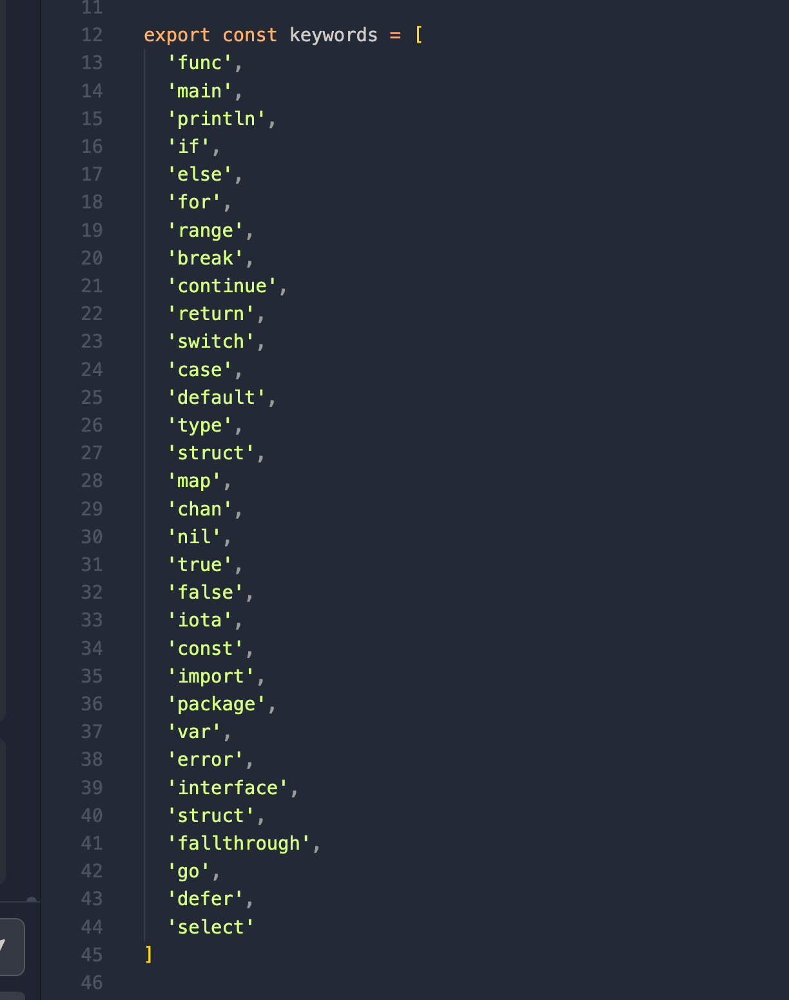
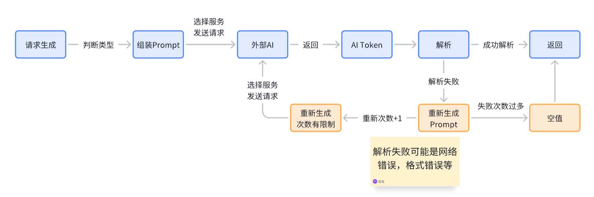

# Ability

## Compiler

负责对代码、proj部分进行解析并生成AST树，对AST进行检查。基于wasm提供。

需求：

1. 代码诊断 获取类型语法错误 lint
2. 获取补全项目
3. 获取变量单位（定义一个规范）...
4. hover的判断（只看类型什么的）

### 对外接口

新: 更贴近业务，确保wasm的数据流内容更小，前端定义的内容更少些。

```typescript
interface Compiler {
  getDiagnostics(fileUri: URI): Diagnostic[]
  getCompletionItems(fileUri: URI, position: Position): CompletionItem[]
  getInlayHints(fileUri: URI): InlayHint[]
  // hover
  getDefinition(fileUri: URI, position: Position): Identifier | null
}
```

废弃

```typescript
class Compiler {
    getIdentifyType(code: string, identifyPosition: Position): IdentifyType;
    getCompleteSuggest(code: string, identify: string): IdentifyUsage[];
    getASTTree(code: string): ASTree;
    getTypesInfo(ast: AST): TypesInfo;
    getCompletionItem(): CompletionItem;
    getHoverDoc(): HoverDoc;
}

interface TypesInfo {
    getType(node: ASTNode): Type;
}

class Linter {
    // Linter相关实现
}
```

### 详细设计

#### Todo

- [x] 去看看具体的实现跟提供的接口有什么，然后再去做修改
- [x] 详细内容具体谁给
- [x] 暂时先别考虑LSP
- [ ] 考虑边界

#### 现有的Gop Compiler

`gop/ast/print.go` 中有 `print` 函数可以输出AST树。

叶子节点：

```go
Ident struct {
    NamePos token.Pos // identifier position
    Name    string    // identifier name
    Obj     *Object   // denoted object; or nil
}

type Object struct {
    Kind ObjKind
    Name string      // declared name
    Decl interface{} // corresponding Field, XxxSpec, FuncDecl, LabeledStmt, AssignStmt, Scope; or nil
    Data interface{} // object-specific data; or nil
    Type interface{} // placeholder for type information; may be nil
}

type ObjKind int
type Pos = token.Pos
type Pos int
```

`gop/ast/resolve.go` 中有 `resolve` 标识符解析。

`gop/ast/filter.go` 中有 `exportFilter` 判断导出的符号。

#### 现有的vscode插件抽离出关键部分

```plaintext
.
├── languages // 语言配置相关
│   ├── go.mod.language-configuration.json
│   └── gop.language-configuration.json
├── syntaxes // 语法相关
│   ├── go.mod.tmGrammar.json
│   ├── go.sum.tmGrammar.json
│   ├── gop.backup.json
│   ├── gop.tmLanguage.json
│   └── govulncheck.tmGrammar.json
├── snippets // 代码片段
│   ├── go.json
│   └── gop.json
├── tsconfig.json
└── src // 对应的插件相关
    ├── extensionAPI.ts
    └── language
        ├── goLanguageServer.ts
        ├── legacy
        │   ├── goCodeAction.ts
        |   ├── .....
        └── registerDefaultProviders.ts
```

#### 目前的前端实现

`editor/code-editor/code-text-editor/monaco.ts` 这是 Monaco Editor 的集成文件，负责在项目中集成 Monaco Editor 以提供代码编辑功能。


```typescript
monaco.languages.registerCompletionItemProvider('spx', {
    provideCompletionItems: (model, position) => {
        const word = model.getWordUntilPosition(position);
        const range = {
            startLineNumber: position.lineNumber,
            endLineNumber: position.lineNumber,
            startColumn: word.startColumn,
            endColumn: word.endColumn
        };
        const suggestions: languages.CompletionItem[] = getCompletionItems(
            range,
            monaco,
            i18n,
            getProject()
        );
        return { suggestions };
    }
});
```

## Runtime

在debug模式下负责捕获Runtime错误并提供内容让UI组件获取，在页面下部展示分条的console，来引导用户跳转。

### 对外接口

提供一个获取捕获到的运行时输出的函数用于让UI部分获取具体内容，并且这个函数内提供的是解析完的参数。也提供回调让出现新的console行时就触发。

```typescript
type Position = {
    Line: number;
    Column: number;
    File: string;
}

type RuntimeError = {
    Message: string;
    Position: Position;
}

type RuntimeErrorList = RuntimeError[];

type CurrentRuntimeError = {
    runtimeErrorList: RuntimeErrorList;
    runtimeErrorProjectHash: string;
}

type Dispose = () => void;

type Log = string;

class Runtime {
    GetRuntimeErrors(): CurrentRuntimeError;
    OnRuntimeErrors(cb: (errors: CurrentRuntimeError) => void): Dispose;
}
```

### 详细设计

```typescript
type Log = string;

interface Runtime {
    runtimeErrorList: RuntimeError[];
    projectHash: string;
    handleRuntimeLog(log: Log): void;
    parseRuntimeLog(logList: Log[]): void;
}
```

## Doc

文档部分负责提供简略文档和详细文档，通过传入identifier来判断文档的内容，再进行展示。同时目前文档可以直接维护在前端代码中，因此不需要crud只需要实现get方法。  

### 对外接口

```typescript
type MarkDown = string

type Ident = {
    Name: string // e.g. "for"
    Pkg: string // e.g. "github.com/gop/gop/..."
}

type Doc = {
    content: MarkDown
    identify: Ident
    
}

interface DocAbility{
    getNormalDoc(identifier): Doc | null
    getDetailDoc(identifier): Doc | null
}
```

### 内部设计

```typescript
每个identify对应一个doc，当查找没有的时候就直接返回空。
type DocMap = {
    Identify: Doc
}
```

## Project

目前需要用到所有Project的地方都可以由项目中原有的Project类实现。<span style="background:#ffcc00">（已有）</span>
但是需要一个完整的rename工具函数负责整体rename的功能。<span style="background:#ffcc00">（补充）</span>

```typescript
class ProjectAbility {
    getSounds()
    getSpites()
    ...
    getFileHash()
    
    //扔给AI
    getContext(): object
    rename()
    
}
// 用 model project
```

## ChatBot

### 前端

```typescript
export type ReplyAction = {
    message: string
}

export type Message = {
    content: string,
    actions: ReplyAction[]
}

export interface Chat {
    First: boolean, // 前端也需要存是不是第一条消息是因为前端的第一条消息也需要自己封装一下的。
    sendUserMessage(useressage: string): Promise<Message>
}

type Input = {
    input: string // user message
    lang: string // user native language
}

type ExplainChatInput = Input
type CommentChatInput = Input
type FixCodeChatInput = Input

export interface ChatBot {
    startExplainChat(input: ExplainChatInput): Chat
    startCommentChat(input: CommentChatInput): Chat
    startFixCodeChat(input: FixCodeChatInput): Chat
}   
```

### 后端

后端对于请求，只需要判断传入的ID是不是空就可以对是不是第一条消息进行判断。之后进行封装。  
由于AI部分的请求都需要对Prompt进行封装，不能把封装后的Prompt暴露在网络过程中，因此接口面向业务。

- 接口名称：AI对话
- 负责提供对话的传入与传出，并返回序列化后的数据。
- POST：/ai/chat/
- 请求参数

```json
{
    id: string, // null as the first message
    chatAction: enum, //1: Explain, 2: Comment, 3: FixCode
    userInput: string, //
    userLanguage: string, //
    projectContext: { 
        projectVariable: ProjectVariable[],
        projectName: string,
        projectCode: Code[]
    }
}
```

- 返回参数

```json
{
    code: number,
    msg: string,
    data: {
        id: string,
        model: string,
        userAction: string,
        respMessage: string
    }
}
```

## Suggest

### 前端

```typescript
type CodeInput = {
    Position: Position
    Code: string
}

type Position = { Line: number, Column: number }

interface SuggestItem {
    label: string,
    desc: string,
    insertText: string,
}

export interface Suggest {
    startSuggestTask(input: CodeInput): SuggestItem[]
}
```

### 后端

- 接口名称：AI对话
- 负责提供对话的传入与传出，并返回序列化后的数据。
- POST：/ai/task/
- 请求参数

```json
{
    taskAction: enum, //1: Suggest
    userCode: string, //
    userCurrentCursor: {
        Line: number,
        Coulumn: number
    },
}
```

- 返回参数

```json
{
    code: number,
    msg: string,
    data:{
        id: string,
        model: string,
        taskAction: enum,
        message: {
            label: string,
            desc: string,
            insertText: string,
        }
    }
}
```



### Template contains

| Action | Template |
|- | - |
| Suggest | <div>提示ai解释</div> <div>用户内容 可能通过正则匹配去除包裹字</div> <div>通过设定包裹字提示AI只对其中理解</div> <div>设定回复模板</div> <div>提示回复模板</div> <div>生成推荐提问</div> |
| Explain |  <div>提示ai生成建议</div> <div>获取整个上下文</div> <div>可能通过正则匹配去除包裹字</div> <div>通过设定包裹字提示AI只对其中建议</div> <div>设定返回模板</div> |
| Comment |  <div>提示ai补上建议</div> <div>获取整个上下文</div> <div>可能通过正则匹配去除包裹字</div> <div>通过设定包裹字提示AI只对其中生成注释并返回主体内容</div> <div>设定返回只包含全文code</div> |
| FixCode | <div>提示ai修复代码</div> <div>获取整个Code部分</div> <div>可能通过正则匹配去除包裹字和一些引导词</div> <div>通过设定包裹字提示AI只对其中修复</div> <div>设定返回模板</div> |

### Coordinator
