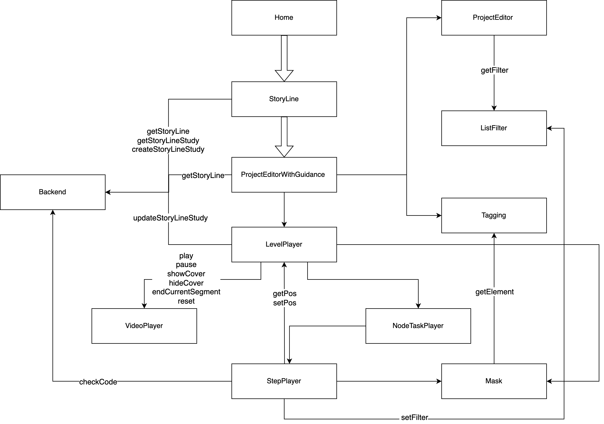

# Guidance

## 模块概览

为builder的快速入门设计的引导系统。

- 总体架构

## 模块详情

### StoryLine

- 定位：主要针对用户UI层面的故事线页面

### ProjectEditorWithGuidance

- 定位：用户从故事线页面点击进入一个关卡打开的页面，是原先普通Project编辑页面的一个高级扩展

### Tagging

- 定位：对页面元素进行语义化标注，用于定位目标元素，可在Mask、监听用户触发行为中使用

### Mask

- 定位：根据目标元素对页面进行蒙层，对目标元素进行高亮

### LevelPlayer

- 定位：在一个关卡中调度关卡介绍、视频播放组件和节点任务

### VideoPlayer

- 定位：仅为视频播放部分，展示视频的分段点，在每个分段点会触发特定事件（可以不知晓业务的存在）

### NodeTaskPlayer

- 定位：播放视频，并且展示视频的分段点，在每个分段点会触发特定事件（可以不知晓业务的存在）

### StepPlayer

- 定位：执行单一步骤，包括加载快照，高亮目标元素，代码检查和快照对比等，步骤结束即销毁

### ListFilter

- 定位：过滤资源列表，包括API Reference、素材、精灵和动画等，用于在引导过程中控制可见的资源范围，确保用户关注特定内容

### BackEnd

- 定位：提供后端接口服务
