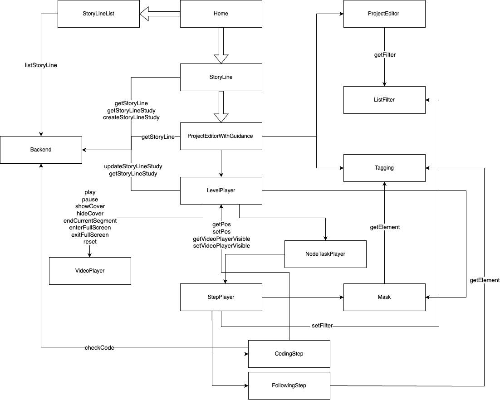

# Guidance

## 模块概览

为builder的快速入门设计的引导系统。

- 总体架构

## 模块详情

### StoryLine

- 定位：主要针对用户UI层面的故事线页面
- 类型：component

### ProjectEditorWithGuidance

- 定位：用户从故事线页面点击进入一个关卡打开的页面，是原先普通Project编辑页面的一个高级扩展
- 类型：component

### UIAdapter

- 定位：对原先项目编辑模块的扩展（隐藏）以满足向导的需求
- 类型：class

### Tagging

- 定位：对页面元素进行语义化标注，用于蒙层或高亮的定位、用户触发行为的监听
- 类型：class

### Mask

- 定位：根据页面元素对页面进行蒙层
- 类型：component

### LevelCoordinator

- 定位：在一个关卡中调度关卡介绍、节点任务视频、步骤
- 类型：component

### VideoPlayer

- 定位：播放视频，并且展示视频的分段点，在每个分段点会触发特定事件（可以不知晓业务的存在）
- 类型：component

### NodeTaskPlayer

- 定位：播放视频，并且展示视频的分段点，在每个分段点会触发特定事件（可以不知晓业务的存在）
- 类型：component

### StepPlayer

- 定位：执行单一步骤，步骤结束即销毁
- 类型：component

### BackEnd
