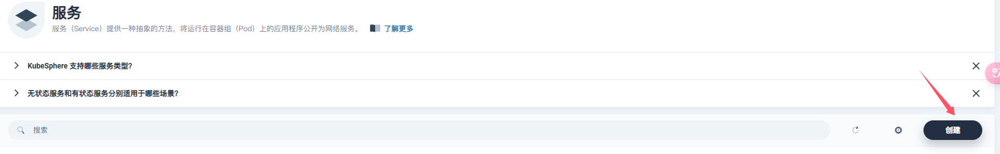
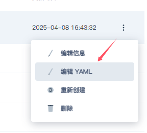

# 测试环境的部署

## 注意

注意，下列所有操作都需要在连上**七牛云内网**之后才能进行。包括服务搭建完成之后也需要连接**七牛内网**才能进行访问！！！

## 1.将builder项目打包成镜像

在builder内部有写好的Dockerfile，只需以此文件执行相关打包命令即可。参考命令：

```
docker buildx build --load -t aslan-spock-register.qiniu.io/goplus/builder-guidance:v1.2 .
```

## 2.将本地打包好的镜像推送到远程

可以推送到：aslan-spock-register.qiniu.io/goplus/builder-xxx:xxx

参考命令：

```
docker push aslan-spock-register.qiniu.io/goplus/builder-guidance:v1.2
```

docker镜像的相关资料：https://yeasy.gitbook.io/docker_practice/image/build

## 3.登录到KubeSphere

利用LDAP进行登录。需要找管理员要一下权限。

## 4.创建服务

进入KubeSphere后，首先点击项目，进入到builder项目。


之后进入应用负载中的服务。


点击创建服务。



之后选择无状态服务。


设置好名称后点击下一步。


之后点击添加容器。


输入之前弄好的镜像，并为容器配置名称。


之后配置端口。


之后选择配置字典（如果需要自定义配置字典可以模仿已有配置字典进行创建）


添加配置字典的信息。


之后一直点完成即可。

在上述步骤完成后，会出现服务启动失败的信息，此时请先进入服务下面的工作负载中。然后点击你创建的工作负载去修改YAML文件（如下图）。



将deFauleMode从420修改为511。


将下述图1替换成图2。


之后就能正常运行了。

## 5.配置域名

进入应用路由。

无需创建，直接在现有的基础上进行修改。


配置的域名采用类似goplus-builder-xxx.jfcs-k8s-qa1.qiniu.io这样的域名即可。域名的配置信息如下，**注意**要选择你已经部署好的服务以及相应的开放端口！


