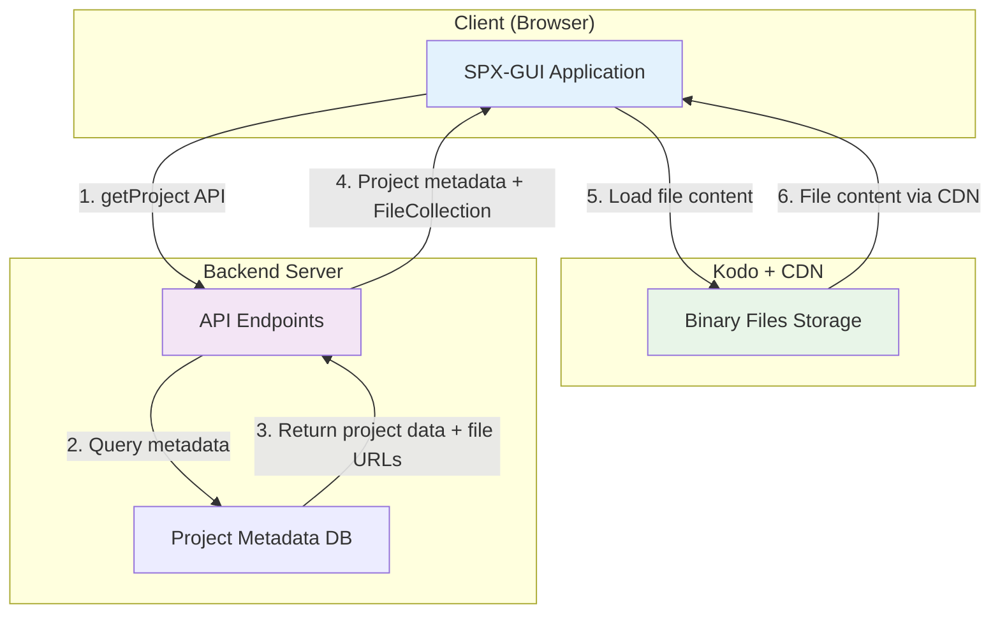
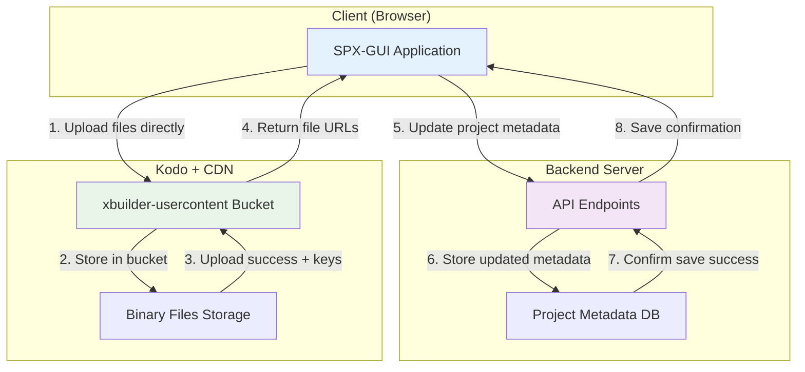
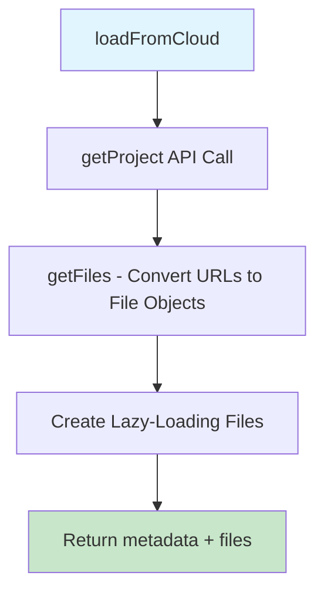
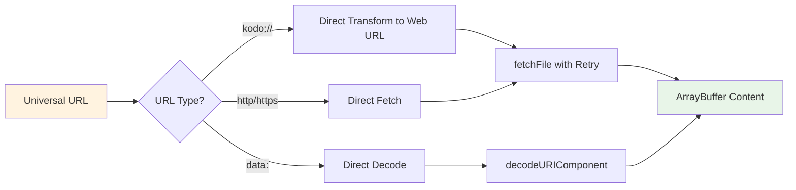
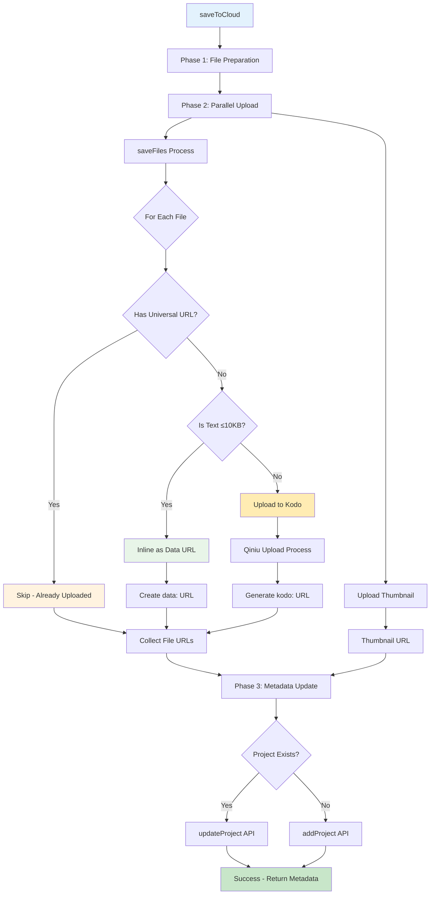
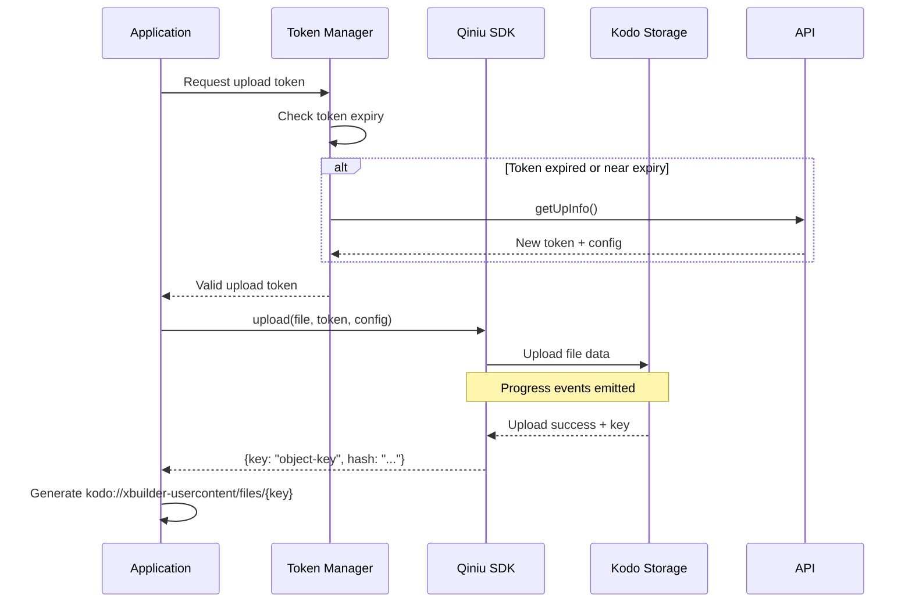
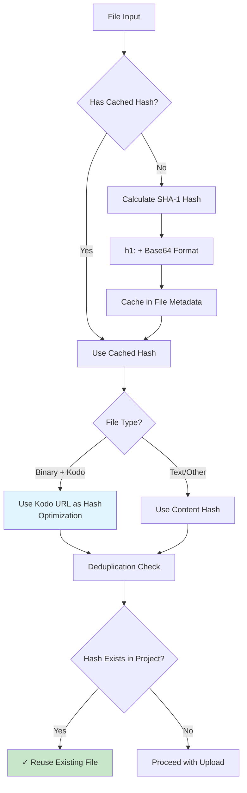
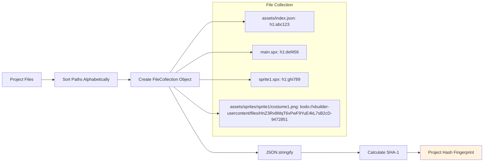

# SPX-GUI Cloud Project Loading & Saving Mechanism

## Overview

This document focuses on the cloud-based project loading and saving mechanisms in SPX-GUI, detailing how projects are stored, retrieved, and synchronized with Qiniu Kodo cloud storage through the universal URL system.

## Key Components for Cloud Operations

```
src/models/common/
├── cloud.ts              # Cloud storage operations (primary focus)
├── file.ts               # Lazy-loading File class for cloud assets
└── hash.ts               # File hashing for cloud deduplication

src/models/project/
└── index.ts              # Project class with cloud load/save methods
```

## Cloud Storage Architecture

### Project Loading Architecture



### Project Saving Architecture



### Project Data Sample

This is a sample of how project data is stored in the backend database and returned by the `getProject` API:

```json
{
  "id": "proj_abc123def456",
  "owner": "john-doe",
  "name": "my-game-project",
  "description": "A simple platformer game with sprites and sounds",
  "instructions": "Use arrow keys to move, space to jump",
  "visibility": "public",
  "createdAt": "2025-10-15T08:30:00Z",
  "updatedAt": "2025-10-28T14:22:00Z",
  "thumbnail": "kodo://xbuilder-usercontent/files/FvYyHLNrtx8qFHSwnLjEe57UA2fF-2824936",
  "files": {
    "main.spx": "data:text/plain,when%20start%0A%20%20say%20%22Hello%20World%22",
    "assets/index.json": "data:application/json,%7B%22zorder%22%3A%5B%22sprite1%22%5D%2C%22camera%22%3A%7B%22on%22%3Afalse%7D%7D",
    "assets/sprites/sprite1/index.json": "kodo://xbuilder-usercontent/files/QmX7Kp9FzNvR8sLtY3eW2jA6bC-1847293",
    "assets/sprites/sprite1/costume1.png": "kodo://xbuilder-usercontent/files/HnZ3Rv8MqT6xPwF9YuE4kL7sB2cD-9472851",
    "assets/sounds/bgm/music.mp3": "kodo://xbuilder-usercontent/files/WpK8Mz3NvB5tR7xY6jF2sQ9eL4cA-5836174",
    "assets/backdrops/forest.jpg": "kodo://xbuilder-usercontent/files/TzQ4Np7BvL5wX8sF3eR6jY2kM9cP-3729586",
    "sprite1.spx": "data:text/plain,when%20start%0A%20%20move%2010%20steps"
  }
}
```

### Universal URL System

The cloud storage system uses a **Universal URL** approach that supports multiple storage schemes:

**Supported URL Schemes:**
- `http:` / `https:` - Third-party hosted resources  
- `data:` - Inline data URLs for small text files (≤10KB)
- `kodo:` - Qiniu Kodo object storage URLs (format: `kodo://xbuilder-usercontent/files/{key}`)

### Cloud File Management (`src/models/common/file.ts`)

**Lazy-Loading Architecture:**
```typescript
export class File {
  readonly name: string
  readonly type: string
  readonly meta: { universalUrl?: string; hash?: string }
  
  async arrayBuffer() {
    // Loads content on-demand via universal URL
  }
}
```

**Key Features:**
- **Immutable Design**: Files never change after creation
- **Lazy Loading**: Content loaded only when accessed
- **Universal URL Integration**: Each file tagged with storage location
- **Automatic Cleanup**: Memory and URL management handled automatically

## Cloud Loading Mechanism

### Loading Workflow (`loadFromCloud`)

**Method Signature:**
```typescript
await project.loadFromCloud(owner, name, signal, reporter)
```

#### Cloud Loading Flow Diagram



#### Universal URL Resolution Process



#### Step-by-Step Process Details

**1. Project Metadata Retrieval**
```typescript
let projectData = await getProject(owner, name, signal)
```
- Fetches project metadata from API endpoint
- Returns `{ files: FileCollection, thumbnail: UniversalUrl, ...metadata }`

**2. File Collection Conversion**
```typescript
const files = getFiles(fileCollection)
// Creates lazy-loading File objects with universal URLs
```

### Cloud URL Resolution System

**Direct URL Transformation:**
- **Kodo URLs**: Transformed directly to web URLs using URL pattern conversion
- **No Network Overhead**: Eliminates API calls for URL resolution
- **Instant Resolution**: Sub-millisecond URL transformation

## Cloud Saving Mechanism

### Save Workflow (`saveToCloud`)

**Method Signature:**
```typescript
async function save(metadata: Metadata, files: Files, signal?: AbortSignal)
```

#### Complete Save Flow Diagram



#### Parallel Processing Visualization

```mermaid
gantt
    title Cloud Save Timeline (Parallel Processing)
    dateFormat X
    axisFormat %s
    
    section File Processing
    File Analysis             :0, 200
    
    section Parallel Uploads
    Large Files (Kodo)        :200, 2000
    Thumbnail Upload          :200, 1500
    Small Files (Inline)      :200, 300
    
    section Finalization
    Collect URLs              :2000, 2100
    Update Project Metadata   :2100, 2300
    
    section Result
    Save Complete             :milestone, 2300, 0
```



### File Upload Process

#### Kodo Upload Process Flow



**Performance Benefits:**
- **Inlined Files**: Zero network overhead, instant access
- **Kodo Uploads**: CDN distribution, reliable storage
- **Deduplication**: Files with existing universal URLs skip upload

## Cloud Deduplication & Hashing

### Content-Based Deduplication System



### Project Fingerprinting Process



**Optimization Benefits:**
- **Storage Efficiency**: Identical content stored once across all projects
- **Upload Skip**: Files with existing hashes bypass upload process
- **Change Detection**: Project modifications detected via hash comparison

## Key Types

### FileCollection
```typescript
type FileCollection = {
  [path: string]: UniversalUrl  // Maps file paths to storage URLs
}
```

### Files  
```typescript
type Files = {
  [path: string]: File | undefined  // Maps paths to lazy-loading File objects
}
```

### UniversalUrl
```typescript
type UniversalUrl = string
// Examples:
// "kodo://xbuilder-usercontent/files/FvYyHLNrtx8qFHSwnLjEe57UA2fF-2824936"  - Kodo storage
// "data:text/plain,hello%20world"                                          - Inline content
// "https://example.com/file.png"                                           - External resource
```

### Project Class

The `Project` class (`src/models/project/index.ts`) provides a unified interface for loading and saving projects across multiple storage targets.

```typescript
class Project {
  async load(metadata: Metadata, files: Files): Promise<void>
  async export(): Promise<[Metadata, Files]>
}
```
