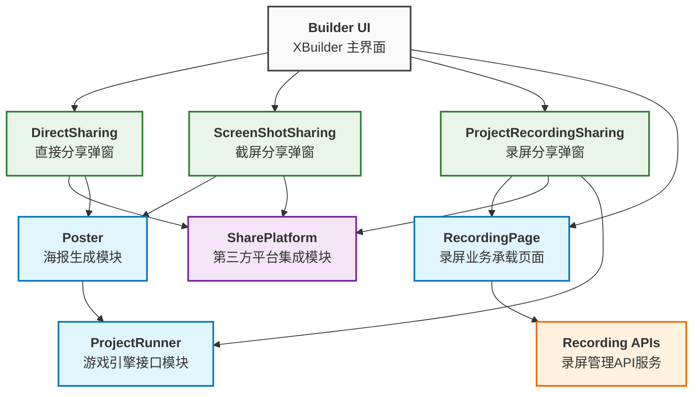

# Tech design for Share
## 挑战
* 提供丝滑的分享方式以满足用户的需求
    我们将尽可能的将Share与XBuilder的耦合度降低，让Share可以作为一块独立的功能，提供相应的分享方式，以及后续如果需要对分享方式进行修改的话，可以很方便的进行操作

## 模块
### SharePlatform
负责与外部平台的集成。目前支持：QQ、微信、抖音、小红书、B站。为三种分享方式提供第三方平台的接口支持
### Poster
用于生成海报，包含图片、二维码和项目信息
### ProjectRunner
通过 ProjectRunner 获取 runner 游戏引擎上暴露的方法
### RecordingPage
录屏业务的承载页面
### Recording APIs
spx-backend 提供的用于对 Recording 管理的 APIs

## UI 层（分享弹窗）
### DirectSharing
项目页面上的直接分享弹窗，用于直接分享项目到各个平台
### ScreenShotSharing
项目页面上的截屏分享弹窗，用于接收截屏图片、调用Poster生成海报后分享到各个平台
### ProjectRecordingSharing
项目页面上的录屏分享弹窗，用于接收录屏后分享到各个平台

## 模块关系
下图说明了系统中各个模块之间的关系：

