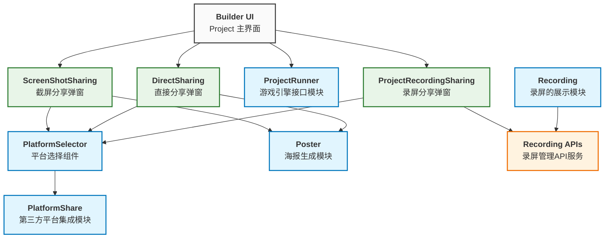

# Tech design for Share

## 挑战

- 提供丝滑的分享方式以满足用户的需求
- 我们将尽可能的将 Share 与 XBuilder 的耦合度降低，让 Share 可以作为一块独立的功能，提供相应的分享方式
- 以及后续如果需要对分享方式进行修改的话，可以很方便的进行操作
- 实现海报的组件布局与暴露方法的强关联，同时需要注意 kodo 和 COEP
- 模态框统一管理，而不是复杂的父子组件通信
- 游戏引擎方法暴露

## 核心功能模块

### PlatformShare

负责与外部平台的集成。目前支持：QQ、微信、抖音、小红书、B 站。为三种分享方式提供第三方平台的接口支持。

See API design in [`module_PlatformShare.ts`](./module_PlatformShare.ts).

### PlatformSelector

定义可复用的平台选择组件，向各弹窗提供被选择的社交平台信息。

See API design in [`module_PlatformSelector.ts`](./module_PlatformSelector.ts).

### Poster

用于生成海报，包含图片、二维码和项目信息。

See API design in [`module_ProjectPoster.ts`](./module_ProjectPoster.ts).

### ProjectRunner

通过 ProjectRunner 获取 runner 游戏引擎上暴露的方法，控制游戏画面。

See API design in [`module_ProjectRunner.ts`](./module_ProjectRunner.ts).

### Recording

录屏的展示模块。

包括录屏卡片和录屏详情

See API design in [`module_Recording.ts`](./module_Recording.ts).

### Recording APIs

spx-backend 提供的用于对 Recording 管理的 APIs。

See API design in [`module_RecordingAPIs.ts`](./module_RecordingAPIs.ts).

### RecordingItem

录屏条目显示组件，用于在各种列表环境中展示单个录屏记录（公共录屏列表、用户录屏列表等）。支持不同的显示模式，为用户自己的录屏提供编辑/删除操作。

See details in [`RecordingItem`](./module_RecordItem.ts).

### MobileKeyboard

#### MobileKeyboard Edit

用于编辑移动键盘布局。它提供了通用的按键池和固定的编辑区域，用户可以将对应的按键拖拽到目标区域

#### MobileKeyboard View

用于展示移动键盘布局。它会在相应区域显示已分配的按键，并反映当前键盘的状态。详情见

#### UIKeyBtn

键盘中的核心按键组件，负责单个按键的展示与交互逻辑。它同时服务于 编辑 和 查看 组件，并通过 projectRunner 与游戏画布交互，实现按键映射功能。

See details in [`MobileKeyboard`](./module_mobileKeyboard.ts).

### ProjectAPIs

包含：spx-backend 提供的用于移动键盘管理的 HTTP 接口。包括 编辑 和 查看 功能。

See details in [`ProjectAPIs`](./module_ProjectAPIs.ts).

## UI 层（分享弹窗）

### DirectSharing

项目页面上的直接分享弹窗，用于直接分享项目到各个平台，调用 Poster 模块以生成海报图片。

See API design in [`module_ProjectDirectSharing.ts`](./module_ProjectDirectSharing.ts).

### ScreenShotSharing

项目页面上的截屏分享弹窗，用于接收截屏图片（通过 ProjectRunner 模块）、调用 Poster 生成海报后分享到各个平台。

See API design in [`module_ProjectScreenShotSharing.ts`](./module_ProjectScreenShotSharing.ts).

### ProjectRecordingSharing

项目页面上的录屏分享弹窗，用于接收录屏后分享到各个平台，调用 Recording APIs 创建并存储对应的 Recording 记录。

See API design in [`module_ProjectRecordingSharing.ts`](./module_ProjectRecordingSharing.ts).

## 模块关系

下图说明了分享策略中各个模块之间的关系：

