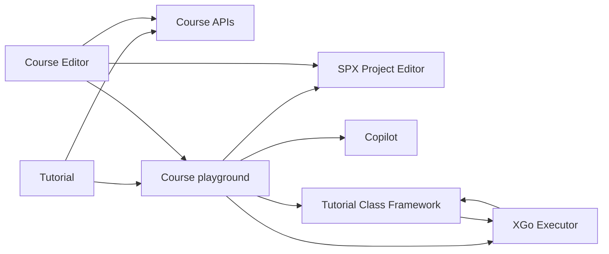

# Tech design for [User Tutorial v2](../../product/tutorial-v2.md)

Implementation issue: [#3403](https://github.com/goplus/builder/issues/3403).

## Scope

XBuilder supports two Course kinds with separate runtime behavior:

- A **Guided Course** is driven by Copilot and may guide the learner across Builder routes.
- A **Playground Course** embeds an SPX project and an XGo Tutorial program. The learner edits a session-local project model while the Tutorial program controls the course flow and completion.

This design introduces neither Course draft/published revisions nor persisted runtime sessions or unfinished-course progress. Saving a Course makes it available for learning. Course Preview runs directly from the Course Editor's unsaved in-memory state. Course package import/export and linting remain internal Course Editor concerns for now.

## Modules

### Course APIs

Course APIs own the persistent Course and Course Series contracts. They distinguish Guided and Playground Courses, while keeping Playground-specific content opaque outside the modules that interpret it. They also provide the Course-authoring operations needed by Course Editor.

See [Course APIs](./module_CourseApis.ts) and [Course storage](./course-storage.md).

### Tutorial

Tutorial provides the application entry and exit for learning a Course. It selects the appropriate Guided or Playground learning flow, coordinates their lifecycle, and connects the active Course with the shared editor, Copilot, and execution capabilities. The public module boundary stays independent of the different internal implementations of those flows.

See [Tutorial](./module_Tutorial.ts).

### XGo Executor

XGo Executor runs an XGo program and bridges its asynchronous capabilities and events with the host application. It is generic infrastructure: callers provide a framework and source files, while the executor has no Tutorial, Editor, or Copilot knowledge.

See [XGo Executor](./module_XGoExecutor.ts).

### Tutorial Class Framework

The Tutorial Class Framework defines the Tutorial-project format and the XGo API used by Course authors. It gives Course programs the capabilities and events needed to present, guide, and complete a learning experience, without coupling Course content to the host application's implementation.

See [Tutorial Class Framework](./module_TutorialFramework.ts), its [Go contract](./tutorial-class-framework.go) and an [example Tutorial Course project](./example-tutorial-course/).

### SPX Project Editor

SPX Project Editor provides the learner-facing project editing experience and its editor capabilities. Tutorial learning and Course Preview compose this existing editor around an embedded project model; the editor remains responsible for editing behavior and for turning a learner's work into a regular saved project.

See [SPX Project Editor](./module_SpxProjectEditor.ts).

### Copilot

Copilot supplies generic assistant sessions, context, generation, and conversation events. Tutorial and Course Editor configure those generic capabilities for their respective learning and authoring experiences; Copilot itself has no Course-specific behavior.

See [Copilot](./module_Copilot.ts).

### Course Editor

Course Editor owns authoring and validating Course content, then saving it through Course APIs. It also provides Preview by using the same learning capabilities with an isolated representation of the author's current work.

See [Course Editor](./module_CourseEditor.ts).

## Module relationships

