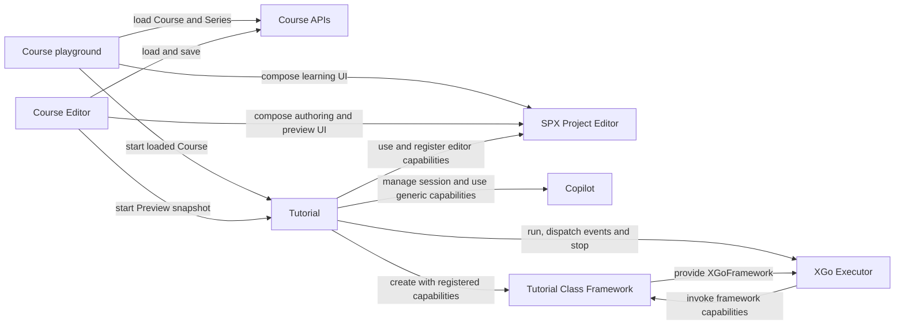

# Tech design for [User Tutorial v2](../../product/tutorial-v2.md)

Implementation issue: [#3403](https://github.com/goplus/builder/issues/3403).

## Scope

XBuilder supports two Course kinds with separate runtime behavior:

- A **Guided Course** is driven by Copilot and may guide the learner across Builder routes.
- A **Playground Course** embeds an SPX project and an XGo Tutorial program. The learner edits a session-local project model while the Tutorial program controls the course flow and completion.

This design introduces neither Course draft/published revisions nor persisted runtime sessions or unfinished-course progress. Saving a Course makes it available for learning. Course Preview runs directly from the Course Editor's unsaved in-memory state. Course package import/export and linting remain internal Course Editor concerns for now.

## Modules

### Course APIs

Course APIs own the persistent Course and Course Series contracts. A Course is a discriminated union of `guided` and `playground`; all Courses in a Course Series have the same kind as the Series. Playground Course content crosses this boundary as an opaque `FileCollection`. Course APIs also provide LLM-assisted generation of an editable Copilot context from the author's current in-memory file collection.

The TypeScript module describes the frontend/backend HTTP contract. Course storage uses one table with common columns and opaque `content jsonb`; the database does not depend on the internal format of a Tutorial project. Database constraints and migration are documented separately because they are backend implementation details that are not visible in that interface.

See [Course APIs](./module_CourseApis.ts) and [Course storage](./course-storage.md).

### Tutorial

Tutorial owns the active Course lifecycle. Its public boundary starts and stops a Course or Course Series and exposes the current selection. The differences between Guided and Playground Courses remain internal branches of this implementation rather than part of the module boundary. Tutorial owns Course dialogs and completion UI, but it does not compose the SPX Project Editor UI; it delegates assistant and program-execution work to the generic Copilot and XGo Executor modules.

For a Playground Course, Course playground interprets the opaque Course content using the Tutorial-project contract, creates a model `SpxProject` without cloud-project identity, builds an `EditorState` from `inEditorRoute` and composes the SPX Project Editor UI. Once that surrounding UI composition is ready, it starts Tutorial with the loaded Course. Tutorial starts a Copilot Topic, combines its own presentation and completion capabilities with the available editor and Copilot capabilities, creates the Tutorial `XGoFramework`, passes that framework through `XGoExecutorOptions` and runs the conventional root `main_course.gox`. Stopping or completing the Course tears these runtime resources down together.

Tutorial is also the event dispatcher for the running Tutorial program (see `TutorialEvent`): it forwards runtime start/exit and Copilot round completion, and adapts the Runtime's `didChangeOutput` notification and cumulative outputs into per-entry `editor.runtime.log` events — one event per newly appended `log`-kind entry, in append order.

See [Tutorial](./module_Tutorial.ts).

### XGo Executor

XGo Executor builds and executes an XGo program in an isolated Worker/WASM instance. XGo-to-JavaScript calls use asynchronous capabilities; JavaScript-to-XGo notifications use events. `stop` terminates the Worker and is the lifecycle boundary for a running program.

The executor is generic: it knows source files, one caller-selected `XGoFramework`, capabilities and events, but has no Course, Tutorial Class Framework, Editor or Copilot concepts. As validated in [#3344](https://github.com/goplus/builder/pull/3344), the framework is supplied in `XGoExecutorOptions` and `run` receives only the project files; XGo determines the entry file from the class-framework convention.

See [XGo Executor](./module_XGoExecutor.ts).

### Tutorial Class Framework

The Tutorial Class Framework defines both the Tutorial-project format and the Course-author-facing XGo API. The format contract owns the content directory layout and configuration schemas. Root `index.json` identifies the SPX project, Course-author-provided Copilot instructions that are not shown in the learner UI, and the initial in-editor route; root `main_course.gox` is the conventional Tutorial entry file. Course APIs and storage do not depend on these internal details.

Its Course-author-facing Go contract is included in this design:

```text
course
├── CourseAbilities
├── editor
│   ├── project
│   ├── runtime
│   ├── codeEditor
│   └── ruler
├── copilot
└── spotlight
```

The initial interface includes course start/prelude/message/video/completion with optional feedback, runtime start/exit/log, code reading, API filtering, workspace formatting, Ruler control, Copilot round completion, text and structured JSON generation, and spotlight reveal. For structured generation, Course code passes a non-nil struct pointer; the framework derives its JSON Schema, invokes the frontend capability and decodes the result back into that value. `editor.project` reads the session project model: Course code can read a specific code file's current content or list the project's code files, regardless of what the Code Editor UI shows.

Calling `complete` or `completeWith` ends the Course program from within: after the current callback returns, the framework leaves its event loop and the program exits with reason `completed`. Remaining statements in that callback still run, but queued events are no longer processed, presentation calls after a completion are ignored by the host, and repeated completion calls are idempotent. Executor exit reasons map to Course outcomes accordingly: `completed` following a completion capability call is normal completion, while `completed` without one means the Course program fell through without completing and is treated as a Course-program defect; `stopped` means the Course was ended from outside, such as the learner leaving; `error` means the Course program failed.

See [Tutorial Class Framework](./module_TutorialFramework.ts), its [Go contract](./tutorial-class-framework.go) and an [example Tutorial Course project](./example-tutorial-course/).

### SPX Project Editor

SPX Project Editor comprises the existing `ProjectEditor`, `EditorContextProvider`, `EditorState`, Runtime, Code Editor and Stage Viewer. `ProjectEditor` is mounted under `EditorContextProvider`, which receives an externally constructed model `SpxProject` and `EditorState`; loading and UI composition remain the caller's responsibility.

Course projects omit owner and cloud-project identity, so the existing ownership rule naturally selects effect-free editing. Course learning does not call the normal route's `editing.loadProject`, avoiding cloud and local-cache loading. The Project Editor module implements the learner-facing "Save as my project" action through its existing project persistence dependencies, creating an owned regular Project from the current session-local state.

Course playground, or Course Editor during Preview, initializes the existing in-editor route from the Course's `inEditorRoute`, for example `/sprites/Bird/code` or `/simple/sprites/Lita`. The route selects the initial editor mode and selection. This is the sole declarative presentation configuration: runtime tools such as API filtering and the Ruler remain controlled by the Tutorial program.

Simple Mode is implemented inside the existing `ProjectEditor`, like Map Mode. `EditorState` recognizes `/simple/sprites/<sprite-name>` and stores Simple as the current edit mode; `ProjectEditor` renders the reduced composition for the selected sprite. No separate `SimpleProjectEditor` component or dynamic mode API is introduced.

Stage Viewer exposes sprite-name clicks as a Vue event and Ruler visibility as a prop. `ProjectEditor` handles the click by asking the existing `CodeEditor` to insert the sprite name at the current selection. Runtime remains on `EditorState`; Code Editor and Spotlight keep their existing module/provider ownership rather than becoming fields of Editor Context.

See [SPX Project Editor](./module_SpxProjectEditor.ts).

### Copilot

Copilot supplies generic sessions, Topics, response generation, round events and Topic-level behavior controls. It has no Course or Tutorial concepts.

While running a Playground Course, Tutorial puts Course-author-provided instructions that are not shown in the learner UI in the existing Topic description and disables proactive event reactions. Project, code and runtime context continue to come from normal Editor context providers. The Topic's `allowCodeHelper: false` hides both code-block Copy and code-change Apply for that session.

See [Copilot](./module_Copilot.ts).

### Course Editor

Course Editor receives a Course Series ID and Course ID, then uses Course APIs internally to load and save Course metadata and a typed, in-memory view of the Tutorial-project file collection. It loads and writes the Tutorial Class Framework's project format; keeping these models valid is the Course Editor's responsibility rather than the Course APIs' or database's. It owns the Tutorial Language Server integration needed for program diagnostics, completion and hover; that Language Server is not designed separately here.

Preview snapshots the current unsaved Tutorial-project file collection, composes the SPX Project Editor preview UI directly and starts the same Tutorial lifecycle used for learning. It never saves first and never passes the author's mutable project instance into the preview. Course Series Preview snapshots every Course in the author's current in-memory series and uses the real series lifecycle to walk them in order.

The Course Editor calls Course APIs to generate or rewrite the Course-author-provided Copilot instructions, then lets the author review and edit the result before saving. These instructions are not shown in the learner UI. Package import/export and Course linting remain internal features of this module and require no external module interface.

See [Course Editor](./module_CourseEditor.ts).

## Module relationships


