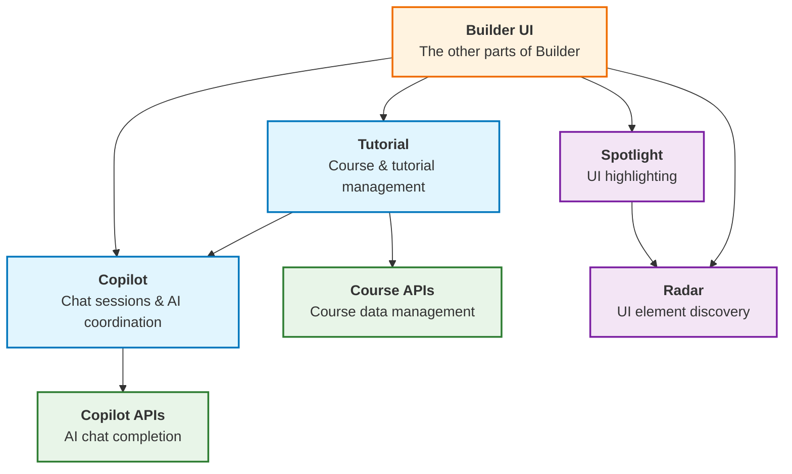

# Tech design for [User Tutorial](../../product/tutorial.md)

## Challenges

* Provide simple Copilot APIs to meet the tutorial requirements

  We split the implementation into different parts. The module Copilot provides the core Copilot functionality, while other parts of the application provide extra context and tools for the Copilot.

* Preserve the state of the tutorial (& Copilot) across page navigation & reloads

  By ensuring the session data (which includes topic & messages) and tutorial state are serializable, we can save them to & restore them from the local storage. This allows the tutorial to continue seamlessly across page navigation and reloads.

* Project info (especially the reference project) passing in limited context window

  We provide the `type: function` tool for the Copilot to actively retrieve a particular part of project info. So we do not need to pass the entire project info every time.

* Hide or disable certain UI elements or codes during the tutorial

  We plan to introduce a special markup in code of a target (Sprite or Stage), for example, `// @tutorial-disabled`, to indicate that functionalities related to the target should be disabled during the tutorial. We will recognize this markup and hide or disable related UI elements accordingly.

## Modules

### Copilot

The Copilot module implements the Copilot functionality and provides APIs for other parts of the application to provide extra context & tools or invoke Copilot features.

See details in [`Copilot`](./module_Copilot.ts).

### Tutorial

The Tutorial module provides tutorial management functionality, including course navigation and session management for the tutorial system.

See details in [`Tutorial`](./module_Tutorial.ts).

### Radar

The Radar module provides a mechanism to discover & manipulate UI elements in the application. With module Radar, the Copilot can provide context-aware results based on the current UI state.

See details in [`Radar`](./module_Radar.ts).

### Spotlight

The Spotlight module provides a tool to highlight certain UI elements in the application. It can be used to guide users through the tutorial by highlighting specific elements.

See details in [`Spotlight`](./module_Spotlight.ts).

### Copilot APIs

The HTTP APIs provided by spx-backend for Copilot chat completion.

See details in [`Copilot APIs`](./module_CopilotApis.ts).

### Course APIs

The HTTP APIs provided by spx-backend for course management.

See details in [`Course APIs`](./module_CourseApis.ts).

## Module Relationships

The following diagram illustrates the relationships between the different modules in the system:

## Key Features Implementations

Here we describe how we implement key features by combining the modules above.

### Copilot

This is about how key features in the Copilot module are implemented, such as how the context information is collected and sent to the Copilot APIs.

See details in [`Copilot`](./impl_Copilot.ts).

### Tutorial Implementation

This is about how the tutorial system is implemented based on module Copilot and Course APIs.

See details in [`Tutorial Implementation`](./impl_Tutorial.ts).

### App Integration

This is about how the application integrates with the Copilot system, including context providers for route information and UI state, and tools providers for UI interaction capabilities.

See details in [`App Integration`](./impl_App.ts).

### Project Editor Integration

This is about how the project editor provides context and tools to the Copilot module, such as project information and project-specific functionality, taking reading sprite code as an example.

See details in [`Project Editor Integration`](./impl_ProjectEditor.ts).
