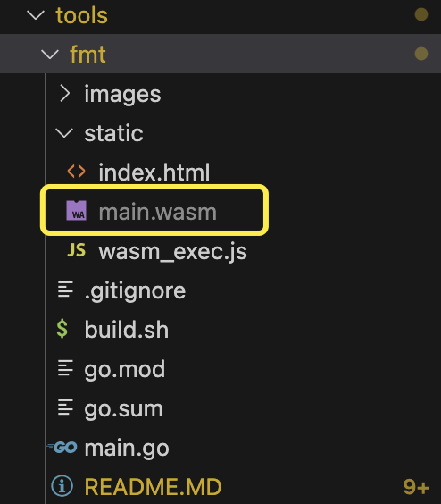
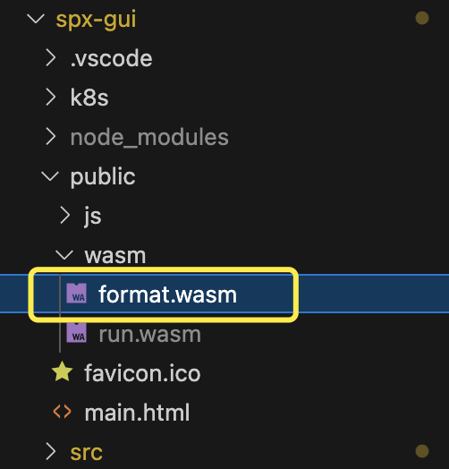

# Installation

# **STEM EDUCATION**

STEM EDU is an online educational platform for children's programming, designed to offer an interactive learning experience.

## **How to Run**

### **Installation**

Before you begin, ensure that you have both **Go** and **Node.js** environments set up on your local machine.

#### **Frontend Setup**

1. Clone the repository to your local machine:

```bash
git clone https://github.com/goplus/builder.git
cd spx-gui
```

1. Inside the `spx-gui` directory, install the project dependencies using npm:

```bash
npm install
```

### Offline SPX Config

In this stage, we build the two WASM components required by the web app and copy them into the app's assets folder.

#### Format

Support for formatting text content offline by uploading files or typing spx code to get formatting results or error results.

##### Build format.wasm

**MacOS**

```bash
## in build folder
cd tools/fmt
sh ./build.sh
```

**Windows**

```bash
## in build folder
cd tools/fmt
./build.sh
```

Screenshot：

Location: builder/tools/fmt/static/main.wasm



##### Deploy format.wasm

Rename main.wasm to format.wasm, and move it.

```bash
## in build folder
mv tools/fmt/static/main.wasm spx-gui/public/wasm/format.wasm
```



#### Project Config

Support for compiling SPX projects offline by uploading folders and then run and view them on the Web.Users can upload the entire project folder, view the file structure and content, and run the project directly in the browser.

##### Build run.wasm

**MacOS**

```bash
## in build folder
cd tools/ispx
sh ./build.sh
```

**Windows**

```bash
## in build folder
cd tools/ispx
./build.sh
```

##### Deploy run.wasm

Rename main.wasm to run.wasm, and move it.

```bash
## in build folder
mv tools/ispx/main.wasm spx-gui/public/wasm/run.wasm
```

### **Getting Started**

#### **Running the Frontend**

Once all dependencies are installed, you can run the project locally:

1. Open a Command Prompt or Terminal in the `spx-gui` directory.
2. Start the development server:

```bash
## in spx-gui folder
npm run dev
```

1. Access the application at [http://localhost:5173/](http://localhost:5173/).

#### **Backend Setup and Launch**

1. Navigate to the backend directory:

```bash
cd spx-backend
cd cmd
```

1. Run the Go scripts:

```bash
go mod tidy
gop run .
```

## **Quick Play**

Import the zip(04-Bullet.zip in builder/tools/04-Bullet.zip)in the top button 'Import - local', and click the run button in the stage, then wait for a few seconds.

## Deploy

### Frontend

In `spx-gui`, build the project with `npx vite build`, then run docker build. You will get a nginx docker image with the built project files. Run the nginx image and it will listen on port 80.

## **API Documentation**

(Include any relevant API documentation or references here.)

[STEM 接口文档](https://lbul0aws0j.feishu.cn/docx/BpEQdCvwZoXw3TxBsgIc6F7Dnqh?from=from_copylink)

