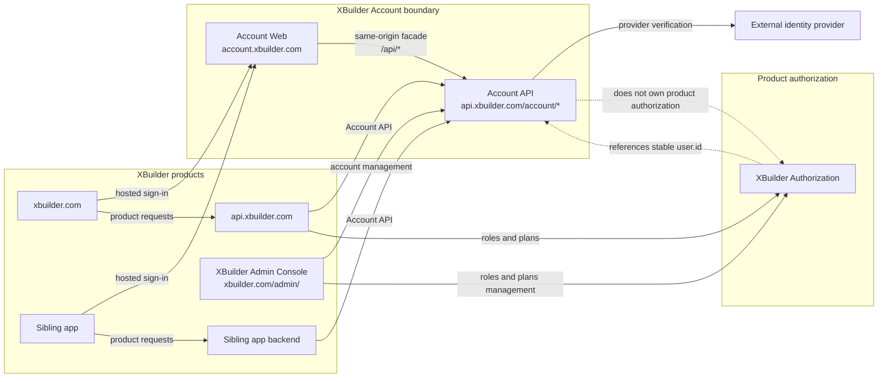
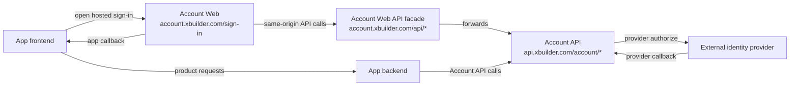
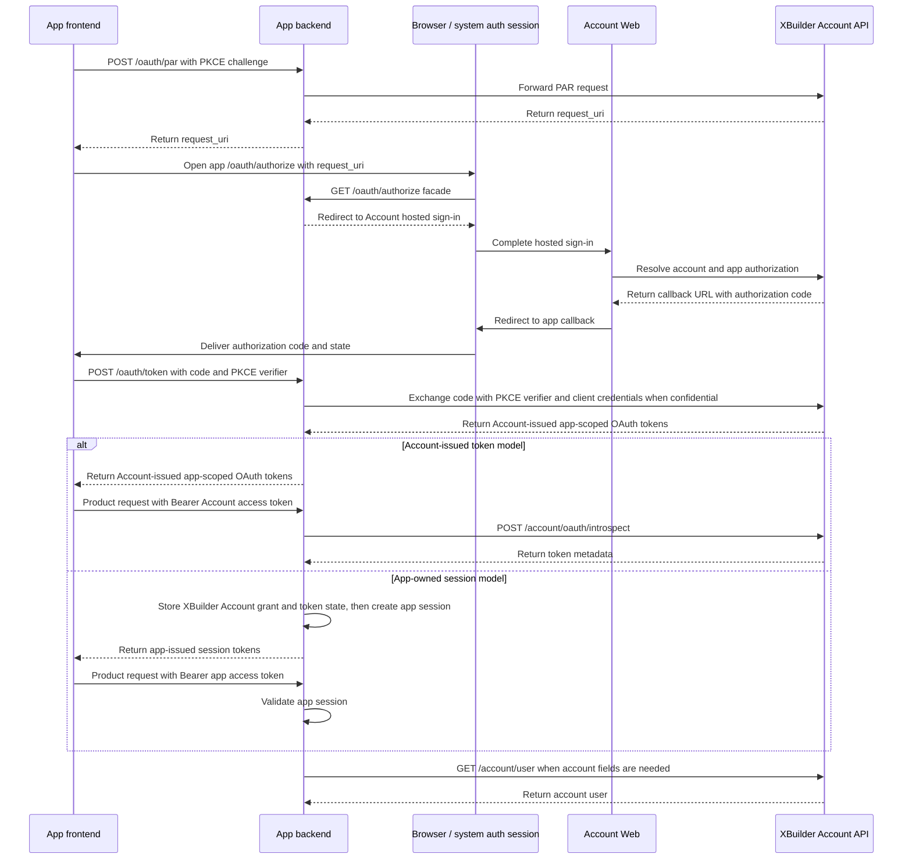

# XBuilder Account

XBuilder Account is XBuilder's first-party account system. It is responsible for account principals, third-party
identity binding, sign-in methods, account sessions, first-party app SSO, the account management module in XBuilder
Admin Console, and the account foundation after migrating from Casdoor.

This document defines the product and system boundary of XBuilder Account. It describes the target state after
migration. It does not describe the current Casdoor runtime implementation, the final database schema, the complete
OpenAPI contract, or concrete implementation tasks.

## Background and goals

XBuilder currently depends on our own Casdoor fork for account sign-in and token issuance. This fork has diverged
significantly from upstream Casdoor and includes substantial XBuilder-specific sign-in behavior.

The goal of XBuilder Account is to replace Casdoor and become XBuilder's own account and identity foundation. It is not
a generic Auth0-style or Casdoor-style multi-tenant identity platform. It is also not a public third-party app platform
for arbitrary external developers.

Goals include:

- Remove the runtime dependency on Casdoor
- Use the existing `user` as the account principal
- Support third-party identity sign-in
- Support users with no password and only third-party identities
- Support admin-created users
- Support admins setting or clearing password credentials for users
- Support username and password sign-in for users with admin-managed passwords
- Support account session management required by hosted sign-in and SSO
- Support XBuilder first-party sibling apps sharing the XBuilder account identity
- Support platform-managed apps for first-party app SSO
- Support first-party apps integrating product APIs through Account-issued token model or App-owned session model
- Support the XBuilder Account management module and write account-related admin actions to admin audit logs

Non-goals include:

- Public username and password registration for regular users
- Regular users setting or resetting passwords by themselves
- A generic multi-tenant identity platform
- An arbitrary public third-party app platform
- App self-service registration
- Managing XBuilder or sibling app product authorization data such as roles, plans, capabilities, quotas, memberships,
  and seats
- User deletion or user status management
- Preserving Casdoor user IDs, groups, or other Casdoor concepts in the new runtime model

## Core concepts

| Concept | Meaning |
| - | - |
| `user` | XBuilder account principal. It reuses the existing user model, with field ownership split by Account and product boundaries |
| `identity_provider` | Third-party identity provider in platform configuration, such as GitHub, Google, or Apple |
| `user_identity` | Third-party identity bound to a `user` |
| `user_password_credential` | Optional admin-managed password credential |
| `user_session` | Account session owned by XBuilder Account for hosted sign-in and SSO continuity |
| `app` | Platform-managed OAuth client configuration for first-party app SSO |
| `app_secret` | OAuth client credential used by confidential apps in backend token exchange |
| `app_grant` | Authorization relationship for a `user` to let an `app` access XBuilder Account |
| `auth_flow` | Short-lived temporary state maintained by XBuilder Account in third-party callbacks, provider credential handoff, and OAuth authorization code flow, such as provider redirect state, pushed authorization request, authorization code, PKCE challenge, and one-time provider code consumption records |
| `audit_log` | Audit log for XBuilder Admin management actions and security-related events |

`app` is the product and management resource name. The OAuth protocol layer still uses the standard client concept and
standard parameter names, such as `client_id`, `client_secret`, `redirect_uri`, `request_uri`, `code`, and `grant_type`.

XBuilder Account can reuse the existing `user` table, but the account system boundary is not the same as the physical
table boundary. Account API only exposes user fields owned by the account system, such as `id`, `username`,
`displayName`, and `avatar`. Writable fields are defined by concrete endpoints. `description`, `roles`, `plan`,
`capabilities`, statistics fields, and product fields belong to the XBuilder product or authorization system. They are
not exposed or managed by XBuilder Account API.

`auth_flow` is a logical concept. It only defines lifecycle and security semantics, and it does not constrain physical
storage. Provider redirect state, pushed authorization request, authorization code, PKCE challenge, and provider code
consumption records must all be short-lived. One-time state must be single-use. Failed provider callbacks, failed token
exchanges, or repeated submissions must not leave valid replayable state behind.

## System boundary



## User sign-in behavior

Regular users cannot publicly register username and password accounts.

Regular users sign in through third-party identities by default. The first batch of third-party identity providers
includes:

- `wechat`
- `qq`
- `github`
- `apple`
- `google`
- `x`

Admins can create users. Admins can also set or clear passwords for users. Only users with an admin-managed password can
sign in with username and password.

User sign-in methods include third-party identities and admin-managed password credentials. Admins can remove any
third-party identity and can also clear password credentials. After removal, a user may have no sign-in methods. The
account still exists, but the user cannot sign in again until an admin sets a password credential again.

Removing sign-in methods does not automatically revoke existing account sessions. Revoking existing account sessions is
a separate management action.

## Third-party identities

Third-party identities must be matched by stable subject identifiers provided by providers. They must not be matched by
provider-returned email or username. For shared account identity across first-party apps, prefer provider subjects that
are stable across apps.

Examples of stable subject identifiers:

| Provider | Stable subject identifier |
| - | - |
| WeChat | `unionid` |
| QQ | `unionid` |
| GitHub | numeric user ID |
| Apple | `sub` |
| Google | `sub` |
| X | user ID |

Apple should be handled as an OIDC-style provider. Account binding must use Apple's stable `sub`, not the email returned
by Apple, because users may use private relay email.

WeChat and QQ `unionid` availability depends on provider configuration, app binding relationships, and authorization
results. `openid` is a provider app or client scoped identifier. It can only be stored as an auxiliary identifier and
must not be used as the principal subject for unified account identity across first-party apps. If `openid` is stored,
the corresponding subject namespace must also be stored.

If a WeChat or QQ sign-in result does not contain `unionid`, XBuilder Account should not silently create a cross-app
account identity from `openid`. Account creation should rely on a verified stable subject across apps. A provider-scoped
identity may only be linked through a user-confirmed account-linking flow.

`user_identity` should store the provider, stable provider subject, subject namespace when needed, and the linked
`user.id`. Limited display metadata such as provider username, display name, and avatar may be stored for display and
troubleshooting. It must not be treated as the authoritative source for XBuilder account fields.

Provider access tokens and refresh tokens should not be persisted. Full raw profile payloads should not be persisted.
XBuilder Account should not act as a token vault for third-party API integrations. Product capabilities that need access
to provider APIs should model, authorize, and store their own provider tokens separately.

Third-party identity provider configuration should be managed by deployment configuration or server-controlled
configuration. It is not part of the XBuilder Admin Console management scope.

## First-party apps

In this document, first-party apps are apps registered and managed by the XBuilder platform. `xbuilder.com` should be
treated as a first-party app using XBuilder Account, not as the account system itself. Sibling apps under
`*.xbuilder.com` should also be supported as first-party apps.

These apps are platform-managed OAuth client configurations. They define redirect URI allowlists, allowed origins,
client type, status, and credentials required by first-party app SSO.

First-party apps share the same XBuilder account identity, but product authorization is managed by each app or by the
corresponding product authorization system. XBuilder Account is responsible only for the account and SSO boundary, such
as account existence, app status, redirect URI allowlists, credential checks, and token or code validity. App roles,
memberships, workspaces, seats, and product permissions are product authorization concerns. They are not managed by
XBuilder Account and are not contract fields for first-party app SSO.

First-party app product API integration supports two models:

- Account-issued token model: the app uses an app-scoped OAuth token issued by XBuilder Account as its product API
  Bearer token. The app backend validates the token through token introspection and can read stable account identity
  from Account API
- App-owned session model: the app backend obtains stable `user.id` through XBuilder Account SSO, then creates,
  validates, refreshes, and revokes its own app session

Account-issued token model is suitable for apps that do not want to maintain their own session state and whose product
requests all happen in user request paths. In this model, the app frontend may hold the Account-issued app-scoped OAuth
token. The app backend should treat that token as the product API credential for the app, validate it on product
requests, extract stable `user.id`, and then apply its own product authorization logic. Sibling apps can transparently
forward OAuth endpoints through their own backend, so the frontend faces same-origin `/oauth/*` instead of directly
calling `api.xbuilder.com/account/oauth/*`.

When an app backend accepts Account-issued app-scoped OAuth tokens as product API credentials, it must verify that the
token is bound to the current app. Product permissions are still determined by the app or the corresponding product
authorization system. They are not expressed by XBuilder Account OAuth scopes.

App-owned session model is suitable for apps that are independently deployed or operated, need backend-side access to
XBuilder Account on behalf of users, need to define their own session refresh, logout, or revocation semantics, or do
not want product requests to depend on XBuilder Account token validation. App sessions reference stable `user.id` and
carry the app's own authorization context. They are not independent accounts and are not sessions managed by XBuilder
Account. XBuilder Account does not store or revoke app sessions.

Regardless of the model, product authorization for first-party apps is still owned by the app or the corresponding
product authorization system. Account sessions, Account-issued app-scoped OAuth tokens, and app sessions should not
encode roles, memberships, workspaces, seats, or product permissions.

First-party app SSO should use OAuth 2.0 authorization code flow. The user-facing hosted sign-in entry is
`account.xbuilder.com/sign-in`, not XBuilder Account API. First-party app frontends can enter this page through their
own OAuth facade. Hosted sign-in handles account resolution, user creation, third-party identity binding, and app
callback. It can also host interactions such as profile completion, account-linking confirmation, and identity conflict
handling.

Public and confidential apps must both use PKCE in authorization code flow. Public apps do not rely on app secrets.
Confidential apps may also use app secrets as OAuth client credentials for backend token exchange. Secret values should
only be returned when they are created.

After sibling app frontends finish sign-in, they should only call their own backends. They should not rely on XBuilder
Account APIs for ordinary product requests. Sibling apps should use `user.id` as the stable account reference. Mutable
account fields such as `username`, `displayName`, and `avatar` may be cached by sibling apps for display, but XBuilder
Account remains the authoritative source for these fields.

## Sign-in integration model

XBuilder Account provides unified hosted sign-in at `account.xbuilder.com/sign-in`. Hosted sign-in uses
`account.xbuilder.com/api/*` as a same-origin API facade. The facade forwards to `api.xbuilder.com/account/*`. For
example, `account.xbuilder.com/api/user` maps to `api.xbuilder.com/account/user`, and
`account.xbuilder.com/api/oauth/token` maps to `api.xbuilder.com/account/oauth/token`. `api.xbuilder.com/account/*` is
the authoritative XBuilder Account API entry point.

`account.xbuilder.com/api/*` is the same-origin integration layer for Account Web. It is not a security boundary.
Account API should not relax authentication or authorization because a request came through the facade. The facade
mainly serves Account API requests from Account Web. It does not change the semantics of OAuth, Bearer token, or account
session cookie authentication.



Ordinary Web apps and native iOS or Android apps can both use hosted sign-in. Native apps should enter
`account.xbuilder.com/sign-in` through the system browser or system authentication session, such as
`ASWebAuthenticationSession` or Chrome Custom Tabs. They should not use embedded WebView.

Provider credential acquisition has two ways:

- Hosted provider acquisition: hosted sign-in redirects the user to the provider authorize page and obtains the provider
  credential through the provider callback
- Provider credential handoff: the client passes a short-lived provider code obtained beforehand to hosted sign-in for
  consumption

Provider credential handoff is suitable for WeChat Mini Program `wx.login()` codes, Apple authorization codes, Google
server auth codes, and similar cases. The client can pass the credential to XBuilder Account through PAR extension
parameters such as `xbuilder_provider` and `xbuilder_provider_code`. This only replaces the upstream provider web
authorize stage. It does not replace the XBuilder Account sign-in flow. Regardless of whether the credential comes from
hosted provider acquisition or handoff, XBuilder Account should use the same account resolution, user creation, and
third-party identity binding logic. If profile completion, account-linking confirmation, or identity conflict handling
is required, these interactions should happen inside hosted sign-in.

Provider credential handoff errors should be returned through the PAR or authorize flow as OAuth errors. Expired,
consumed, provider-mismatched, or unknown provider codes must not produce usable `request_uri` values. XBuilder Account
must consume provider codes atomically with recording consumption state to avoid reusing the same provider code.

## OAuth and product API integration

XBuilder Account OAuth endpoints live under `api.xbuilder.com/account/oauth/*`. They only host OAuth and OAuth RFC
extension protocol endpoints, and issue Account-issued app-scoped OAuth tokens. The token subject is stable `user.id`,
and the token client is the concrete `app`. This document only defines the `account:user:read` Account API scope, which
allows app backends to access `GET /account/user` with an Account-issued app-scoped OAuth token. This scope does not
express product authorization state or any app's product API permissions.

Account-issued app-scoped OAuth tokens can be used as product API credentials for the corresponding app. Whether a
product API accepts the token depends on the app bound to the token and the authentication policy of the product
backend. Product APIs must verify the token client/app and must not only check token active status.

The two models share the same frontend-facing OAuth flow. The app frontend faces the app backend's OAuth facade. The app
backend can transparently forward XBuilder Account's OAuth token response, or it can convert the Account token response
into an app-owned session in its own `/oauth/token`. The flow is:



In Account-issued token model, the app backend does not maintain XBuilder Account token state for that user. It can use
its own `/oauth/*` as a transparent OAuth facade forwarding to `api.xbuilder.com/account/oauth/*`. The app frontend
still receives Account-issued app-scoped OAuth tokens. When receiving product requests, the app backend should use
`/account/oauth/introspect` to validate the token and verify that the token is bound to the current app. When account
fields are needed, the app backend can use `GET /account/user` to fetch the minimum account user fields if the token has
the `account:user:read` scope. Third-party identities and account session management are not part of the default Account
API surface for app-scoped OAuth tokens.

`xbuilder.com` can also use Account-issued token model. For XBuilder product APIs, the token client/app should be
`xbuilder`. After `api.xbuilder.com` accepts the token, it should use XBuilder Authorization and resource rules to
determine product permissions for projects, assets, courses, AI interaction, and other resources. These product
permissions must not be expressed by `account:user:read`.

In App-owned session model, the app backend can expose a standard OAuth facade to its own frontend, such as its own
`/oauth/authorize`, `/oauth/token`, and `/oauth/revoke`. This facade is not XBuilder Account API and should not be
written into the XBuilder Account OpenAPI. The authorization code received by the app frontend in the callback is
generated by XBuilder Account, but the frontend only treats it as an opaque code submitted to the app backend's
`/oauth/token`. In `/oauth/token`, the app backend uses this code, the PKCE verifier, and necessary client credentials
to complete token exchange with XBuilder Account. It then stores the XBuilder Account grant state and token state needed
to access Account API on behalf of the user, creates its own app session, and returns app-issued session tokens to the
frontend. The app frontend does not touch Account-issued app-scoped OAuth tokens. This keeps the frontend responsible
only for the standard OAuth flow.

`app_grant` is the record that a `user` has authorized an `app` to access XBuilder Account. OAuth authorization code
exchange can create or reuse `app_grant`. Account-issued app-scoped OAuth tokens are associated with `app_grant`.
`app_grant` is used for auditing, revocation, and backend access to Account API on behalf of the user. It is not the
same as app session.

## Token and session strategy

XBuilder Account uses opaque tokens.

Account session tokens, authorization codes, Account-issued app-scoped OAuth tokens, and refresh tokens should all be
high-entropy random secrets. Token values do not encode user fields, product authorization state, or other mutable
business state.

XBuilder Account does not issue JWTs. User identity and mutable account state are resolved through server-side state and
account APIs.

Hosted sign-in uses a `__Host-` prefixed cookie on `account.xbuilder.com` to maintain account session. The cookie must
set `HttpOnly`, `Secure`, `SameSite=Lax`, and `Path=/`, and must not set `Domain`. Account session is used to maintain
sign-in page state and SSO continuation. It is not exposed to app frontends and is not a product API credential.

Product API requests use server-revocable opaque credentials. Account-issued token model uses app-scoped OAuth tokens
issued by XBuilder Account. App-owned session model uses session credentials owned by the app backend, usually app
access tokens and app refresh tokens.

Each app defines how its product API credentials are transmitted. Bearer access token is the recommended default.
Product API credentials must not be passed through URLs, `postMessage`, or untrusted iframes.

Access tokens should be short-lived, server-revocable, and should not encode user fields or product authorization state.
Refresh tokens are used to update short-lived access tokens or continue sessions. They should live longer than access
tokens, must be hashed on the server, and must be rotated after each use. If a rotated refresh token appears again, it
should be treated as a replay risk signal and revoke the corresponding token family or grant.

If app frontends need to store product API tokens, storage should be limited to browser storage or platform storage
scoped to the current app.

App frontends should refresh access tokens before they are close to expiration and should not rely only on refreshing
after a 401. If a product request returns 401, the app frontend should refresh and retry the original request at most
once. Concurrent refresh attempts in the same frontend runtime must be merged. When multiple Web tabs share the same
sign-in state, they should coordinate which tab performs refresh and sync token updates through `BroadcastChannel` or
`storage` events to avoid concurrent use of the same rotating refresh token. If refresh fails, the app frontend should
clear local product API tokens and the current user cache, then enter hosted sign-in again.

OAuth token revocation is used to revoke Account-issued app-scoped OAuth tokens or refresh tokens. `app_grant` validity
is determined by the related token family and app status. When `app_grant` needs to be revoked, the refresh token family
and active access tokens under that grant should be revoked, or the corresponding app should be disabled. Revoking
account session affects hosted sign-in and SSO continuity. Logout, refresh, and revocation for App-owned session model
are owned by each app backend.

## Key flows

### Third-party identity hosted sign-in completion flow

1. XBuilder Account verifies the provider credential and uses the stable provider subject to find or create
   `user_identity` and the linked `user`
2. If profile completion, account-linking confirmation, or identity conflict handling is needed, XBuilder Account
   completes these steps in the hosted sign-in page
3. XBuilder Account creates or reuses account session
4. XBuilder Account returns authorization code and OAuth state to the app callback according to the OAuth authorization
   request
5. App frontend submits the authorization code and PKCE verifier to the app backend's OAuth token endpoint
6. App backend uses these parameters, with client credentials for confidential apps, to complete token exchange with
   XBuilder Account
7. In Account-issued token model, app backend returns Account-issued app-scoped OAuth tokens to the frontend. App
   backend validates the token through token introspection and obtains stable `user.id`. When account fields are needed,
   it can call `GET /account/user`
8. In App-owned session model, app backend stores the XBuilder Account grant state and token state needed to access
   Account API on behalf of the user, creates its own app session, and returns app-issued session tokens to the
   frontend

### Username and password sign-in

1. The user submits username and password
2. XBuilder Account validates only admin-managed `user_password_credential`
3. If validation succeeds, account session is created
4. Users without an admin-managed password cannot sign in with username and password

### Account session lifecycle

1. Hosted sign-in can keep valid account session within `account.xbuilder.com` and update session state when needed
2. Logout ends the current account session
3. Users or admins can revoke a specified account session or all account sessions for a user
4. Revoking account session affects hosted sign-in and subsequent SSO. It does not by default revoke Account-issued
   app-scoped OAuth tokens or app sessions

## Admin console and admin permissions

`xbuilder.com/admin/` is XBuilder Admin Console, not a frontend dedicated to XBuilder Account. It can host XBuilder
Account, XBuilder Authorization, assets, courses, and other product management modules.

The XBuilder Account admin permission is identified as `accountAdmin`.

`accountAdmin` grants access to the XBuilder Account management module. It covers user management, admin-managed
password management, viewing and removing third-party identities, revoking account sessions, app management, and app
secret management.

The XBuilder Authorization admin permission is identified as `authorizationAdmin`.

`authorizationAdmin` grants access to the XBuilder Authorization management module. It covers authorization inputs and
derived results such as user roles, plan, derived capabilities, and quota policies.

Granting and checking `accountAdmin` and `authorizationAdmin` belong to the management scope of XBuilder Authorization.
`accountAdmin` does not manage XBuilder product authorization data such as roles, plans, capabilities, or quotas. Admins
who need to manage both the account system and the authorization system should have both `accountAdmin` and
`authorizationAdmin`.

Initial admin grants should be completed through deployment configuration, migration scripts, or operations commands
that are only available during initialization. When XBuilder Authorization is unavailable or permission checks cannot be
completed, Admin APIs must not allow requests.

Admin audit logs record management actions and security-related events from account, authorization, and other management
modules. Viewing audit logs is not part of the XBuilder Account management module itself. The XBuilder Admin API should
control visible audit event scope according to admin permissions.

The XBuilder Account management module should at least include these product capabilities:

- View user lists and user details
- Create users
- Set or clear admin-managed passwords
- View and remove user third-party identities
- View and revoke user account sessions
- Manage apps, including viewing, creating, updating, enabling, and disabling apps
- Create and delete app secrets

XBuilder product authorization data may appear in the same XBuilder Admin Console and on the same user detail page, but
it does not belong to XBuilder Account.

`/admin/account/*` endpoints should require `accountAdmin`. `/admin/authorization/*` endpoints should require
`authorizationAdmin`.

`/admin/audit-logs` endpoints should require admin permissions, and backend RBAC should determine the visible audit
event scope.

The admin console frontend can live in the open-source frontend repository and be deployed at `xbuilder.com/admin/`.

Admin APIs should not be exposed as unrestricted public interfaces. `api.xbuilder.com/admin/*` should be restricted at
the ingress layer and still protected by backend RBAC and audit logging.

The main frontend can show an Admin Console entry in the user menu when the user has admin permissions.

## API boundary

This section only describes API boundaries. Concrete contracts should be defined in `docs/openapi.yaml` when endpoints
are implemented.

### Account identity provider endpoints

```http
GET  /account/identity-providers
GET  /account/identity-providers/{provider}/authorize
GET  /account/identity-providers/{provider}/callback
POST /account/identity-providers/{provider}/callback
```

- These endpoints are provided by XBuilder Account backend and are mainly used by `account.xbuilder.com/sign-in`
- `GET /account/identity-providers` returns identity providers available for hosted sign-in according to app context
- `GET /account/identity-providers/{provider}/authorize` is used for provider redirect when hosted sign-in did not
  receive a provider code through provider credential handoff
- Provider callback needs to support both GET and POST because the concrete HTTP method depends on provider response
  mode. For example, Sign in with Apple's `form_post` scenario uses POST callback
- Provider callback should rely on provider redirect state for callback correlation and CSRF protection. It should not
  apply ordinary frontend CSRF token checks

### Account OAuth endpoints

```http
POST /account/oauth/par
GET  /account/oauth/authorize
POST /account/oauth/token
POST /account/oauth/introspect
POST /account/oauth/revoke
```

- OAuth protocol parameters should use standard names, such as `client_id`, `redirect_uri`, `request_uri`, `state`,
  `code`, `grant_type`, `code_challenge`, and `code_verifier`
- Confidential clients use `client_secret_basic` authentication
- Public clients use `client_id` in token exchange, revocation, or other requests that need client identification
- `POST /account/oauth/par` creates pushed authorization requests and can carry provider credential handoff through
  `xbuilder_provider` and `xbuilder_provider_code`. Its returned `request_uri` is an opaque, short-lived, single-use
  reference, not a dereferenceable URL
- `GET /account/oauth/authorize` is a PAR-only OAuth authorization endpoint. It only accepts `client_id` and
  `request_uri`. Authorization request parameters such as `response_type`, `redirect_uri`, `scope`, `state`, and
  `code_challenge` must be submitted through `POST /account/oauth/par` first
- `POST /account/oauth/token` is used for authorization code exchange and refresh token exchange
- `POST /account/oauth/introspect` is an RFC 7662 token introspection endpoint and is only callable by authenticated app
  backends
- `POST /account/oauth/revoke` revokes Account-issued app-scoped OAuth tokens or refresh tokens

### Current account endpoints

```http
GET    /account/user
PATCH  /account/user
GET    /account/user/identities

POST   /account/session
GET    /account/session
DELETE /account/session
GET    /account/sessions
DELETE /account/sessions
DELETE /account/sessions/{sessionID}
```

- `GET /account/user` returns user fields owned by the current account system. Account Web can access it with account
  session cookie. App backends can access it with an Account-issued app-scoped OAuth token that has `account:user:read`
  scope
- `PATCH /account/user` only allows Account Web access with account session cookie, and updates writable account fields
- `GET /account/user` and `PATCH /account/user` do not expose or update XBuilder product fields such as `description`
- `GET /account/user/identities` returns the current user's third-party identities
- `account:user:read` only authorizes `GET /account/user`. It does not authorize `GET /account/user/identities`, account
  session endpoints, mutation endpoints, or admin endpoints
- `POST /account/session` is called by Account Web to submit sign-in credentials. The backend validates the credentials
  before creating the current account session
- `GET /account/session` and `DELETE /account/session` manage the current account session used by hosted sign-in
- `GET /account/sessions`, `DELETE /account/sessions`, and `DELETE /account/sessions/{sessionID}` manage the current
  user's account sessions

### XBuilder Account admin endpoints

```http
GET    /admin/account/users
POST   /admin/account/users
GET    /admin/account/users/{userID}
PATCH  /admin/account/users/{userID}

PUT    /admin/account/users/{userID}/password
DELETE /admin/account/users/{userID}/password

GET    /admin/account/users/{userID}/identities
DELETE /admin/account/users/{userID}/identities/{identityID}

GET    /admin/account/users/{userID}/sessions
DELETE /admin/account/users/{userID}/sessions
DELETE /admin/account/sessions/{sessionID}

GET    /admin/account/apps
POST   /admin/account/apps
GET    /admin/account/apps/{appID}
PATCH  /admin/account/apps/{appID}
PUT    /admin/account/apps/{appID}/status

GET    /admin/account/apps/{appID}/secrets
POST   /admin/account/apps/{appID}/secrets
DELETE /admin/account/apps/{appID}/secrets/{secretID}
```

- Apps do not provide `DELETE` deletion semantics. When an app needs to be taken offline, update app status to preserve
  audit, historical authorization, and token association context

### XBuilder Authorization admin endpoints

```http
GET   /admin/authorization/users/{userID}
PATCH /admin/authorization/users/{userID}
```

- These authorization endpoints share the XBuilder Admin API namespace, but they are not XBuilder Account APIs
- They manage the authorization inputs for a user in XBuilder Authorization
- Writable fields are `roles` and `plan`
- `capabilities` and quota policies are derived by XBuilder Authorization and should remain read-only

### Admin audit endpoints

```http
GET /admin/audit-logs
```

- These endpoints share the XBuilder Admin API namespace, but they are not XBuilder Account APIs
- They can contain audit events produced by account, authorization, and other management modules

## Relationship with authorization system

XBuilder Account is responsible for authentication, account identity, account session, and first-party app SSO. It is
not responsible for centrally managing product authorization for each first-party app.

XBuilder product roles, plans, capabilities, quotas, memberships, seats, and other product permissions still belong to
the product authorization system. Sibling apps should also have their own authorization models. XBuilder Account can
provide stable `user.id` values to these systems, but it does not manage this product authorization data or carry
mutable authorization state in Account-issued app-scoped OAuth tokens.

## Security boundary

The admin console frontend is not a security boundary. Loading the admin console page in a browser does not mean the
user has admin permissions. Admin APIs must be protected by backend RBAC and audit logs. Ingress restrictions can reduce
exposure, but they cannot replace backend permission checks.

Session tokens, refresh tokens, authorization codes, app secrets, and other security credentials must all have
sufficient entropy. `request_uri` should be unguessable, short-lived, single-use, and bound to app. `authorization code`
should be short-lived, single-use, and bound to app, redirect URI, and PKCE. Authorization response must return the
original OAuth state for app validation. App secret values should only be returned when they are created.

XBuilder Account must perform exact string matching on the redirect URI allowlist. Prefix, wildcard, or path prefix
matching is forbidden. Token exchange must verify PKCE. Apps must validate OAuth state and authorization request.
Provider identity linking must be based on stable provider subject and must not rely on email, username, or display
fields.

When app backends accept Account-issued app-scoped OAuth tokens as product API credentials, they must verify token
active status, token subject, and token client/app. Product API credentials must not be shared across apps.

Account session is only used for hosted sign-in and SSO continuity. It should not be passed through URLs, `postMessage`,
or untrusted iframes, and should not be directly read or persisted by app frontends. Mutation endpoints authenticated by
Account Web cookies should validate `Origin` or use equivalent CSRF protection.

`account:user:read` only authorizes access to `GET /account/user`. It does not authorize third-party identity
management, account session management, account field updates, or admin capabilities. These operations should be handled
by Account Web with cookie authentication or by Admin API.

When native iOS or Android apps host sign-in, they should use the system browser or system authentication session, such
as `ASWebAuthenticationSession` or Chrome Custom Tabs. They should not use embedded WebView. Restricted runtimes such as
WeChat Mini Programs can use provider credential handoff to pass short-lived provider codes to hosted sign-in. They
should not pass long-lived tokens through URLs or `postMessage`.

Provider credential handoff only allows short-lived, one-time, immediately consumable authorization-code-like provider
credentials. Allowed examples include WeChat Mini Program `wx.login()` code, Apple authorization code, and Google server
auth code. Provider access tokens, provider refresh tokens, ID tokens, `session_key`, account session tokens, app access
tokens, app refresh tokens, app secrets, or other long-lived secrets should not be passed through provider credential
handoff. After reading a provider code, XBuilder Account should immediately consume it and should not persist or return
it to the frontend.

## Migration direction

Migration should be one-time, not long-term dual-write or gradual switching.

Casdoor should only be used as the migration data source for migrating users, identities, password credential
information, and existing XBuilder product authorization data.

If historical WeChat or QQ identities only have `openid` and no `unionid`, migration must not use them for automatic
cross-app merging. Such records can only be migrated as provider-scoped identities with subject namespace to the
originally linked user, or become cross-app principal identities after `unionid` is filled before migration.

Existing roles and plans in XBuilder product authorization data should be handled in the same migration. After
migration, this data should be managed by XBuilder Authorization. It should not be managed by XBuilder Account or become
contract fields for first-party app SSO.

After migration, the runtime must no longer depend on Casdoor.

Casdoor-derived identity identifiers should only be used as one-time migration mapping keys. They should not remain part
of the runtime account model.

After frontend migration, the frontend should no longer depend on Casdoor SDKs, Casdoor JWTs, or decoding username from
tokens. `spx-gui` can keep the Bearer request model, but the Bearer value should be replaced with a product API token.

## Glossary

| Term | Meaning |
| - | - |
| XBuilder Account | XBuilder's first-party account system |
| Account Web | Hosted sign-in and account-related Web UI on `account.xbuilder.com` |
| Account API | XBuilder Account API on `api.xbuilder.com/account/*` |
| OAuth client | OAuth client role. In this product context, it corresponds to `app` |
| OAuth facade | OAuth-compatible endpoints exposed by an app backend to its own frontend, then internally integrated with XBuilder Account |
| Hosted sign-in | Unified sign-in entry provided by `account.xbuilder.com/sign-in`. It hosts third-party identity sign-in, admin-managed password sign-in, provider credential handoff, profile completion, account-linking confirmation, identity conflict handling, and app callback |
| Hosted provider acquisition | Hosted sign-in obtains provider credential through provider web authorize and callback |
| Provider credential handoff | The client passes a short-lived provider code to hosted sign-in for consumption |
| Hosted interaction | Profile completion, account-linking confirmation, or identity conflict handling in XBuilder Account hosted sign-in |
| Account session | Account session owned by XBuilder Account for hosted sign-in and SSO continuity |
| Account-issued app-scoped OAuth token | Opaque OAuth token issued by XBuilder Account to a concrete app. It can be used as the app's product API Bearer token |
| Account-issued token model | Model where a first-party app directly uses Account-issued app-scoped OAuth token as product API credential |
| App-owned session model | Model where a first-party app backend creates, refreshes, validates, and revokes app session itself |
| App grant | Authorization relationship for a `user` to let an `app` access XBuilder Account |
| `account:user:read` | Account API scope allowing Account-issued OAuth tokens to access `GET /account/user` |
| Opaque token | Random token that encodes no business semantics and must be resolved by the server |
| Token introspection | RFC 7662 token validation protocol for querying opaque token validity and metadata |
| Authorization code | Short-lived one-time code returned to the app after first-party app SSO completes |
| PKCE | Proof Key for Code Exchange |
| PAR | Pushed Authorization Requests |
| OIDC | OpenID Connect |
| SSO | Single Sign-On |
| RBAC | Role-Based Access Control |
