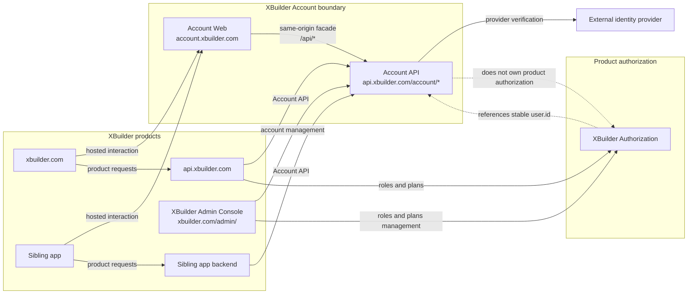
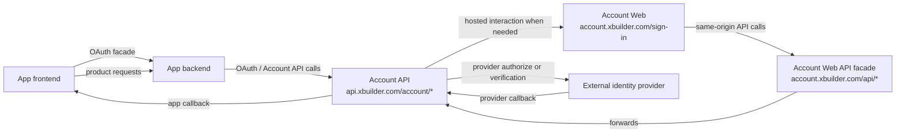
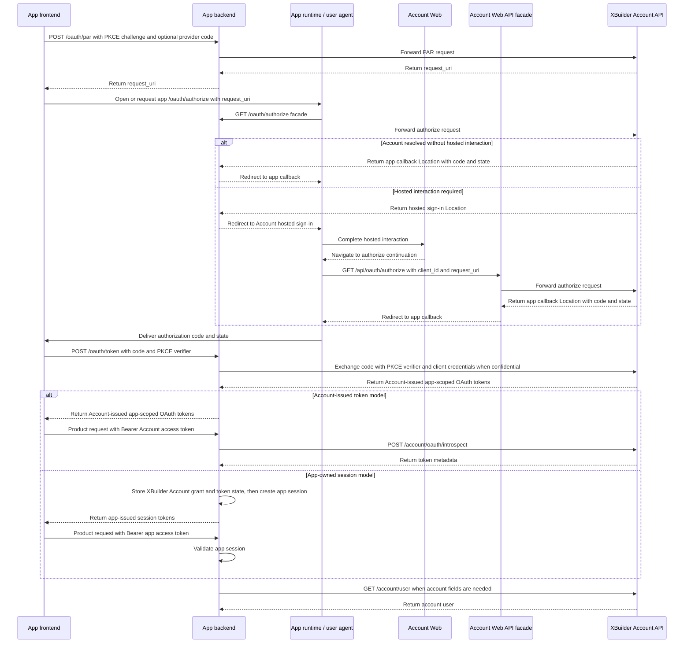

# XBuilder Account

XBuilder Account 是 XBuilder 的自有账号系统。它负责账号主体、第三方身份绑定、登录方式、account session、自有 app SSO、XBuilder Admin Console 中的账号管理模块，以及从 Casdoor 迁移后的账号基础能力。

本文档定义 XBuilder Account 的产品与系统边界。它描述迁移完成后的目标状态，不描述当前 Casdoor 运行时实现，也不定义最终数据库 schema、完整 OpenAPI 契约或具体实现任务。

## 背景与目标

XBuilder 当前依赖我们自己的 Casdoor fork 提供账号登录和 token 签发。这个 fork 已经与上游 Casdoor 明显分叉，并包含较多 XBuilder 专用登录行为。

XBuilder Account 的目标是替换 Casdoor，成为 XBuilder 产品自己的账号与身份基础设施。它不是一个通用 Auth0 或 Casdoor 风格的多租户身份平台，也不是面向任意第三方开发者开放的公开第三方 app 平台。

目标包括：

- 移除运行时对 Casdoor 的依赖
- 使用现有 `user` 作为账号主体
- 支持第三方身份登录
- 支持没有密码、只有第三方身份的用户
- 支持管理员创建用户
- 支持管理员为用户设置或清除密码凭证
- 支持已有管理员托管密码的用户使用用户名和密码登录
- 支持 hosted sign-in 和 SSO 所需的 account session 管理能力
- 支持 XBuilder 自有 sibling apps 共享 XBuilder 账号身份
- 支持平台管理的 apps，用于自有 app SSO
- 支持自有 app 使用 Account-issued token model 或 App-owned session model 接入产品 API
- 支持 XBuilder Account 管理模块，并将账号相关管理操作写入 admin audit logs

非目标包括：

- 普通用户公开注册用户名和密码账号
- 普通用户自行设置或重置密码
- 通用多租户身份平台
- 任意公开第三方 app 平台
- app 自助注册
- 管理 XBuilder 或 sibling app 的 roles、plans、capabilities、quotas、memberships、seats 等产品授权数据
- 用户删除或用户状态管理
- 在新运行时模型中保留 Casdoor user ID、groups 或其他 Casdoor 概念

## 核心概念

| 概念 | 含义 |
| - | - |
| `user` | XBuilder 账号主体，复用现有用户模型，字段归属按 Account 与产品边界划分 |
| `identity_provider` | 平台配置中的第三方身份提供方，如 GitHub、Google、Apple 等 |
| `user_identity` | 绑定到某个 `user` 的第三方身份 |
| `user_password_credential` | 管理员托管的可选密码凭证 |
| `user_session` | XBuilder Account 拥有的 account session，用于 hosted sign-in 和 SSO 连续性 |
| `app` | 平台管理的 OAuth client configuration，用于自有 app SSO |
| `app_secret` | confidential app 在后端 token exchange 中使用的 OAuth client credential |
| `app_grant` | 某个 `user` 授权某个 `app` 访问 XBuilder Account 的授权关系 |
| `auth_flow` | XBuilder Account 在第三方回调、provider credential handoff 和 OAuth 授权码流程中维护的短生命周期临时状态，如 provider redirect state、pushed authorization request、authorization code、PKCE challenge 和一次性 provider code 消费记录 |
| `audit_log` | XBuilder Admin 管理操作和安全相关事件的审计日志 |

`app` 是产品和管理资源名。OAuth 协议层仍然使用标准 client 概念和标准参数名，例如 `client_id`、`client_secret`、`redirect_uri`、`request_uri`、`code` 和 `grant_type`。

XBuilder Account 可以复用现有 `user` 表，但账号系统边界不等同于物理表边界。Account API 只暴露账号系统拥有的用户字段，例如 `id`、`username`、`displayName` 和 `avatar`。`avatar` 对外返回可展示的 HTTP URL。可写字段由具体接口定义。`description`、`roles`、`plan`、`capabilities`、统计字段和产品字段属于 XBuilder 产品或授权系统，不由 XBuilder Account API 暴露或管理。

`auth_flow` 是逻辑概念，只定义生命周期和安全语义，不约束物理存储方式。Provider redirect state、pushed authorization request、authorization code、PKCE challenge 和 provider code consumption records 都必须短生命周期保存。一次性状态必须一次性使用。失败的 provider callback、失败的 token exchange 或重复提交不得留下可 replay 的有效状态。

## 系统边界



## 用户登录行为

普通用户不能使用用户名和密码公开注册。

普通用户默认通过第三方身份登录。第一批第三方身份提供方包括：

- `wechat`
- `qq`
- `github`
- `apple`
- `google`
- `x`

管理员可以创建用户。管理员也可以为用户设置或清除密码。只有已经拥有管理员托管密码的用户，才能使用用户名和密码登录。

用户的登录方式包括第三方身份和管理员托管密码凭证。管理员可以移除任意第三方身份，也可以清除密码凭证。移除后，用户可能没有任何登录方式。此时账号仍然存在，但用户无法再次登录，直到管理员重新设置密码凭证。

移除登录方式不会自动撤销已有 account sessions。撤销已有 account sessions 是独立的管理操作。

## 第三方身份

第三方身份必须使用 provider 提供的稳定主体标识进行匹配，不能使用 provider 返回的邮箱或用户名进行账号匹配。跨自有 app 共享账号身份时，应优先使用 provider 的跨 app 稳定主体标识。

稳定主体标识示例：

| Provider | 稳定主体标识 |
| - | - |
| WeChat | `unionid` |
| QQ | `unionid` |
| GitHub | numeric user ID |
| Apple | `sub` |
| Google | `sub` |
| X | user ID |

Apple 应按 OIDC 风格 provider 处理。账号绑定必须使用 Apple 稳定的 `sub`，不能使用 Apple 返回的邮箱，因为用户可能使用 private relay email。

WeChat 和 QQ 的 `unionid` 可用性取决于 provider 配置、应用绑定关系和授权结果。`openid` 是 provider app/client scoped identifier，只能作为辅助标识保存，不能作为跨自有 app 统一账号身份的主体标识。如需记录 `openid`，必须同时记录对应的 subject namespace。

如果 WeChat 或 QQ 登录结果缺少 `unionid`，XBuilder Account 不应静默使用 `openid` 创建跨 app 账号身份。账号创建应依赖已验证的跨 app 稳定主体标识。Provider-scoped identity 只能通过用户确认的账号绑定流程绑定。

`user_identity` 应保存 provider、稳定 provider subject、必要时的 subject namespace，以及关联的 `user.id`。provider username、display name、avatar 等少量展示元数据可以用于展示和排障，但不能作为 XBuilder 账号字段的权威来源。

Provider access token 和 refresh token 不应持久化。完整原始 profile payload 不应持久化。XBuilder Account 不作为第三方 API 集成的 token vault。需要访问 provider APIs 的产品能力应单独建模、授权和存储相关 token。

第三方身份提供方配置应由部署配置或服务端受控配置管理，不属于 XBuilder Admin Console 管理范围。

## 自有 app

本文档中的自有 app 指由 XBuilder 平台登记和管理的 app。`xbuilder.com` 应被视为使用 XBuilder Account 的自有 app，而不是账号系统本身。`*.xbuilder.com` 下的 sibling apps 也应作为自有 app 支持。

这些 app 是平台管理的 OAuth client configurations。它们定义 redirect URI allowlists、allowed origins、client type、status 以及自有 app SSO 所需凭证。

自有 app 共享同一个 XBuilder 账号身份，但产品授权由各 app 或对应的产品授权系统负责。XBuilder Account 只负责账号存在性、app 状态、redirect URI allowlists、凭证校验、token/code 有效性等账号与 SSO 边界。App roles、memberships、workspaces、seats 和 product permissions 属于产品授权范围，不由 XBuilder Account 管理，也不作为自有 app SSO 的契约字段。

自有 app 产品 API 接入支持两种模型：

- Account-issued token model：app 使用 XBuilder Account 签发的 app-scoped OAuth token 作为产品 API Bearer token，app backend 通过 token introspection 校验 token，并可通过 Account API 读取稳定账号身份
- App-owned session model：app backend 通过 XBuilder Account SSO 获得稳定的 `user.id`，并创建、校验、刷新和撤销自己的 app session

Account-issued token model 适用于不希望维护自有 session，且产品请求都发生在用户请求链路中的 app。该模式下，app frontend 可以持有 Account-issued app-scoped OAuth token。App backend 应把这个 token 视为该 app 的产品 API credential，并在产品请求中校验 token、解析稳定 `user.id`，再执行自己的产品授权逻辑。Sibling apps 可以通过自己的 backend 透明转发 OAuth endpoints，让 frontend 面对同源 `/oauth/*`，而不是直接调用 `api.xbuilder.com/account/oauth/*`。

App backend 接受 Account-issued app-scoped OAuth token 作为产品 API credential 时，必须校验 token 绑定的 app 与当前 app 一致。产品权限仍由 app 或对应的产品授权系统判断，不由 XBuilder Account OAuth scope 表达。

App-owned session model 适用于独立部署、独立运维、需要后台代表用户访问 XBuilder Account、需要自行定义 session 刷新、退出和撤销语义，或不希望产品请求依赖 XBuilder Account token 校验的 app。App session 引用稳定的 `user.id`，并携带该 app 自己的 authorization context。它不是独立账号，也不是 XBuilder Account 管理的 session。XBuilder Account 不存储或撤销 app sessions。

无论使用哪种模式，自有 app 的产品授权仍由 app 或对应的产品授权系统负责。Account session、Account-issued app-scoped OAuth token 和 app session 都不应编码 roles、memberships、workspaces、seats 或 product permissions。

自有 app SSO 应使用 OAuth 2.0 authorization code flow。自有 app frontend 应经自己的 OAuth facade 发起流程，而不是直接调用 XBuilder Account API。XBuilder Account 可以直接完成 OAuth authorization request，也可以在需要 Account Web 介入时进入 `account.xbuilder.com/sign-in`。Hosted sign-in 可承载第三方身份登录、管理员托管密码登录、补充信息、账号绑定确认和身份冲突处理等 hosted interaction。

Public 和 confidential apps 在 authorization code flow 中都必须使用 PKCE。Public apps 不依赖 app secret。Confidential apps 可以同时使用 app secrets 作为 OAuth client credentials 进行后端 token exchange。Secret value 只应在创建时返回。

Sibling app frontend 登录完成后应只访问自己的 backend，不应在普通产品请求中依赖 XBuilder Account APIs。Sibling apps 应使用 `user.id` 作为稳定账号引用。`username` 是可变账号 handle，不能作为稳定身份标识。`username`、`displayName`、`avatar` 等可变账号字段可以被 sibling apps 缓存用于展示，但 XBuilder Account 仍是这些字段的权威来源。

## 登录接入模型

XBuilder Account 通过 `account.xbuilder.com/sign-in` 承载需要 Account Web 介入的 hosted sign-in。Hosted sign-in 使用 `account.xbuilder.com/api/*` 作为同源 API facade。该 facade 转发到 `api.xbuilder.com/account/*`，例如 `account.xbuilder.com/api/user` 对应 `api.xbuilder.com/account/user`，`account.xbuilder.com/api/oauth/token` 对应 `api.xbuilder.com/account/oauth/token`。`api.xbuilder.com/account/*` 是 XBuilder Account API 的权威入口。

`account.xbuilder.com/api/*` 是 Account Web 的同源接入层，不是安全边界。Account API 不应因为请求来自 facade 就放宽鉴权或权限校验。Facade 主要承载 Account Web 的 Account API 请求，不改变 OAuth、Bearer token 或 account session cookie 的鉴权语义。



普通 Web app 和 native iOS/Android app 在需要 hosted interaction 或选择 hosted provider acquisition 时，可以使用 hosted sign-in。Native apps 应通过系统浏览器或系统认证会话进入 `account.xbuilder.com/sign-in`，例如 `ASWebAuthenticationSession` 或 Chrome Custom Tabs，不应使用 embedded WebView。

Provider credential acquisition 有两种方式：

- Hosted provider acquisition：Hosted sign-in 将用户跳转到 provider authorize 页面，并通过 provider callback 获得 provider credential。
- Provider credential handoff：客户端把预先获得的短生命周期 provider code 通过 PAR 交给 XBuilder Account 消费。

Provider credential handoff 适用于微信小程序 `wx.login()` code、Apple authorization code 或 Google server auth code 等场景。客户端可以通过 PAR extension parameters 将 credential 交给 XBuilder Account，例如 `xbuilder_provider` 和 `xbuilder_provider_code`。该方式只替换上游 provider web authorize 阶段，不替换 XBuilder Account 的账号解析、用户创建、第三方身份绑定和 OAuth authorization code flow。无论 credential 来自 hosted provider acquisition 还是 handoff，XBuilder Account 都应使用同一套账号解析、用户创建和第三方身份绑定逻辑。如果 handoff 已足够解析账号且不需要 hosted interaction，OAuth authorization request 直接完成并返回 app callback。如果需要补充信息、确认账号绑定、处理身份冲突或重新认证，这些交互应在 hosted sign-in 页面内完成。

Provider credential handoff 的错误应通过 PAR 或 authorize 流程返回 OAuth error。过期、已消费、provider 不匹配或未知 provider code 都不得产生可继续使用的 `request_uri`。XBuilder Account 消费 provider code 与记录消费状态必须原子完成，避免同一个 provider code 被重复使用。

## OAuth 与产品 API 接入

XBuilder Account 的 OAuth endpoints 位于 `api.xbuilder.com/account/oauth/*`。它们只承载 OAuth 和 OAuth RFC 扩展协议端点，并签发 Account-issued app-scoped OAuth tokens。Token subject 是稳定的 `user.id`，token client 是具体 `app`。本文只定义 `account:user:read` Account API scope，用于允许 app backend 通过 Account-issued app-scoped OAuth token 访问 `GET /account/user`。该 scope 不表达产品授权状态，也不表达任何 app 的产品 API 权限。

Account-issued app-scoped OAuth token 可以作为对应 app 的产品 API credential。产品 API 是否接受该 token，取决于 token 绑定的 app 和该产品 backend 的鉴权策略。产品 API 必须校验 token client/app，不应只校验 token active。

两种模型共享同一条 frontend-facing OAuth flow。App frontend 面对 app backend 的 OAuth facade。App backend 可以透明转发 XBuilder Account 的 OAuth token response，也可以在自己的 `/oauth/token` 中把 Account token response 转换为 app-owned session。Hosted sign-in 是需要 Account Web 介入时的交互分支，不是 provider credential handoff 的必经路径。流程如下：



Provider credential handoff 如果已足够解析账号且不需要 hosted interaction，`/account/oauth/authorize` 直接返回 app callback。微信小程序等受限运行环境可以在程序内部处理这一跳。如果 authorize 返回 hosted sign-in 或其他交互 URL，app frontend 应打开该 URL 完成交互。

在 Account-issued token model 中，app backend 不维护该用户的 XBuilder Account token 状态。它可以把自己的 `/oauth/*` 作为透明 OAuth facade 转发到 `api.xbuilder.com/account/oauth/*`。App frontend 拿到的仍然是 Account-issued app-scoped OAuth token。App backend 应在收到产品请求时使用 `/account/oauth/introspect` 校验 token，并校验 token 绑定的 app 与当前 app 一致。需要账号字段时，app backend 可以在 token 具备 `account:user:read` scope 时使用 `GET /account/user` 获取当前账号的最小用户信息。第三方身份和 account session 管理不属于 app-scoped OAuth token 的默认 Account API surface。

`xbuilder.com` 也可以使用 Account-issued token model。对 XBuilder 产品 API 来说，token client/app 应为 `xbuilder`。`api.xbuilder.com` 接受该 token 后，应通过 XBuilder Authorization 和资源规则判断 projects、assets、courses、AI interaction 等产品权限，而不是用 `account:user:read` 表达这些产品权限。

在 App-owned session model 中，app backend 可以向自己的 frontend 暴露标准 OAuth facade，例如自己的 `/oauth/authorize`、`/oauth/token`、`/oauth/revoke`。这个 facade 不是 XBuilder Account API，也不应写入 XBuilder Account OpenAPI。App frontend 在 callback 中拿到的 authorization code 由 XBuilder Account 生成，但只把它当作提交给 app backend `/oauth/token` 的 opaque code。App backend 在 `/oauth/token` 中使用该 code、PKCE verifier 和必要的 client credentials 与 XBuilder Account 完成 token exchange，然后保存后续代表用户访问 Account API 所需的 XBuilder Account grant 状态和 token 状态，创建自己的 app session，并向 frontend 返回 app-issued session tokens。App frontend 不接触 Account-issued app-scoped OAuth tokens。这样 frontend 仍然只需要理解标准 OAuth flow。

`app_grant` 是 XBuilder Account 对某个 `user` 授权某个 `app` 的记录。OAuth authorization code exchange 可以创建或复用 `app_grant`。Account-issued app-scoped OAuth tokens 与 `app_grant` 关联。`app_grant` 用于审计、撤销和后端代表用户访问 Account API，不等同于 app session。

## Token 与 session 策略

XBuilder Account 使用 opaque tokens。

Account session tokens、authorization codes、Account-issued app-scoped OAuth tokens 和 refresh tokens 都应是高熵随机 secret。Token value 不编码用户字段、产品授权状态或其他可变业务状态。

XBuilder Account 不签发 JWT。用户身份和可变账号状态通过服务端状态和账号 API 解析。

Hosted sign-in 使用带 `__Host-` 前缀的 cookie 在 `account.xbuilder.com` 维护 account session。Cookie 必须设置 `HttpOnly`、`Secure`、`SameSite=Lax` 和 `Path=/`，不得设置 `Domain`。Account session 用于登录页内保持登录态和 SSO 续接，不暴露给 app frontend，也不是产品 API credential。

产品 API 请求使用服务端可撤销的 opaque credential。Account-issued token model 使用 XBuilder Account 签发的 app-scoped OAuth tokens。App-owned session model 使用 app backend 自己拥有的 session credential，通常是 app access token 和 app refresh token。

产品 API credential 的传递方式由各 app 自己定义。Bearer access token 是推荐的默认方式。产品 API credential 不得通过 URL、`postMessage` 或不受信任 iframe 传递。

Access token 应短生命周期、可服务端撤销，并且不编码用户字段或产品授权状态。Refresh token 用于更新短生命周期 access token 或延续 session，应长于 access token，必须服务端保存哈希，并在每次使用后轮换。已被轮换的 refresh token 再次出现时，应作为 replay 风险信号撤销对应 token family 或 grant。

App frontend 如需保存产品 API tokens，应限制在当前 app 作用域内的 browser storage 或平台 storage 中。

App frontend 应在 access token 接近过期时提前刷新，不应只依赖 401 后刷新。产品请求返回 401 时，app frontend 最多刷新并重试原请求一次。同一前端运行环境内必须合并并发刷新。Web 多标签页共享同一登录态时，应协调由哪个标签页负责刷新，并通过 `BroadcastChannel` 或 `storage` event 同步 token 更新，避免多个标签页使用同一 refresh token 并发刷新。刷新失败时，app frontend 应清空本地产品 API tokens 和当前用户缓存，并重新进入 OAuth 登录流程。

OAuth token revocation 用于撤销 Account-issued app-scoped OAuth token 或 refresh token。`app_grant` 的有效性由关联 token family 和 app 状态决定。需要撤销 `app_grant` 时，应撤销该 grant 下的 refresh token family 和仍有效 access tokens，或禁用对应 app。撤销 account session 会影响 hosted sign-in 和 SSO 连续性。App-owned session model 的退出、刷新和撤销由各 app backend 负责。

## 关键流程

### 第三方身份 SSO 完成流程

1. App frontend 通过 app backend 的 OAuth facade 发起 OAuth authorization request。请求可以通过 PAR 携带 provider credential handoff，也可以后续进入 hosted provider acquisition。
2. XBuilder Account 验证 provider credential，并使用稳定 provider subject 查找或创建 `user_identity` 与关联的 `user`。
3. 如果账号已解析且不需要 hosted interaction，XBuilder Account 直接完成 OAuth authorization request，且不得创建 account session。
4. 如果需要补充信息、确认账号绑定、处理身份冲突或重新认证，XBuilder Account 在 hosted sign-in 页面中完成这些步骤，并创建或复用 account session。
5. XBuilder Account 根据 OAuth authorization request 向 app callback 返回 authorization code 和 OAuth state。
6. App frontend 将 authorization code 和 PKCE verifier 提交给 app backend 的 OAuth token endpoint。
7. App backend 使用这些参数，并在 confidential app 场景下附带 client credentials，与 XBuilder Account 完成 token exchange。
8. Account-issued token model 下，app backend 将 Account-issued app-scoped OAuth tokens 返回给 frontend。App backend 使用 token introspection 校验 token，并取得稳定的 `user.id`。需要账号字段时，可以再调用 `GET /account/user`。
9. App-owned session model 下，app backend 保存后续代表用户访问 Account API 所需的 XBuilder Account grant 状态和 token 状态，创建自己的 app session，并向 frontend 返回 app-issued session tokens。

### 用户名和密码登录

1. 用户提交用户名和密码。
2. XBuilder Account 只校验管理员托管的 `user_password_credential`。
3. 校验成功后创建 account session。
4. 未设置管理员托管密码的用户不能使用用户名和密码登录。

### Account session 生命周期

1. Hosted sign-in 可以在 `account.xbuilder.com` 内保持有效 account session，并在必要时更新 session 状态。
2. 退出登录结束当前 account session。
3. 用户或管理员可以撤销指定 account session 或某个用户的所有 account sessions。
4. 撤销 account session 会影响 hosted sign-in 和后续 SSO，不默认同步撤销 Account-issued app-scoped OAuth tokens 或 app sessions。

## 管理台与管理权限

`xbuilder.com/admin/` 是 XBuilder Admin Console，不是 XBuilder Account 专属前端。它可以承载 XBuilder Account、XBuilder Authorization、assets、courses 以及其他产品管理模块。

XBuilder Account 管理权限标识为 `accountAdmin`。

`accountAdmin` 授予访问 XBuilder Account 管理模块的权限，覆盖用户管理、管理员托管密码管理、查看和移除第三方身份、撤销 account sessions、app 管理和 app secret 管理。

XBuilder Authorization 管理权限标识为 `authorizationAdmin`。

`authorizationAdmin` 授予访问 XBuilder Authorization 管理模块的权限，覆盖用户 roles、plan、derived capabilities 和 quota policies 等授权输入和推导结果。

`accountAdmin` 和 `authorizationAdmin` 的授予和判定属于 XBuilder Authorization 的管理范围。`accountAdmin` 不管理 XBuilder 产品授权数据，如 roles、plans、capabilities 或 quotas。需要同时管理账号系统和授权系统的管理员应同时拥有 `accountAdmin` 和 `authorizationAdmin`。

首次管理员授予应通过部署配置、迁移脚本或只在初始化阶段可用的运维命令完成。XBuilder Authorization 不可用或无法完成权限判定时，Admin APIs 不得放行请求。

Admin audit logs 记录账号、授权以及其他管理模块的管理操作和安全相关事件。查看 audit logs 不属于 XBuilder Account 管理模块本身，应由 XBuilder Admin API 根据管理员权限控制可见范围。

XBuilder Account 管理模块至少应包含以下产品能力：

- 查看用户列表和用户详情
- 创建用户
- 设置或清除管理员托管密码
- 查看和移除用户第三方身份
- 查看和撤销用户 account sessions
- 管理 apps，包括查看、创建、更新和启用或停用 apps
- 创建和删除 app secrets

XBuilder 产品授权数据可以出现在同一个 XBuilder Admin Console 和同一个用户详情页中，但不属于 XBuilder Account。

`/admin/account/*` endpoints 应要求 `accountAdmin`。`/admin/authorization/*` endpoints 应要求 `authorizationAdmin`。

`/admin/audit-logs` endpoints 应要求管理权限，并由后端 RBAC 决定可见审计事件范围。

管理台前端可以放在开源前端仓库中，并部署在 `xbuilder.com/admin/`。

Admin APIs 不应作为无访问限制的公开接口暴露。`api.xbuilder.com/admin/*` 应在 ingress 层限制访问范围，并继续由后端 RBAC 和 audit logging 保护。

主前端可以在用户具备管理权限时，在用户菜单中展示 Admin Console 入口。

## API 边界

本节只描述 API 边界。接口实现时，应在 `docs/openapi.yaml` 中定义具体契约。

### Account identity provider endpoints

```http
GET  /account/identity-providers
GET  /account/identity-providers/{provider}/authorize
GET  /account/identity-providers/{provider}/callback
POST /account/identity-providers/{provider}/callback
```

- 这些 endpoints 由 XBuilder Account backend 提供，主要供 `account.xbuilder.com/sign-in` 使用
- `GET /account/identity-providers` 根据 app context 返回当前可用于 hosted sign-in 的 identity providers
- `GET /account/identity-providers/{provider}/authorize` 用于当前 flow 未通过 provider credential handoff 提供 provider code 时的 provider redirect
- Provider callback 需要同时支持 GET 和 POST，因为具体 HTTP method 取决于 provider response mode，例如 Sign in with Apple 的 `form_post` 场景会使用 POST callback
- Provider callback 应依赖 provider redirect state 进行回调关联和 CSRF 防护，不应套用普通前端 CSRF token 校验

### Account OAuth endpoints

```http
POST /account/oauth/par
GET  /account/oauth/authorize
POST /account/oauth/token
POST /account/oauth/introspect
POST /account/oauth/revoke
```

- OAuth protocol parameters 应使用标准名称，例如 `client_id`、`redirect_uri`、`request_uri`、`state`、`code`、`grant_type`、`code_challenge` 和 `code_verifier`
- Confidential client 使用 `client_secret_basic` 认证
- Public client 在 token exchange 或 revocation 等需要标识 client 的请求中使用 `client_id`
- `POST /account/oauth/par` 创建 pushed authorization request，并可通过 `xbuilder_provider` 和 `xbuilder_provider_code` 承载 provider credential handoff。它返回的 `request_uri` 是 opaque、短生命周期、单次使用的 reference，不是可访问 URL
- `GET /account/oauth/authorize` 是 PAR-only OAuth authorization endpoint，只接受 `client_id` 和 `request_uri`。`response_type`、`redirect_uri`、`scope`、`state`、`code_challenge` 等 authorization request parameters 必须先通过 `POST /account/oauth/par` 提交
- `GET /account/oauth/authorize` 通过 `Location` 表达下一跳。账号可由 account session 或 PAR 中的 provider credential handoff 解析。账号已解析且不需要 hosted interaction 时，下一跳是 app callback。账号无法解析或需要 hosted interaction 时，下一跳是 hosted sign-in
- `GET /account/oauth/authorize` 不得通过 `Set-Cookie` 或其他响应头向 hosted sign-in 传递流程状态。Hosted sign-in 需要的上下文通过 `clientID` 和 `requestURI` 传递，具体状态保存在服务端 `auth_flow` 中
- `POST /account/oauth/token` 用于 authorization code exchange 和 refresh token exchange
- `POST /account/oauth/introspect` 是 RFC 7662 token introspection endpoint，只允许已认证的 app backend 调用
- `POST /account/oauth/revoke` 撤销 Account-issued app-scoped OAuth token 或 refresh token

### Current account endpoints

```http
GET    /account/user
PATCH  /account/user
PUT    /account/user/avatar
GET    /account/user/identities

POST   /account/session
GET    /account/session
DELETE /account/session
GET    /account/sessions
DELETE /account/sessions
DELETE /account/sessions/{sessionID}
```

- `GET /account/user` 返回当前账号系统拥有的用户字段。Account Web 可以使用 account session cookie 访问。App backend 可以使用具备 `account:user:read` scope 的 Account-issued app-scoped OAuth token 访问
- `PATCH /account/user` 只允许 Account Web 使用 account session cookie 调用，用于更新可写账号字段
- `PUT /account/user/avatar` 只允许 Account Web 使用 account session cookie 调用，用于通过 `multipart/form-data` 上传并替换头像图片
- `GET /account/user` 和 `PATCH /account/user` 不暴露或更新 `description` 等 XBuilder 产品字段
- `GET /account/user/identities` 返回当前用户的第三方身份
- `account:user:read` 只授权 `GET /account/user`，不授权 `PATCH /account/user`、`PUT /account/user/avatar`、`GET /account/user/identities`、account session endpoints、mutation endpoints 或 admin endpoints
- `POST /account/session` 由 Account Web 调用，用于提交登录凭证，并由后端校验后创建当前 account session
- `GET /account/session` 和 `DELETE /account/session` 管理 hosted sign-in 使用的当前 account session
- `GET /account/sessions`、`DELETE /account/sessions` 和 `DELETE /account/sessions/{sessionID}` 管理当前用户的 account sessions

### XBuilder Account admin endpoints

```http
GET    /admin/account/users
POST   /admin/account/users
GET    /admin/account/users/{userID}
PATCH  /admin/account/users/{userID}

PUT    /admin/account/users/{userID}/avatar
PUT    /admin/account/users/{userID}/password
DELETE /admin/account/users/{userID}/password

GET    /admin/account/users/{userID}/identities
DELETE /admin/account/users/{userID}/identities/{identityID}

GET    /admin/account/users/{userID}/sessions
DELETE /admin/account/users/{userID}/sessions
DELETE /admin/account/sessions/{sessionID}

GET    /admin/account/apps
POST   /admin/account/apps
GET    /admin/account/apps/{appID}
PATCH  /admin/account/apps/{appID}

GET    /admin/account/apps/{appID}/secrets
POST   /admin/account/apps/{appID}/secrets
DELETE /admin/account/apps/{appID}/secrets/{secretID}
```

- Apps 不提供 `DELETE` 删除语义。需要下线 app 时应更新 app status，以保留审计、历史授权和 token 关联上下文

### XBuilder Authorization admin endpoints

```http
GET   /admin/authorization/users/{userID}
PATCH /admin/authorization/users/{userID}
```

- 这些 authorization endpoints 共享 XBuilder Admin API namespace，但不是 XBuilder Account APIs
- 它们管理某个用户在 XBuilder Authorization 中的授权输入
- 可写字段是 `roles` 和 `plan`
- `capabilities` 和 quota policies 由 XBuilder Authorization 推导，应保持只读

### Admin audit endpoints

```http
GET /admin/audit-logs
```

- 这些 endpoints 共享 XBuilder Admin API namespace，但不是 XBuilder Account APIs
- 它们可以包含账号、授权以及其他管理模块产生的审计事件

## 与授权系统的关系

XBuilder Account 负责 authentication、account identity、account session 和自有 app SSO。它不负责集中化管理各个自有 app 的产品授权。

XBuilder 产品自身的 roles、plans、capabilities、quotas、memberships、seats 或其他产品权限仍属于产品授权系统。Sibling apps 也应拥有自己的授权模型。XBuilder Account 可以为这些系统提供稳定的 `user.id`，但不管理这些产品授权数据，也不通过 Account-issued app-scoped OAuth token 承载这些可变授权状态。

## 安全边界

管理台前端不是安全边界。浏览器能加载管理台页面，不代表拥有管理权限。Admin APIs 必须由后端 RBAC 和审计日志保护。Ingress 限制可以降低暴露面，但不能替代后端权限校验。

Session tokens、refresh tokens、authorization codes、app secrets 和其他安全凭证都必须具备足够熵。`request_uri` 应不可猜、短生命周期、单次使用，并绑定 app。`authorization code` 应短生命周期、一次性使用，并绑定 app、redirect URI 和 PKCE。Authorization response 必须回传原始 OAuth state 供 app 校验。App secret value 只应在创建时返回。

XBuilder Account 必须对 redirect URI allowlist 做精确字符串匹配，禁止前缀、通配符或路径前缀匹配，并在 token exchange 时校验 PKCE。App 必须校验 OAuth state 和 authorization request。Provider identity linking 必须基于稳定 provider subject，不能依赖邮箱、用户名或展示字段。

App backend 接受 Account-issued app-scoped OAuth token 作为产品 API credential 时，必须校验 token active、token subject 和 token client/app。不同 app 之间不能共享产品 API credential。

Account session 只用于 hosted sign-in 和 SSO 连续性。它不应通过 URL、`postMessage` 或不受信任 iframe 传递，也不应被 app frontend 直接读取或持久化。`/account/oauth/authorize` 不得设置 account session cookie。Account Web 使用 cookie 鉴权的 mutation endpoints 应校验 `Origin` 或使用等价 CSRF 防护。

`account:user:read` 只授权访问 `GET /account/user`，不授权第三方身份管理、account session 管理、账号字段更新或 admin 能力。这些操作应由 Account Web 使用 cookie 认证完成，或由 Admin API 承载。

Native iOS/Android apps 使用 hosted sign-in 时应使用系统浏览器或系统认证会话，例如 `ASWebAuthenticationSession` 或 Chrome Custom Tabs，不应使用 embedded WebView。微信小程序等无法使用系统浏览器的受限运行环境，可以通过 provider credential handoff 将短生命周期 provider code 传递给 XBuilder Account，不应通过 URL 或 `postMessage` 传递长期 token。

Provider credential handoff 只允许使用短生命周期、一次性、可立即消费的 authorization-code-like provider credential。允许的例子包括微信小程序 `wx.login()` code、Apple authorization code 和 Google server auth code。不应通过 provider credential handoff 传递 provider access token、provider refresh token、ID token、`session_key`、account session token、app access token、app refresh token、app secret 或其他长期 secret。XBuilder Account 读取 provider code 后应立即消费，不应持久化或返回给 frontend。

## 迁移方向

迁移应是一次性的，而不是长期双写或逐步切换。

Casdoor 只应作为迁移数据源，用于迁移 users、identities、密码凭证信息以及现有 XBuilder 产品授权数据。

如果历史 WeChat 或 QQ identity 只有 `openid` 而没有 `unionid`，迁移不能用它进行跨 app 自动合并。此类记录只能作为带 subject namespace 的 provider-scoped identity 迁移到原有关联用户，或在迁移前补齐 `unionid` 后再作为跨 app 主体身份使用。

现有 XBuilder 产品授权数据中的 roles 和 plans 应在同一次迁移中处理。迁移后，这些数据应归 XBuilder Authorization 管理，不由 XBuilder Account 管理，也不作为自有 app SSO 的契约字段。

迁移完成后，运行时不应再依赖 Casdoor。

Casdoor 来源的身份标识只应用作一次性迁移映射键，不应保留为运行时账号模型的一部分。

前端迁移后不应继续依赖 Casdoor SDK、Casdoor JWT 或从 token 中 decode 用户名。`spx-gui` 可以保留 Bearer 请求模型，但 Bearer value 应替换为产品 API token。

## 术语表

| 术语 | 含义 |
| - | - |
| XBuilder Account | XBuilder 自有账号系统 |
| Account Web | `account.xbuilder.com` 上的 hosted sign-in 和账号相关 Web UI |
| Account API | `api.xbuilder.com/account/*` 上的 XBuilder Account API |
| OAuth client | OAuth 协议中的 client 角色，在本文产品语境中对应 `app` |
| OAuth facade | App backend 暴露给自己 frontend 的 OAuth-compatible endpoints，内部再对接 XBuilder Account |
| Hosted sign-in | `account.xbuilder.com/sign-in` 提供的统一登录入口，在需要 Account Web 介入时承载第三方身份登录、管理员托管密码登录、handoff 后续交互、补充信息、账号绑定确认和身份冲突处理，并可通过 `clientID` 和 `requestURI` 续接 OAuth authorization request |
| Hosted provider acquisition | Hosted sign-in 通过 provider web authorize 和 callback 获得 provider credential 的方式 |
| Provider credential handoff | 客户端将短生命周期 provider code 通过 PAR 交给 XBuilder Account 消费的方式 |
| Hosted interaction | XBuilder Account hosted sign-in 页面中的补充信息、账号绑定确认、身份冲突处理或重新认证等交互 |
| Account session | XBuilder Account 拥有的账号 session，用于 hosted sign-in 和 SSO 连续性 |
| Account-issued app-scoped OAuth token | XBuilder Account 签发给某个具体 app 的 opaque OAuth token，可作为该 app 的产品 API Bearer token |
| Account-issued token model | 自有 app 直接使用 Account-issued app-scoped OAuth token 作为产品 API credential 的模型 |
| App-owned session model | 自有 app backend 自己创建、刷新、校验和撤销 app session 的模型 |
| App grant | 某个 `user` 授权某个 `app` 访问 XBuilder Account 的授权关系 |
| `account:user:read` | 允许使用 Account-issued app-scoped OAuth token 访问 `GET /account/user` 的 Account API scope |
| Opaque token | 不编码业务语义的随机 token，需由服务端解析 |
| Token introspection | RFC 7662 定义的 token 校验协议，用于由服务端查询 opaque token 是否有效及其元数据 |
| Authorization code | 自有 app SSO 完成后返回给 app 的短生命周期一次性 code，用于后续 exchange |
| PKCE | Proof Key for Code Exchange |
| PAR | Pushed Authorization Requests |
| OIDC | OpenID Connect |
| SSO | Single Sign-On |
| RBAC | Role-Based Access Control |
