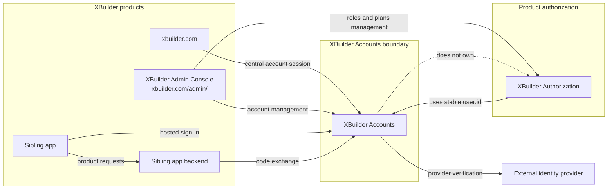
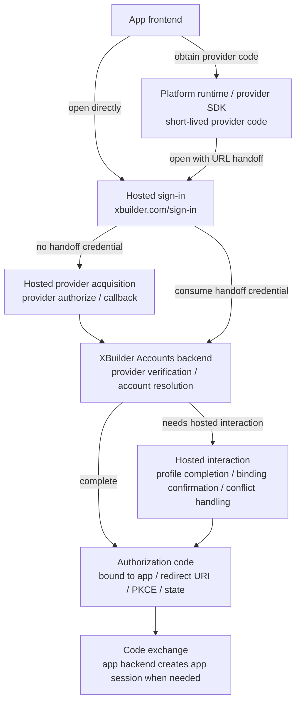
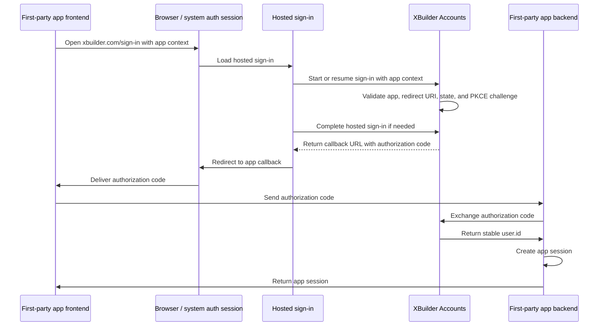

# XBuilder Accounts

XBuilder Accounts 是 XBuilder 的自有账号系统。它负责账号主体、第三方身份绑定、登录方式、会话、自有 app SSO、XBuilder Admin Console 中的账号管理模块，以及从 Casdoor 迁移后的账号基础能力。

本文档定义 XBuilder Accounts 的产品与系统边界。它描述迁移完成后的目标状态，不描述当前 Casdoor 运行时实现，也不定义最终数据库 schema、完整 OpenAPI 契约或具体实现任务。

## 背景与目标

XBuilder 当前依赖我们自己的 Casdoor fork 提供账号登录和 token 签发。这个 fork 已经与上游 Casdoor 明显分叉，并包含较多 XBuilder 专用登录行为。

XBuilder Accounts 的目标是替换 Casdoor，成为 XBuilder 产品自己的账号与身份基础设施。它不是一个通用 Auth0 或 Casdoor 风格的多租户身份平台，也不是面向任意第三方开发者开放的公开第三方 app 平台。

目标包括：

- 移除运行时对 Casdoor 的依赖
- 使用现有 `user` 作为账号主体
- 支持第三方身份登录
- 支持没有密码、只有第三方身份的用户
- 支持管理员创建用户
- 支持管理员为用户设置或清除密码凭证
- 支持已有管理员托管密码的用户使用用户名和密码登录
- 支持 central account session、refresh、logout 和 session revocation
- 支持 XBuilder 自有 sibling apps 共享 XBuilder 账号身份
- 支持平台管理的 apps，用于自有 app SSO
- 支持 XBuilder Accounts 管理模块和账号系统审计日志

非目标包括：

- 普通用户公开注册用户名和密码账号
- 普通用户自行设置或重置密码
- 通用多租户身份平台
- 任意公开第三方 app 平台
- app 自助注册
- 管理 XBuilder 或 sibling app 的 roles、plans、capabilities、quotas、memberships、seats 等产品授权数据
- 用户删除或用户状态管理
- 在新运行时模型中保留 Casdoor user ID、groups 或其他 Casdoor 概念

## 核心概念

| 概念 | 含义 |
| - | - |
| `user` | XBuilder 账号主体，复用现有用户模型 |
| `identity_provider` | 平台配置中的第三方身份提供方，如 GitHub、Google、Apple 等 |
| `user_identity` | 绑定到某个 `user` 的第三方身份 |
| `user_password_credential` | 管理员托管的可选密码凭证 |
| `user_session` | XBuilder Accounts 拥有的 central account session |
| `app` | 平台管理的 OAuth client configuration，用于自有 app SSO |
| `app_secret` | confidential app 在后端 token exchange 中使用的 OAuth client credential |
| `app_session` | 自有 app 自己拥有的产品运行时 session，不是 XBuilder Accounts 记录 |
| `auth_flow` | 登录、第三方回调、provider credential handoff 和 OAuth 授权码流程中的短生命周期临时状态，如 provider redirect state、OAuth state、PKCE 和一次性 code |
| `audit_log` | 管理操作和安全相关事件的审计日志 |

`app` 是产品和管理资源名。OAuth 协议层仍然使用标准 client 概念和标准参数名，例如 `client_id`、`client_secret`、`redirect_uri`、`code` 和 `grant_type`。

## 系统边界



## 用户登录行为

普通用户不能使用用户名和密码公开注册。

普通用户默认通过第三方身份登录。第一批第三方身份提供方包括：

- `wechat`
- `qq`
- `github`
- `apple`
- `google`
- `x`

管理员可以创建用户。管理员也可以为用户设置或清除密码。只有已经拥有管理员托管密码的用户，才能使用用户名和密码登录。

用户的登录方式包括第三方身份和管理员托管密码凭证。管理员可以移除任意第三方身份，也可以清除密码凭证。移除后，用户可能没有任何登录方式。此时账号仍然存在，但用户无法再次登录，直到管理员重新设置密码凭证。

移除登录方式不会自动撤销已有 session。session revocation 是独立的管理操作。

## 第三方身份

第三方身份必须使用 provider 提供的稳定主体标识进行匹配，不能使用 provider 返回的邮箱或用户名进行账号匹配。跨自有 app 共享账号身份时，应优先使用 provider 的跨 app 稳定主体标识。

稳定主体标识示例：

| Provider | 稳定主体标识 |
| - | - |
| WeChat | `unionid` |
| QQ | `unionid` |
| GitHub | numeric user ID |
| Apple | `sub` |
| Google | `sub` |
| X | user ID |

Apple 应按 OIDC 风格 provider 处理。账号绑定必须使用 Apple 稳定的 `sub`，不能使用 Apple 返回的邮箱，因为用户可能使用 private relay email。

WeChat 和 QQ 的 `unionid` 可用性取决于 provider 配置、应用绑定关系和授权结果。`openid` 是 provider app/client scoped identifier，只能作为辅助标识保存，不能作为跨自有 app 统一账号身份的主体标识。如需记录 `openid`，必须同时记录对应的 subject namespace。

如果 WeChat 或 QQ 登录结果缺少 `unionid`，XBuilder Accounts 不应静默使用 `openid` 创建跨 app 账号身份。账号创建应依赖已验证的跨 app 稳定主体标识。Provider-scoped identity 只能通过用户确认的账号绑定流程绑定。

`user_identity` 应保存 provider、稳定 provider subject、必要时的 subject namespace，以及关联的 `user.id`。provider username、display name、avatar 等少量展示元数据可以用于展示和排障，但不能作为 XBuilder 用户资料的权威字段。

Provider access token 和 refresh token 不应持久化。完整原始 profile payload 不应持久化。

第三方身份提供方配置应由平台配置管理，不属于 XBuilder Admin Console 管理范围。

## 自有 app

本文档中的自有 app 指由 XBuilder 平台登记和管理的 app。`xbuilder.com` 应被视为使用 XBuilder Accounts 的自有 app，而不是账号系统本身。`*.xbuilder.com` 下的 sibling apps 也应作为自有 app 支持。

这些 app 是平台管理的 OAuth client configurations。它们定义 redirect URI allowlists、allowed origins、client type、status 以及自有 app SSO 所需凭证。

自有 app 共享同一个 XBuilder 账号身份，但产品授权由各 app 或对应的产品授权系统负责。XBuilder Accounts 只负责账号存在性、app 状态、redirect URI allowlists、凭证校验、token/code 有效性等账号与 SSO 边界。App roles、memberships、workspaces、seats 和 product permissions 属于产品授权范围，不由 XBuilder Accounts 管理，也不作为自有 app SSO 的契约字段。

XBuilder Accounts 拥有用于登录和 SSO 的 central account session。`xbuilder.com` 是 XBuilder 主产品入口，由 `api.xbuilder.com` 支撑，并且和 XBuilder Accounts 处在同一个产品后端边界内，因此可以直接使用 central account session。拥有独立 backend 的 sibling apps 应创建自己的 app session。

自有 app SSO 应使用兼容 OAuth2 的 authorization code flow。自有 app frontend 的稳定登录入口是 `xbuilder.com/sign-in`，不是 XBuilder Accounts API。Hosted sign-in 负责账号解析、用户创建、第三方身份绑定和 app callback，并可承载补充资料、账号绑定确认、身份冲突处理等 hosted interaction。独立后端的自有 app 不应把 central account session 当成产品运行时 session。SSO 完成后，app backend 应与 XBuilder Accounts 做 authorization code exchange，解析稳定的 `user.id`，并创建自己的 app session。

App sessions 是自有 app 自己的产品运行时 session。它们引用稳定的 `user.id`，并携带该 app 自己的 authorization context。它们不是独立账号。

Public apps 应使用 PKCE，并且不依赖 app secret。Confidential apps 可以使用 app secrets 作为 OAuth client credentials 进行后端 token exchange。Secret value 只应在创建时返回。

Sibling app frontend 在登录发起时应集成 hosted sign-in 入口和必要 app context，不应直接集成 XBuilder Accounts APIs。登录完成后，它通常只应访问自己的 backend，不应在普通产品请求中依赖 XBuilder Accounts APIs。Sibling apps 应使用 `user.id` 作为稳定账号引用。`username`、`displayName`、`avatar` 等可变资料字段可以被 sibling apps 缓存用于展示，但 XBuilder Accounts 仍是账号资料的权威来源。

## 登录接入模型

XBuilder Accounts 通过 `xbuilder.com/sign-in` 承载统一 hosted sign-in。Hosted sign-in URL 应携带 app context，例如 `client_id`、`redirect_uri`、OAuth state 和 PKCE `code_challenge`。不同客户端的差异只在于 provider credential acquisition：可以由 hosted sign-in 通过 provider web authorize 完成，也可以由客户端先通过平台运行时或 provider SDK 获得短生命周期 provider code，再通过 URL handoff 交给 hosted sign-in。



Hosted sign-in 适用于 Web app，也适用于 native iOS/Android app 通过系统浏览器或系统认证会话进入 XBuilder Accounts 的场景。App 从一开始就把用户带到 `xbuilder.com/sign-in`。第三方 provider 登录和用户名密码登录在 hosted sign-in 页面内完成；补充资料、账号绑定确认、身份冲突处理等 hosted interaction 也应由 hosted sign-in 承载。App 只接收最终 callback，例如 authorization code。

Provider credential handoff 适用于客户端先通过平台运行时或 provider SDK 获得短生命周期 provider code 的场景，例如微信小程序 `wx.login()` code、Apple authorization code 或 Google server auth code。客户端打开 `xbuilder.com/sign-in`，并在 URL 中带上 app context、provider 和 provider code。Hosted sign-in 页面读取 code 后立即提交给 XBuilder Accounts backend 消费，并清理 URL。Sibling app frontend 不直接调用 XBuilder Accounts APIs，也不需要理解内部注册和绑定规则。

Provider credential handoff 只替换上游 provider web authorize 阶段，不替换 XBuilder Accounts 的账号登录流程。无论 provider credential 来自 hosted provider acquisition 还是 URL handoff，XBuilder Accounts 都应使用同一套账号解析、用户创建和第三方身份绑定逻辑。如果需要补充资料、确认账号绑定或处理身份冲突，这些交互应在 hosted sign-in 页面内完成。

## Token 与 session 策略

XBuilder Accounts 使用 opaque tokens。

Session tokens、refresh tokens、authorization codes 和自有 app SSO access tokens 都应是高熵随机 secret。Token value 不编码用户资料、产品授权状态或其他可变业务状态。

XBuilder Accounts 不签发 JWT。用户身份和可变账号状态通过服务端状态和账号 API 解析。

Refresh token 的作用是让短生命周期 access token 或 session token 可以更新，而不要求用户频繁重新登录。Refresh token 也必须是服务端可撤销的 opaque secret，不能被视为不可撤销的长期身份凭证。

## 关键流程

Provider credential acquisition 有两种方式：

- Hosted provider acquisition：App 打开 `xbuilder.com/sign-in`，hosted sign-in 将用户跳转到 provider authorize 页面，并通过 provider callback 获得 provider credential。
- Provider credential handoff：客户端先通过平台运行时或 provider SDK 获得短生命周期 provider code，再打开 `xbuilder.com/sign-in` 并通过 URL handoff 交给 hosted sign-in。

第三方身份 hosted sign-in completion：

1. XBuilder Accounts 验证 provider credential，并使用稳定 provider subject 查找或创建 `user_identity` 与关联的 `user`。
2. 如果需要用户补充资料、确认账号绑定或处理身份冲突，XBuilder Accounts 在 hosted sign-in 页面中完成这些步骤。
3. XBuilder Accounts 创建或复用 central account session。
4. 用户回到原始产品入口。对于自有 app SSO，XBuilder Accounts 向 app callback 返回 authorization code。
5. App backend 使用 authorization code 与 XBuilder Accounts 完成 exchange，并创建自己的 app session。

用户名和密码登录：

1. 用户提交用户名和密码。
2. XBuilder Accounts 只校验管理员托管的 `user_password_credential`。
3. 校验成功后创建 central account session。
4. 未设置管理员托管密码的用户不能使用用户名和密码登录。

Session refresh、logout 和 revocation：

1. Refresh 使用服务端可验证和可撤销的 refresh token 更新短生命周期 token 或 session 状态。
2. Logout 结束当前 central account session。
3. Session revocation 由用户或管理员触发，用于撤销指定 session 或某个用户的所有 sessions。

自有 app SSO：



1. 自有 app 将用户带到 `xbuilder.com/sign-in`，并提供 app context、redirect URI、OAuth state 和 PKCE `code_challenge`。
2. XBuilder Accounts 校验 app、redirect URI、OAuth state 和 PKCE challenge。
3. 如果用户还没有 central account session，hosted sign-in 完成第三方身份登录、管理员托管密码登录或 provider credential handoff。
4. 登录完成后，XBuilder Accounts 向 app callback 返回短生命周期 authorization code。
5. App backend 使用 authorization code 与 XBuilder Accounts 做 token exchange，解析稳定的 `user.id`，并创建自己的 app session。
6. App frontend 在后续普通产品请求中访问自己的 backend，而不是直接依赖 XBuilder Accounts APIs。

## 管理台与管理权限

`xbuilder.com/admin/` 是 XBuilder Admin Console，不是 XBuilder Accounts 专属前端。它可以承载 XBuilder Accounts、XBuilder Authorization、assets、courses 以及其他产品管理模块。

XBuilder Accounts 管理权限标识为 `accountAdmin`。

`accountAdmin` 授予访问 XBuilder Accounts 管理模块的权限，覆盖用户管理、管理员托管密码管理、查看和移除第三方身份、session revocation、app 管理、app secret 管理和账号系统审计日志。

`accountAdmin` 的授予和判定属于 XBuilder Authorization 的管理范围。`accountAdmin` 不管理 XBuilder 产品授权数据，如 roles、plans、capabilities 或 quotas。XBuilder Authorization 的管理权限应由其授权模型定义，而不是由 `accountAdmin` 定义。

XBuilder Accounts 管理模块至少应包含以下产品能力：

- 查看用户列表和用户详情
- 创建用户
- 设置或清除管理员托管密码
- 查看和移除用户第三方身份
- 查看和撤销用户 sessions
- 管理 apps
- 创建和删除 app secrets
- 查看账号系统 audit logs

XBuilder 产品授权数据可以出现在同一个 XBuilder Admin Console 和同一个用户详情页中，但不属于 XBuilder Accounts。

管理台前端可以放在开源前端仓库中，并部署在 `xbuilder.com/admin/`。

Admin APIs 不应作为无访问限制的公开接口暴露。`api.xbuilder.com/admin/*` 应在 ingress 层限制访问范围，并继续由后端 RBAC 和 audit logging 保护。

主前端可以在用户具备管理权限时，在 profile dropdown 中展示 Admin Console 入口。

## API 边界

本节只描述 API 边界。接口实现时，应在 `docs/openapi.yaml` 中定义具体契约。

登录与 account session endpoints：

```http
GET    /auth/identity-providers
GET    /auth/identity-providers/{provider}/authorize
GET    /auth/identity-providers/{provider}/callback
POST   /auth/identity-providers/{provider}/callback
POST   /auth/sessions
GET    /auth/session
DELETE /auth/session
POST   /auth/session/refresh
```

`GET /auth/identity-providers` 根据 app context 返回当前可用于 hosted sign-in 的 identity providers。

`GET /auth/identity-providers/{provider}/authorize` 用于 hosted sign-in 中未通过 URL handoff 提供 provider code 时的 provider redirect。Provider callback 需要同时支持 GET 和 POST，因为具体 HTTP method 取决于 provider response mode，例如 Sign in with Apple 的 `form_post` 场景会使用 POST callback。

`POST /auth/sessions` 由 hosted sign-in 前端调用，用于通过管理员托管密码凭证或 provider credential 创建 central account session，并将其设为当前 session。在自有 app SSO 上下文中，session 创建完成后可继续向 app callback 返回 authorization code。它不是 sibling app frontend 的稳定集成接口。

`GET /auth/session`、`DELETE /auth/session` 和 `POST /auth/session/refresh` 作用于当前 central account session，不是自有 app 产品 session API。

已登录用户账号 endpoints：

```http
GET    /user
PATCH  /user
GET    /user/identities
GET    /user/sessions
DELETE /user/sessions/{sessionID}
```

自有 app SSO protocol endpoints：

```http
GET  /oauth/authorize
POST /oauth/token
GET  /oauth/userinfo
POST /oauth/revoke
```

OAuth protocol parameters 应使用标准名称，例如 `client_id`、`client_secret`、`redirect_uri`、`code`、`grant_type`、`code_challenge` 和 `code_verifier`。

这些是 SSO protocol endpoints，不是用户可见登录入口。自有 app 的用户可见登录入口仍是 `xbuilder.com/sign-in`；`GET /oauth/authorize` 表示 Accounts 后端的授权请求入口，需要用户交互时由 hosted sign-in 承载。

`POST /oauth/token` 用于 authorization code exchange，并返回 opaque access token。`GET /oauth/userinfo` 使用该 access token 返回稳定账号身份，例如 `user.id`，不返回产品授权状态。`POST /oauth/revoke` 用于撤销通过 `/oauth/token` 签发的自有 app SSO tokens。

XBuilder Accounts admin endpoints：

```http
GET    /admin/users
POST   /admin/users
GET    /admin/users/{userID}
PATCH  /admin/users/{userID}

PUT    /admin/users/{userID}/password
DELETE /admin/users/{userID}/password

GET    /admin/users/{userID}/identities
DELETE /admin/users/{userID}/identities/{identityID}

GET    /admin/users/{userID}/sessions
DELETE /admin/users/{userID}/sessions
DELETE /admin/sessions/{sessionID}

GET    /admin/apps
POST   /admin/apps
GET    /admin/apps/{appID}
PATCH  /admin/apps/{appID}
PUT    /admin/apps/{appID}/status

GET    /admin/apps/{appID}/secrets
POST   /admin/apps/{appID}/secrets
DELETE /admin/apps/{appID}/secrets/{secretID}

GET    /admin/audit-logs
```

XBuilder Authorization admin endpoints：

```http
GET /admin/users/{userID}/authorization
PUT /admin/users/{userID}/authorization
```

这些 authorization endpoints 共享 XBuilder Admin API namespace，但不是 XBuilder Accounts APIs。

它们管理某个用户在 XBuilder Authorization 中的授权输入。可写字段是 `roles` 和 `plan`。`capabilities` 和 quota policies 由 XBuilder Authorization 推导，应保持只读。

## 与授权系统的关系

XBuilder Accounts 负责 authentication、account identity、session 和自有 app SSO。它不负责集中化管理各个自有 app 的产品授权。

XBuilder 产品自身的 roles、plans、capabilities、quotas、memberships、seats 或其他产品权限仍属于产品授权系统。Sibling apps 也应拥有自己的授权模型。XBuilder Accounts 可以为这些系统提供稳定的 `user.id`，但不管理这些产品授权数据，也不通过 SSO token 承载这些可变授权状态。

## 安全边界

管理台前端不是安全边界。浏览器能加载管理台页面，不代表拥有管理权限。Admin APIs 必须由后端 RBAC 和审计日志保护。Ingress 限制可以降低暴露面，但不能替代后端权限校验。

Session tokens、refresh tokens、authorization codes、app secrets 和其他安全凭证都必须具备足够熵。`authorization code` 应短生命周期、一次性使用，并绑定 app、redirect URI、PKCE 和 OAuth state。App secret value 只应在创建时返回。

自有 app SSO 必须校验 redirect URI allowlist、OAuth state 和 PKCE。Provider identity linking 必须基于稳定 provider subject，不能依赖邮箱、用户名或展示字段。

Native iOS/Android apps 承载 hosted sign-in 时应使用系统浏览器或系统认证会话，例如 `ASWebAuthenticationSession` 或 Chrome Custom Tabs，不应使用 embedded WebView。微信小程序等无法使用系统浏览器的受限运行环境，可以通过 URL handoff 向 hosted sign-in 传递短生命周期 provider code，不应通过 URL 或 `postMessage` 传递长期 token。

Provider credential handoff 只允许使用短生命周期、一次性、可立即消费的 authorization-code-like provider credential。允许的例子包括微信小程序 `wx.login()` code、Apple authorization code 和 Google server auth code。不应通过 URL handoff 传递 provider access token、provider refresh token、ID token、`session_key`、XBuilder session token、refresh token、app secret 或其他长期 secret。Hosted sign-in 页面读取 provider code 后应立即提交给后端消费，并清理 URL。

## 迁移方向

迁移应是一次性的，而不是长期双写或逐步切换。

Casdoor 只应作为迁移数据源，用于迁移 users、identities、密码凭证信息以及现有 XBuilder 产品授权数据。

现有 XBuilder 产品授权数据中的 roles 和 plans 应在同一次迁移中处理。迁移后，这些数据应归 XBuilder Authorization 管理，不由 XBuilder Accounts 管理，也不作为自有 app SSO 的契约字段。

迁移完成后，运行时不应再依赖 Casdoor。

Casdoor 来源的身份标识只应用作一次性迁移映射键，不应保留为运行时账号模型的一部分。

## 术语表

| 术语 | 含义 |
| - | - |
| XBuilder Accounts | XBuilder 自有账号系统 |
| IdP | Identity Provider，身份提供方 |
| OIDC | OpenID Connect |
| OAuth client | OAuth 协议中的 client 角色，在本文产品语境中对应 `app` |
| Opaque token | 不编码业务语义的随机 token，需由服务端解析 |
| Central account session | XBuilder Accounts 拥有的中心账号 session |
| App session | 自有 app 自己拥有的产品运行时 session |
| Hosted sign-in | `xbuilder.com/sign-in` 提供的统一登录入口，承载第三方身份登录、管理员托管密码登录、provider credential handoff、补充资料、账号绑定确认、身份冲突处理和 app callback |
| Hosted provider acquisition | Hosted sign-in 通过 provider web authorize 和 callback 获得 provider credential 的方式 |
| Provider credential handoff | 客户端先通过平台运行时或 provider SDK 获得短生命周期 provider code，再通过 URL 交给 hosted sign-in 消费的方式 |
| Hosted interaction | XBuilder Accounts hosted 页面中的补充资料、账号绑定确认或身份冲突处理等交互 |
| Authorization code | 自有 app SSO 完成后返回给 app 的短生命周期一次性 code，用于 app backend 后续 exchange |
| PKCE | Proof Key for Code Exchange |
| SSO | Single Sign-On |
| RBAC | Role-Based Access Control |
