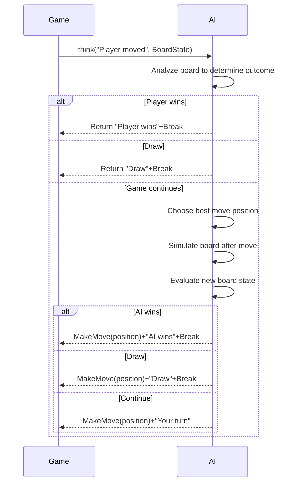

# AI Interaction

AI Interaction is a feature in XBuilder that allows games to communicate with AI during runtime. This functionality enables users to create rich interactive scenarios in games such as intelligent opponents (like AI opponents in board games), smart conversations, dynamic content generation, and adaptive gaming experiences.

The AI Interaction feature is designed for children around 10 years old who are learning programming. It provides minimal APIs that allow them to easily integrate AI capabilities into their games without needing to understand complex network requests, error handling, or AI model details.

## Basic Concepts

### AI Interaction

AI Interaction refers to the communication process between a running game and external AI. This interaction includes sending messages to AI and receiving/processing AI responses.

The basic AI interaction flow is:

1. The game sends a message to AI (may contain contextual information like game state)
2. AI processes the message and generates a response
3. The game processes the response and provides feedback
4. AI determines subsequent actions based on the feedback

This process iterates until the interaction naturally concludes or is interrupted.

### AI Player

An AI Player is an intelligent agent in the game that interacts with human players, capable of understanding game situations and making reasonable responses. Each AI Player is an independent interaction instance with its own memory and behavior patterns, operating without interference from others.

Core characteristics of AI Players:

- Identity: Clearly defined through role settings (e.g., opponent, teacher, etc.). Role definitions include:
  - Identity description: The basic identity of the role, such as "guide", "opponent", "teacher", etc.
  - Behavior guidelines: How the role should behave, including tone, attitude, and decision-making style
  - Knowledge scope: What the role should or shouldn't know
  - Goal orientation: The role's main objectives or tasks in the game
- Interactivity: Can receive instructions and provide intelligent responses
- Autonomy: Makes decisions based on context
- Customizability: Behaviors and capability ranges can be freely defined

Example:

```go
import "ai"

// Declare Player variable (zero value is ready to use)
var teacher ai.Player

// Set the role the Player should play
teacher.setRole "Math Teacher", { "Style": "Patient", "Difficulty": "Beginner", "Subjects": ["Addition", "Subtraction"] }
```

### AI Context

AI Context is a key collection of data that helps AI understand the current game state, conversation history, and environmental information. Good context enables AI to generate more accurate and relevant responses, improving the intelligence and coherence of the gaming experience.

AI Context comes in two types:

- Automatically attached context: Information automatically collected and provided to AI by the system, such as conversation history and basic game environment. Users don't need to manually provide this - the system automatically attaches it during each AI interaction.
- User-provided context: Specific information explicitly provided by developers through APIs, such as current game state or special rules. The system automatically converts this information into a format AI can understand, enabling AI to generate more intelligent responses based on the current situation.

Notably, the system automatically analyzes game source code during initialization and generates a descriptive summary of the game world from the player's perspective. This summary is attached to the AI context as background knowledge, helping AI understand the game's basic design and possible player interaction methods. This allows AI to generate responses that better align with game logic and player experience.

AI Context typically contains these types of information:

- Game state information: Such as score, collected items, completed tasks, etc.
- Conversation history: Previous interactions with AI, helping AI understand conversation continuity
- Environmental information: Game world rules, available resources, time limits, etc.
- User information: Such as the user's play style, learning progress, difficulties, etc.

Good AI Context design principles:

- Relevance: Only provide information relevant to the current task or conversation
- Conciseness: Avoid redundant information, keep context data structure clear
- Timeliness: Update context promptly to ensure AI gets the latest game state
- Understandability: Organize information in ways AI can easily process

Example:

```go
var npc ai.Player
npc.think "What's my next move?", { "Position": [10, 20], "HP": 80, "Equipment": ["Sword", "Shield"] }
```

### AI Command

AI Commands are pre-registered functions that AI can call. Through commands, AI can perform specific operations in the game, such as moving sprites, playing sounds, or changing game state.

Each AI Command contains:

- Command definition: Defined through struct type, including:
  - Command name: The struct type name
  - Command description: Can be provided by implementing struct methods to give complete descriptions. If not implemented, the system generates default descriptions.
  - Parameter definition: Added through struct fields to define required parameters and their types
  - Parameter description: Can be set through field tags to describe parameter purposes. If not added, the system generates default descriptions.
- Command implementation: Concrete execution logic that receives the command definition struct as parameter and performs corresponding operations

Good AI Command design principles:

- Clear semantics: Command names and parameters should clearly express their functionality, understandable even without descriptions
- Concise parameters: Avoid too many parameters to maintain usability

Example:

```go
type AttackThePlayer struct {
    Strokes int
}

var enemy ai.Player
enemy.onCmd AttackThePlayer, (cmd) => {
    // Execute attack logic
}
```

### AI Message

AI Messages are text content sent by the game to AI, which can contain questions, instructions, or other information. AI generates responses based on message content.

AI Messages can include additional context information to help AI better understand the current game state.

Example:

```go
var guide ai.Player
guide.think "Where is the nearest treasure?", { "CurrentPosition": [35, 42], "ExploredAreas": ["East", "South"] }
```

### AI Response

AI Response is AI's processing result for game messages. Each response contains:

- Text response: Text content generated by AI, typically used as debug information without needing processing
- Single AI command: The single AI command AI decides to call, automatically executed by the system

After executing the command, the system provides feedback to AI for determining subsequent actions. Command execution may produce these results:

- Success: Command executed correctly, game state changed as expected, AI can continue
- Failure: Command failed due to invalid parameters or disallowed game state, with error information helping AI adjust strategy
- Interruption: Command actively requests terminating current interaction flow

Only when the AI command is legal and successfully executed is the AI response considered valid.

Example:

```go
type Help struct {
    Topic    string `desc:"Topic needing help"`
    Priority int    `desc:"Priority, range: 1-5"`
}

var helper ai.Player
helper.onCmd Help, (cmd) => {
    // Execute help logic
}

helper.think "I need help" // Will automatically execute AI response command
```

## API Design

All AI interaction functionality is provided through methods of the `Player` struct in the `ai` package.

### setRole

`setRole` is a "command" class API that sets the role AI should play during interactions. By defining clear roles, AI responses become more consistent, better suited to game scenarios, and avoid repeating role descriptions in each `think` call.

```go
Player.setRole role
Player.setRole role, additionalContext
```

Parameters:

- `role`: `string` type, describing the role AI should play, such as "guide", "opponent", "teacher", etc.
- `additionalContext`: Optional parameter, `map[string]any` type, providing additional context information about the role

For ease of use, `setRole` can be called at any point in the game to change AI's role settings. Once set, the role remains effective until replaced by new settings.

Example:

```go
var guide ai.Player
guide.setRole "Guide", { "Style": "Friendly", "Knowledge": "Game Rules" }
```

### onCmd

`onCmd` is an "event" class API that registers commands AI can call. Users can predefine game operations executable by AI through it.

```go
Player.onCmd T, (command) => { return err }
```

Parameters:

- `T`: Generic type representing specific AI command struct type
- `(command) => { return err }`: Function type implementing AI command logic
  - Its `T` type parameter `command` contains all parameter values set by AI when calling this command
  - Its `error` type return value `err` provides feedback to AI about command execution results
    - `nil`: Command executed successfully, AI continues
    - `ai.Break`: Interrupt interaction
    - Others: Error information is fed back to AI as context for strategy adjustment

Command struct `T` has these characteristics:

- Parameter definition: Exported fields (capitalized) in the struct automatically become configurable AI parameters, supporting basic types like `string`, `int`, `float64`, `bool` and their slices
- Parameter description: Each field can have a `desc` tag explaining parameter purpose, e.g., `desc: "Move direction"`. These help AI correctly understand and use parameters. If not added, the system generates default descriptions.
- Command description: Can implement `Desc() string` method to provide complete command description including functionality and usage scenarios. If not implemented, the system generates default descriptions.

Example:

```go
type Move struct {
    Direction string `desc:"Move direction, options: up, down, left, right"`
    Steps     int    `desc:"Number of steps"`
}

var npc ai.Player
npc.onCmd Move, (cmd) => {
    // Execute move logic
}
```

### think

`think` is a "command" class API that sends messages to AI and optionally provides additional context information to get responses. The system automatically processes AI responses, including executing commands AI decides to call.

```go
Player.think msg
Player.think msg, additionalContext
```

Parameters:

- `msg`: `string` type, message content sent to AI
- `additionalContext`: Optional parameter, `map[string]any` type, additional context information provided to AI

For ease of use, `think` uses blocking design and returns no value. If errors occur during requests, the system automatically retries several times. If still unsuccessful after multiple attempts, it triggers error handling functions registered through `onErr`. If none registered, uses default error handling.

Example:

```go
var enemy ai.Player
enemy.think "Attack player", { "PlayerHP": 80, "Distance": 5 }
```

### onErr

`onErr` is an "event" class API that registers error handling logic when AI interactions fail. By defining error handling functions, friendly prompts can be shown to users when errors occur like network request failures or invalid AI responses.

```go
Player.onErr => {}
Player.onErr (err) => {}
```

Parameters:

- `(err) => {}`: Function type representing specific error handling function, with optional `error` type parameter `err` representing specific errors (typically for debugging), obtainable through `err.Error`

Example:

```go
var helper ai.Player
helper.onErr (err) => {
    say "AI assistant error occurred"
    printf "ai error: %v", err // Print logs to console for debugging
}
```

## Complete Example

Here's a complete example of a Tic-Tac-Toe AI opponent:

```go
/*

Assume there's already a 3x3 2D array variable board representing game state, initialized as:

    [][]string{
        {"", "", ""},
        {"", "", ""},
        {"", "", ""},
    }

And a function updateBoard(row, col, piece) for updating board state.

*/

// Define AI opponent move command
type MakeMove struct {
    Row    int    `desc:"Row position: -1 (no move needed), 0, 1, 2"`
    Col    int    `desc:"Column position: -1 (no move needed), 0, 1, 2"`
    Result string `desc:"Game result: unset (continue), X (player wins), O (AI wins), TIE (draw)"`
}

var (
    // Declare AI opponent
    opponent ai.Player
)

// Register AI opponent move command
opponent.onCmd MakeMove, (cmd) => {
    if cmd.Row != -1 && cmd.Col != -1 {
        // Check if move position is valid
        if cmd.Row < 0 || cmd.Row > 2 || cmd.Col < 0 || cmd.Col > 2 || board[cmd.Row][cmd.Col] != "" {
            return errorf("Invalid move position, please choose again. Board state: %v", board)
        }

        // Update board logic
        updateBoard(cmd.Row, cmd.Col, "O")
    }

    // Check if game ended
    if cmd.Result == "" {
        say "Your turn"
    } else if cmd.Result == "TIE" {
        say "Game over, it's a draw"
    } else {
        say "Game over, " + cmd.Result + " wins"
    }
    return ai.Break
}

// Register error handling
opponent.onErr (err) => {
    say "I surrender"
    printf "AI error: %v", err
}

onStart => {
    // Set AI opponent role
    opponent.setRole "Tic-Tac-Toe Opponent", {
        "Rules": "Standard Tic-Tac-Toe rules",
        "Piece": "O",
        "Difficulty": "Medium",
        "Style": "Offensive",
    }
}

onMsg "Player moved", => {
    // Request AI opponent move
    opponent.think "Player has moved, your turn", { "BoardState": board }
}
```

Here's the internal logic flow of AI processing Tic-Tac-Toe game:


