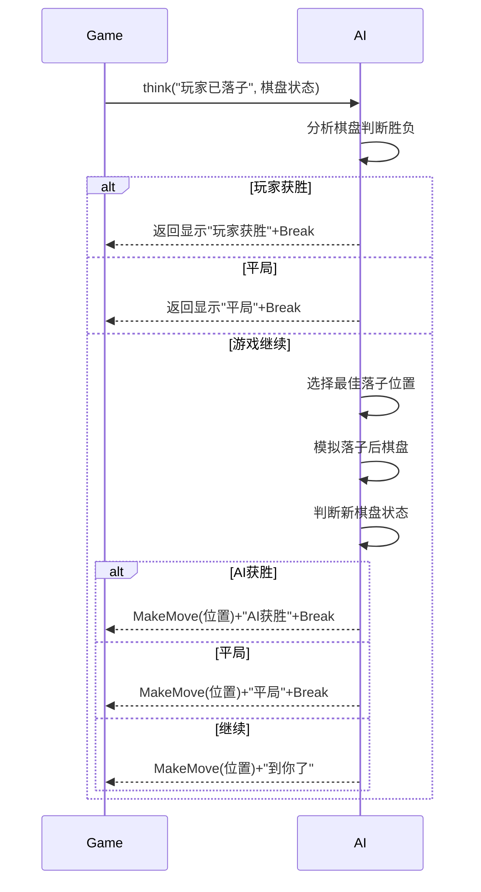

# AI 交互（AI Interaction）

AI 交互是 XBuilder 中允许游戏在运行时与 AI 进行通信的功能。通过这一功能，用户可以在游戏中创建智能对抗（如棋牌类游戏的人机对战）、智能对话、动态内容生成、自适应游戏体验等丰富的交互场景。

AI 交互功能专为学习编程的 10 岁左右的儿童设计，提供了极简的 API，使他们能够轻松地将 AI 能力集成到自己的游戏中，而无需理解复杂的网络请求、错误处理或 AI 模型细节。

## 基本概念

### AI 交互（AI Interaction）

AI 交互是指游戏运行时与外部 AI 之间的通信过程。这种交互包括向 AI 发送消息以及接收和处理 AI 的回应。

AI 交互的基本流程是：

1. 游戏向 AI 发送消息（可能包含游戏状态等上下文信息）
2. AI 处理消息并生成回应
3. 游戏处理回应并反馈结果
4. AI 根据反馈决定后续动作

整个过程是迭代进行的，直到交互自然结束或被中断。

### AI 玩家（AI Player）

AI 玩家是游戏中与人类玩家互动的智能体，能够理解游戏情境并做出合理反应。每个 AI 玩家都是独立的交互实例，拥有自己的记忆和行为方式，彼此之间互不干扰。

AI 玩家的核心特征：

- 身份性：通过角色设定明确身份（如对手、老师等）。角色定义包含：
  - 身份描述：角色的基本身份，如“向导”、“对手”、“老师”等
  - 行为准则：角色应该如何行事，包括语气、态度和决策风格
  - 知识范围：角色应该了解或不了解的内容范围
  - 目标导向：角色在游戏中的主要目标或任务
- 交互性：能接收指令并给出智能回应
- 自主性：基于上下文自主决策
- 可定制：可自由定义行为和能力范围

示例：

```go
import "ai"

// 声明 Player 变量（零值即可使用）
var teacher ai.Player

// 设置 Player 所扮演的角色
teacher.setRole "数学老师", { "风格": "耐心", "难度": "初级", "科目": ["加法", "减法"] }
```

### AI 上下文（AI Context）

AI 上下文是帮助 AI 理解当前游戏状态、对话历史和环境信息的关键数据集合。良好的上下文能够使 AI 生成更加准确、相关的回应，提高游戏体验的智能性和连贯性。

AI 上下文分为两类：

- 自动附加的上下文：由系统自动收集并提供给 AI 的信息，如对话历史、基本游戏环境等，这些信息无需用户手动提供，系统会在每次 AI 交互时自动附加
- 用户提供的上下文：由开发者通过 API 显式提供的特定信息，如当前游戏状态、特殊规则等，系统会自动将这些信息转换为 AI 可理解的格式，使 AI 能够根据当前情境生成更加智能的回应

特别地，系统会在初始化时自动分析游戏源码，并从玩家视角生成一份游戏世界的描述性总结。这份总结会作为背景知识被附加到 AI 上下文中，使 AI 能够理解游戏的基本设计和玩家可能的互动方式。这样，AI 就可以基于对游戏世界的理解，生成更符合游戏逻辑和玩家体验的智能回应。

AI 上下文通常包含以下几种类型的信息：

- 游戏状态信息：如游戏分数、收集的物品、已完成的任务等
- 对话历史：之前与 AI 的交互记录，帮助 AI 理解对话的连续性
- 环境信息：游戏世界的规则、可用资源、时间限制等
- 用户信息：如用户的游戏风格、学习进度、困难点等

良好的 AI 上下文设计原则：

- 相关性：仅提供与当前任务或对话相关的信息
- 简洁性：避免冗余信息，保持上下文数据结构清晰
- 时效性：及时更新上下文，确保 AI 获得最新的游戏状态
- 可理解性：以 AI 易于处理的方式组织信息

示例：

```go
var npc ai.Player
npc.think "下一步该怎么走？", { "位置": [10, 20], "生命值": 80, "装备": ["剑", "盾"] }
```

### AI 指令（AI Command）

AI 指令是游戏预先注册的、允许 AI 调用的函数。通过指令机制，AI 可以执行游戏中的特定操作，如移动精灵、播放声音、改变游戏状态等。

每个 AI 指令包含以下要素：

- 指令定义：通过结构体类型定义，包含：
  - 指令名称：即结构体类型名
  - 指令描述：可通过实现结构体方法来提供指令的完整描述，未实现时系统会自动生成默认描述
  - 参数定义：可通过添加结构体字段来定义指令所需的参数及其类型
  - 参数描述：可通过设置字段标签来描述参数的用途，未添加时系统会自动生成默认描述
- 指令实现：具体的执行函数逻辑，接收指令定义结构体作为参数并执行相应操作

良好的 AI 指令设计原则：

- 语义清晰：指令名称和参数应能清楚表达其功能，即使不通过指令或参数描述也能被理解
- 参数简洁：避免过多参数，保持指令易用性

示例：

```go
type AttackThePlayer struct {
    Strokes int
}

var enemy ai.Player
enemy.onCmd AttackThePlayer, (cmd) => {
    // 执行攻击逻辑
}
```

### AI 消息（AI Message）

AI 消息是游戏发送给 AI 的文本内容，可以包含问题、指令或其他信息。AI 会根据消息内容生成回应。

AI 消息可以附带额外的上下文信息，帮助 AI 更好地理解游戏当前状态。

示例：

```go
var guide ai.Player
guide.think "最近的宝藏在哪里？", { "当前位置": [35, 42], "已探索区域": ["东", "南"] }
```

### AI 回应（AI Response）

AI 回应是 AI 对游戏发送的消息的处理结果。每次回应包含：

- 文本回应：AI 生成的文本内容，通常无需处理，可用作调试信息
- 单条 AI 指令：AI 决定调用的单条 AI 指令，由系统自动执行

系统执行指令后会将结果反馈给 AI，由其决定后续动作。指令执行可能产生以下结果：

- 成功：指令被正确执行，游戏状态按预期改变，AI 可继续后续操作
- 失败：指令因参数无效或游戏状态不允许而失败，附带的错误信息会帮助 AI 调整策略
- 中断：指令主动要求终止当前交互流程

只有当 AI 指令合法且被成功执行时，该 AI 回应才被视为有效。

示例：

```go
type Help struct {
    Topic    string `desc:"需要帮助的主题"`
    Priority int    `desc:"优先级，取值范围：1-5"`
}

var helper ai.Player
helper.onCmd Help, (cmd) => {
    // 执行帮助逻辑
}

helper.think "我需要帮助" // 会自动执行 AI 回应的指令
```

## API 设计

所有 AI 交互功能通过 `ai` 包下的 `Player` 结构体的方法提供。

### setRole

`setRole` 是一个“命令”类 API，用于设置 AI 在交互过程中应该扮演的角色。通过定义明确的角色，可以使 AI 的回应更加一致、更符合游戏场景，并避免在每次 `think` 调用中重复角色描述。

```go
Player.setRole role
Player.setRole role, additionalContext
```

参数说明：

- `role`：`string` 类型，描述 AI 应该扮演的角色，如“向导”、“对手”、“老师”等
- `additionalContext`：可选参数，`map[string]any` 类型，提供关于角色的额外上下文信息

为了便于使用，`setRole` 可以在游戏的任何时刻调用，以改变 AI 的角色设定。一旦设置，该角色将持续生效，直到被新的角色设定替换。

示例：

```go
var guide ai.Player
guide.setRole "向导", { "风格": "友好", "知识范围": "游戏规则" }
```

### onCmd

`onCmd` 是一个“事件”类 API，用于注册可被 AI 调用的指令。用户可以通过它预定义游戏中可被 AI 执行的操作。

```go
Player.onCmd T, (command) => { return err }
```

参数说明：

- `T`：泛型，表示具体的 AI 指令结构体类型
- `(command) => { return err }`：函数类型，表示 AI 指令具体逻辑的实现
  - 其 `T` 类型的入参 `command` 包含 AI 在调用该指令时所设置的所有参数值
  - 其 `error` 类型的返回值 `err` 用于向 AI 反馈该指令的执行结果
    - `nil`：指令执行成功，AI 继续后续操作
    - `ai.Break`：中断交互
    - 其他：错误信息会作为上下文反馈给 AI，由其决定调整策略

指令结构体 `T` 具有以下特征：

- 参数定义：结构体中的导出字段（首字母大写）将自动作为 AI 可配置参数，支持 `string`、`int`、`float64`、`bool` 等基础类型及其切片
- 参数描述：可以为每个字段添加 `desc` 标签说明参数用途，例如 `desc: "移动方向"`，这些描述将帮助 AI 正确理解和使用参数；未添加时系统会自动生成默认描述
- 指令描述：可以实现 `Desc() string` 方法提供指令的完整描述，包括功能、使用场景等；未实现时系统会自动生成默认描述

示例：

```go
type Move struct {
    Direction string `desc:"移动方向，可选值：up, down, left, right"`
    Steps     int    `desc:"移动步数"`
}

var npc ai.Player
npc.onCmd Move, (cmd) => {
    // 执行移动逻辑
}
```

### think

`think` 是一个“命令”类 API，用于向 AI 发送消息并选择性提供额外的上下文信息以获取回应。系统会自动处理 AI 的回应，包括执行 AI 决定调用的指令。

```go
Player.think msg
Player.think msg, additionalContext
```

参数说明：

- `msg`：`string` 类型，向 AI 发送的消息内容
- `additionalContext`：可选参数，`map[string]any` 类型，提供给 AI 的额外上下文信息

为了便于使用，`think` 采用阻塞式设计，且不返回任何值。如果请求过程中发生错误，系统会自动重试若干次。如果多次尝试仍未成功，将触发通过 `onErr` 注册的错误处理函数。如果未注册，则使用默认的错误处理方式。

示例：

```go
var enemy ai.Player
enemy.think "攻击玩家", { "玩家血量": 80, "距离": 5 }
```

### onErr

`onErr` 是一个“事件”类 API，用于注册当 AI 交互失败时的错误处理逻辑。通过定义错误处理函数，可以在网络请求失败或 AI 回应无效等错误发生时，向用户展示友好的提示信息。

```go
Player.onErr => {}
Player.onErr (err) => {}
```

参数说明：

- `(err) => {}`：函数类型，表示具体的错误处理函数，其 `error` 类型可选参数 `err` 表示具体的错误，通常用于调试，可通过调用 `err.Error` 获得对应的字符串描述

示例：

```go
var helper ai.Player
helper.onErr (err) => {
    say "AI 助手出错"
    printf "ai error: %v", err // 打印日志到控制台，用于调试
}
```

## 完整示例

以下是一个三子棋游戏 AI 对手的完整示例：

```go
/*

假设已有 3x3 的二维数组变量 board 表示棋盘状态，其初始值为：

    [][]string{
        {"", "", ""},
        {"", "", ""},
        {"", "", ""},
    }

并且有一个函数 updateBoard(row, col, piece) 用于更新棋盘状态。

*/

// 定义 AI 对手落子指令
type MakeMove struct {
    Row    int    `desc:"行位置：-1（无需落子）、0、1、2"`
    Col    int    `desc:"列位置：-1（无需落子）、0、1、2"`
    Result string `desc:"游戏结果：未设置（继续）、X（玩家胜）、O（AI 胜）、TIE（平局）"`
}

var (
    // 声明 AI 对手
    opponent ai.Player
)

// 注册 AI 对手落子指令
opponent.onCmd MakeMove, (cmd) => {
    if cmd.Row != -1 && cmd.Col != -1 {
        // 检查落子位置是否有效
        if cmd.Row < 0 || cmd.Row > 2 || cmd.Col < 0 || cmd.Col > 2 || board[cmd.Row][cmd.Col] != "" {
            return errorf("无效的落子位置，请重新选择，棋盘状态：%v", board)
        }

        // 更新棋盘逻辑
        updateBoard(cmd.Row, cmd.Col, "O")
    }

    // 检查游戏是否结束
    if cmd.Result == "" {
        say "到你了"
    } else if cmd.Result == "TIE" {
        say "游戏结束，平局"
    } else {
        say "游戏结束，" + cmd.Result + "获胜"
    }
    return ai.Break
}

// 注册错误处理
opponent.onErr (err) => {
    say "我认输了"
    printf "AI 错误: %v", err
}

onStart => {
    // 设置 AI 对手角色
    opponent.setRole "三子棋对手", {
        "规则": "标准三子棋规则",
        "执子": "O",
        "难度": "中等",
        "风格": "进攻型",
    }
}

onMsg "玩家落子", => {
    // 请求 AI 对手落子
    opponent.think "玩家已落子，到你了", { "棋盘状态": board }
}
```

以下是 AI 处理三子棋游戏的内部逻辑流程：


