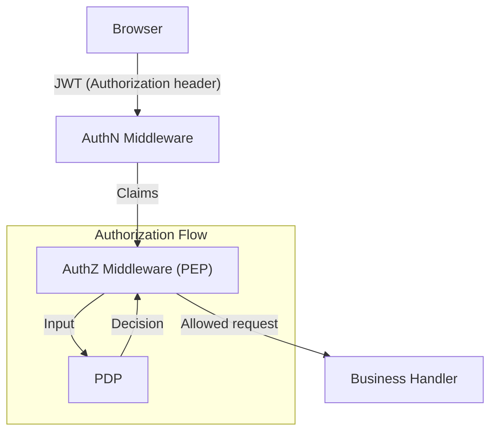

# XBuilder Authorization System

XBuilder Authorization System is a centralized permission management solution designed to unify control over different user roles' access to platform features. This system ensures precise frontend UI visibility control and secure backend interface protection through frontend-backend collaboration, while supporting differentiated feature experiences and resource quota management based on subscription-like plans.

The authorization system is built on JWT authentication mechanisms and implements versioned permission control management through an embedded Policy Decision Point (PDP), ensuring permission control logic is deployed and maintained centrally alongside business code.

## Background and Objectives

Current Issues:

  - Feature control for different plans/roles relies on frontend hardcoded visibility, which is error-prone and difficult to maintain
  - Certain resource-intensive features (such as LLM calls) lack quota mechanisms, unable to prevent abuse or estimate resource costs
  - Backend lacks unified authorization mechanisms
  - Permission logic is scattered, cannot be centrally managed or version-controlled

Objectives:

  - Frontend provides precise feature visibility based on backend-delivered capability tables
  - Backend centralized authorization to prevent privilege escalation
  - Authorization policies versioned and deployed together with business code
  - Authorization chain latency negligible or minimized
  - Minimize operational costs

## Key Users and Roles

| Role | Permission Overview |
| - | - |
| Asset Library Admin | CRUD asset library |
| Plus Subscription User | Access to premium LLM (e.g., `anthropic/claude-sonnet-4`); quota 1000 |
| Free User | Basic LLM only (e.g., `deepseek/deepseek-chat-v3-0324`); quota 100 |

## Feature Scope

1. Frontend Visibility: Control buttons, menus, and route entries based on the `capabilities` field returned by the backend.
2. Premium LLM Access Control: Backend calls embedded PDP through middleware to select appropriate models for requests and write results to `ctx`, with business layer consuming fields only.
3. Asset Library Management Permissions: Only `assetAdmin` role can write.
4. Quota and Credit Display: Capability table includes `copilotMessageQuota` and `copilotMessageQuotaLeft` fields, frontend displays remaining credits.
5. User Information Endpoint: `GET /user` returns personal information + nested `capabilities` field.

## User Experience and Acceptance Criteria

| User Story | Acceptance Criteria |
| - | - |
| As an asset library admin, I can upload/delete assets | Upload API returns 200; non-admins get 403; frontend shows corresponding function buttons only to admins |
| As a Plus user, I can use premium models | When requesting `POST /copilot/message`, backend automatically selects `anthropic/claude-sonnet-4` for processing; Free users on the same path get `deepseek/deepseek-chat-v3-0324` automatically selected by backend |
| As a Free user, clicking upgrade prompt redirects to subscription page | Unauthorized buttons are hidden, or clicking results in 403 with upgrade prompt |

## Authentication and Authorization Flow



- AuthN Middleware: Validates JWT; parses `claims` and stores them in `ctx`.
- AuthZ Middleware (PEP): Calls embedded PDP based on `claims` and request context to make authorization decisions; returns 403 if unauthorized; otherwise writes decision results to `ctx` and continues.

## PDP Design and Implementation

PDP is the core component in the authorization chain, responsible for determining whether access is allowed based on permission attributes and request context, and returning additional authorization data when needed (such as available models, remaining quotas, etc.). In this system, PDP has the following characteristics:

- Embedded Implementation: PDP runs in the same process as the business backend, requiring no additional network calls, with negligible latency.
- Code-based Policies: Authorization policies are implemented in maintainable code form and unified in the `pdp` package, version-managed with business code, with release processes synchronized with business code.
- Easy to Replace: If third-party policy engines need to be introduced in the future, only the PDP implementation layer needs to be replaced, keeping the interface unchanged.

## Permission Attribute Management

### Source and Management Method

- `roles`: Configured centrally by administrators through Casdoor's user tag functionality. Not visible to regular users and cannot be self-modified.
- `plan`: Since no formal payment system has been integrated yet, it is still manually set by administrators through Casdoor's user tag functionality. Users needing plan changes can submit applications through [User Feedback Channels], and backend administrators decide whether to make changes after review.

### Future Evolution Direction

- Decoupling from Casdoor: Current permission attribute management relies on Casdoor's user tag functionality. When replacing IdP in the future, a permission attribute injection mechanism compatible with new systems will be designed while maintaining existing policy structures unchanged.
- Integration with Formal Billing System: After integration, the `plan` field will be automatically set and updated by the payment system, with backend synchronization only, requiring no manual intervention.

## Data Contract

### `GET /user` Response Example

```json
{
  "id": 1,
  "username": "john",
  "plan": "plus",
  "capabilities": {
    "canManageAssets": true,
    "canUsePremiumLLM": true,
    "copilotMessageQuota": 1000,
    "copilotMessageQuotaLeft": 789
  }
}
```

### Error Code Conventions

| Scenario | Code | Description |
| - | - | - |
| Missing/Invalid JWT | 401 (Unauthorized) | User did not provide or provided invalid JWT |
| Insufficient Permissions | 403 (Forbidden) | User is authenticated but authorization check failed, access denied |
| Quota Exhausted | 429 (Too Many Requests) | User permissions allow but request exceeds quota limits |

## Glossary

| Term | Meaning |
| - | - |
| IdP | Identity Provider |
| JWT | JSON Web Token |
| AuthN | Authentication |
| AuthZ | Authorization |
| PEP | Policy Enforcement Point |
| PDP | Policy Decision Point |
| Capabilities | Capability Table |
