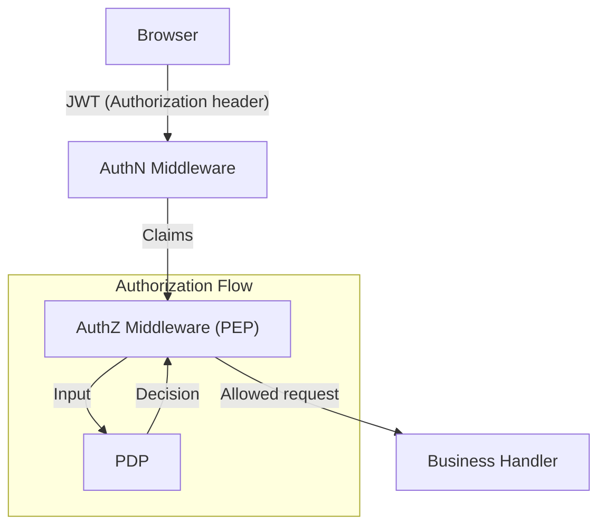

# XBuilder 授权系统

XBuilder 授权系统是一个集中化的权限管理解决方案，旨在统一控制不同用户角色对平台功能的访问权限。该系统通过前后端协同的方式，既确保了前端用户界面的精准显隐，又保障了后端接口的安全防护，同时支持基于类似订阅套餐的差异化功能体验和资源配额管理。

授权系统基于 JWT 身份验证机制，并通过内置的策略决策点（PDP），实现权限控制的版本化管理，确保权限控制逻辑与业务代码同步部署、集中维护。

## 背景与目标

现状问题：

  - 不同套餐/角色的功能控制靠前端硬编码显隐，易错、难维护
  - 某些资源密集型功能（如 LLM 调用）缺乏配额机制，无法限制滥用或预估资源成本
  - 后端缺乏统一的授权机制
  - 权限逻辑分散，无法集中管理或版本控制

目标：

  - 前端依据后端下发的能力表精准显隐功能
  - 后端集中化授权，防止越权
  - 授权策略与业务代码一起版本化、一起部署
  - 授权链路延迟可忽略不计或最小化
  - 运维成本最小化

## 关键用户与角色

| 角色 | 权限概览 |
| - | - |
| 素材库管理员 | CRUD 素材库 |
| Plus 订阅用户 | 访问高级 LLM（如 `anthropic/claude-sonnet-4`）；配额 1000 |
| Free 用户 | 仅基础 LLM（如 `deepseek/deepseek-chat-v3-0324`）；配额 100 |

## 功能范围

1. 前端显隐：依据后端返回的 `capabilities` 字段控制按钮、菜单、路由入口。
2. 高级 LLM 访问控制：后端通过中间件调用内置 PDP，为请求选择合适的模型并将结果写入 `ctx`，业务层只消费字段。
3. 素材库管理权限：仅 `assetAdmin` 角色可写。
4. 配额与额度展示：能力表包含 `copilotMessageQuota` 和 `copilotMessageQuotaLeft` 字段，前端展示剩余额度。
5. 用户信息端点：`GET /user` 返回个人信息 + `capabilities` 嵌套字段。

## 用户体验与验收标准

| 用户故事 | 验收条件 |
| - | - |
| 作为素材库管理员，我能上传/删除素材 | 上传接口 200；非管理员 403；前端仅管理员看到对应功能按钮 |
| 作为 Plus 用户，我能使用高级模型 | 请求 `POST /copilot/message` 时，后端自动选用 `anthropic/claude-sonnet-4` 处理；Free 用户同一路径下由后端自动选用 `deepseek/deepseek-chat-v3-0324` |
| 作为 Free 用户，我点击升级提示跳转订阅页 | 无权限按钮被隐藏，或点击后收到 403 并提示升级 |

## 认证授权流程



- AuthN Middleware：验证 JWT；解析 `claims` 并存入 `ctx`。
- AuthZ Middleware（PEP）：根据 `claims` 与请求上下文调用内置 PDP 作出授权决定；若未授权则返回 403；否则将决策结果写入 `ctx` 并继续。

## PDP 设计与实现

PDP 是授权链路中的核心组件，负责根据权限属性与请求上下文得出是否允许访问的结论，并在需要时返回额外的授权数据（如可用模型、剩余额度等）。在本系统中，PDP 具备以下特征：

- 内嵌实现：PDP 与业务后端同进程运行，无需额外网络调用，延迟可忽略不计。
- 代码化策略：授权策略以可维护的代码形式实现并统一存放于 `pdp` 包，随业务代码版本化管理，发布流程与业务代码同步。
- 易于替换：如未来需要引入第三方策略引擎，只需替换 PDP 实现层，保持接口不变。

## 权限属性管理

### 来源与管理方式

- `roles`：通过 Casdoor 的用户标签功能由管理人员统一配置。普通用户不可见，不可自助修改。
- `plan`：由于尚未接入正式的付费系统，仍由管理人员通过 Casdoor 的用户标签功能手动设定。用户如需变更套餐，可通过【用户反馈渠道】提交申请，后台管理员审核后决定是否变更。

### 后续演进方向

- 与 Casdoor 解耦：当前权限属性管理依赖 Casdoor 提供的用户标签功能。未来如替换 IdP，会设计兼容新系统的权限属性注入机制，并维持现有策略结构不变。
- 接入正式计费系统：接入后，`plan` 字段将由付费系统自动设置与更新，后端同步即可，无需人工介入。

## 数据契约

### `GET /user` 响应示例

```json
{
  "id": 1,
  "username": "john",
  "plan": "plus",
  "capabilities": {
    "canManageAssets": true,
    "canUsePremiumLLM": true,
    "copilotMessageQuota": 1000,
    "copilotMessageQuotaLeft": 789
  }
}
```

### 错误码约定

| 场景 | 代码 | 说明 |
| - | - | - |
| 缺少/无效 JWT | 401 (Unauthorized) | 用户未提供或提供了无效的 JWT |
| 权限不足 | 403 (Forbidden) | 用户已认证，但授权判断失败，访问被拒绝 |
| 配额耗尽 | 429 (Too Many Requests) | 用户权限允许但请求超过配额限制 |

## 术语表

| 术语 | 含义 |
| - | - |
| IdP | Identity Provider（身份提供方） |
| JWT | JSON Web Token |
| AuthN | Authentication（身份验证） |
| AuthZ | Authorization（授权） |
| PEP | Policy Enforcement Point（执行点） |
| PDP | Policy Decision Point（决策点） |
| Capabilities | 能力表 |
