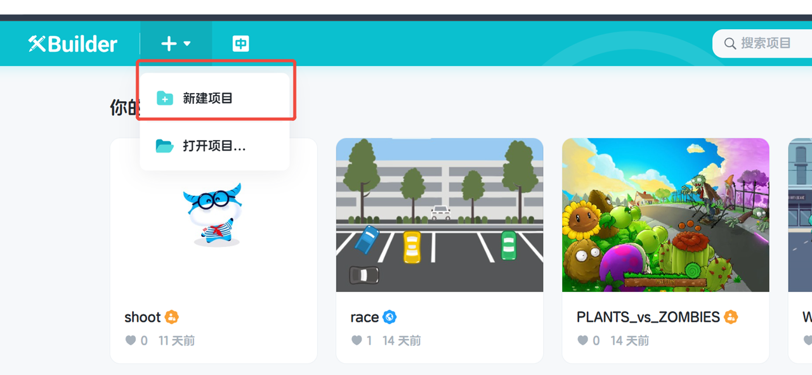
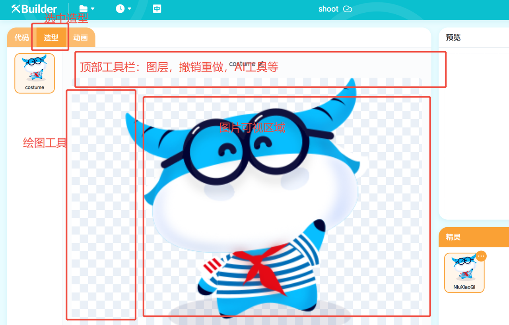
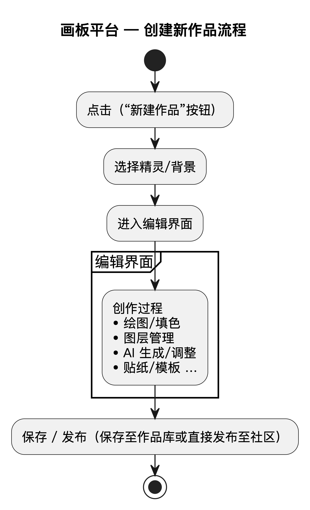
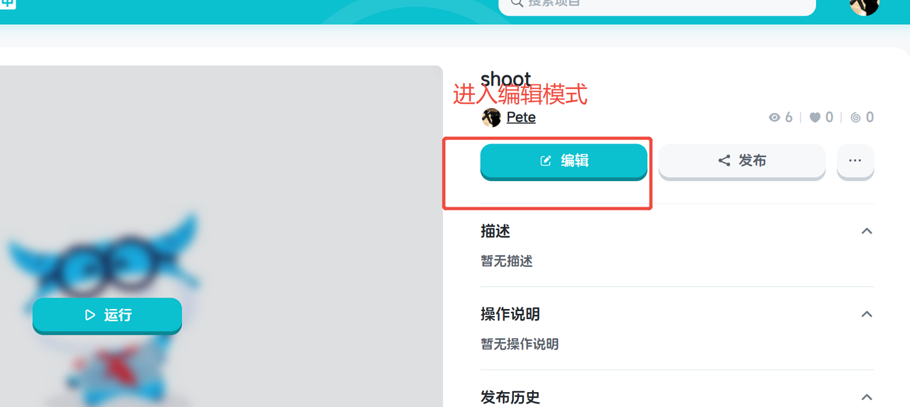
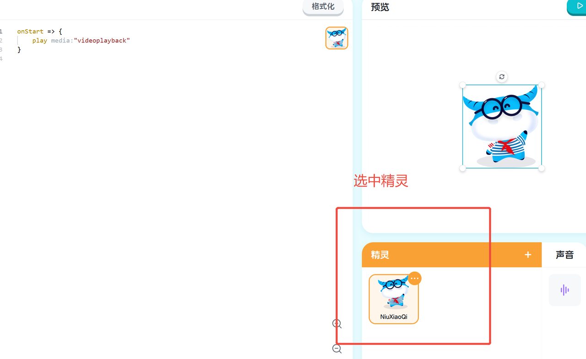
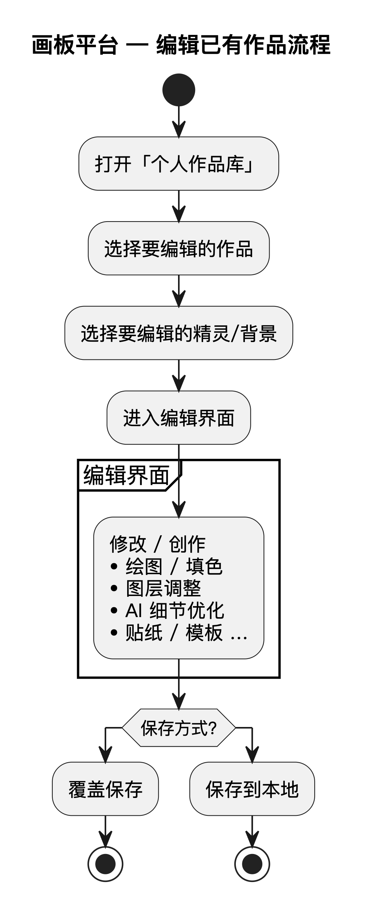
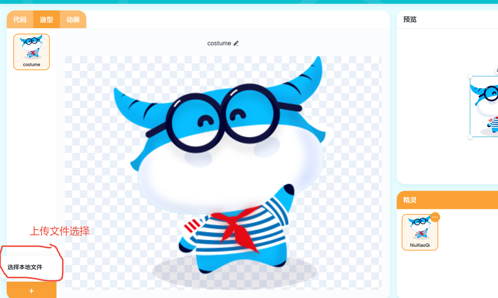
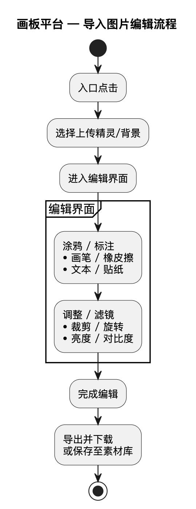
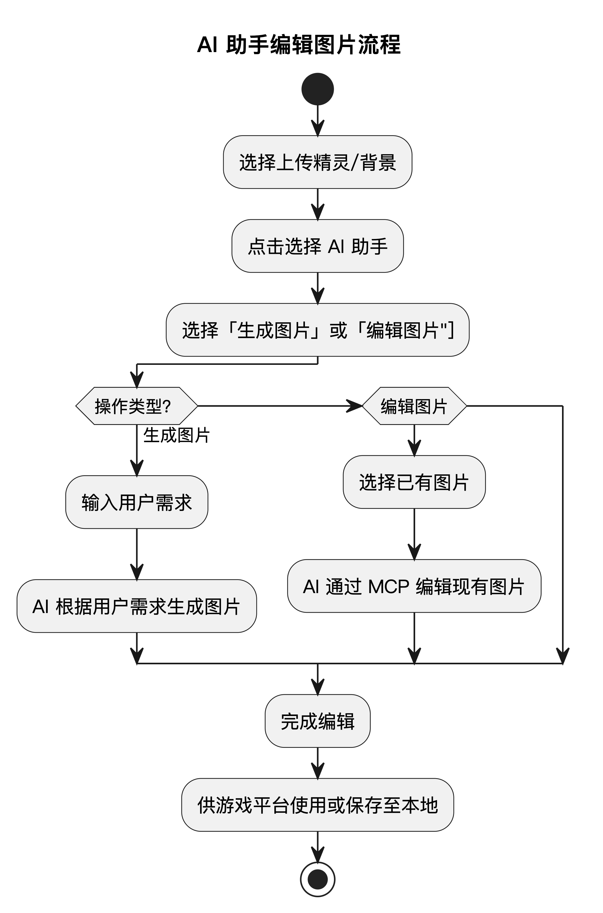

# 1. 产品概述与背景

## 1.1 项目背景
* 当前平台概述：Xbuilder 是一个开源的、面向青少年的在线游戏编辑平台。
* 用户痛点与机遇：
  * 大量用户反映需要在线编辑上传的图片，或者在线从零绘制他们的精灵或背景。这一功能是 Scratch 创建和编辑精灵/背景的核心，可大幅简化游戏制作流程，让用户更多时间停留在 Xbuilder 平台，而不是切换到 PS 等图片设计软件。画板平台还可以接入 AI Agent，从而创造新的增值服务。

## 1.2 产品简介
* 功能定义：画板平台是一个可接入 AI Agent 作画的在线图形绘制/编辑平台。
* 核心价值：
  * 为用户提供无需离开平台的便捷创作工具
  * 丰富平台 UGC（用户生成内容）生态
  * 增强玩家间的互动和个性化表达，接入 AI Agent 体系

## 1.3 市场与竞品基准
* Scratch 已吸引超过 1.3 亿青少年用户，每月有约 140 万人发布新作品，展现出极高的用户参与度。
* Canva 作为主流的在线图形设计平台，拥有 2.2 亿活跃用户，其“浏览器创作 + 模板/智能推荐”模式已被市场广泛验证，用户粘性强。
* 据预测，到 2025 年，全球在线游戏和创作相关市场的规模将达到 2,253 亿美元，年均增长率为 9.5%。这也体现了集成画板功能和生成式内容在产品中的商业价值和发展空间。

# 2. 产品目标
* 用户目标
  * 降门槛：3 步内完成角色/场景绘制，零 PS 基础也能上手
  * 易保存：一键同步到作品库并发布
* 业务目标
     * 提升用户活跃度
     * 延长用户在线时长
     * 增加付费转化率（AI 增值工具）

# 3. 用户分析

## 3.1 目标用户画像
1. 休闲创作者
   * 特征描述：喜欢个性化装扮，但绘画基础较弱，希望通过简单的工具进行创作。
   * 需求与动机：追求趣味性、易用性，希望有模板、AI 助手或贴纸辅助创作。
2. 核心玩家/创作者
   * 特征描述：对游戏有深度理解，有一定绘画或设计能力，希望创作更精美、更具个人特色的内容。
   * 需求与动机：需要相对专业的工具集（如多图层、调色板、多种笔刷），追求创作自由度和深度；或通过 AI Agent 精确调整图形。
3. 青少年儿童开发者
   * 特征描述：不熟悉复杂图形制作，也不会使用专业图形软件（如 PS）。
   * 需求与动机：可以用预设图案简单创作游戏角色，或使用 AI 工具生成游戏角色。

## 3.2 用户故事
* 作为一名休闲创作者，我希望能使用预设的贴纸和图案，来快速创作我的游戏角色/背景，让它看起来独一无二。
* 作为一名核心玩家，我希望能使用图层功能和变形功能，来分别绘制草稿和线稿，精确绘制角色的细节部位，方便我对作品进行修改和完善。
* 作为一名普通玩家，我希望能导入其他平台的图片，在上面进行涂鸦和标记，然后分享给我的朋友。

# 4. 功能范围与优先级

|    功能模块     |   优先级   |                             简要描述                             |       备注       |
|:-----------:|:-------:|:------------------------------------------------------------:|:--------------:|
|   核心画布功能    | P0 (最高) |                      提供基础的画布，支持设定尺寸、背景。                      | MVP（最小可行产品）必备。 |
|   基础绘图工具    | P0 (最高) |                        包含画笔、橡皮擦、填充工具。                        |    MVP 必备。     |
|    颜色选择器    | P0 (最高) |                       提供基本调色板和自定义颜色功能。                       |    MVP 必备。     |
|   图形变形功能    | P0 (最高) |                   拖动多边形的一条边，可将其变形成复杂曲线图形。                    |   满足进阶用户需求。    |
|    图层管理     | P0 (最高) |                   支持新建、删除、合并、调整图层顺序和不透明度。                    |   满足进阶用户需求。    |
| AI Agent 接入 | P0 (最高) | AI Agent 可理解用户输入，生成对应图片；  或通过 MCP 操作绘图工具，精确绘制和调整用户创作的图片。 |    MVP 必备。     |
|   形状与文本工具   | P0 (最高) |                    支持插入基本形状（直线、矩形、圆形）和文字。                    |    MVP 必备。     |
|   导入/导出功能   | P1 (次高) |                   支持导入本地图片、导出作品为 PNG/JPG。                    |     关键工作流。     |
|    滤镜与调整    | P2 (中等) |                     提供亮度、对比度、饱和度调整及常见滤镜。                     |   增强后期处理能力。    |
|   模板与素材库    | P2 (中等) |                     提供官方或社区的模板、贴纸、背景素材。                      | 降低创作门槛，提升趣味性。  |

# 5. 功能详细设计

## 5.1 用户流程图
* 创建新作品流程：
从入口点击 → 选择精灵/背景 → 进入编辑界面 → … → 完成编辑，供游戏平台使用或保存至本地

* 编辑已有作品流程：
从个人作品库 → 选择作品 → 选择要编辑的精灵/背景 → 进入编辑界面 → … → 完成编辑，供游戏平台使用或保存至本地

* 导入图片编辑流程：
从入口点击 → 选择上传精灵/背景 → … → 完成编辑，供游戏平台使用或保存至本地

* AI 助手编辑图片：
选择上传精灵/背景 → 点击选择 AI 助手 → 选择生成/编辑图片 → AI 根据用户需求生成/通过 MCP 编辑现有图片 → 完成编辑，供游戏平台使用或保存至本地

## 5.2 界面与交互设计

参考界面：

* 主编辑界面布局：
  * 顶部菜单栏：文件（新建、保存、导入、导出）、编辑（撤销、重做）、AI Agent（生成、修改图片）、图层选择、组合等
  * 左侧工具栏：画笔、变形、橡皮擦、选择、填充、形状、文本等工具的图标布局
  * 中央画布区：用户创作的核心区域

# 6. 非功能性需求
* 兼容性需求
   * 浏览器兼容：需兼容主流浏览器（Chrome、Safari、Edge）的最新版本
   * 设备兼容：优先保证 PC 端大屏体验，并考虑在平板设备上的基本可用性

# 7. 待定问题与风险
* 待定问题
  * 移动端是否需要做适配？
  * 对于大尺寸、多图层的复杂作品，如何处理性能瓶颈？
* 潜在风险
  * 用户创作的版权归属问题需要法务明确
  * 若功能滥用（如用于传播不良信息），可能带来社区管理风险