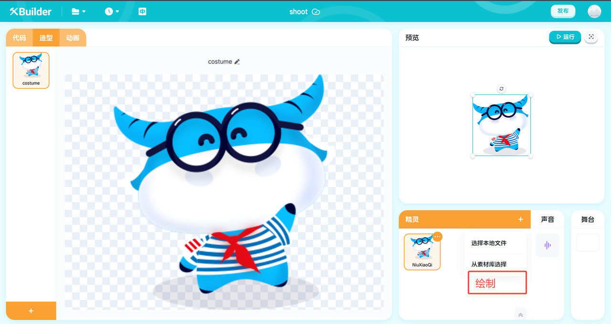
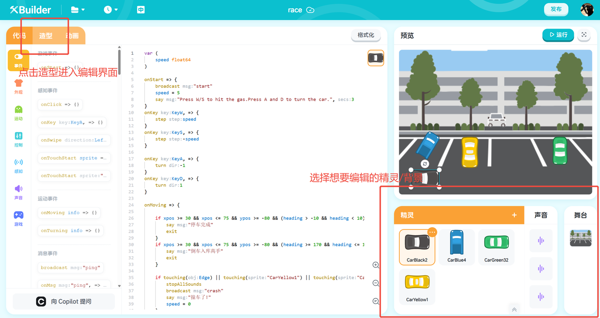
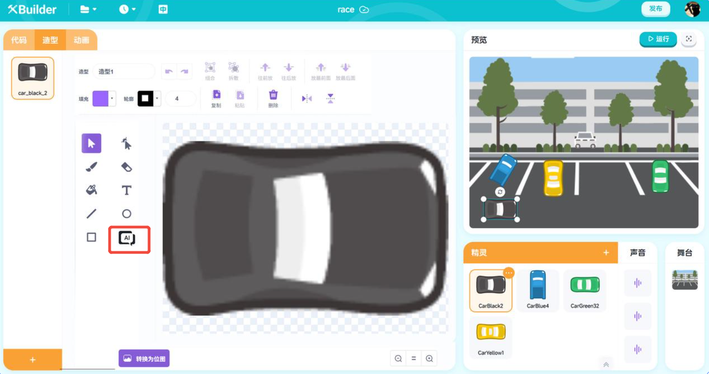
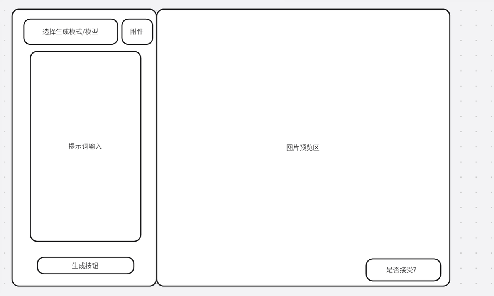

# 1. 产品概述与背景

## 1.1 项目背景
* 当前平台概述：XBuilder 是一个开源的、面向青少年的在线游戏编辑平台。
* 用户痛点与机遇：
  * 大量用户反映需要在线编辑上传的图片，或者在线从零绘制他们的精灵或者背景，这个功能是scratch创建编辑精灵/背景的核心功能，可以大幅简化游戏的制作，让用户更多时间留存于xbuilder平台，而不是PS等图片设计软件。画板平台还可以接入AI Agent，从而创造新的增值服务。

## 1.2 产品简介
* 功能定义：画板平台是一个可接入 AI Agent 作画的在线图形绘制/编辑平台。
* 核心价值：
  * 为用户提供无需离开平台的便捷创作工具
  * 丰富平台 UGC（用户生成内容）生态
  * 增强玩家间的互动和个性化表达，接入 AI Agent 体系

## 1.3 市场与竞品基准
1. 绘图领域
   - Scratch：在背景图，角色图的编辑上，Scratch实现了非常强大的绘画功能。不仅有基础的画笔，绘制，填色等功能，还实现了复杂的矢量图绘制，曲线变化等功能，可以快速绘制出游戏人物。但是，Scratch并没有集成AI助手功能。
   - CodeMonkey：CodeMonkey免费用户无法进行自由创作。
   - Canva：Canva是一个简单，强大的图形绘制程序。提供了非常复杂的图形绘制，产品设计，图层控制等功能。还提供了付费模板，素材库，AI生成等增值服务。但是其没有实现简单易用的矢量图绘制功能，无法简单绘制出美观的游戏角色。
2. AI生成图片领域

# 2. 产品目标
* 实现基础画板功能：包括画线，图形绘制，橡皮擦，填色,添加文字，拖拽位置等。
* 实现进阶画板功能：图形的精确控制，曲线和多边形变形；图层控制等。
* AI接入功能：包括了AI生成图片（文生图）；AI通过MCP，使用绘制工具精确修改图片等。

# 3. 用户分析

## 3.1 目标用户画像
1. 休闲创作者
   * 特征描述：喜欢个性化装扮，但绘画基础较弱，希望通过简单的工具进行创作。
   * 需求与动机：追求趣味性、易用性，希望有模板、AI 助手或贴纸辅助创作。
2. 核心玩家/创作者
   * 特征描述：对游戏有深度理解，有一定绘画或设计能力，希望创作更精美、更具个人特色的内容。
   * 需求与动机：需要相对专业的工具集（如多图层、调色板、多种笔刷），追求创作自由度和深度；或通过 AI Agent 精确调整图形。
3. 青少年儿童开发者
   * 特征描述：不熟悉复杂图形制作，也不会使用专业图形软件（如 PS）。
   * 需求与动机：可以用预设图案简单创作游戏角色，或使用 AI 工具生成游戏角色。

## 3.2 用户故事
* 作为一名休闲创作者，我希望能使用预设的贴纸和图案，来快速创作我的游戏角色/背景，让它看起来独一无二。
* 作为一名核心玩家，我希望能使用图层功能和变形功能，来分别绘制草稿和线稿，精确绘制角色的细节部位，方便我对作品进行修改和完善。
* 作为一名普通玩家，我希望能导入其他平台的图片，在上面进行涂鸦和标记，然后分享给我的朋友。

# 4. 功能详细设计

## 4.1 用户流程图
- 创建新的精灵/背景时自由绘制
1. 进入绘制页面

- 编辑精灵/背景图
1. 进入编辑界面

2. 进行修改
- 画板工具——AI助手
  点击AI助手按钮

- 弹出AI生成工具，AI可以生成位图或矢量图，用户可以自行选择生成位图或矢量图的模型。

- 用户可以在附件中选择本地上传/将当前绘制的内容作为附件，给AI作为基础进行创作。
  用户可以如果接受，图片会被应用到编辑区。如果不接受，则可以输入提示词重新生成。

## 4.2 界面与交互设计

参考界面：

* 主编辑界面布局：
  * 顶部菜单栏：文件（新建、保存、导入、导出）、编辑（撤销、重做）、AI Agent（生成、修改图片）、图层选择、组合等。
  * 左侧工具栏：画笔、变形、橡皮擦、选择、填充、形状、文本等工具的图标布局。
  * 中央画布区：用户创作的核心区域。

# 5. 非功能性需求
* 兼容性需求
   * 浏览器兼容：需兼容主流浏览器（Chrome、Safari、Edge）的最新版本
   * 设备兼容：优先保证 PC 端大屏体验，并考虑在平板设备上的基本可用性

# 6. 待定问题与风险
* 待定问题
  * 移动端是否需要做适配？
  * 对于大尺寸、多图层的复杂作品，如何处理性能瓶颈？
* 潜在风险
  * 用户创作的版权归属问题需要法务明确
  * 若功能滥用（如用于传播不良信息），可能带来社区管理风险