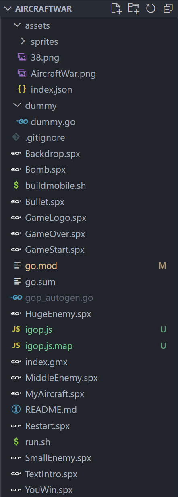
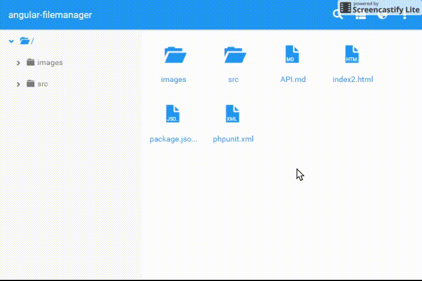
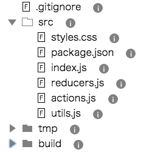

# Project runner

# spx research

## Github Address：[https://github.com/goplus/spx](https://github.com/goplus/spx)

## Startup problem in window10/11 environment

- spx cannot be compiled normally in window environment

  - After replacing the Go version with 1.18, it prompts that the C compilation environment is missing
    - download mingW（https://qzone.work/talks/656.html）
  - The mingw version is too new, causing startup errors
    - Currently available mingw versions->11.2.0
  - Prompt for lack of alc.h header file
    - Download OpenAL and configure environment variables [https://www.openal.org/downloads/](https://www.openal.org/downloads/)
    - No AL/alc.h
      > Manually create the AL folder and import the include directory in the openal directory into AL.
      >
    - ld.exe cannot find AL32
      > C:/ProgramData/mingw64/mingw64/bin/../lib/gcc/x86_64-w64-mingw32/13.2.0/../../../../x86_64-w64-mingw32/bin/ld.exe:  cannot find -lOpenAL32: No such file or directory collect2.exe: error: ld returned 1 exit statusd
      >

      - Revise alc_notandroid.go
- After completing the above configuration, execute gop run. The game can be compiled successfully, but the warning message still exists

> ./wrappers.h:22:16: warning: 'alcGetString' redeclared without dllimport attribute: previous dllimport ignored [-Wattributes]
> 22 | const ALCchar *alcGetString( ALCdevice *device, ALCenum param );
> |                ^~~~~~~~~~~~

# ispx project research

## Github Address：[https://github.com/goplus/ispx](https://github.com/goplus/ispx)

## Startup problem

- problem ：`go get [github.com/goplus/ispx](autolinkhttp://github.com/goplus/ispxautolink)` 、`go install github.com/goplus/ispx@latest` fail
- Solution: Download ispx source code, cd ispx, go install

## ispx compilation principle

- ispx uses igop to convert spx (classfile) into gop code, and then uses igop to run the gop code to realize the operation of spx

# Goplus playground research

## Github Address：[https://github.com/goplusjs/play](https://github.com/goplusjs/play)

## Startup problem

- Problem: Online playground cannot start normally
- Solution: Because I used other versions of goterjs when running other projects before, I can execute the build.sh script after replacing the version.

## Principle

The implementation principle of [https://jsplay.goplus.org/](https://jsplay.goplus.org/) is to run the igop interpreter on js (GoperJS compilation) or wasm (Go official compilation). When running the code, igop first compiles the Go+ code into Go code (compiled by github. com/goplus/gop/cl implementation), and then execute the Go code in interpreted mode (src -> ast -> types -> ssa -> reflect call). This process is actually similar to igop running on the local platform, except that igop itself is compiled into js/wasm and run on the web platform (because it runs on the web, you can call the syscall/js library to operate canvas)

# Wspx

Online compiler for spx projects based on ispx

- Difficulty: Implementation of file system objects
  - github file system object (implemented)
  - Receive from cloud server (to be implemented)
    - Refer to the key code of the file system object implemented by github and rewrite the three methods of FileSystem
  - User local files (default)
    - Problem: The local file system cannot be obtained in the wasm environment
    - Solution: TODO
  - localstorage on web side

# Research on front-end file browsers

## envision prototype

Various files defined by the project are received through the front end and stored in localstorage on the web side. When you click run, each file is read from localstorage and compiled and run.

## Survey of existing components

### angular-filemanager

**Github**** Address：**[https://github.com/joni2back/angular-filemanager](https://github.com/joni2back/angular-filemanager)

**Demo：**

analyze:

- Support file upload
- Multiple files support
- Directory tree navigation
- Search files
- Copy, move, rename (interactive user experience)
- Delete, edit, preview, download

### eact-sortable-tree-theme-file-explorer

**Github**** Address：**[https://github.com/frontend-collective/react-sortable-tree-theme-file-explorer](https://github.com/frontend-collective/react-sortable-tree-theme-file-explorer)

**Demo：**

# participants

ou_5f3689ae1b7c64b4fccefb439fd6bec4ou_6c67722a7531b1003e86b28943ee21a8
