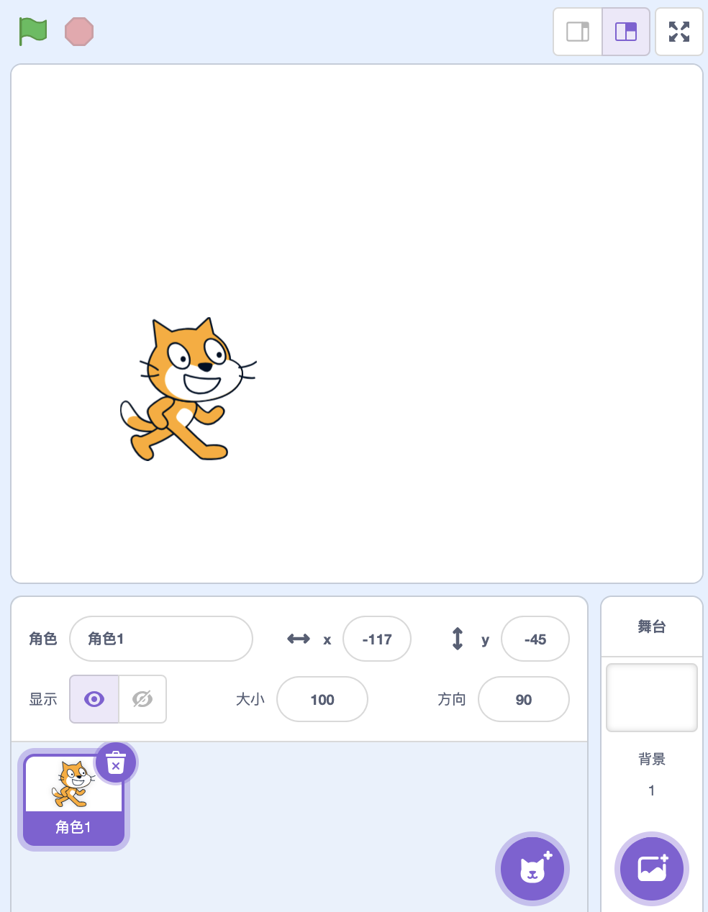
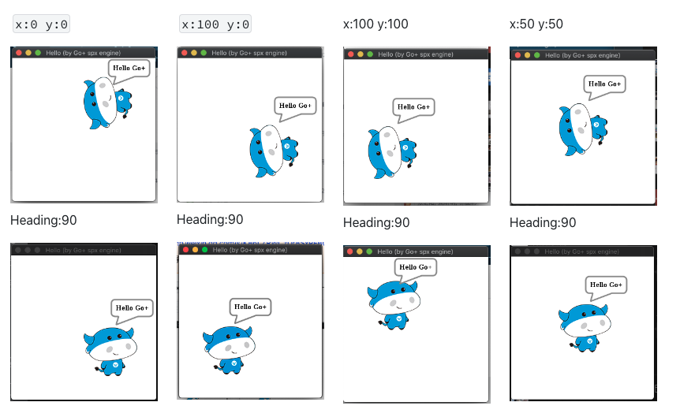
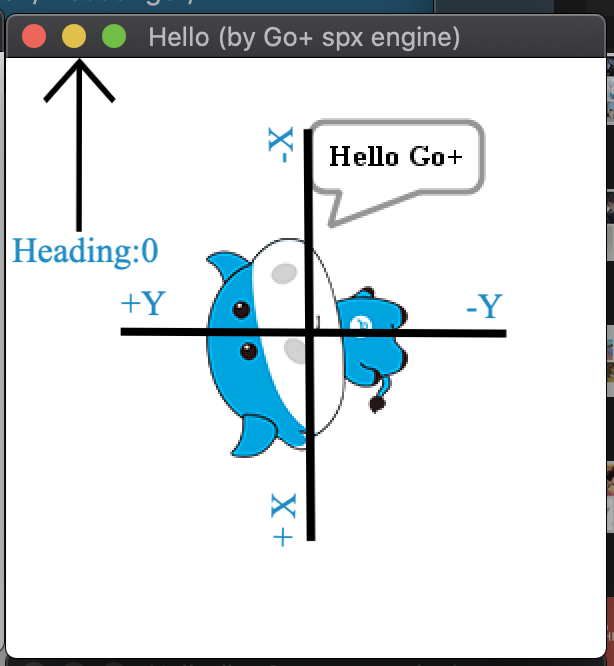
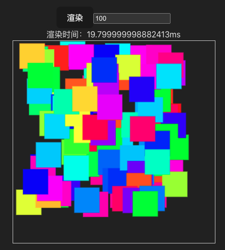

# 前端技术调研-sprite edit

## 竞品功能



## 概览

用户在对 sprite 编辑时，允许用户直接在预览区域可视化操作

|**模块**  |**功能名称** |**功能描述**                                                                         |
| --------------- | ------------------ | ------------------------------------------------------------------------------------------ |
| **Sprite Edit** | 编辑精灵           | - 重命名精灵- 缩放精灵大小- 旋转精灵- 复制精灵- 预设图形- 映射 SPX 配置文件- 拖拽/输入配置 |
| **Sprite IO**   | 导出精灵           | - 下载单个 sprite（配置文件）- 支持下载单张精灵图                                          |
|  **Sprite IO**   | 导入精灵           | - 导入精灵文件（配置文件）                                                                 |

## SPX 舞台及精灵配置

### 概念

#### 精灵坐标

精灵的中心点便是精灵的局部坐标。

> 在这个世界中会有精灵。有一个有意思的地方，精灵有一个相对于自己的坐标，叫做局部坐标。假设精灵自身的坐标为 (100,100)，如果位置为 (50,50)，那么就可以判定精灵的位置是居中的，也就是我们常说的旋转中心，在世界的位置坐标是（-100,-250)。 [孙其瑞：Go+ Spx 引擎坐标与绘制体系详解](https://mp.weixin.qq.com/s/K86LZRWCzDr8SxPFBQ0S_A?poc_token=HAgDlmWjO1vVX07kMZsDFIunCdScT1-p6auipVfk)

以下内容都基于 sprite/index.json 配置 ` x:0 y:0` 的情况测试，对其 custumes 的第一个造型进行学习



> 得出结论：每个精灵的文件的第一层配置为 x,y 为相对中心原点的坐标配置
> 而在 custumes 中配置单造型的 x 值为基于其 heading 方向做一根反方向的射线，单造型随着 X 的增加沿着反方向的射线的距离增加，y 轴则为从 sprite 做一个逆时针旋转 90 度的射线，单张 sprite 随着 y 越大在该轴上的距离也越大



### Stage

舞台的配置在 `/assets/index.json` 中

#### map `object`

对舞台的配置

##### width

画布的宽高

### Sprite

##### costumes `array`

###### costume `object`

####### name

造型名称

####### **path**

造型相对路径

####### x

造型相对精灵 x 位置

####### y

造型相对精灵 y 距离

## 基础库

|            | **fabric.js**                 | **konva.js**                                           | **react-draggable （scratch）** |
| ---------- | ----------------------------- | ------------------------------------------------------ | ------------------------------- |
| 基础       | 拖拽，缩放，旋转，xy 轴的限制 | 拖拽，缩放，旋转，xy 轴的限制                          | 拖拽                            |
| 事件       | 事件系统                      | 事件系统                                               | 只包含基础的事件                |
| 序列化     | 支持与 json，svg 的互相转换   |                                                        |                                 |
| 图形       | 基础图形                      | 基础图形                                               | 否                              |
| typescript | 不支持                        | 支持                                                   | 支持                            |
| 大小       | 308KB                         | 150KB                                                  | 50KB                            |
| 基础概念   |                               | `Stage`（舞台）`layers`（图层）`groups`（组） `shapes` |                                 |
| 图片缓存   |                               | 图片缓存                                               | 无                              |
| 分享       | 博客文档详细                  | 官方文档详细，博客分享较少                             | 官方文档详细                    |

## 测试方法

将两者抽离公用方法，同时渲染指定个数的随机颜色方块

[GitHub - luoliwoshang/canvas-library-performance: Compare the performance of fabricjs and konvajs](https://github.com/luoliwoshang/canvas-library-performance)

**测试逻辑**

```javascript
function render() {
  console.log(library.value)
  library.value.clear()
  const startTime = performance.now()

  for (let i = 0; i < blockNum.value; i++) {
    library.value.rect({
      top: Math.random() * 300,
      left: Math.random() * 300,
      width: 50,
      height: 50,
      fill: ` hsl(${Math.random() * 360}, 100%, 50%)` _// 填充随机颜色_
    }).forEach(_item_ => {
      library.value.add(_item_)
    })

  }
  library.value.draw();
  _// 渲染完成后计算渲染时间_
  const endTime = performance.now()
  renderTime.value = endTime - startTime
}
```

### fabric.js

```javascript
class FabricRenderer {
  _// 实例内容_
  fabricCanvas = null;
  constructor() {
    this.fabricCanvas = new fabric.Canvas("c")
  }
  clear() {
    this.fabricCanvas.clear()
  }
  add(..._args_) {
    this.fabricCanvas.add(..._args_)
  }
  rect({ _top_, _left_, _width_, _height_, _fill_ }) {
    return [new fabric.Rect({ top, left, width, height, fill })]
  }
  draw() {
  }
}
```

### Konvajs

1. 默认选项仅仅渲染图形，以及可配置拖拽功能，不包含基础旋转拖拽等功能
2. 对尺寸，旋转基础功能配置较多，中文文档更新较慢，目前 `stage.find` 已经调整为返回 array 但文档并未更新 [调整图形尺寸、旋转图形](http://konvajs-doc.bluehymn.com/docs/select_and_transform/Basic_demo.html)

```javascript
class KonvaRenderer {
konvaStage = null;
konvaLayer = null;
constructor() {
const stage = new Konva.Stage({
container: "canvas",
width: 400,
height: 400
})
const layer = new Konva.Layer();
stage.add(layer);
console.log(stage)
this.konvaLayer = layer

// 绑定图形点击事件,对transform进行配置_
stage.on('click tap', function (_e_) {
  console.log(_e_.target)
  _// console.log(stage.find('Transformer'))_
  if (_e_.target === stage) {
    stage.find('Transformer').forEach(_item_=>{
      _item_.destroy()
    })
    layer.draw();
    return;
  }
  if (!_e_.target.hasName('rect')) {
    return;
  }
  var tr = new Konva.Transformer();
  layer.add(tr);
  tr.attachTo(_e_.target);
  layer.draw();
});
this.konvaStage = stage


}
clear() {
console.log(this.konvaStage)
this.konvaLayer.destroyChildren()
}
add(..._args_) {
console.log("add")
this.konvaLayer.add(..._args_)
}
rect({ _top_, _left_, _width_, _height_, _fill_ }) {
return [new Konva.Rect({ x:_top_, y:_left_, width, height, fill,name:'rect',draggable:true})]
}
draw() {
console.log("draw",this.konvaLayer, this.konvaStage)
this.konvaLayer.draw()
}
}

```

## 测试

### 测试1:

在加载精灵图时，需要考虑其渲染速度，拖动/旋转/缩放时的速度，渲染指定个数的方块，查看其渲染时间及其帧数，及其操作性能

|  拖拽库/字段   |          100个方块/渲染/拖动/缩放/旋转           |          200个方块/渲染/拖动/缩放/旋转           |        500个方块/渲染/拖动/缩放/旋转         |
|----------------|--------------------------------------------------|--------------------------------------------------|----------------------------------------------|
| fabricjs 5.3.0 | 渲染:3~5.8ms拖动:59.3~59.9fps旋转58.7fps~59.9fps | 渲染:5.8~13ms拖动:57.5~58.7fps旋转:58.7～59.9fps | 渲染:15.8~19ms拖动:37.2~48fps旋转:48.0~52fps |
| konvajs        | 渲染:4.7~16ms拖动:58.9~59.9fps旋转:59.3~59.9fps  | 渲染:19~31ms拖动:58.9~59.9fps旋转:58.1~59.9fps   | 渲染41～93ms拖动:55~59.9fps旋转:55.3~59.9fps |




## TODO 精灵封装格式

```
