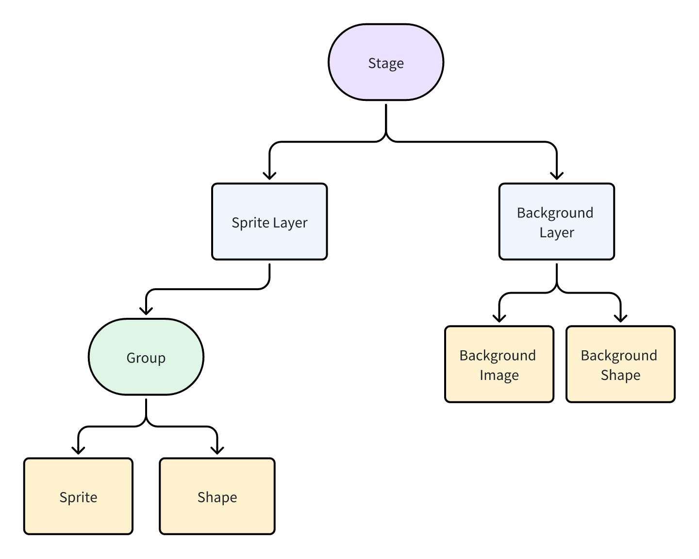
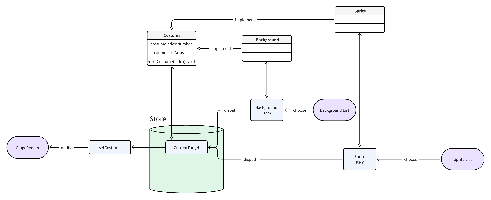

# Stage-Editor


## Feature List

| **Module** |  **Function** | **Description**               |
| -------------- | ------------------ | -------------------------------- |
| Stage    | Render wasm  | Render spx content compiled into wasm obtained from the backend |
|                | Render background content      | Render background toggle background|
|                |Rendering sprite| Rendering sprite|
|                | Full screen operation| Allow users to run wasm content on full screen|

### Stage render

Rendering is supported by canvas
1. When you click start, render the game / animation content provided by wasm to play and run
2. Click finish to switch to editable content

#### Option 1
Use two layers of canvas to draw the background and sprite separately

#### Option 2

Use the multi-layer concept that comes with konvajs to render the background and sprite respectively  

```javascript
<script>
        const stage = new Konva.Stage({
            container: 'container',
            width: window.innerWidth,
            height: window.innerHeight
        });

        const bg_layer = new Konva.Layer();
        stage.add(bg_layer);
        const imageObj = new Image();
        imageObj.onload = function () {
            const background = new Konva.Image({
                image: imageObj
            });

            bg_layer.add(background);
            bg_layer.draw();
        };

        imageObj.src = 'https://ts1.cn.mm.bing.net/th/id/R-C.55019df335721bf296a2aa14decf640d?rik=196S0D50ycT0ig&riu=http%3a%2f%2fpic3.nipic.com%2f20090701%2f1939028_155144097_2.jpg&ehk=1tdke6IVZ32tPnM8CDSfaY%2f6uVZJOPiyCYXZOZOXREY%3d&risl=&pid=ImgRaw&r=0';

        const sprite_layer = new Konva.Layer();
        stage.add(sprite_layer);
        const draggableImgObj = new Image();
        draggableImgObj.onload = function () {
            const draggableImage = new Konva.Image({
                image: draggableImgObj,
                draggable: true
            });

            sprite_layer.add(draggableImage);
            sprite_layer.draw();
        };
        draggableImgObj.src = 'https://ts1.cn.mm.bing.net/th/id/R-C.55019df335721bf296a2aa14decf640d?rik=196S0D50ycT0ig&riu=http%3a%2f%2fpic3.nipic.com%2f20090701%2f1939028_155144097_2.jpg&ehk=1tdke6IVZ32tPnM8CDSfaY%2f6uVZJOPiyCYXZOZOXREY%3d&risl=&pid=ImgRaw&r=0';
    </script>
```
## Steps
1. Get spirte (json,spx) and background (json,spx) from the global state  
## Process flow


## Object interface design [refer to scratch]
```javascript
class Sprite {
    costumeIndex=0
    costumes=[]
}
class Background extends Sprite {
    constructor() {
        super()
        this.costumes=[]
    }
}
class Role extends Sprite {
    constructor() {
        super()
        this.costumes=[]
    }
}
```