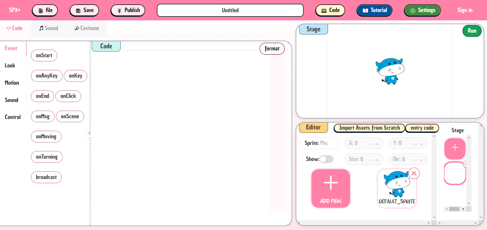
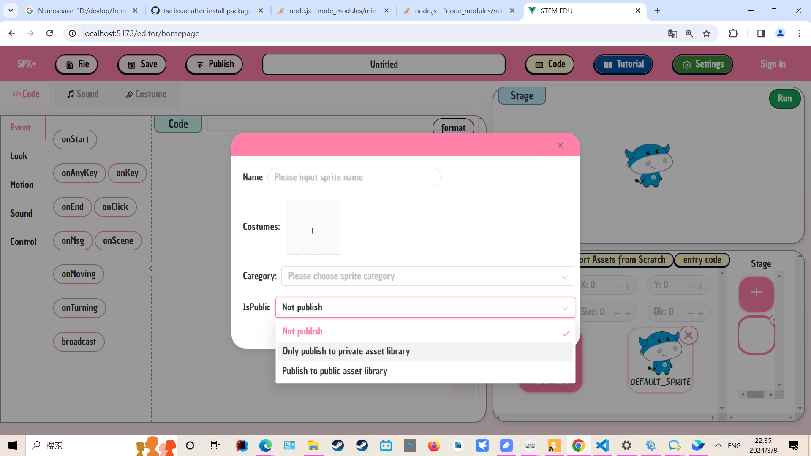
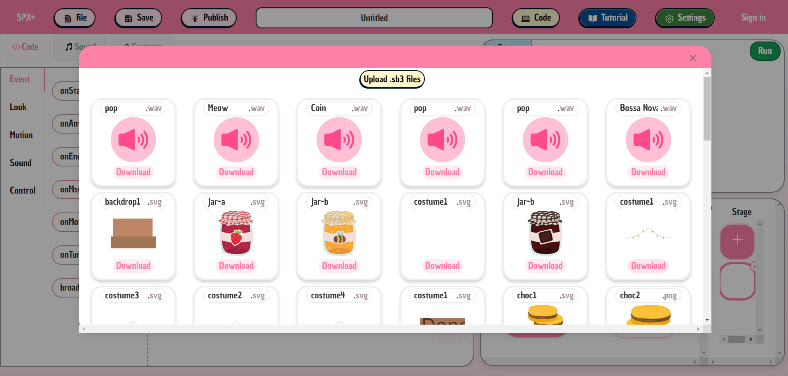
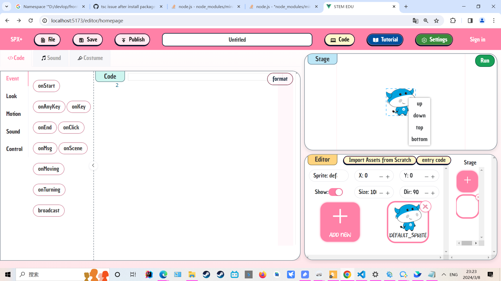
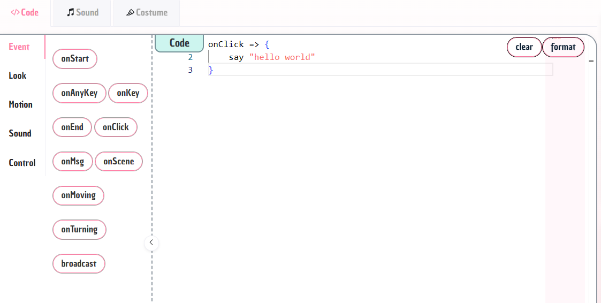
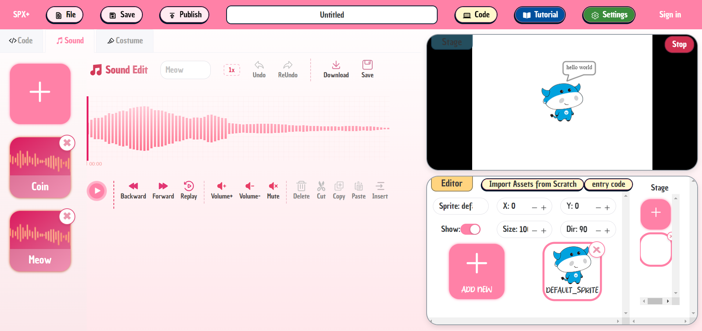
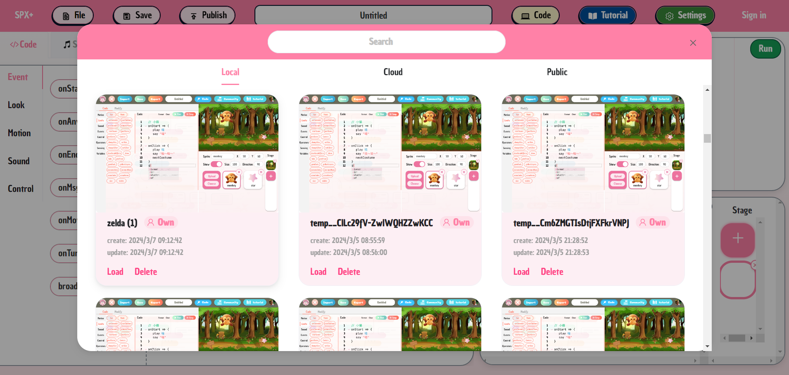

## Overview

In the spx editor, the top section is the toolbar, the left section is the code and audio editing area for the project, and the right section is the stage previewer along with the sprite and background editing area.

Upon entering the editor, you will see our default project, which consists of a blank backdrop and a small cow.

## Start

We can import new sprites by clicking the "ADD NEW" button in the sprite list.

We can choose to click the upload of the "ADD NEW" button , and name the sprite, and upload its costume image. We can also select the  category for the sprite and choose whether to upload it to the asset library. After clicking submit, the sprite will be imported into the current project.

Alternatively, we can import our sprites in another way. We can click the choose button of the "ADD NEW" button to select and import sprites from online public or private asset libraries.

TODO

Of course, we also have a way to import sprites. We can choose to import scratch files and select sound and sprites to import 。

After importing the sprite, you can see the sprite in our editor. We can click to select the sprite to see its corresponding properties. We can adjust its properties through the property editing bar above the sprite list, which can edit the sprite's coordinates, size, heading, and whether to display it. Users can directly drag and drop the sprite in the stage display area above to change its coordinates, or right-click the sprite to change its level. Users can also import backdrop using the same method.

At this point, we hope to edit the behavior of the sprite. After selecting the sprite, we can go to the editing area on the left. For example, we hope that after clicking on the sprite, the sprite will say "hello world". Then we can enter the  code in the code editor. The code editor is configured with syntax prompts, which can quickly input spx statements. Users can directly click on the toolbox on the side to quickly insert the corresponding spx code.And click "format" to format the code. If there is a format error, it will also prompt the user.

At this point, we hope to edit the voice of the user just now. Click the sound button to switch to the sound editing area, where you can preview, replay, edit volume, crop and replace audio, record audio and import to current project. We can switch to the code editing area and add the code `play Meow, true ` in the click event code to let the sprite play the sound after being clicked.

After we finish writing this logic, we can click the run button in the stage editing area and click on our sprite to see a dialog box above the sprite displaying hello world and playing the just imported sound to complete our first hello world project.

### Save

At this point, we can click the Save button in the upper left corner of the toolbar and choose to save to local or to the cloud

### Import

We can choose to upload a zip project locally, obtain historical projects locally, import previously saved projects from the cloud, or import projects publicly available by others.

