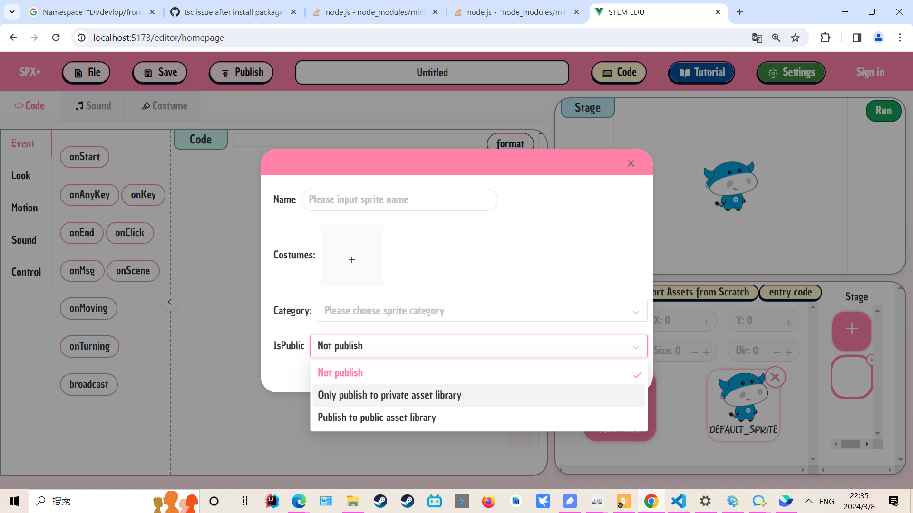
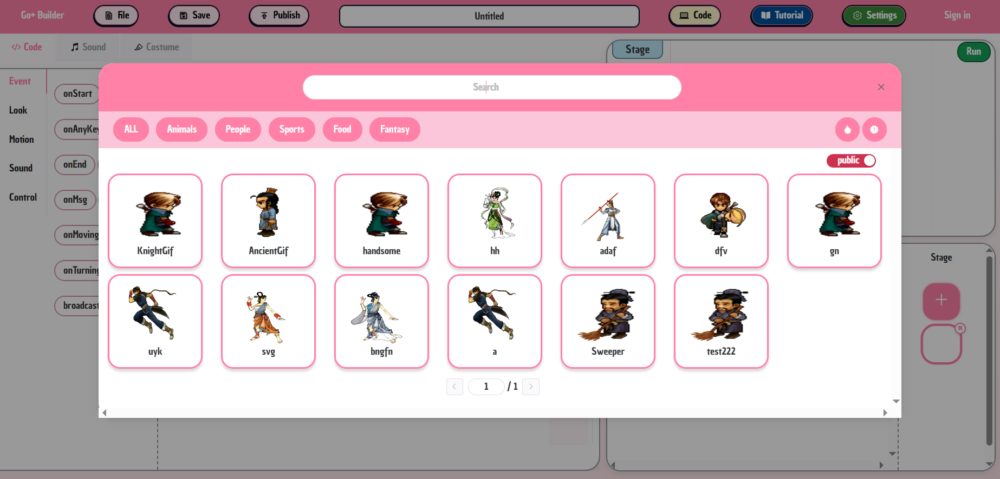
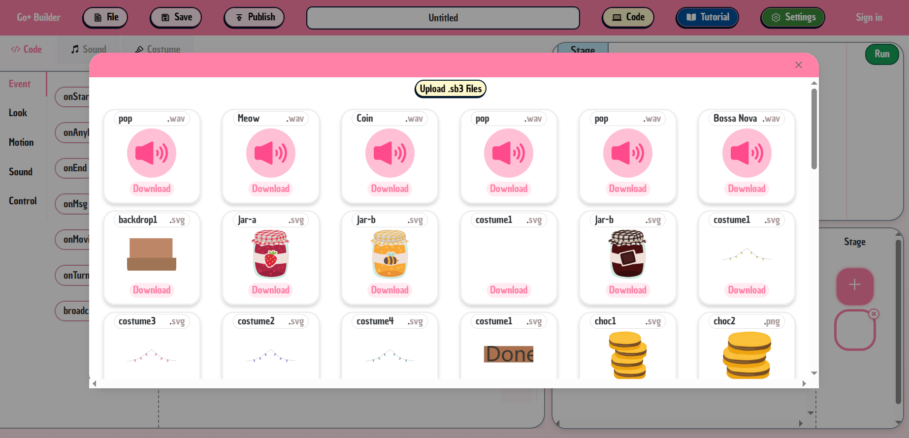
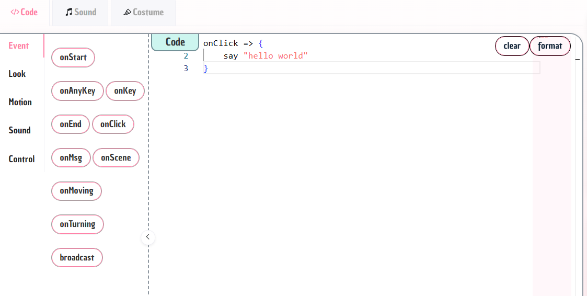
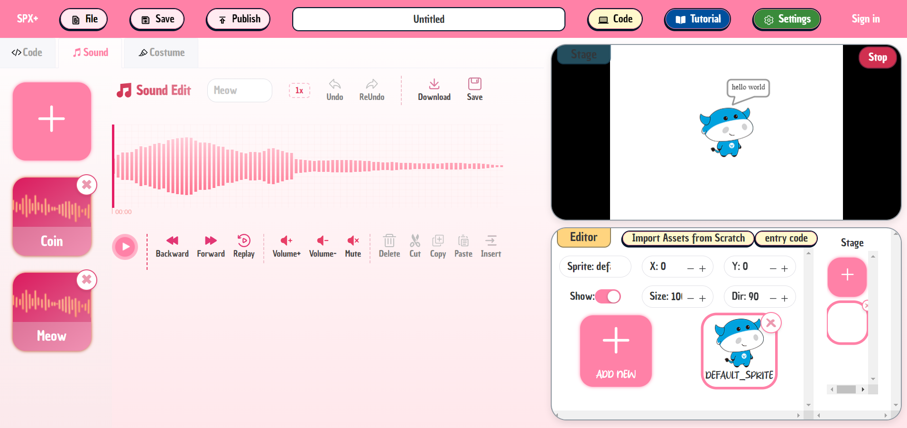
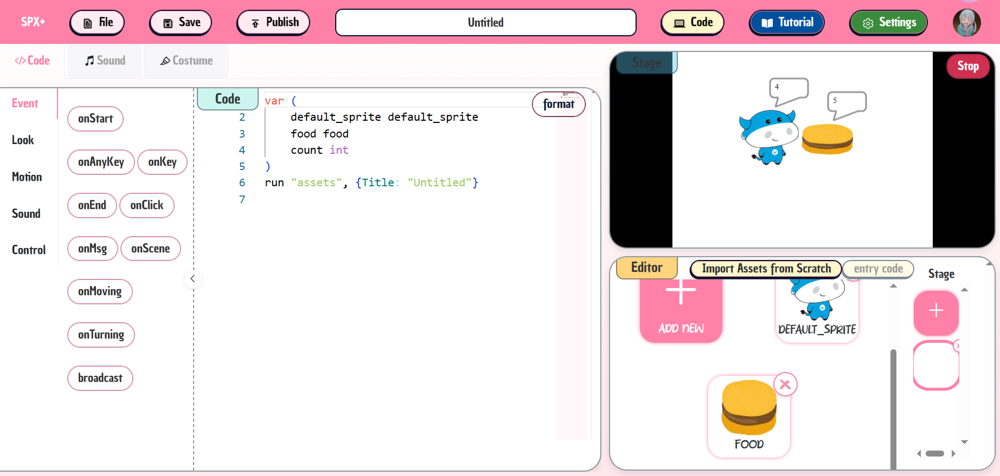
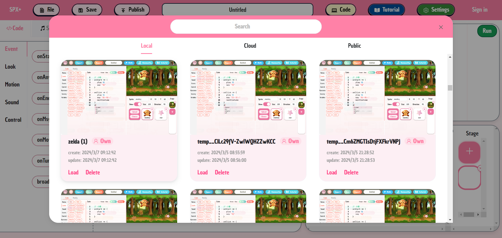

## Overview
In out platform, the top section is the toolbar, the left section is the code and sound editing area for the project, and the right section is the stage viewer along with the sprite and backdrop editing area.

Upon entering the editor, you will see our default project, which consists of a white backdrop and a small cow.


## Edit

### Assets Import
We can import new sprite by the "ADD NEW" area in the sprite list.

If we want to upload local images as sprite.We can choose to click the upload button of the "ADD NEW" area, and name the sprite, and upload its costume image from local. We can also select the category for the sprite and choose whether to upload it to the asset library.

If you choose to upload to public assets library, then others can see and get your sprite and import it.

After clicking submit, the sprite will be imported into the current project.



Of course, we can also import sprite from the assets library. We can click the choose button of the "ADD NEW" area to select and import sprite from online public or private asset library.

 

Of course, we also have a way to import sprites. We can choose to import scratch files and select sounds and sprites to import.



### Stage viewer & Assets list
After importing the sprite, You can see the sprite on the sprite list and in the stage viewer. 

We can click to select the sprite to see its corresponding properties. We can adjust its properties through the property editing bar above the sprite list, which can edit the sprite's coordinates, size, heading, and whether to display it. 

We can directly drag and drop the sprite in the stage display area above to change its coordinates, or right-click the sprite to change its zorder. 

We can also import the backdrop in the same way as the import sprite.


### Code editor
At this point, we hope to edit the behavior of the sprite. After selecting the sprite, we can go to the editing area on the left. 

For example, we hope that after clicking on the sprite, the sprite will say "hello world". Then we can enter the code in the code editor. The code editor is configured with syntax prompts, which can quickly input spx statements. Users can directly click on the toolbox on the side to quickly insert the corresponding spx code.
And We can click "format" button to format the code. If there is a format error, it will also prompt the user.



### Sound editor
At this point, we want to edit and use the sound we just imported.Click the sound button to switch to the sound editing area, where you can preview, replay, edit volume, crop and replace sound, record sound and import to current project.

Then We can switch to the code editing area and add the code `play Meow, true` in the click event code to let the sprite play the sound after being clicked.

After writing this logic, we can click the Run button in the stage editing area, which will run our project.

Click on our sprite, the sprite will display the Hello World and play the sound, and we have completed the first Hello World project.



### EntryCode
If we want to do another function at this time: there are two sprites on the stage, and each sprite clicks will output the number of times all the sprite have been clicked.

Then we can upload another sprite using the method we just did. 
And since both sprites need to be able to modify and output the number of clicks on all sprites when clicked, we need to declare a global variable.

We can choose to click the stage area on the right to enter the entryCode editing area and declare a count variable to record the number of clicks.

And in the click events of the two sprites, both write the logic of modifying and outputting the number of clicks, click run, and you can view the corresponding effect.
```
onClick => {
    count++
    say count
}
```


>As the entryCode for SPX, the SPX executes entryCode, and all sprites and sounds used in the project need to be declared in entryCode.  
>In the default project, if you have not manually edited the entry Code, when you click Run, a default entryCode is automatically generated for SPX execution based on all the sprites and sounds in the current project.  
>Once you have edited the entryCode, the entryCode you edited will be used at run time, and the entryCode will not be generated automatically after that.   
>In addition, you need to manually edit entryCode for all projects imported from the local and cloud (after you have added sprites and sounds, please declare in entryCode)

## Sign in
> If you want to save the project to the cloud and import the project from the cloud in the following steps, please sign in first

Click the sign in button, we can use Go+ commuity account to log in, if you do not have a Go+ commuity account, you can choose to use Facebook,Github,Twitter and Wechat to sign up for Go+ commuity account.

## Save
At this point, we can click the Save button in the upper left corner of the toolbar and choose to save to local or to the cloud

## Import
We can import the project in a variety of ways by clicking the File button in the toolbar.

1. Upload projects in zip format locally
2. Import a project from a local save history
3. Import projects from the cloud


## Runner Widget

If you want to show the project published on our platform on your website, you can choose to embed our running widget in the website.

1. Import widget loader

```html
<script src="https://builder.goplus.org/widgets/loader.js"></script>
```

2. Embedded widget element  

Widget will fill the parent element. And you can load a specified project by passing projectid , then you will see the project running on your website.

```html
<div style="width:400px;height:400px;">
    <spx-runner projectid="1"></spx-runner>
</div>
```
