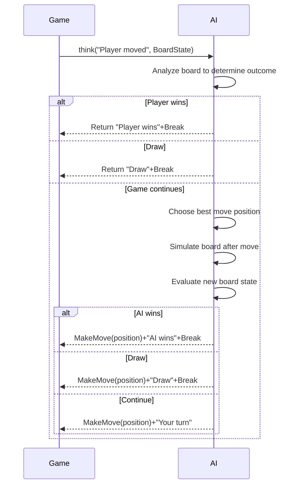

<documents>
        <document>
                <source>xgo-syntax.md</source>
                <document_content>
# XGo Syntax

```csv
Package,Name,Sample,Description
,for_iterate,for v in [] {},Iterate within given list
,for_iterate_with_index,"for i, v in [] {}",Iterate with index within given list
,for_loop_with_condition,for true {},Loop with condition
,for_loop_with_range,for i in 1:5 {},Loop with range
,func_declaration,func name(params) returnType {},"Function declaration, e.g., `func add(a int, b int) int {}`"
,if_else_statement,if true {} else {},If else statement
,if_statement,if true {},If statement
,import_declaration,"import ""package""","Import package declaration, e.g., `import ""fmt""`"
fmt,println,"println ""Hello, World!""",Print given message
,var_declaration,var name type,"Variable declaration, e.g., `var count int`"
```

                </document_content>
        </document>
        <document>
                <source>spx-apis.md</source>
                <document_content>
# spx APIs

## Game

```csv
Name,Sample,Description
answer,,The answer from the player
backdropIndex,,Index of the current backdrop
backdropName,,Name of the current backdrop
broadcast,"broadcast ""ping""",Broadcast a message
broadcast,"broadcast ""ping"", 1",Broadcast a message along with extra data
broadcastAndWait,"broadcastAndWait ""ping""","Broadcast a message, with waiting for related (`onMsg`) behaviors to complete"
broadcastAndWait,"broadcastAndWait ""ping"", 1","Broadcast a message along with extra data, with waiting for related (`onMsg`) behaviors to complete"
ask,"ask ""What is your name?""",Ask player a question and wait for player to answer
changeGraphicEffect,"changeGraphicEffect ColorEffect, 10","Change graphic effect of the stage. For example, if initial effect value is 100, changing by 10 will result in 110"
changeVolume,changeVolume 10,"Change the volume for stage sounds with given volume change. For example, if initial volume is 100, changing by 10 will result in volume 110"
clearGraphicEffects,,Clear all graphic effects of the stage
onAnyKey,onAnyKey key => {},Listen to any key pressed
onBackdrop,onBackdrop backdrop => {},Listen to backdrop switching
onBackdrop,"onBackdrop ""bg1"", => {}",Listen to switching to specific backdrop
onClick,onClick => {},Listen to stage clicked
onKey,"onKey KeyA, => {}",Listen to given key pressed
onKey,"onKey [KeyA], key => {}",Listen to given keys pressed
onMsg,"onMsg (msg, data) => {}",Listen to any message broadcasted
onMsg,"onMsg ""ping"", => {}",Listen to specific message broadcasted
onStart,onStart => {},Listen to game start
onSwipe,"onSwipe Left, => {}",Listen to swipe in given direction
pausePlaying,"pausePlaying ""s1""",Pause sound with given name
play,"play ""s1"", true",Play sound with given name in a loop
play,"play ""s1""",Play sound with given name
playAndWait,"playAndWait ""s1""",Play sound with waiting
resumePlaying,"resumePlaying ""s1""",Resume sound with given name
setGraphicEffect,"setGraphicEffect ColorEffect, 100",Set graphic effect of the stage
setVolume,setVolume 100,Set the volume for stage sounds
stopPlaying,"stopPlaying ""s1""",Stop sound with given name
volume,,The volume for stage sounds
getWidget,"getWidget(Monitor, ""w1"")",Get the widget by given type & name
keyPressed,keyPressed(KeyA),Check if given key is currently pressed
mouseHitItem,,The sprite which is hit by mouse
mousePressed,,If the mouse is currently pressed
mouseX,,X position of the mouse
mouseY,,Y position of the mouse
resetTimer,,Reset the timer to zero
setBackdrop,"setBackdrop ""bg1""",Set the current backdrop by specifying name
setBackdrop,setBackdrop 0,Set the current backdrop by specifying index
setBackdrop,setBackdrop Next,Switch to the Next/Prev backdrop
setBackdropAndWait,"setBackdropAndWait ""bg1""","Set the current backdrop by specifying name, with waiting for related (`onBackdrop`) behaviors to complete"
setBackdropAndWait,setBackdropAndWait 0,"Set the current backdrop by specifying index, with waiting for related (`onBackdrop`) behaviors to complete"
setBackdropAndWait,setBackdropAndWait Next,"Switch to the Next/Prev backdrop, with waiting for related (`onBackdrop`) behaviors to complete"
stopAllSounds,,Stop all playing sounds
timer,,Current timer value
wait,wait 1,Wait for given seconds
```

## Sprite

```csv
Name,Sample,Description
animate,"animate ""a1""",Play animation with given name
animate,"animate ""a1"", true",Loop the animation with given name
animateAndWait,"animateAndWait ""a1""","Play animation with given name, with waiting for animation to complete"
bounceOffEdge,,Bounce off if the sprite touching the edge
changeHeading,changeHeading 90,"Change heading by given degree. For example, if initially heading at 30 degrees, changing by 90 degrees will result in heading 120 degrees"
changeSize,changeSize 1,"Change size of the sprite. For example, if initially size is 1, changing by 1 will result in size 2"
changeXYpos,"changeXYpos 10, 10","Change the sprite's X, Y position"
changeXpos,changeXpos 10,Change the sprite's X position
changeYpos,changeYpos 10,Change the sprite's Y position
clone,,Make a clone of the sprite
clone,clone 1,Make a clone of the sprite and pass extra data
costumeName,,The name of the current costume
die,,"Let the sprite die. Animation for state ""die"" will be played"
distanceTo,"distanceTo(""S1"")",Distance from the sprite to another sprite with given name
distanceTo,distanceTo(Mouse),Distance from the sprite to given object
glide,"glide 100, 100, 1",Glide to given position within given duration
glide,"glide ""S1"", 1",Glide to the sprite with given name within given duration
glide,"glide Mouse, 1",Glide to given object within given duration
heading,,The sprite's heading direction
hide,,Make the sprite invisible
onCloned,onCloned data => {},Listen to sprite cloned
onTouchStart,"onTouchStart ""S1"", sprite => {}",Listen to sprite touching another sprite with given name
onTouchStart,"onTouchStart [""S1""], sprite => {}",Listen to sprite touching another sprite with one of given names
say,"say ""Hi""",Say some word
say,"say ""Hi"", 1",Say some word for given seconds
setCostume,"setCostume ""c1""",Set the current costume by specifying name
setHeading,setHeading Right,Set heading to given direction
setLayer,setLayer Front,Send the sprite to front/back
setLayer,"setLayer Forward, 1","Send the sprite forward or backward, with given layers"
setRotationStyle,setRotationStyle LeftRight,Set the rotation style of the sprite
setSize,setSize 2,Set size of the sprite
setXYpos,"setXYpos 0, 0","Set the sprite's X, Y position"
setXpos,setXpos 0,Set the sprite's X position
setYpos,setYpos 0,Set the sprite's Y position
show,,Make the sprite visible
size,,"Size of the sprite. Value is relative to initial size. For example, 2 means current size is twice the initial size"
ask,"ask ""What is your name?""",Ask player a question and wait for player to answer
changeGraphicEffect,"changeGraphicEffect ColorEffect, 10","Change graphic effect of the sprite. For example, if initial effect value is 100, changing by 10 will result in 110"
changeVolume,changeVolume 10,"Change the volume for sprite sounds with given volume change. For example, if initial volume is 100, changing by 10 will result in volume 110"
clearGraphicEffects,,Clear all graphic effects of the sprite
stopPlaying,"stopPlaying ""s1""",Stop sound with given name
onAnyKey,onAnyKey key => {},Listen to any key pressed
onBackdrop,onBackdrop backdrop => {},Listen to backdrop switching
onBackdrop,"onBackdrop ""bg1"", => {}",Listen to switching to specific backdrop
onClick,onClick => {},Listen to sprite clicked
onKey,"onKey KeyA, => {}",Listen to given key pressed
onKey,"onKey [KeyA], key => {}",Listen to given keys pressed
onMsg,"onMsg (msg, data) => {}",Listen to any message broadcasted
onMsg,"onMsg ""ping"", => {}",Listen to specific message broadcasted
onStart,onStart => {},Listen to game start
onSwipe,"onSwipe Left, => {}",Listen to swipe in given direction
pausePlaying,"pausePlaying ""s1""",Pause sound with given name
play,"play ""s1"", true",Play sound with given name in a loop
play,"play ""s1""",Play sound with given name
playAndWait,"playAndWait ""s1""",Play sound with waiting
resumePlaying,"resumePlaying ""s1""",Resume sound with given name
setGraphicEffect,"setGraphicEffect ColorEffect, 100",Set graphic effect of the sprite
setVolume,setVolume 100,Set the volume for sprite sounds
volume,,The volume for sprite sounds
step,step 100,"Step toward current heading with given distance. Animation for state ""step"" will be played"
step,"step 100, 1","Step toward current heading with given distance and speed. Animation for state ""step"" will be played"
step,"step 100, 1, ""a1""","Step toward current heading with given distance, speed and animation"
stepTo,"stepTo ""S1""","Step to the sprite with given name. Animation for state ""step"" will be played"
stepTo,"stepTo ""S1"", 1","Step to the sprite with given name and specify speed. Animation for state ""step"" will be played"
stepTo,"stepTo ""S1"", 1, ""a1""",Step to the sprite with given name and specify speed and animation
stopAnimation,"stopAnimation ""a1""",Stop animation with given name
think,"think ""Emmm...""",Think of some word
think,"think ""Emmm..."", 1",Think of some word for given seconds
touching,"touching(""S1"")",If sprite touching another sprite with given name
touching,touching(Edge),If sprite touching given object
touchingColor,"touchingColor(HSB(50,100,100))",If sprite touching given color
turn,turn Right,"Turn by given direction. For example, if initially heading at 30 degrees, turning right will result in heading 120 degrees"
turn,"turn Right, 1",Turn by given direction and specify the turn speed
turn,"turn Right, 1, ""a1""","Turn by given direction, specify the turn speed and animation"
turnTo,"turnTo ""S1""",Turn to the sprite with given name
turnTo,"turnTo ""S1"", 1","Turn to the sprite with given name, and specify the turn speed"
turnTo,"turnTo ""S1"", 1, ""a1""","Turn to the sprite with given name, and specify the turn speed and animation"
visible,,If sprite visible
xpos,,The sprite's X position
ypos,,The sprite's Y position
```

## Others

```csv
Name,Sample,Description
Back,,Back
Backward,,Backward
Forward,,Forward
Front,,Front
hSB,"HSB(50, 100, 100)",Define HSB color
hSBA,"HSBA(50, 100, 100, 100)",Define HSBA color
Down,,"Down direction, i.e., 180 degree"
Edge,,Edge of the stage
EdgeBottom,,Bottom edge of the stage
EdgeLeft,,Left edge of the stage
EdgeRight,,Right edge of the stage
EdgeTop,,Top edge of the stage
exit,,Exit the game
forever,forever => {},Repeat forever
Left,,"Left direction, i.e., -90 degree"
LeftRight,,Left-Right
Monitor,,Monitor widget
Monitor.changeSize,changeSize 0.1,Change size of the widget
Monitor.changeXYpos,"changeXYpos 10, 10",Change the widget's position
Monitor.changeXpos,changeXpos 10,Change the widget's X position
Monitor.changeYpos,changeYpos 10,Change the widget's Y position
Monitor.hide,hide,Make the widget invisible
Monitor.setSize,setSize 2,Set size of the widget
Monitor.setXYpos,"setXYpos 0, 0","Set the widget's X, Y position"
Monitor.setXpos,setXpos 0,Set the widget's X position
Monitor.setYpos,setYpos 0,Set the widget's Y position
Monitor.show,show,Make the widget visible
Monitor.size,size,"Size of the widget. Value is relative to initial size. For example, 2 means current size is twice the initial size"
Monitor.visible,visible,If widget visible
Monitor.xpos,xpos,The widget's X position
Monitor.ypos,ypos,The widget's Y position
Mouse,,Mouse
MovingInfo.dx,dx,Change of the X position
MovingInfo.dy,dy,Change of the Y position
MovingInfo.NewX,newX,The X position after moving
MovingInfo.NewY,newY,The Y position after moving
MovingInfo.OldX,oldX,The X position before moving
MovingInfo.OldY,oldY,The Y position before moving
Next,,Next item
None,,Don't Rotate
Normal,,Normal
Prev,,Previous item
rand,"rand(1, 10)",Generate a random integer
rand,"rand(1.5, 9.9)",Generate a random number
repeat,"repeat 10, => {}",Repeat for given times
repeatUntil,"repeatUntil false, => {}",Repeat until given condition is met
Right,,"Right direction, i.e., 90 degree"
Sprite,,Type for sprite
TurningInfo.dir,dir,The degree changed by turning
TurningInfo.NewDir,NewDir,The heading direction after turning
TurningInfo.OldDir,OldDir,The heading direction before turning
Up,,"Up direction, i.e., 0 degree"
waitUntil,waitUntil true,Wait until given condition is met
Widget.changeSize,changeSize 0.1,Change size of the widget
Widget.changeXYpos,"changeXYpos 10, 10",Change the widget's position
Widget.changeXpos,changeXpos 10,Change the widget's X position
Widget.changeYpos,changeYpos 10,Change the widget's Y position
Widget.hide,hide,Make the widget invisible
Widget.setSize,setSize 2,Set size of the widget
Widget.setXYpos,"setXYpos 0, 0","Set the widget's X, Y position"
Widget.setXpos,setXpos 0,Set the widget's X position
Widget.setYpos,setYpos 0,Set the widget's Y position
Widget.show,show,Make the widget visible
Widget.size,size,"Size of the widget. Value is relative to initial size. For example, 2 means current size is twice the initial size"
Widget.visible,visible,If widget visible
Widget.xpos,xpos,The widget's X position
Widget.ypos,ypos,The widget's Y position
```

## Keys

```csv
Name,Sample,Description
"Key0-Key9,KeyA-KeyZ,KeyF1-KeyF12,KeyKP0-KeyKP9,KeyApostrophe,KeyBackslash,KeyBackspace,KeyCapsLock,KeyComma,KeyDelete,KeyDown,KeyEnd,KeyEnter,KeyEqual,KeyEscape,KeyGraveAccent,KeyHome,KeyInsert,KeyKPDecimal,KeyKPDivide,KeyKPEnter,KeyKPEqual,KeyKPMultiply,KeyKPSubtract,KeyLeft,KeyLeftBracket,KeyMenu,KeyMinus,KeyNumLock,KeyPageDown,KeyPageUp,KeyPause,KeyPeriod,KeyPrintScreen,KeyRight,KeyRightBracket,KeyScrollLock,KeySemicolon,KeySlash,KeySpace,KeyTab,KeyUp,KeyAlt,KeyControl,KeyShift,KeyMax,KeyAny","onKey Key1, => {}","Key definitions, used for keyboard event listening."
```

                </document_content>
        </document>
        <document>
                <source>custom-element-code-link.md</source>
                <document_content>
# `code-link`

Display a link to a code location in the project. By clicking on the link, the user will be navigated to the code location. A location can be a position or a range.

## Attributes

### `file`

Text document URI, e.g., `file:///NiuXiaoQi.spx`

### `position`

Format: `${line},${column}`, e.g., `10,20`. `line` & `column` are numbers start from 1. `1,1` means the first column of the first line.

### `range`

Format: `${startLine},${startColumn}-${endLine},${endColumn}`, e.g., `10,20-12,10`

`startLine`, `startColumn`, `endLine`, `endColumn` are numbers start from 1. `10,20-12,10` means the range from line 10, column 20 to line 12, column 10. The end position is exclusive.

### children

The text to display in the link.

## Examples

### Basic example

```xml
<code-link file="file:///NiuXiaoQi.spx" position="10,20"></code-link>
```

This is a link to line 10, column 20 in the code of sprite `NiuXiaoQi`.

### Example with text

```xml
<code-link file="file:///main.spx" position="1,1">Details</code-link>
```

This is a link to the beginning of the code of stage with the text "Details".

### Example with range

```xml
<code-link file="file:///Stage.spx" range="2,1-2,10">onStart</code-link>
```

This is a link to a range (line 2, column 1 to line 2, column 10) in the code of stage with the text "onStart".

                </document_content>
        </document>
        <document>
                <source>custom-element-code-change.md</source>
                <document_content>
# `code-change`

Display a modification based on the existing code.

**NOTE**:

* Prefer `code-change` over standard code block when showcasing code modifications.
* Use tabs to maintain indentation in the new code.
* Use `<pre is="code-change">` instead of `<code-change>`.

## Attributes

### `file`

Text document URI, e.g., `file:///NiuXiaoQi.spx`

### `line`

The position (line number) to do code change, e.g., `10`.

### `remove-line-count`

The number of lines to remove, e.g., `3`. If omitted, no line will be removed.

### children

The new code to insert.

## Examples

```xml
<pre is="code-change" file="file:///NiuXiaoQi.spx" line="10" remove-line-count="3">
onStart => {
        say "Hello, world!"
}
</pre>
```

                </document_content>
        </document>
        <document>
                <source>ai-interaction.md</source>
                <document_content>
# AI Interaction

AI Interaction is a feature in XBuilder that allows games to communicate with AI during runtime. This functionality enables users to create rich interactive scenarios in games such as intelligent opponents (like AI opponents in board games), smart conversations, dynamic content generation, and adaptive gaming experiences.

The AI Interaction feature is designed for children around 10 years old who are learning programming. It provides minimal APIs that allow them to easily integrate AI capabilities into their games without needing to understand complex network requests, error handling, or AI model details.

## Basic Concepts

### AI Interaction

AI Interaction refers to the communication process between a running game and external AI. This interaction includes sending messages to AI and receiving/processing AI responses.

The basic AI interaction flow is:

1. The game sends a message to AI (may contain contextual information like game state)
2. AI processes the message and generates a response
3. The game processes the response and provides feedback
4. AI determines subsequent actions based on the feedback

This process iterates until the interaction naturally concludes or is interrupted.

### AI Player

An AI Player is an intelligent agent in the game that interacts with human players, capable of understanding game situations and making reasonable responses. Each AI Player is an independent interaction instance with its own memory and behavior patterns, operating without interference from others.

Core characteristics of AI Players:

- Identity: Clearly defined through role settings (e.g., opponent, teacher, etc.). Role definitions include:
  - Identity description: The basic identity of the role, such as "guide", "opponent", "teacher", etc.
  - Behavior guidelines: How the role should behave, including tone, attitude, and decision-making style
  - Knowledge scope: What the role should or shouldn't know
  - Goal orientation: The role's main objectives or tasks in the game
- Interactivity: Can receive instructions and provide intelligent responses
- Autonomy: Makes decisions based on context
- Customizability: Behaviors and capability ranges can be freely defined

Example:

```go
import "ai"

// Declare Player variable (zero value is ready to use)
var teacher ai.Player

// Set the role the Player should play
teacher.setRole "Math Teacher", { "Style": "Patient", "Difficulty": "Beginner", "Subjects": ["Addition", "Subtraction"] }
```

### AI Context

AI Context is a key collection of data that helps AI understand the current game state, conversation history, and environmental information. Good context enables AI to generate more accurate and relevant responses, improving the intelligence and coherence of the gaming experience.

AI Context comes in two types:

- Automatically attached context: Information automatically collected and provided to AI by the system, such as conversation history and basic game environment. Users don't need to manually provide this - the system automatically attaches it during each AI interaction.
- User-provided context: Specific information explicitly provided by developers through APIs, such as current game state or special rules. The system automatically converts this information into a format AI can understand, enabling AI to generate more intelligent responses based on the current situation.

Notably, the system automatically analyzes game source code during initialization and generates a descriptive summary of the game world from the player's perspective. This summary is attached to the AI context as background knowledge, helping AI understand the game's basic design and possible player interaction methods. This allows AI to generate responses that better align with game logic and player experience.

AI Context typically contains these types of information:

- Game state information: Such as score, collected items, completed tasks, etc.
- Conversation history: Previous interactions with AI, helping AI understand conversation continuity
- Environmental information: Game world rules, available resources, time limits, etc.
- User information: Such as the user's play style, learning progress, difficulties, etc.

Good AI Context design principles:

- Relevance: Only provide information relevant to the current task or conversation
- Conciseness: Avoid redundant information, keep context data structure clear
- Timeliness: Update context promptly to ensure AI gets the latest game state
- Understandability: Organize information in ways AI can easily process

Example:

```go
var npc ai.Player
npc.think "What's my next move?", { "Position": [10, 20], "HP": 80, "Equipment": ["Sword", "Shield"] }
```

### AI Command

AI Commands are pre-registered functions that AI can call. Through commands, AI can perform specific operations in the game, such as moving sprites, playing sounds, or changing game state.

Each AI Command contains:

- Command definition: Defined through struct type, including:
  - Command name: The struct type name
  - Command description: Can be provided by implementing struct methods to give complete descriptions. If not implemented, the system generates default descriptions.
  - Parameter definition: Added through struct fields to define required parameters and their types
  - Parameter description: Can be set through field tags to describe parameter purposes. If not added, the system generates default descriptions.
- Command implementation: Concrete execution logic that receives the command definition struct as parameter and performs corresponding operations

Good AI Command design principles:

- Clear semantics: Command names and parameters should clearly express their functionality, understandable even without descriptions
- Concise parameters: Avoid too many parameters to maintain usability

Example:

```go
type AttackThePlayer struct {
    Strokes int
}

var enemy ai.Player
enemy.onCmd AttackThePlayer, (cmd) => {
    // Execute attack logic
}
```

### AI Message

AI Messages are text content sent by the game to AI, which can contain questions, instructions, or other information. AI generates responses based on message content.

AI Messages can include additional context information to help AI better understand the current game state.

Example:

```go
var guide ai.Player
guide.think "Where is the nearest treasure?", { "CurrentPosition": [35, 42], "ExploredAreas": ["East", "South"] }
```

### AI Response

AI Response is AI's processing result for game messages. Each response contains:

- Text response: Text content generated by AI, typically used as debug information without needing processing
- Single AI command: The single AI command AI decides to call, automatically executed by the system

After executing the command, the system provides feedback to AI for determining subsequent actions. Command execution may produce these results:

- Success: Command executed correctly, game state changed as expected, AI can continue
- Failure: Command failed due to invalid parameters or disallowed game state, with error information helping AI adjust strategy
- Interruption: Command actively requests terminating current interaction flow

Only when the AI command is legal and successfully executed is the AI response considered valid.

Example:

```go
type Help struct {
    Topic    string `desc:"Topic needing help"`
    Priority int    `desc:"Priority, range: 1-5"`
}

var helper ai.Player
helper.onCmd Help, (cmd) => {
    // Execute help logic
}

helper.think "I need help" // Will automatically execute AI response command
```

## API Design

All AI interaction functionality is provided through methods of the `Player` struct in the `ai` package.

### setRole

`setRole` is a "command" class API that sets the role AI should play during interactions. By defining clear roles, AI responses become more consistent, better suited to game scenarios, and avoid repeating role descriptions in each `think` call.

```go
Player.setRole role
Player.setRole role, additionalContext
```

Parameters:

- `role`: `string` type, describing the role AI should play, such as "guide", "opponent", "teacher", etc.
- `additionalContext`: Optional parameter, `map[string]any` type, providing additional context information about the role

For ease of use, `setRole` can be called at any point in the game to change AI's role settings. Once set, the role remains effective until replaced by new settings.

Example:

```go
var guide ai.Player
guide.setRole "Guide", { "Style": "Friendly", "Knowledge": "Game Rules" }
```

### onCmd

`onCmd` is an "event" class API that registers commands AI can call. Users can predefine game operations executable by AI through it.

```go
Player.onCmd T, (command) => { return err }
```

Parameters:

- `T`: Generic type representing specific AI command struct type
- `(command) => { return err }`: Function type implementing AI command logic
  - Its `T` type parameter `command` contains all parameter values set by AI when calling this command
  - Its `error` type return value `err` provides feedback to AI about command execution results
    - `nil`: Command executed successfully, AI continues
    - `ai.Break`: Interrupt interaction
    - Others: Error information is fed back to AI as context for strategy adjustment

Command struct `T` has these characteristics:

- Parameter definition: Exported fields (capitalized) in the struct automatically become configurable AI parameters, supporting basic types like `string`, `int`, `float64`, `bool` and their slices
- Parameter description: Each field can have a `desc` tag explaining parameter purpose, e.g., `desc: "Move direction"`. These help AI correctly understand and use parameters. If not added, the system generates default descriptions.
- Command description: Can implement `Desc() string` method to provide complete command description including functionality and usage scenarios. If not implemented, the system generates default descriptions.

Example:

```go
type Move struct {
    Direction string `desc:"Move direction, options: up, down, left, right"`
    Steps     int    `desc:"Number of steps"`
}

var npc ai.Player
npc.onCmd Move, (cmd) => {
    // Execute move logic
}
```

### think

`think` is a "command" class API that sends messages to AI and optionally provides additional context information to get responses. The system automatically processes AI responses, including executing commands AI decides to call.

```go
Player.think msg
Player.think msg, additionalContext
```

Parameters:

- `msg`: `string` type, message content sent to AI
- `additionalContext`: Optional parameter, `map[string]any` type, additional context information provided to AI

For ease of use, `think` uses blocking design and returns no value. If errors occur during requests, the system automatically retries several times. If still unsuccessful after multiple attempts, it triggers error handling functions registered through `onErr`. If none registered, uses default error handling.

Example:

```go
var enemy ai.Player
enemy.think "Attack player", { "PlayerHP": 80, "Distance": 5 }
```

### onErr

`onErr` is an "event" class API that registers error handling logic when AI interactions fail. By defining error handling functions, friendly prompts can be shown to users when errors occur like network request failures or invalid AI responses.

```go
Player.onErr => {}
Player.onErr (err) => {}
```

Parameters:

- `(err) => {}`: Function type representing specific error handling function, with optional `error` type parameter `err` representing specific errors (typically for debugging), obtainable through `err.Error`

Example:

```go
var helper ai.Player
helper.onErr (err) => {
    say "AI assistant error occurred"
    printf "ai error: %v", err // Print logs to console for debugging
}
```

## Complete Example

Here's a complete example of a Tic-Tac-Toe AI opponent:

```go
/*

Assume there's already a 3x3 2D array variable board representing game state, initialized as:

    [][]string{
        {"", "", ""},
        {"", "", ""},
        {"", "", ""},
    }

And a function updateBoard(row, col, piece) for updating board state.

*/

// Define AI opponent move command
type MakeMove struct {
    Row    int    `desc:"Row position: -1 (no move needed), 0, 1, 2"`
    Col    int    `desc:"Column position: -1 (no move needed), 0, 1, 2"`
    Result string `desc:"Game result: unset (continue), X (player wins), O (AI wins), TIE (draw)"`
}

var (
    // Declare AI opponent
    opponent ai.Player
)

// Register AI opponent move command
opponent.onCmd MakeMove, (cmd) => {
    if cmd.Row != -1 && cmd.Col != -1 {
        // Check if move position is valid
        if cmd.Row < 0 || cmd.Row > 2 || cmd.Col < 0 || cmd.Col > 2 || board[cmd.Row][cmd.Col] != "" {
            return errorf("Invalid move position, please choose again. Board state: %v", board)
        }

        // Update board logic
        updateBoard(cmd.Row, cmd.Col, "O")
    }

    // Check if game ended
    if cmd.Result == "" {
        say "Your turn"
    } else if cmd.Result == "TIE" {
        say "Game over, it's a draw"
    } else {
        say "Game over, " + cmd.Result + " wins"
    }
    return ai.Break
}

// Register error handling
opponent.onErr (err) => {
    say "I surrender"
    printf "AI error: %v", err
}

onStart => {
    // Set AI opponent role
    opponent.setRole "Tic-Tac-Toe Opponent", {
        "Rules": "Standard Tic-Tac-Toe rules",
        "Piece": "O",
        "Difficulty": "Medium",
        "Style": "Offensive",
    }
}

onMsg "Player moved", => {
    // Request AI opponent move
    opponent.think "Player has moved, your turn", { "BoardState": board }
}
```

Here's the internal logic flow of AI processing Tic-Tac-Toe game:


                </document_content>
        </document>
</documents>

# About XGo

The XGo programming language is

* Superset of the Go language
* Statically typed
* With special features focusing on simplicity and efficiency

In document `xgo-syntax.md`, you can find some definitions for XGo language syntax.

## How XGo simplifies Go's expressions

### Program structure

XGo allows omitting package main and func main.

```go
package main

import "fmt"

func main() {
        fmt.Println("Hi")
}
```

```xgo
import "fmt"

fmt.Println("Hi")
```

### Builtin functions

XGo provides more builtin functions. It simplifies the expression of the most common tasks.

```go
fmt.Println("Hi")
```

```xgo
println("Hi")
```

### Command-line style

XGo recommends command-line style code, which is a special style for function-calls whose return values are not used:

```go
println("Hi")
```

```xgo
println "Hi"
```

### List literals

```go
a := []int{1, 2, 3}
```

```xgo
a := [1, 2, 3]
```

### Map literals

```go
a := map[string]int{
        "Monday": 1,
        "Tuesday": 2,
}
```

```xgo
a := {
        "Monday": 1,
        "Tuesday": 2,
}
```

### Lambda expressions

```go
onStart(func() {...})
onMsg(msg, func() {...})
```

```xgo
onStart => {...}
onMsg msg, => {...}
```

### Function overloading

XGo allows calling multiple functions (they are defined as `Xxx__0`, `Xxx__1`, etc.) with the same name (`xxx`) in XGo but different implementations.

```go
Step__0(5.5)
Step__1(5.5, "run")
Step__2(10)
```

```xgo
step 5.5
step 5.5, "run"
step 10
```

### Classfiles

XGo classfiles provide a mechanism to abstract domain knowledge, making XGo more accessible and friendly to various user groups, especially those new to programming or unfamiliar with object-oriented programming concepts. Instead of explicitly defining classes using `type` and `struct` keywords as in Go, XGo allows defining classes using a simpler, more intuitive syntax within files called classfiles.

Key Aspects of XGo Classfiles:

* Simplified Syntax: Classfiles define classes using a syntax closer to sequential programming. Variables and functions are declared directly within the classfile, eliminating the need for explicit `struct` and method declarations.
* Abstraction of Domain Knowledge: The primary purpose is to abstract domain-specific knowledge. This is achieved by defining a base class for a project and organizing related worker classes under it.
* Project and Worker Classes: A classfile typically consists of a project class and multiple worker classes. The project class represents the main entity, while worker classes represent supporting components.

Under the hood, XGo classfiles will be compiled into Go code with `struct` and method declarations, allowing seamless integration with existing Go codebases.

# About spx

spx is a Scratch-like 2D Game Engine for STEM education. It is designed for children to learn programming by developing games. spx is developed based on XGo classfiles. In spx, there are two types of classes: `Game` classes and `Sprite` classes.

The `Game` class is the "project class" that represents the whole game. In an spx project, there is only one code file (named `main.spx`) for the `Game` class. We call it code for "the stage". Variables & functions declared in the stage code can be accessed by all game objects.

The `Sprite` classes are "worker classes" which are used to define game objects. In an spx project, there can be multiple code files for `Sprite` classes. Each `Sprite` class has its own code file, named after the sprite's name, e.g., `Apple.spx`, `Banana.spx`. Variables & functions declared in a sprite's code can only be accessed by that sprite.

In document `spx-apis.md`, you can find definitions for most APIs of spx game engine.

## Guidelines for Developing Games in spx

You MUST follow these IMPORTANT guidelines:

* **Code File Organization**: Always place in this order:
  1. Variable declarations (using `var` blocks)
  2. Function definitions
  3. Event handlers (like `onStart`, `onClick`)

* **Object-Oriented Implementation**: In spx, XGo uses classfiles instead of traditional struct-based OOP:
  - Each Sprite is a distinct object type
  - The Stage is a Game object
  - Variable blocks become fields of the object
  - Functions become methods of the object and please make sure to place the function definition before all event handlers (such as `onStart`, `onClick`)
  - Sprite can directly access the Game Field because the Sprite struct embeds the Game struct
  - The first `var` block cannot assign values since it is compiled into struct fields, but you can define variables in first `var` block and with assign values in `onStart` event handler.
  - In particular, the clone command Make a clone of current sprite is actually copy current Sprite struct. If you want to get the cloned object, you can get the object through `onCloned => {object := this}`

    Example: Stage File Structure

        ```spx
        var (
                score int
                speed int
        )

        var (
                fo0 = 2
                bar = 3
        )

        func reset() {
                score = 0
                speed = 20
        }
        ```

        can not define to:

        ```spx
        var (
                fo0 = 2
                bar = 3
        )

        var (
                score int
                speed int
        )

        func reset() {
                score = 0
                speed = 20
        }
        ```

        This compiles to:

        ``` go
        type Game struct {
                spx.Game
                Score int
                Speed int
        }

        var (
                fo0 = 2
                bar = 3
        )

        func (this *Game) reset() {
                this.score = 0
                this.speed = 20
        }
        ```

        Example: Sprite File Structure

        ```spx
        var (
                dir int
                x int
                y int
        )

        func reset() {
                dir = right
                x = -100
                y = 0
        }
        ```

        This compiles to:

        ``` go
        type Snake struct {
                spx.SpriteImpl
                *Game
                dir int
                x int
                y int
        }

        func (this *Snake) reset() {
                this.dir = right
                this.x = -100
                this.y = 0
        }
        ```

* Put these statements at the top level of the code file:

        - File-scope variable / constant definitions
        - Event-listening statements, e.g., `onMsg "m", => { ... }`, `onKey KeyUp, => { ... }`

        Put other initialization logic in the callback of `onStart`.

        RIGHT:

        ```spx
        const word = "Hello"

        var (
                count int
        )

        onStart => {
                println word
        }

        onClick => {
                count++
        }
        ```

        WRONG:

        ```spx
        onStart => {
                const word = "Hello"
                var count int
                println word

                onClick => {
                        count++
                }
        }
        ```

* Use `broadcast`/`onMsg` to communicate between sprites & the stage, instead of directly calling functions of other sprites.

* Prefer higher-level APIs over low-level APIs

        There may be different APIs for similar purpose. For example, both `step` and `setXYPos` (or `changeXYPos`) can be used to change a sprite's position, while `step` provides higher-level abstraction as:

        - it respects the sprite's heading, which is more intuitive for character movement
        - if there is a bound animation to state "step", it will be played

        So `step` is preferred over `setXYPos` (or `changeXYPos`) in most cases. Use low-level APIs only when necessary.

        The same principle applies to other APIs include `turnTo` over `setHeading`, `turn` over `changeHeading`, etc.

# About XBuilder

XBuilder provides a visual interface for children to learn programming by developing games. It uses spx as the game engine. Users of XBuilder are expected to be children aged around 10 who are new to programming.
