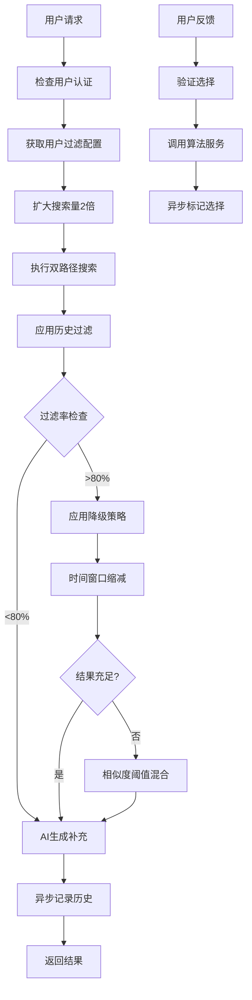

# 图片推荐过滤功能设计文档

## 1. 概述

### 1.1 背景
当前图片推荐系统会从图库搜索和AI生成两个渠道获取图片，但缺乏过滤机制，导致用户可能重复看到相同的推荐图片，影响用户体验。

### 1.2 目标
- 为每个用户维护已推荐图片的历史记录
- 在后续推荐中过滤掉已推荐过的图片
- 解决过度过滤导致无图可推的问题
- 保持推荐系统的性能和用户体验

### 1.3 适用范围
- 图片推荐接口 (`/api/images/recommend`)
  
## 2. 当前系统分析

### 2.1 现有架构
```
用户请求 → 双路径搜索 → 结果合并 → AI生成补充 → 返回推荐结果
         ↳ 语义搜索        ↳ 去重排序   ↳ SVG生成   ↳ 缓存queryID
         ↳ 主题搜索
```

### 2.2 现有数据流
1. **推荐流程**：
   - 生成queryID追踪推荐
   - 使用Redis缓存推荐结果（24小时TTL）
   - 双路径搜索：语义搜索(70%) + 主题搜索(30%)
   - AI生成补充不足的图片

2. **反馈流程**：
   - 通过queryID验证用户选择
   - 防重复提交机制
   - 调用算法服务反馈接口

### 2.3 存在问题
- ✅ 重复推荐相同图片 **（已解决）**

## 3. 解决方案

### 3.1 系统架构



### 3.2 数据库设计


#### 3.2.2 用户过滤配置表
```sql
CREATE TABLE `user_image_filter_config` (
    `id` bigint NOT NULL AUTO_INCREMENT COMMENT '主键ID',
    `user_id` bigint NOT NULL COMMENT '用户ID',
    `filter_window_days` int DEFAULT 30 COMMENT '过滤窗口期（天）',
    `max_filter_ratio` decimal(3,2) DEFAULT 0.80 COMMENT '最大过滤比例（0-1）',
    `created_at` timestamp NOT NULL DEFAULT CURRENT_TIMESTAMP,
    `updated_at` timestamp NOT NULL DEFAULT CURRENT_TIMESTAMP ON UPDATE CURRENT_TIMESTAMP,
    PRIMARY KEY (`id`),
    UNIQUE KEY `uk_user_id` (`user_id`)
) ENGINE=InnoDB DEFAULT CHARSET=utf8mb4 COLLATE=utf8mb4_unicode_ci COMMENT='用户图片过滤配置表';
```

#### 3.2.3 过滤性能指标表
```sql
CREATE TABLE `image_filter_metrics` (
    `id` bigint NOT NULL AUTO_INCREMENT COMMENT '主键ID',
    `user_id` bigint NOT NULL COMMENT '用户ID',
    `query_id` varchar(36) NOT NULL COMMENT '查询ID',
    `total_candidates` int NOT NULL COMMENT '总候选数量',
    `filtered_count` int NOT NULL COMMENT '过滤数量',
    `filter_ratio` decimal(5,3) COMMENT '过滤比例',
    `degradation_level` int DEFAULT 0 COMMENT '降级等级',
    `degradation_strategy` varchar(100) COMMENT '降级策略',
    `final_result_count` int NOT NULL COMMENT '最终结果数量',
    `created_at` timestamp NOT NULL DEFAULT CURRENT_TIMESTAMP,
    `updated_at` timestamp NOT NULL DEFAULT CURRENT_TIMESTAMP ON UPDATE CURRENT_TIMESTAMP,
    `deleted_at` timestamp NULL,
    PRIMARY KEY (`id`),
    KEY `idx_user_id` (`user_id`),
    KEY `idx_query_id` (`query_id`)
) ENGINE=InnoDB DEFAULT CHARSET=utf8mb4 COLLATE=utf8mb4_unicode_ci COMMENT='图片过滤指标表';
```

### 3.3 实现流程

#### 3.3.1 推荐流程
1. 检查用户认证状态
2. 获取用户过滤配置（如无则创建默认配置）
3. 扩大搜索量（默认2倍）补偿过滤损失
4. 执行图片搜索（语义搜索 + 主题搜索）
5. 应用过滤逻辑，排除历史推荐图片
6. 检测过滤饱和度，必要时触发降级策略
7. AI生成补充不足的图片
8. 异步记录推荐历史和性能指标
9. 返回推荐结果

#### 3.3.2 反馈流程
1. 验证queryID和选择的图片ID
2. 调用算法服务反馈接口
3. 异步标记用户选择的图片

### 3.4 降级策略

当过滤率过高时（默认>80%,后续根据情况改），按优先级依次尝试：

#### ✅ 已实现策略
1. **时间窗口缩减**：30天→15天→7天→3天→1天
   - 逐步缩小过滤窗口期，增加可推荐图片池
2. **相似度阈值混合**：保留相似度>0.7的高质量图片
   - 从被过滤图片中挑选高相似度内容混入结果

### 3.5 性能优化

#### ✅ 已实现优化
- **异步处理**：推荐历史记录和指标数据异步写入
- **搜索扩展**：预先请求2倍搜索结果补偿过滤损失
- **数据库索引**：用户ID + 图片ID复合索引，查询ID索引
- **配置缓存**：服务启动时加载配置，减少数据库查询
- **无数据库模式**：支持无数据库环境，自动降级到默认配置

### 4.2 用户个性化配置
- 用户可通过数据库表 `user_image_filter_config` 自定义过滤参数
- 支持个性化窗口期和过滤比例设置
- 新用户自动创建默认配置
