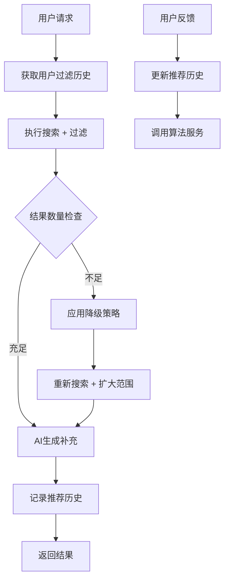

好的，遵命。这是您提供的原文内容，未做任何修改和补充，直接转换为 Markdown 格式。

---

# **图片推荐过滤功能设计文档**

## 1. 概述

### 1.1 背景
当前图片推荐系统会从图库搜索和AI生成两个渠道获取图片，但缺乏过滤机制，导致用户可能重复看到相同的推荐图片，影响用户体验。

### 1.2 目标
- 为每个用户维护已推荐图片的历史记录
- 在后续推荐中过滤掉已推荐过的图片
- 解决过度过滤导致无图可推的问题
- 保持推荐系统的性能和用户体验

### 1.3 适用范围
- 图片推荐接口 (`/api/images/recommend`)

## 2. 当前系统分析

### 2.1 现有架构
用户请求 → 双路径搜索 → 结果合并 → AI生成补充 → 返回推荐结果
↳ 语义搜索        ↳ 去重排序   ↳ SVG生成   ↳ 缓存queryID
↳ 主题搜索

### 2.2 现有数据流
1. 推荐流程：
- 生成queryID追踪推荐
- 使用Redis缓存推荐结果（24小时TTL）
- 双路径搜索：语义搜索(70%) + 主题搜索(30%)
- AI生成补充不足的图片
2. 反馈流程：
- 通过queryID验证用户选择
- 防重复提交机制
- 调用算法服务反馈接口

### 2.3 存在问题
- ❌ 重复推荐相同图片



### 3.2 数据库设计

#### 3.2.2 用户过滤配置表
```sql
CREATE TABLE `user_image_filter_config` (
    `id` bigint NOT NULL AUTO_INCREMENT COMMENT '主键ID',
    `user_id` bigint NOT NULL COMMENT '用户ID',
    `filter_window_days` int DEFAULT 30 COMMENT '过滤窗口期（天）',
    `max_filter_ratio` decimal(3,2) DEFAULT 0.80 COMMENT '最大过滤比例（0-1）',
    `created_at` timestamp NOT NULL DEFAULT CURRENT_TIMESTAMP,
    `updated_at` timestamp NOT NULL DEFAULT CURRENT_TIMESTAMP ON UPDATE CURRENT_TIMESTAMP,
    PRIMARY KEY (`id`),
    UNIQUE KEY `uk_user_id` (`user_id`)
) ENGINE=InnoDB DEFAULT CHARSET=utf8mb4 COLLATE=utf8mb4_unicode_ci COMMENT='用户图片过滤配置表';
```

### 3.4.2 过滤流程
1. 获取用户过滤配置和历史记录
2. 执行带过滤的图片搜索（扩大搜索量补偿过滤损失）
3. 检测过滤饱和度，触发降级策略
4. AI生成补充（避免重复生成）
5. 记录推荐历史用于后续过滤

### 3.5 降级策略
当过滤率过高时（默认>80%），按优先级依次尝试：
1. 时间窗口扩展：7天→15天→30天→60天→无限制
2. 主题范围扩展：搜索相似主题（cartoon→anime→cute）
3. 相似度阈值降低：0.8→0.7→0.6→0.5
4. 新用户内容混合：混入30%新用户喜欢的内容

### 3.6 性能优化
- 缓存策略：Redis缓存用户历史ID + 本地缓存配置
- 异步处理：推荐历史记录异步写入，过期数据异步清理
- 数据库优化：按时间分区，复合索引优化查询

## 4. 配置参数

### 4.1 关键配置

| 参数名                             | 默认值 | 描述                                       |
|------------------------------------|--------|--------------------------------------------|
| `IMAGE_FILTER_ENABLED`             | `true` | 过滤功能开关                               |
| `IMAGE_FILTER_DEFAULT_WINDOW_DAYS` | `7`    | 默认过滤窗口期（7天）                      |
| `IMAGE_FILTER_DEFAULT_MAX_RATIO`   | `0.8`  | 默认最大过滤比例（0.8）                    |
| `IMAGE_FILTER_SEARCH_EXPANSION_RATIO` | `2.0`  | 搜索量扩大倍数（2.0）                      |
