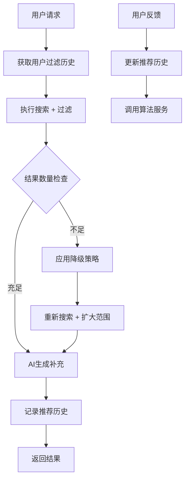

# **图片推荐过滤功能设计文档**

## 1. 概述

### 1.1 背景
当前图片推荐系统会从图库搜索和AI生成两个渠道获取图片，但缺乏过滤机制，导致用户可能重复看到相同的推荐图片，影响用户体验。

### 1.2 目标
- 为每个用户维护已推荐图片的历史记录
- 在后续推荐中过滤掉已推荐过的图片
- 解决过度过滤导致无图可推的问题
- 保持推荐系统的性能和用户体验

### 1.3 适用范围
- 图片推荐接口 (`/api/images/recommend`)

## 2. 当前系统分析

### 2.1 现有架构
用户请求 → 双路径搜索 → 结果合并 → AI生成补充 → 返回推荐结果
↳ 语义搜索        ↳ 去重排序   ↳ SVG生成   ↳ 缓存queryID
↳ 主题搜索

### 2.2 现有数据流
1. 推荐流程：
- 生成queryID追踪推荐
- 使用Redis缓存推荐结果（24小时TTL）
- 双路径搜索：语义搜索(70%) + 主题搜索(30%)
- AI生成补充不足的图片
2. 反馈流程：
- 通过queryID验证用户选择
- 防重复提交机制
- 调用算法服务反馈接口

### 2.3 存在问题
- ❌ 重复推荐相同图片



### 3.2 数据库设计

#### 3.2.1 用户图片过滤配置表 (user_image_filter_config)
```sql
CREATE TABLE `user_image_filter_config` (
    `id` bigint NOT NULL AUTO_INCREMENT COMMENT '主键ID',
    `user_id` bigint NOT NULL COMMENT '用户ID',
    `max_filter_ratio` decimal(3,2) DEFAULT 0.80 COMMENT '最大过滤比例（0-1）',
    `session_enabled` tinyint(1) DEFAULT 1 COMMENT '会话级过滤开关',
    `created_at` timestamp NOT NULL DEFAULT CURRENT_TIMESTAMP,
    `updated_at` timestamp NOT NULL DEFAULT CURRENT_TIMESTAMP ON UPDATE CURRENT_TIMESTAMP,
    `deleted_at` timestamp NULL DEFAULT NULL COMMENT '软删除时间戳',
    PRIMARY KEY (`id`),
    UNIQUE KEY `uk_user_id` (`user_id`)
) ENGINE=InnoDB DEFAULT CHARSET=utf8mb4 COLLATE=utf8mb4_unicode_ci COMMENT='用户图片过滤配置表';
```

#### 3.2.2 用户图片推荐历史表 (user_image_recommendation_history)
```sql
CREATE TABLE `user_image_recommendation_history` (
    `id` bigint NOT NULL AUTO_INCREMENT COMMENT '主键ID',
    `user_id` bigint NOT NULL COMMENT '用户ID',
    `image_id` bigint NOT NULL COMMENT '图片ID',
    `query_id` varchar(36) NOT NULL COMMENT '查询ID',
    `session_id` varchar(36) DEFAULT NULL COMMENT '会话ID（用于会话级过滤）',
    `query` text COMMENT '用户原始查询',
    `source` varchar(20) NOT NULL COMMENT '图片来源（search/generated）',
    `similarity` decimal(5,3) COMMENT '相似度分数',
    `rank` int NOT NULL COMMENT '推荐结果中的排名',
    `selected` boolean DEFAULT false COMMENT '是否被用户选择',
    `selected_at` timestamp NULL COMMENT '选择时间',
    `created_at` timestamp NOT NULL DEFAULT CURRENT_TIMESTAMP,
    `updated_at` timestamp NOT NULL DEFAULT CURRENT_TIMESTAMP ON UPDATE CURRENT_TIMESTAMP,
    `deleted_at` timestamp NULL DEFAULT NULL COMMENT '软删除时间戳',
    PRIMARY KEY (`id`),
    KEY `idx_user_image` (`user_id`, `image_id`),
    KEY `idx_query_id` (`query_id`),
    KEY `idx_user_session` (`user_id`, `session_id`),
    KEY `idx_selected` (`selected`)
) ENGINE=InnoDB DEFAULT CHARSET=utf8mb4 COLLATE=utf8mb4_unicode_ci COMMENT='用户图片推荐历史表';
```

#### 3.2.3 图片过滤指标表 (image_filter_metrics)
```sql
CREATE TABLE `image_filter_metrics` (
    `id` bigint NOT NULL AUTO_INCREMENT COMMENT '主键ID',
    `user_id` bigint NOT NULL COMMENT '用户ID',
    `query_id` varchar(36) NOT NULL COMMENT '查询ID',
    `total_candidates` int NOT NULL COMMENT '总候选数量',
    `filtered_count` int NOT NULL COMMENT '过滤数量',
    `filter_ratio` decimal(5,3) COMMENT '过滤比例',
    `degradation_level` int DEFAULT 0 COMMENT '降级等级（0=无降级，1-4=降级等级）',
    `degradation_strategy` varchar(100) COMMENT '降级策略',
    `final_result_count` int NOT NULL COMMENT '最终结果数量',
    `created_at` timestamp NOT NULL DEFAULT CURRENT_TIMESTAMP,
    `updated_at` timestamp NOT NULL DEFAULT CURRENT_TIMESTAMP ON UPDATE CURRENT_TIMESTAMP,
    `deleted_at` timestamp NULL DEFAULT NULL COMMENT '软删除时间戳',
    PRIMARY KEY (`id`),
    KEY `idx_user_id` (`user_id`),
    KEY `idx_query_id` (`query_id`)
) ENGINE=InnoDB DEFAULT CHARSET=utf8mb4 COLLATE=utf8mb4_unicode_ci COMMENT='图片过滤指标表';
```

### 3.4 会话级过滤实现

#### 3.4.1 核心服务组件
- **ImageFilterService**: 核心过滤服务 (`internal/controller/image_filter_service.go`)
- **UserImageFilterConfig**: 用户过滤配置模型 (`internal/model/image_filter.go`)
- **UserImageRecommendationHistory**: 推荐历史记录模型
- **ImageFilterMetrics**: 过滤指标监控模型

#### 3.4.2 过滤流程
1. **配置获取**: 从数据库获取用户过滤配置或使用默认配置
2. **会话过滤**: 若启用会话级过滤，先过滤当前会话已推荐的图片
3. **历史过滤**: 基于时间窗口过滤历史推荐图片
4. **降级检测**: 检测过滤率，超过阈值时触发降级策略
5. **结果记录**: 异步记录推荐历史和过滤指标

#### 3.4.3 关键方法
- `FilterWithSession()`: 会话级过滤主方法
- `applySessionFiltering()`: 应用会话过滤逻辑
- `applyDegradationStrategies()`: 应用降级策略
- `RecordRecommendationHistoryWithSession()`: 记录推荐历史（支持会话ID）

### 3.5 降级策略
当过滤率过高时（默认>80%），按优先级依次尝试：
1. **时间窗口缩减**：15天→7天→3天→1天（减少历史窗口降低过滤率）
2. **相似度阈值混合**：混入高相似度(>0.23)的已推荐图片
3. **降级策略标记**：记录使用的降级策略和等级用于监控

### 3.6 性能优化
- 缓存策略：Redis缓存用户历史ID + 本地缓存配置
- 异步处理：推荐历史记录异步写入，过期数据异步清理
- 数据库优化：按时间分区，复合索引优化查询

## 4. 配置参数

### 4.1 ImageFilterConfig 结构配置

基于 `internal/config/config.go` 中的实际实现：

| 配置字段                    | 类型    | 默认值 | 描述                                       |
|----------------------------|---------|--------|--------------------------------------------|
| `Enabled`                  | bool    | `true` | 过滤功能全局开关                           |
| `DefaultWindowDays`        | int     | `30`   | 默认过滤窗口期（30天）                     |
| `DefaultMaxFilterRatio`    | float64 | `0.8`  | 默认最大过滤比例（0.8）                    |
| `SearchExpansionRatio`     | float64 | `2.0`  | 搜索量扩大倍数（2.0）                      |
| `EnableDegradation`        | bool    | `true` | 是否启用降级策略                           |
| `EnableMetrics`            | bool    | `true` | 是否存储过滤指标数据                       |

### 4.2 用户级配置

用户可以在 `user_image_filter_config` 表中配置个性化参数：

| 字段名                | 类型    | 默认值 | 描述                     |
|-----------------------|---------|--------|--------------------------|
| `max_filter_ratio`    | decimal | `0.80` | 用户个性化最大过滤比例   |
| `session_enabled`     | boolean | `true` | 是否启用会话级过滤       |
