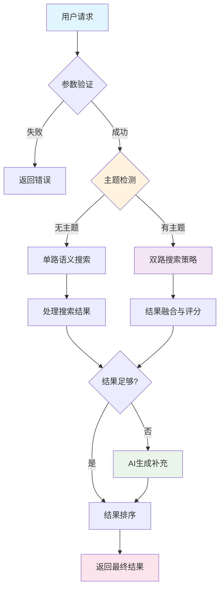
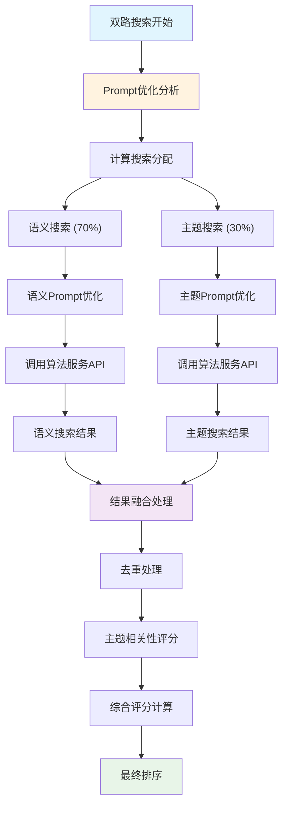
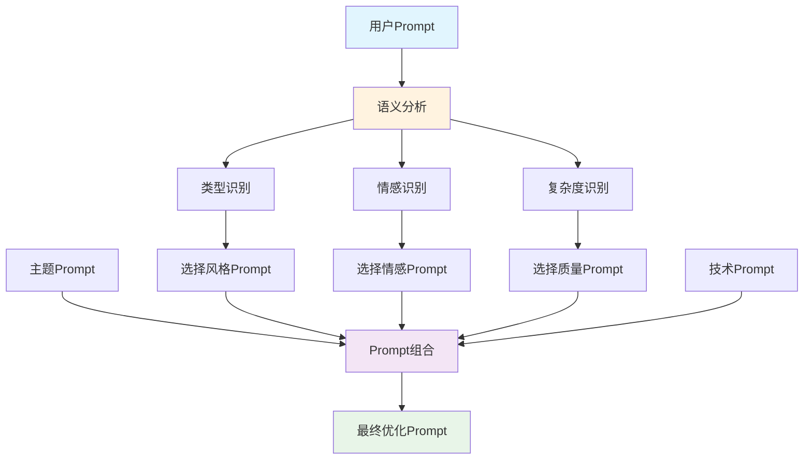
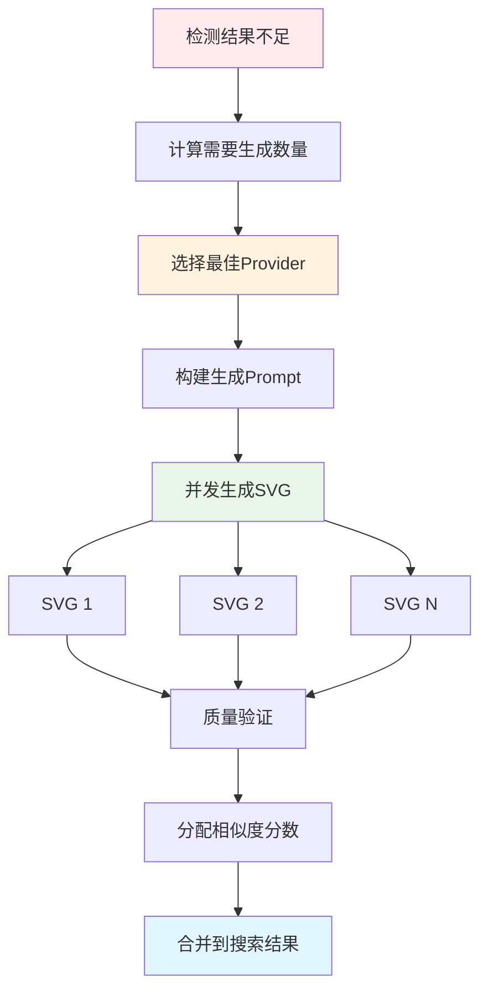

# XBuilder 主题优化系统流程图与示例

## 1. 系统流程图

### 1.1 整体处理流程



### 1.2 双路搜索详细流程



### 1.3 Prompt优化流程



### 1.4 AI生成补充流程



## 2. 详细示例演示

### 2.1 完整请求处理示例

#### 输入请求
```json
{
  "prompt": "一只可爱的小猫",
  "theme": "cartoon",
  "top_k": 6
}
```

#### 处理步骤详解

**步骤1: Prompt分析**
```json
{
  "analysis": {
    "type": "animal",
    "emotion": "cute", 
    "complexity": "medium",
    "keywords": ["一只", "可爱", "小猫"]
  }
}
```

**步骤2: Prompt优化**
```json
{
  "prompts": {
    "base": "一只可爱的小猫",
    "theme": "必须使用卡通风格，必须色彩鲜艳丰富，必须可爱有趣，严格使用简单几何形状，强制使用明亮饱和的色彩，禁止写实细节",
    "quality": "high quality vector art, detailed illustration, professional design, rich colors",
    "style": "cute and friendly style, appealing character design",
    "technical": "SVG format, scalable graphics, cartoon-optimized, bright color palette",
    "semantic_search": "一只可爱的小猫，必须使用卡通风格，必须色彩鲜艳丰富，必须可爱有趣，严格使用简单几何形状，强制使用明亮饱和的色彩，禁止写实细节",
    "theme_search": "一只可爱的小猫，必须使用卡通风格，必须色彩鲜艳丰富，必须可爱有趣，严格使用简单几何形状，强制使用明亮饱和的色彩，禁止写实细节，high quality vector art, detailed illustration, professional design, rich colors，cute and friendly style, appealing character design，SVG format, scalable graphics, cartoon-optimized, bright color palette"
  }
}
```

**步骤3: 双路搜索执行**
```json
{
  "search_config": {
    "semantic_count": 4,
    "theme_count": 2,
    "concurrent": true
  },
  "semantic_results": [
    {
      "image_path": "cat001.svg",
      "similarity": 0.95,
      "rank": 1,
      "source": "semantic_search"
    },
    {
      "image_path": "cat002.svg", 
      "similarity": 0.89,
      "rank": 2,
      "source": "semantic_search"
    }
  ],
  "theme_results": [
    {
      "image_path": "cartoon_cat001.svg",
      "similarity": 0.87,
      "rank": 1,
      "source": "theme_search"
    },
    {
      "image_path": "cat001.svg",
      "similarity": 0.85,
      "rank": 2,
      "source": "theme_search"
    }
  ]
}
```

**步骤4: 结果融合**
```json
{
  "fusion_process": {
    "deduplication": {
      "removed": ["cat001.svg"],
      "reason": "duplicate_found"
    },
    "theme_scoring": [
      {
        "image_path": "cat001.svg",
        "semantic_score": 0.95,
        "theme_score": 0.9,
        "final_score": 0.935
      },
      {
        "image_path": "cat002.svg",
        "semantic_score": 0.89,
        "theme_score": 0.7,
        "final_score": 0.833
      },
      {
        "image_path": "cartoon_cat001.svg",
        "semantic_score": 0.87,
        "theme_score": 0.95,
        "final_score": 0.894
      }
    ]
  }
}
```

**步骤5: AI生成补充**
```json
{
  "generation_config": {
    "needed": 3,
    "provider": "recraft",
    "prompt": "一只可爱的小猫，必须使用卡通风格...",
    "concurrent": true
  },
  "generated_results": [
    {
      "id": 2001,
      "image_path": "generated_cat_001.svg",
      "similarity": 0.80,
      "rank": 4,
      "source": "generated"
    },
    {
      "id": 2002,
      "image_path": "generated_cat_002.svg", 
      "similarity": 0.75,
      "rank": 5,
      "source": "generated"
    },
    {
      "id": 2003,
      "image_path": "generated_cat_003.svg",
      "similarity": 0.70,
      "rank": 6,
      "source": "generated"
    }
  ]
}
```

**最终响应**
```json
{
  "query": "一只可爱的小猫，必须使用卡通风格，必须色彩鲜艳丰富，必须可爱有趣，严格使用简单几何形状，强制使用明亮饱和的色彩，禁止写实细节，high quality vector art, detailed illustration, professional design, rich colors，cute and friendly style, appealing character design，SVG format, scalable graphics, cartoon-optimized, bright color palette",
  "results_count": 6,
  "results": [
    {
      "id": 1001,
      "image_path": "cat001.svg",
      "similarity": 0.935,
      "rank": 1,
      "source": "search"
    },
    {
      "id": 1002,
      "image_path": "cartoon_cat001.svg",
      "similarity": 0.894,
      "rank": 2,
      "source": "search"
    },
    {
      "id": 1003,
      "image_path": "cat002.svg",
      "similarity": 0.833,
      "rank": 3,
      "source": "search"
    },
    {
      "id": 2001,
      "image_path": "generated_cat_001.svg",
      "similarity": 0.80,
      "rank": 4,
      "source": "generated"
    },
    {
      "id": 2002,
      "image_path": "generated_cat_002.svg",
      "similarity": 0.75,
      "rank": 5,
      "source": "generated"
    },
    {
      "id": 2003,
      "image_path": "generated_cat_003.svg",
      "similarity": 0.70,
      "rank": 6,
      "source": "generated"
    }
  ]
}
```

### 2.2 不同主题对比示例

#### 2.2.1 卡通主题 (cartoon)

**输入**: "一辆红色汽车"

**优化后Prompt**:
```
一辆红色汽车，必须使用卡通风格，必须色彩鲜艳丰富，必须可爱有趣，严格使用简单几何形状，强制使用明亮饱和的色彩，禁止写实细节，high quality vector art, detailed illustration, professional design, rich colors，sleek and dynamic style, modern design，SVG format, scalable graphics, cartoon-optimized, bright color palette
```

**预期结果特征**:
- 简化的几何形状
- 明亮饱和的红色
- 可爱友好的外观
- 卡通化的轮廓

#### 2.2.2 写实主题 (realistic)

**输入**: "一辆红色汽车"

**优化后Prompt**:
```
一辆红色汽车，必须使用写实风格，严格要求高度细节化，强制逼真效果，必须专业高质量渲染，禁止卡通化或简化元素，high quality vector art, detailed illustration, professional design, rich colors，sleek and dynamic style, modern design，SVG format, scalable graphics, realistic rendering, detailed textures
```

**预期结果特征**:
- 高度详细的车身细节
- 逼真的光影效果
- 精确的比例和透视
- 专业的渲染质量

#### 2.2.3 极简主题 (minimal)

**输入**: "一辆红色汽车"

**优化后Prompt**:
```
一辆红色汽车，必须使用极简风格，严格限制元素数量，强制使用干净线条和几何形状，严格使用黑白或单色调，禁止复杂装饰，high quality vector art, clean lines, vibrant colors，sleek and dynamic style, modern design，SVG format, scalable graphics, minimal design, geometric shapes
```

**预期结果特征**:
- 极简的线条和形状
- 有限的色彩使用
- 干净的设计风格
- 几何化的表现

### 2.3 错误处理示例

#### 2.3.1 无效主题
```json
// 请求
{
  "prompt": "一只小猫",
  "theme": "invalid_theme",
  "top_k": 6
}

// 响应
{
  "error": {
    "code": "INVALID_THEME",
    "message": "不支持的主题类型: invalid_theme",
    "details": {
      "supported_themes": [
        "cartoon", "realistic", "minimal", "fantasy", 
        "retro", "scifi", "nature", "business"
      ]
    }
  }
}
```

#### 2.3.2 搜索服务异常降级
```json
// 当算法服务异常时的降级处理
{
  "query": "一只可爱的小猫，卡通风格...",
  "results_count": 2,
  "results": [
    {
      "id": 2001,
      "image_path": "generated_cat_001.svg",
      "similarity": 0.80,
      "rank": 1,
      "source": "generated"
    },
    {
      "id": 2002,
      "image_path": "generated_cat_002.svg",
      "similarity": 0.75,
      "rank": 2,
      "source": "generated"
    }
  ],
  "warnings": [
    {
      "code": "SEARCH_SERVICE_UNAVAILABLE",
      "message": "搜索服务暂不可用，已使用AI生成结果"
    }
  ]
}
```

## 3. 性能测试用例

### 3.1 并发测试场景

```bash
# 模拟100个并发请求
for i in {1..100}; do
  curl -X POST "http://localhost:8080/api/images/recommend" \
    -H "Content-Type: application/json" \
    -d '{
      "prompt": "测试图像'$i'",
      "theme": "cartoon",
      "top_k": 6
    }' &
done
wait
```

### 3.2 不同主题性能对比

| 主题 | 平均响应时间 | 搜索策略 | AI Provider |
|------|-------------|----------|-------------|
| 无主题 | 1.2s | 单路语义 | OpenAI |
| cartoon | 1.8s | 双路搜索 | Recraft |
| realistic | 1.9s | 双路搜索 | Recraft |
| minimal | 1.5s | 双路搜索 | SVGIO |
| fantasy | 2.0s | 双路搜索 | Recraft |

### 3.3 缓存效果测试

```json
// 第一次请求 (无缓存)
{
  "response_time": "1.8s",
  "cache_status": "MISS",
  "search_time": "0.8s",
  "generation_time": "1.0s"
}

// 第二次相同请求 (有缓存)
{
  "response_time": "0.3s", 
  "cache_status": "HIT",
  "search_time": "0.1s",
  "generation_time": "0.2s"
}
```

## 4. 集成示例

### 4.1 React组件集成

```jsx
import React, { useState } from 'react';

const ImageRecommendation = () => {
  const [results, setResults] = useState([]);
  const [loading, setLoading] = useState(false);

  const searchImages = async (prompt, theme) => {
    setLoading(true);
    try {
      const response = await fetch('/api/images/recommend', {
        method: 'POST',
        headers: {
          'Content-Type': 'application/json',
          'Authorization': 'Bearer ' + token
        },
        body: JSON.stringify({
          prompt,
          theme,
          top_k: 6
        })
      });
      
      const data = await response.json();
      setResults(data.results);
    } catch (error) {
      console.error('搜索失败:', error);
    } finally {
      setLoading(false);
    }
  };

  return (
    <div>
      <div className="search-controls">
        <input 
          type="text" 
          placeholder="描述你想要的图像..."
          onChange={(e) => setPrompt(e.target.value)}
        />
        <select onChange={(e) => setTheme(e.target.value)}>
          <option value="">无主题</option>
          <option value="cartoon">卡通风格</option>
          <option value="realistic">写实风格</option>
          <option value="minimal">极简风格</option>
        </select>
        <button onClick={() => searchImages(prompt, theme)}>
          搜索图像
        </button>
      </div>
      
      {loading && <div>搜索中...</div>}
      
      <div className="results-grid">
        {results.map(result => (
          <div key={result.id} className="result-item">
            
            <div className="result-meta">
              <span>相似度: {(result.similarity * 100).toFixed(1)}%</span>
              <span>来源: {result.source}</span>
              <span>排名: #{result.rank}</span>
            </div>
          </div>
        ))}
      </div>
    </div>
  );
};
```

### 4.2 Python SDK示例

```python
import requests
import asyncio
import aiohttp

class XBuilderClient:
    def __init__(self, api_base, token):
        self.api_base = api_base
        self.token = token
        self.headers = {
            'Authorization': f'Bearer {token}',
            'Content-Type': 'application/json'
        }
    
    async def recommend_images(self, prompt, theme=None, top_k=6):
        """推荐图像"""
        url = f"{self.api_base}/api/images/recommend"
        payload = {
            'prompt': prompt,
            'top_k': top_k
        }
        if theme:
            payload['theme'] = theme
            
        async with aiohttp.ClientSession() as session:
            async with session.post(url, json=payload, headers=self.headers) as response:
                return await response.json()
    
    async def get_themes(self):
        """获取所有主题"""
        url = f"{self.api_base}/api/themes"
        async with aiohttp.ClientSession() as session:
            async with session.get(url, headers=self.headers) as response:
                return await response.json()

# 使用示例
async def main():
    client = XBuilderClient('https://api.xbuilder.com', 'your_token')
    
    # 获取卡通风格的小猫图像
    results = await client.recommend_images(
        prompt='一只可爱的小猫',
        theme='cartoon',
        top_k=6
    )
    
    print(f"找到 {results['results_count']} 个结果:")
    for result in results['results']:
        print(f"  {result['rank']}. {result['image_path']} "
              f"(相似度: {result['similarity']:.3f}, "
              f"来源: {result['source']})")

# 运行示例
asyncio.run(main())
```

这些流程图和示例全面展示了XBuilder主题优化系统的工作原理和使用方法，为开发者提供了清晰的集成指导。